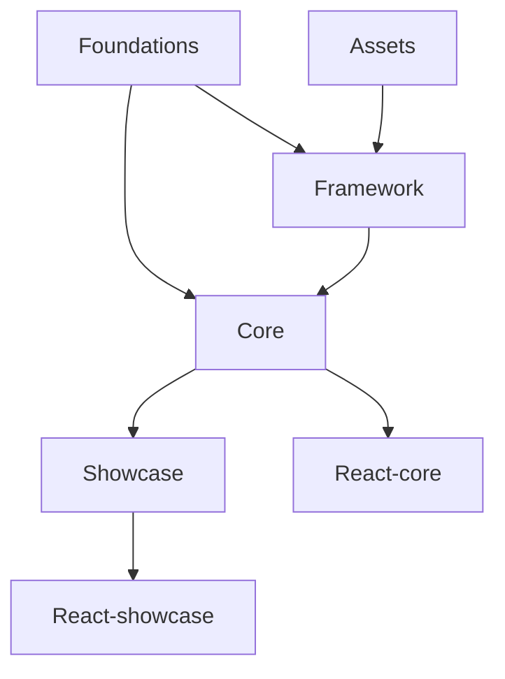

# LF Widgets Architecture

This document provides a comprehensive overview of the architecture of the LF Widgets library. It describes the monorepo structure, the roles of each package, and how the various parts interact. Visual diagrams (using Mermaid) are provided to help you quickly grasp the repository layout and inter-package relationships.

---

## Table of Contents

1. [Monorepo Structure](#monorepo-structure)
2. [Packages Overview](#packages-overview)
   - [Root Package](#root-package)
   - [Assets](#assets)
   - [Foundations](#foundations)
   - [Framework](#framework)
   - [Core](#core)
   - [Showcase](#showcase)
   - [React-core](#react-core)
   - [React-showcase](#react-showcase)
3. [Inter-Package Relationships](#inter-package-relationships)
4. [Framework Initialization Flow](#framework-initialization-flow)
5. [Build & Testing Scripts](#build--testing-scripts)
6. [Conclusion](#conclusion)

---

## Monorepo Structure

The LF Widgets library is organized as a monorepo managed by Yarn and Lerna. The following diagram shows the high-level folder structure:

```mermaid
graph TD
    A[lf-widgets]
    A --> B[packages]
    B --> C[assets]
    C --> C1[assets/]
    C1 --> C2[fonts/]
    C1 --> C3[showcase/]
    C1 --> C4[svg/]
    B --> D[core]
    D --> D1[dist/ (Stencil build output)]
    B --> E[foundations]
    E --> E1[dist/ (TSC build output)]
    B --> F[framework]
    F --> F1[dist/ (Stencil build output)]
    B --> G[react-core]
    B --> H[react-showcase]
    B --> I[showcase]
    I --> I1[src/ (index.html & entry files)]
    I --> I2[vite.config.mjs]
    A --> J[node_modules]
```

---

## Packages Overview

Each package in the monorepo serves a specific role:

### Root Package

- **Purpose:**  
  Acts as a container for the Yarn & Lerna workspace. It aggregates the various packages, defines global devDependencies and scripts, and provides build orchestration.
- **Key Points:**
  - Private repository.
  - Defines workspace boundaries and manages cross-package dependencies.

---

### Assets

- **Package Name:** `@lf-widgets/assets`
- **Purpose:**  
  Centralizes static resources (SVG icons, fonts, and media for the showcase) used by the library.
- **Key Points:**
  - Exports a folder structure of assets.
  - Acts as a static repository that can be consumed by other packages, primarily the framework.

---

### Foundations

- **Package Name:** `@lf-widgets/foundations`
- **Purpose:**  
  Provides types, constants, and core utilities without introducing any runtime dependencies.
- **Key Points:**
  - Built with TypeScript (`tsc`).
  - Supplies contracts and shared definitions consumed by downstream modules (framework, core, etc.).
  - Acts as the foundation for consistency across the library.

---

### Framework

- **Package Name:** `@lf-widgets/framework`
- **Purpose:**  
  Serves as the core orchestrator of the LF Widgets library. It handles theming, asset management, module registration, and sets up global event listeners.
- **Key Points:**
  - Built with Stencil.js (even though it does not rely on Stencil decorators like `@Component`).
  - Exposes a singleton-like instance through the `getLfFramework()` function.
  - Allows registration of submodules via the `register` method.
  - Initializes global state (e.g., sets a symbol on the `window` object and dispatches a custom event when ready).
- **Example Initialization Snippet:**

  ```typescript
  import { getLfFramework } from "@lf-widgets/framework";

  const lfFramework = getLfFramework();
  // lfFramework is now available for module registration and asset management.
  ```

- **Internal Architecture:**  
  The main class (`LfFramework`) initializes various sub-modules (e.g., color, data, debug, drag, effects, llm, portal, theme, utilities) and sets up global listeners to manage interactions (like click callbacks). Its design facilitates:

  - **Asset Management:** Each module can have its own asset management functions (`getAssetPath`, `setAssetPath`).
  - **Module Registration:** Additional modules can be registered at runtime.
  - **Event Dispatching:** Global events are dispatched once the framework is ready, allowing components to safely wait for initialization.

---

### Core

- **Package Name:** `@lf-widgets/core`
- **Purpose:**  
  Contains the main library of web components built with Stencil.js.
- **Key Points:**
  - Components in this package are built using Stencil and rely on the framework for runtime dependencies.
  - Uses a standardized pattern to wait for the framework readiness (via promises exported by the foundations).
- **Component Lifecycle Example:**

  ```typescript
  async componentWillLoad() {
    this.#framework = await awaitFramework(this);
    // Continue with the component's initialization...
  }
  ```

- **Documentation Generation:**  
  Includes scripts (e.g., `doc`) that generate documentation for the components.

---

### Showcase

- **Package Name:** `@lf-widgets/showcase`
- **Purpose:**  
  Provides an interactive showcase to display the components in a real-world scenario. It also renders the documentation generated by the core package.
- **Key Points:**
  - Built with Stencil.js.
  - Utilizes Vite as the development server for faster builds.
  - Integrated with Cypress for e2e testing to ensure component functionality.

---

### React-core

- **Package Name:** `@lf-widgets/react-core`
- **Purpose:**  
  Acts as a bridge between the Stencil components and React applications.
- **Key Points:**
  - Built with TypeScript.
  - Exports Stencil-based components as React components.
  - Depends on `@lf-widgets/core` and the `@stencil/react-output-target` package for proper integration.

---

### React-showcase

- **Package Name:** `@lf-widgets/react-showcase`
- **Purpose:**  
  Provides a React version of the showcase, allowing users to interact with the components in a React context.
- **Key Points:**
  - Built with TypeScript.
  - Exports the showcase component as a React component.
  - Relies on the Stencil showcase and bridges it using React integration libraries.

---

## Inter-Package Relationships

The following diagram illustrates how the different packages depend on and interact with one another:



**Notes:**

- **Foundations** is the base for both the **Framework** and **Core** packages.
- **Framework** orchestrates and exposes runtime functionality used by **Core** and indirectly by **Showcase**.
- **Assets** are used by the **Framework** for centralized asset management.
- **Showcase** leverages **Core** for component rendering and is also used for testing.
- The React counterparts (**React-core** and **React-showcase**) wrap their Stencil-based versions for seamless integration with React projects.

---

## Framework Initialization Flow

The LF Widgets framework is designed to be initialized on demand. The following flowchart summarizes the steps taken when the `getLfFramework()` function is invoked:

```mermaid
flowchart TD
    A[getLfFramework() called]
    B{lfFramework already exists?}
    B -- Yes --> C[Return existing lfFramework instance]
    B -- No --> D[Call initLfFramework()]
    D --> E[Create new LfFramework instance]
    E --> F[Call finalize() on the new instance]
    F --> G[Set global window[LF_FRAMEWORK_SYMBOL]]
    G --> H[Call markFrameworkReady()]
    H --> I[Dispatch CustomEvent (LF_FRAMEWORK_EVENT_NAME)]
    I --> C[Return newly created lfFramework instance]
```

**Key Points:**

- **Singleton Pattern:** Ensures only one instance of the framework is created.
- **Global Exposure:** The instance is attached to the `window` object for global accessibility.
- **Event Dispatching:** A custom event notifies any listeners that the framework is ready, enabling dependent components to safely execute initialization code.

---

## Build & Testing Scripts

The root `package.json` defines several scripts that coordinate the build, test, and development processes across packages:

- **Build Scripts:**
  - `build:core`, `build:foundations`, `build:framework`, etc., which use Lerna to run package-specific builds.
  - The `build` script orchestrates the entire build process across all packages.
- **Development & Testing:**
  - `dev` and `dev:setup` scripts for running the showcase in development mode.
  - Cypress is used for running e2e tests against the showcase to ensure all components work as expected.
  - The `doc` script generates documentation from the core package.

These scripts help maintain consistency and ensure that changes in one package are correctly integrated and tested across the entire library.

---

## Conclusion

The LF Widgets library is a modern, modular system for building web components with Stencil.js. Its architecture is characterized by:

- **Clear Separation of Concerns:** Each package has a distinct responsibility—from foundational types and constants to runtime orchestration and component rendering.
- **Dynamic Framework Initialization:** The framework is initialized on demand, providing flexibility in how and when global state and event listeners are set up.
- **Seamless React Integration:** React-core and React-showcase bridge the gap between Stencil web components and React applications.
- **Robust Development & Testing Tools:** A comprehensive set of build and test scripts ensure high quality and maintainability.

By following this architecture, the LF Widgets library achieves a scalable, maintainable, and developer-friendly codebase that is both efficient in development and robust in production.
