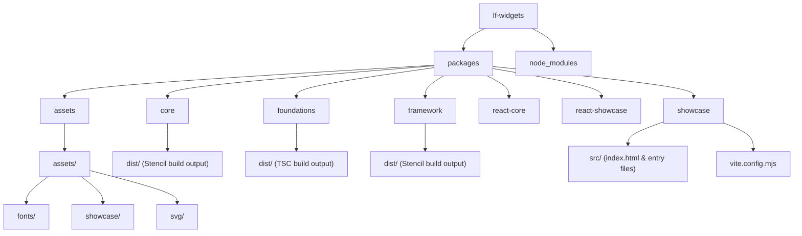
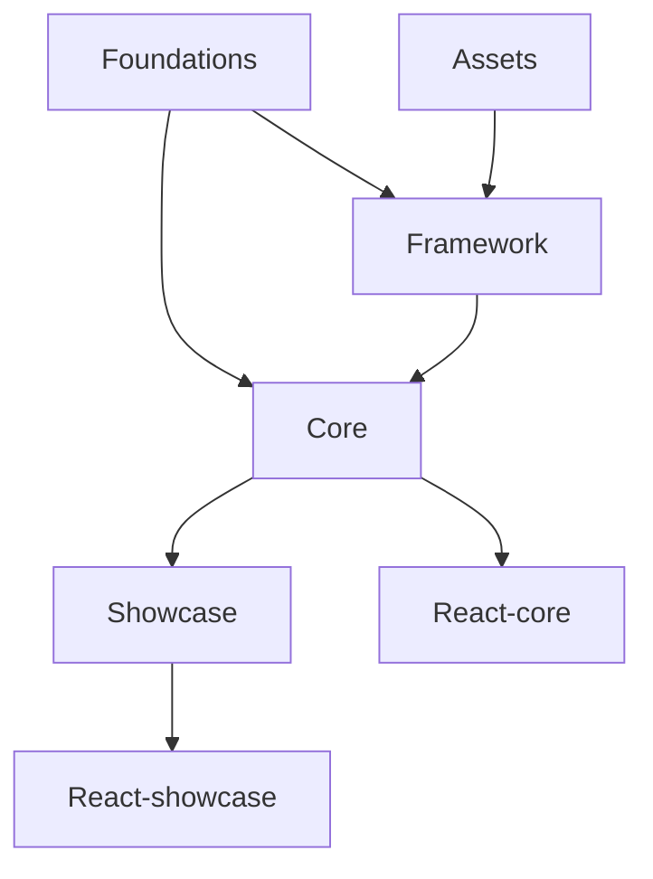
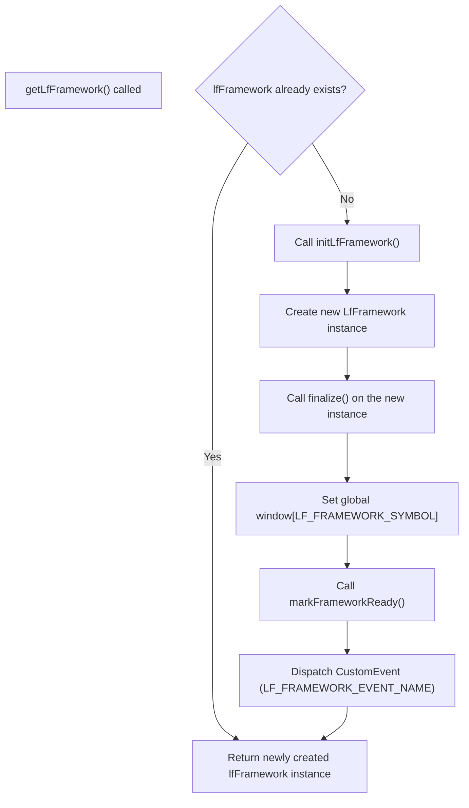
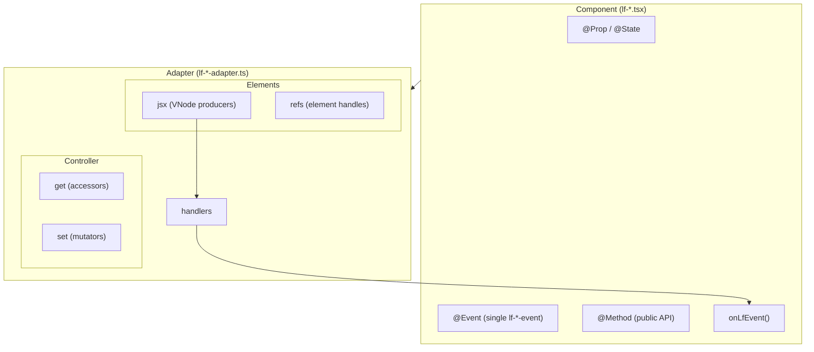
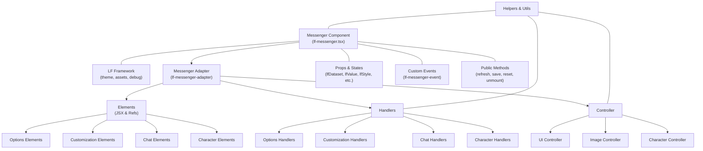

# LF Widgets Architecture

This document provides a comprehensive overview of the architecture of the LF Widgets library. It describes the monorepo structure, the roles of each package, and how the various parts interact. Visual diagrams (using Mermaid) are provided to help you quickly grasp the repository layout and inter-package relationships.

---

## Table of Contents

- [LF Widgets Architecture](#lf-widgets-architecture)
  - [Table of Contents](#table-of-contents)
  - [Monorepo Structure](#monorepo-structure)
  - [Packages Overview](#packages-overview)
    - [Root Package](#root-package)
    - [Assets](#assets)
    - [Foundations](#foundations)
    - [Framework](#framework)
    - [Core](#core)
    - [Showcase](#showcase)
    - [React-core](#react-core)
    - [React-showcase](#react-showcase)
  - [Inter-Package Relationships](#inter-package-relationships)
  - [Framework Initialization Flow](#framework-initialization-flow)
  - [Advanced component architecture](#advanced-component-architecture)
    - [Adapter's Role](#adapters-role)
    - [Controller Submodules](#controller-submodules)
    - [Elements \& Handlers](#elements--handlers)
  - [Build \& Testing Scripts](#build--testing-scripts)
  - [Conclusion](#conclusion)

---

## Monorepo Structure

The LF Widgets library is organized as a monorepo managed by Yarn and Lerna. The following diagram shows the high-level folder structure:



---

## Packages Overview

Each package in the monorepo serves a specific role:

### Root Package

- **Purpose:**  
  Acts as a container for the Yarn & Lerna workspace. It aggregates the various packages, defines global devDependencies and scripts, and provides build orchestration.
- **Key Points:**
  - Private repository.
  - Defines workspace boundaries and manages cross-package dependencies.

---

### Assets

- **Package Name:** `@lf-widgets/assets`
- **Purpose:**  
  Centralizes static resources (SVG icons, fonts, and media for the showcase) used by the library.
- **Key Points:**
  - Exports a folder structure of assets.
  - Acts as a static repository that can be consumed by other packages, primarily the framework.

---

### Foundations

- **Package Name:** `@lf-widgets/foundations`
- **Purpose:**  
  Provides types, constants, and core utilities without introducing any runtime dependencies.
- **Key Points:**
  - Built with TypeScript (`tsc`).
  - Supplies contracts and shared definitions consumed by downstream modules (framework, core, etc.).
  - Acts as the foundation for consistency across the library.

---

### Framework

- **Package Name:** `@lf-widgets/framework`
- **Purpose:**  
  Serves as the core orchestrator of the LF Widgets library. It handles theming, asset management, module registration, and sets up global event listeners.
- **Key Points:**
  - Built with Stencil.js (even though it does not rely on Stencil decorators like `@Component`).
  - Exposes a singleton-like instance through the `getLfFramework()` function.
  - Allows registration of submodules via the `register` method.
  - Initializes global state (e.g., sets a symbol on the `window` object and dispatches a custom event when ready).
- **Example Initialization Snippet:**

  ```typescript
  import { getLfFramework } from "@lf-widgets/framework";

  const lfFramework = getLfFramework();
  // lfFramework is now available for module registration and asset management.
  ```

- **Internal Architecture:**  
  The main class (`LfFramework`) initializes various sub-modules (e.g., color, data, debug, drag, effects, llm, portal, theme, utilities) and sets up global listeners to manage interactions (like click callbacks). Its design facilitates:

  - **Asset Management:** Each module can have its own asset management functions (`getAssetPath`, `setAssetPath`).
  - **Module Registration:** Additional modules can be registered at runtime.
  - **Event Dispatching:** Global events are dispatched once the framework is ready, allowing components to safely wait for initialization.

---

### Core

- **Package Name:** `@lf-widgets/core`
- **Purpose:**  
  Contains the main library of web components built with Stencil.js.
- **Key Points:**
  - Components in this package are built using Stencil and rely on the framework for runtime dependencies.
  - Uses a standardized pattern to wait for the framework readiness (via promises exported by the foundations).
- **Component Lifecycle Example:**

  ```typescript
  async componentWillLoad() {
    this.#framework = await awaitFramework(this);
    // Continue with the component's initialization...
  }
  ```

- **Documentation Generation:**  
  Includes scripts (e.g., `doc`) that generate documentation for the components.

---

### Showcase

- **Package Name:** `@lf-widgets/showcase`
- **Purpose:**  
  Provides an interactive showcase to display the components in a real-world scenario. It also renders the documentation generated by the core package.
- **Key Points:**
  - Built with Stencil.js.
  - Utilizes Vite as the development server for faster builds.
  - Integrated with Cypress for e2e testing to ensure component functionality.

---

### React-core

- **Package Name:** `@lf-widgets/react-core`
- **Purpose:**  
  Acts as a bridge between the Stencil components and React applications.
- **Key Points:**
  - Built with TypeScript.
  - Exports Stencil-based components as React components.
  - Depends on `@lf-widgets/core` and the `@stencil/react-output-target` package for proper integration.

---

### React-showcase

- **Package Name:** `@lf-widgets/react-showcase`
- **Purpose:**  
  Provides a React version of the showcase, allowing users to interact with the components in a React context.
- **Key Points:**
  - Built with TypeScript.
  - Exports the showcase component as a React component.
  - Relies on the Stencil showcase and bridges it using React integration libraries.

---

## Inter-Package Relationships

The following diagram illustrates how the different packages depend on and interact with one another:



**Notes:**

- **Foundations** is the base for both the **Framework** and **Core** packages.
- **Framework** orchestrates and exposes runtime functionality used by **Core** and indirectly by **Showcase**.
- **Assets** are used by the **Framework** for centralized asset management.
- **Showcase** leverages **Core** for component rendering and is also used for testing.
- The React counterparts (**React-core** and **React-showcase**) wrap their Stencil-based versions for seamless integration with React projects.

---

## Framework Initialization Flow

The LF Widgets framework is designed to be initialized on demand. The following flowchart summarizes the steps taken when the `getLfFramework()` function is invoked:



**Key Points:**

- **Singleton Pattern:** Ensures only one instance of the framework is created.
- **Global Exposure:** The instance is attached to the `window` object for global accessibility.
- **Event Dispatching:** A custom event notifies any listeners that the framework is ready, enabling dependent components to safely execute initialization code.

---

## Advanced component architecture

The most complex components in the library are built using a combination of Stencil.js and the LF Widgets framework. This architecture allows for a clear separation of concerns and ensures that components are modular, reusable, and easy to maintain.

### Component Complexity Tiers

Components fall into three complexity tiers, each with specific file organization patterns:

| Tier | Complexity | File Pattern | Examples |
|------|------------|--------------|----------|
| **Simple** | Single JSX section, few handlers | `lf-<name>-adapter.ts`, `elements.<name>.tsx`, `handlers.<name>.ts` | `lf-breadcrumbs`, `lf-radio`, `lf-chip` |
| **Medium** | Multiple JSX sections, enhanced setters, portal | `lf-<name>-adapter.ts`, `elements.<name>.tsx`, `handlers.<name>.ts` | `lf-autocomplete`, `lf-select` |
| **Complex** | Domain segmentation, multiple controller/handler files | `lf-<name>-adapter.ts`, `controller.<domain>.ts`, `elements.<domain>.tsx`, `handlers.<domain>.ts`, `helpers.<function>.ts` | `lf-messenger`, `lf-chat` |

### Adapter Pattern Overview

The adapter pattern provides a clean separation between the component class and its implementation details:



### Simple Component Pattern (Tier 1)

For components with straightforward requirements (e.g., `lf-breadcrumbs`, `lf-radio`):

**File Structure:**

```text
lf-breadcrumbs/
├── lf-breadcrumbs.tsx           # Main component
├── lf-breadcrumbs.scss          # Styles
├── lf-breadcrumbs-adapter.ts    # Adapter factory
├── elements.breadcrumbs.tsx     # JSX functions
└── handlers.breadcrumbs.ts      # Event handlers
```

**Adapter Factory:**

```typescript
export const createAdapter = (
  getters: LfBreadcrumbsAdapterInitializerGetters,
  setters: LfBreadcrumbsAdapterInitializerSetters,
  getAdapter: () => LfBreadcrumbsAdapter,
): LfBreadcrumbsAdapter => {
  return {
    controller: { get: getters, set: setters },
    elements: {
      jsx: prepBreadcrumbsJsx(getAdapter),
      refs: prepRefs(),
    },
    handlers: prepBreadcrumbsHandlers(getAdapter),
  };
};
```

**Refs with Maps:**  
For components rendering multiple items (e.g., breadcrumb items), use Maps to track element references and ripple targets:

```typescript
const prepRefs = (): LfBreadcrumbsAdapterRefs => ({
  items: new Map(),      // Map<nodeId, HTMLElement>
  ripples: new Map(),    // Map<nodeId, HTMLElement> for ripple effects
});
```

### Medium Component Pattern (Tier 2)

For components with portal-based dropdowns or enhanced setters (e.g., `lf-autocomplete`, `lf-select`):

**Enhanced Setters Pattern:**  
When a setter requires complex logic (e.g., portal management), wrap the initializer setters:

```typescript
export const createAdapter = (
  getters: LfAutocompleteAdapterInitializerGetters,
  setters: LfAutocompleteAdapterInitializerSetters,
  getAdapter: () => LfAutocompleteAdapter,
): LfAutocompleteAdapter => {
  const enhancedSetters = {
    ...setters,
    list: (state = "toggle") => {
      const adapter = getAdapter();
      const { controller, elements } = adapter;
      const { manager } = controller.get;
      const { dropdown, textfield } = elements.refs;
      const { close, isInPortal, open } = manager.portal;

      switch (state) {
        case "close": close(dropdown); break;
        case "open": open(dropdown, autocomplete, textfield); break;
        default:
          if (isInPortal(dropdown)) close(dropdown);
          else open(dropdown, autocomplete, textfield);
          break;
      }
    },
  };

  return {
    controller: { get: getters, set: enhancedSetters },
    // ...
  };
};
```

**Portal Pattern:**  
Use `manager.portal.open/close/isInPortal` for floating elements like dropdowns:

- `open(floatingEl, hostEl, anchorEl)` - Positions and shows the dropdown
- `close(floatingEl)` - Hides and resets the dropdown
- `isInPortal(floatingEl)` - Checks if currently visible

### Complex Component Pattern (Tier 3)

The following diagram illustrates the internal structure of the Messenger component, which is a top-level component in the library:



**File Structure (Complex):**

```text
lf-messenger/
├── lf-messenger.tsx              # Main component
├── lf-messenger.scss             # Main styles
├── lf-messenger-adapter.ts       # Adapter factory (imports domain modules)
├── controller.character.ts       # Domain: Character getters/setters
├── controller.image.ts           # Domain: Image getters/setters
├── controller.ui.ts              # Domain: UI state getters/setters
├── elements.character.tsx        # Domain: Character JSX
├── elements.chat.tsx             # Domain: Chat JSX
├── elements.customization.tsx    # Domain: Customization JSX
├── elements.options.tsx          # Domain: Options JSX
├── handlers.character.ts         # Domain: Character event handlers
├── handlers.chat.ts              # Domain: Chat event handlers
├── handlers.customization.ts     # Domain: Customization handlers
├── handlers.options.ts           # Domain: Options handlers
├── helpers.utils.ts              # Shared utility functions
└── lf-messenger-*.scss           # Additional style modules
```

**Domain-Segmented Controller Pattern:**  
Each domain exports `prep<Domain>Getters` and `prep<Domain>Setters`:

```typescript
// controller.character.ts
export const prepCharacterGetters = (
  getAdapter: () => LfMessengerAdapter,
): LfMessengerAdapterGettersCharacter => ({
  all: () => getAdapter().controller.get.compInstance.lfDataset?.nodes || [],
  biography: () => { /* ... */ },
  byId: (id) => { /* ... */ },
  chat: () => { /* ... */ },
  current: () => getAdapter().controller.get.compInstance.currentCharacter,
  name: () => { /* ... */ },
});

export const prepCharacterSetters = (
  getAdapter: () => LfMessengerAdapter,
): LfMessengerAdapterSettersCharacter => ({
  current: (character) => {
    const comp = getAdapter().controller.get.compInstance;
    comp.currentCharacter = character;
  },
});
```

**Adapter Assembly:**

```typescript
// lf-messenger-adapter.ts
export const createAdapter = (
  initializerGetters: LfMessengerInitializerGetters,
  getAdapter: () => LfMessengerAdapter,
): LfMessengerAdapter => {
  return {
    controller: {
      get: {
        ...initializerGetters,
        character: prepCharacterGetters(getAdapter),
        image: prepImageGetters(getAdapter),
        status: prepStatusGetters(getAdapter),
        ui: prepUIGetters(getAdapter),
      },
      set: {
        character: prepCharacterSetters(getAdapter),
        image: prepImageSetters(getAdapter),
        status: prepStatusSetters(getAdapter),
        ui: prepUISetters(getAdapter),
      },
    },
    elements: {
      jsx: { /* domain JSX modules */ },
      refs: { /* nested ref structure */ },
    },
    handlers: { /* domain handler modules */ },
  };
};
```

### Handler Patterns

**Switch on eventType, then id:**  
Use constants for IDs to ensure type safety:

```typescript
// handlers.chat.ts
export const prepChatHandlers = (
  getAdapter: () => LfChatAdapter,
): LfChatAdapterHandlers["chat"] => ({
  button: async (e) => {
    const { eventType, id } = e.detail;
    const adapter = getAdapter();
    
    switch (eventType) {
      case "click":
        switch (id) {
          case LF_CHAT_IDS.chat.clear:
            // Handle clear
            break;
          case LF_CHAT_IDS.chat.send:
            // Handle send
            break;
          case LF_CHAT_IDS.chat.settings:
            set.view("settings");
            break;
        }
        break;
    }
  },
});
```

**Composition Handler Pattern:**  
When a component contains child LF components, create composition handlers to forward events:

```typescript
handlers: {
  list: async (event) => {
    const { eventType, node } = event.detail;
    
    switch (eventType) {
      case "click":
        controller.set.value(node.id);
        controller.set.list("close");
        break;
    }
    
    // Always forward to parent event funnel
    comp.onLfEvent(event, "lf-event", node);
  },
}
```

### Helper Files

Complex components extract business logic into helper files:

| Helper File | Purpose |
|-------------|---------|
| `helpers.api.ts` | API/LLM communication |
| `helpers.messages.ts` | Message processing |
| `helpers.attachments.ts` | File/image handling |
| `helpers.parsing.ts` | Content parsing |
| `helpers.utils.ts` | Shared utilities |

**Helper Function Signature:**  
Helpers receive the adapter to access controller state:

```typescript
export const submitPrompt = async (adapter: LfChatAdapter) => {
  const { controller, elements } = adapter;
  const { get, set } = controller;
  // Implementation
};
```

### Adapter's Role

In order to keep the main source file of feature-rich components clean and maintainable, the adapter layer acts as a mediator between the component and its internal structure. It abstracts the component's logic into separate controllers, elements, and handlers, each responsible for a specific aspect of the component's functionality.

### Controller Submodules

The controller is the heart of the component, managing the interaction between the various elements and handlers. It is further divided into submodules, each handling a specific part of the component's functionality (e.g., character management, image handling, UI updates).

### Elements & Handlers

The elements represent the visual structure of the component, while the handlers manage the component's behavior and interactions. By separating these concerns, the component's codebase remains organized and easy to extend.

### Ripple Effect Pattern

For interactive elements requiring ripple effects:

1. **Dedicated ripple element:** Add a `<div>` specifically for the ripple
2. **Use `pointerdown` event:** Not `click` - ripple should start on press
3. **Store refs in Map:** Track ripple elements by item ID

```tsx
// In JSX
<div
  class={bemClass(blocks.item._, blocks.item.ripple)}
  data-lf={lfAttributes.ripple}
  onPointerDown={(e) => handler(e, node)}
  ref={(el) => { if (el) refs.ripples.set(node.id, el); }}
></div>

// In handler
const ripple = refs.ripples.get(node.id);
if (ripple) {
  manager.effects.ripple(ripple, e);
}
```

### Glassmorphism Styling

Components should use the glassmorphism mixins for consistent visual styling:

```scss
@use "../../style/glassmorphize" as *;
@use "../../style/border" as *;

.lf-breadcrumbs__item {
  @include lf-comp-glassmorphize($comp, "surface", "all", 0.75);
  @include lf-comp-border($comp, "all");
}
```

Available mixins:

- `lf-comp-glassmorphize($component, $surface-type, $sides, $opacity)`
- `lf-comp-border($component, $sides)`

## Build & Testing Scripts

The root `package.json` defines several scripts that coordinate the build, test, and development processes across packages:

- **Build Scripts:**
  - `build:core`, `build:foundations`, `build:framework`, etc., which use Lerna to run package-specific builds.
  - The `build` script orchestrates the entire build process across all packages.
- **Development & Testing:**
  - `dev` and `dev:setup` scripts for running the showcase in development mode.
  - Cypress is used for running e2e tests against the showcase to ensure all components work as expected.
  - The `doc` script generates documentation from the core package.

These scripts help maintain consistency and ensure that changes in one package are correctly integrated and tested across the entire library.

---

## Conclusion

The LF Widgets library is a modern, modular system for building web components with Stencil.js. Its architecture is characterized by:

- **Clear Separation of Concerns:** Each package has a distinct responsibility—from foundational types and constants to runtime orchestration and component rendering.
- **Dynamic Framework Initialization:** The framework is initialized on demand, providing flexibility in how and when global state and event listeners are set up.
- **Seamless React Integration:** React-core and React-showcase bridge the gap between Stencil web components and React applications.
- **Robust Development & Testing Tools:** A comprehensive set of build and test scripts ensure high quality and maintainability.

By following this architecture, the LF Widgets library achieves a scalable, maintainable, and developer-friendly codebase that is both efficient in development and robust in production.
