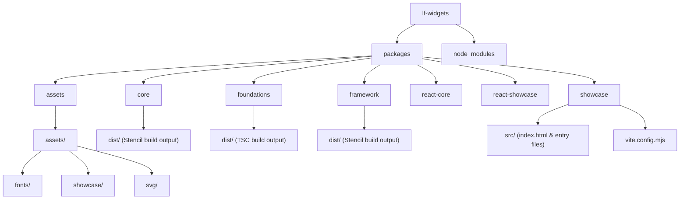
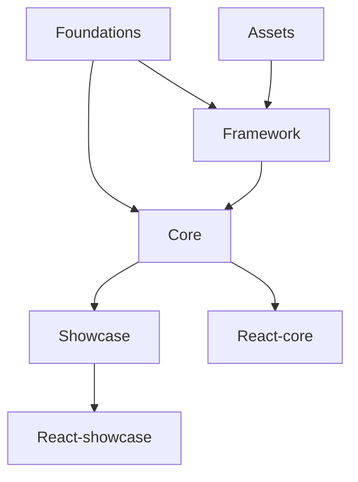
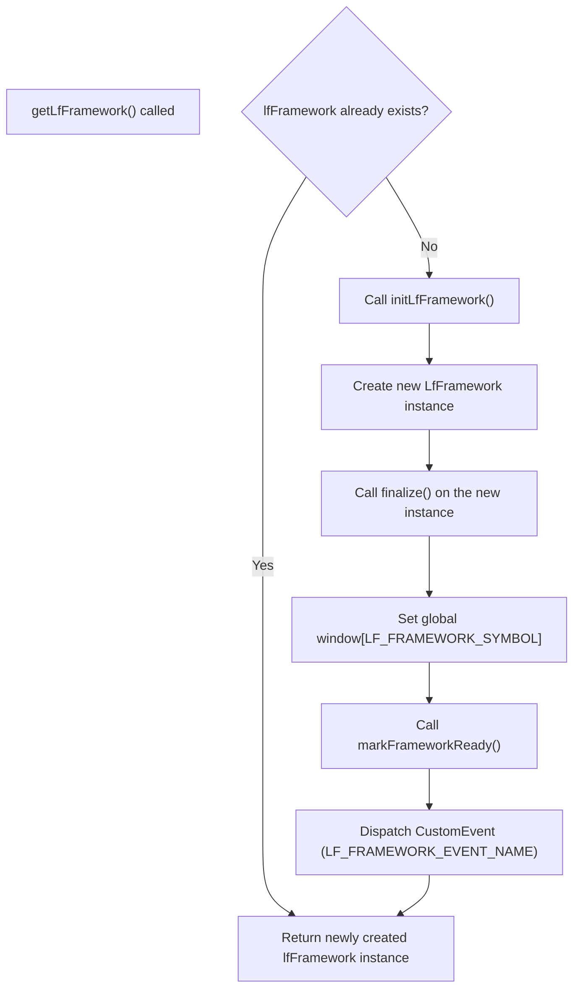
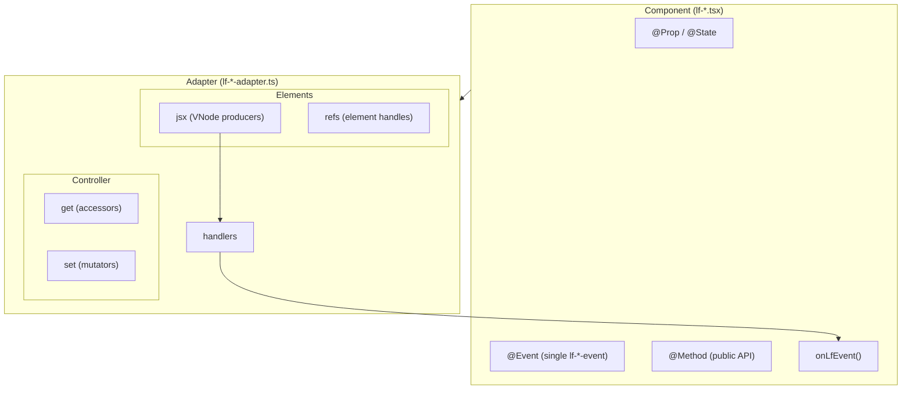
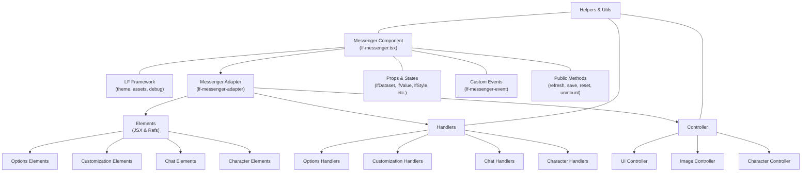

# LF Widgets Architecture

This document provides a comprehensive overview of the architecture of the LF Widgets library. It describes the monorepo structure, the roles of each package, and how the various parts interact. Visual diagrams (using Mermaid) are provided to help you quickly grasp the repository layout and inter-package relationships.

> **Note**: This document is the canonical reference ("Holy Bible") for all architectural decisions. All component implementations MUST follow the patterns described here.

---

## Table of Contents

- [LF Widgets Architecture](#lf-widgets-architecture)
  - [Table of Contents](#table-of-contents)
  - [Monorepo Structure](#monorepo-structure)
  - [Packages Overview](#packages-overview)
    - [Root Package](#root-package)
    - [Assets](#assets)
    - [Foundations](#foundations)
    - [Framework](#framework)
    - [Core](#core)
    - [Showcase](#showcase)
    - [React-core](#react-core)
    - [React-showcase](#react-showcase)
  - [Inter-Package Relationships](#inter-package-relationships)
  - [Framework Services](#framework-services)
    - [Framework Initialization Flow](#framework-initialization-flow)
    - [Available Services](#available-services)
  - [Data Layer](#data-layer)
    - [LfDataDataset \& LfDataNode](#lfdatadataset--lfdatanode)
    - [LfDataCell \& Shapes](#lfdatacell--shapes)
    - [Cell Container](#cell-container)
    - [Data Service Utilities](#data-service-utilities)
  - [Shape Rendering](#shape-rendering)
    - [LfShape Component](#lfshape-component)
    - [Shape-to-Component Mapping](#shape-to-component-mapping)
    - [Event Dispatcher Pattern](#event-dispatcher-pattern)
  - [Component Architecture](#component-architecture)
    - [Component Complexity Tiers](#component-complexity-tiers)
    - [Adapter Pattern Overview](#adapter-pattern-overview)
    - [Simple Component Pattern (Tier 1)](#simple-component-pattern-tier-1)
    - [Medium Component Pattern (Tier 2)](#medium-component-pattern-tier-2)
    - [Complex Component Pattern (Tier 3)](#complex-component-pattern-tier-3)
    - [Handler Patterns](#handler-patterns)
    - [Helper Files](#helper-files)
    - [Adapter's Role](#adapters-role)
    - [Controller Submodules](#controller-submodules)
    - [Elements \& Handlers](#elements--handlers)
  - [DOM-Driven Architecture](#dom-driven-architecture)
    - [Blocks Define DOM Hierarchy](#blocks-define-dom-hierarchy)
    - [Refs Mirror DOM Nesting](#refs-mirror-dom-nesting)
    - [IDS Mirror Blocks](#ids-mirror-blocks)
    - [File Organization by Block](#file-organization-by-block)
    - [SCSS Block Structure](#scss-block-structure)
    - [Parts for CSS Customization](#parts-for-css-customization)
    - [Handler Splitting by Domain](#handler-splitting-by-domain)
    - [Quick Reference Table](#quick-reference-table)
    - [DOM-Driven Checklist](#dom-driven-checklist)
  - [Event System](#event-system)
    - [Single Event Pattern](#single-event-pattern)
    - [Event Payload Structure](#event-payload-structure)
    - [Composition Handlers](#composition-handlers)
  - [Functional Components (Future)](#functional-components-future)
  - [Styling Patterns](#styling-patterns)
    - [BEM Convention](#bem-convention)
    - [Ripple Effect Pattern](#ripple-effect-pattern)
    - [Glassmorphism Styling](#glassmorphism-styling)
      - [Tiered Glass Alpha Variables](#tiered-glass-alpha-variables)
    - [Backdrop-Filter and Shadow DOM Considerations](#backdrop-filter-and-shadow-dom-considerations)
      - [The Core Problem](#the-core-problem)
      - [When Backdrop-Filter Works](#when-backdrop-filter-works)
      - [Real-World Examples](#real-world-examples)
      - [The Transform Trap](#the-transform-trap)
      - [Solution Guidelines](#solution-guidelines)
      - [Quick Reference](#quick-reference)
  - [Testing Strategy](#testing-strategy)
    - [Test-Driven Development (TDD)](#test-driven-development-tdd)
    - [Unit Tests (Jest)](#unit-tests-jest)
    - [E2E Tests (Cypress)](#e2e-tests-cypress)
    - [Testing Checklist](#testing-checklist)
  - [Build \& Scripts](#build--scripts)
    - [Build Commands](#build-commands)
    - [Development Commands](#development-commands)
    - [Test Commands](#test-commands)
    - [Build Order](#build-order)
  - [Best Practices Checklist](#best-practices-checklist)
    - [Pre-Implementation](#pre-implementation)
    - [During Implementation](#during-implementation)
    - [Pre-PR](#pre-pr)
    - [Documentation](#documentation)
  - [Conclusion](#conclusion)

---

## Monorepo Structure

The LF Widgets library is organized as a monorepo managed by Yarn and Lerna. The following diagram shows the high-level folder structure:


```mermaid
graph TD
    A[lf-widgets]
    A --> B[packages]
    B --> C[assets]
    C --> C1["assets/"]
    C1 --> C2["fonts/"]
    C1 --> C3["showcase/"]
    C1 --> C4["svg/"]
    B --> D[core]
    D --> D1["dist/ (Stencil build output)"]
    B --> E[foundations]
    E --> E1["dist/ (TSC build output)"]
    B --> F[framework]
    F --> F1["dist/ (Stencil build output)"]
    B --> G[react-core]
    B --> H[react-showcase]
    B --> I[showcase]
    I --> I1["src/ (index.html & entry files)"]
    I --> I2["vite.config.mjs"]
    A --> J[node_modules]
```

---

## Packages Overview

Each package in the monorepo serves a specific role:

### Root Package

- **Purpose:**  
  Acts as a container for the Yarn & Lerna workspace. It aggregates the various packages, defines global devDependencies and scripts, and provides build orchestration.
- **Key Points:**
  - Private repository.
  - Defines workspace boundaries and manages cross-package dependencies.

---

### Assets

- **Package Name:** `@lf-widgets/assets`
- **Purpose:**  
  Centralizes static resources (SVG icons, fonts, and media for the showcase) used by the library.
- **Key Points:**
  - Exports a folder structure of assets.
  - Acts as a static repository that can be consumed by other packages, primarily the framework.

---

### Foundations

- **Package Name:** `@lf-widgets/foundations`
- **Purpose:**  
  Provides types, constants, and core utilities without introducing any runtime dependencies.
- **Key Points:**
  - Built with TypeScript (`tsc`).
  - Supplies contracts and shared definitions consumed by downstream modules (framework, core, etc.).
  - Acts as the foundation for consistency across the library.

---

### Framework

- **Package Name:** `@lf-widgets/framework`
- **Purpose:**  
  Serves as the core orchestrator of the LF Widgets library. It handles theming, asset management, module registration, and sets up global event listeners.
- **Key Points:**
  - Built with Stencil.js (even though it does not rely on Stencil decorators like `@Component`).
  - Exposes a singleton-like instance through the `getLfFramework()` function.
  - Allows registration of submodules via the `register` method.
  - Initializes global state (e.g., sets a symbol on the `window` object and dispatches a custom event when ready).
- **Example Initialization Snippet:**

  ```typescript
  import { getLfFramework } from "@lf-widgets/framework";

  const lfFramework = getLfFramework();
  // lfFramework is now available for module registration and asset management.
  ```

- **Internal Architecture:**  
  The main class (`LfFramework`) initializes various sub-modules (e.g., color, data, debug, drag, effects, llm, portal, theme, utilities) and sets up global listeners to manage interactions (like click callbacks). Its design facilitates:

  - **Asset Management:** Each module can have its own asset management functions (`getAssetPath`, `setAssetPath`).
  - **Module Registration:** Additional modules can be registered at runtime.
  - **Event Dispatching:** Global events are dispatched once the framework is ready, allowing components to safely wait for initialization.

---

### Core

- **Package Name:** `@lf-widgets/core`
- **Purpose:**  
  Contains the main library of web components built with Stencil.js.
- **Key Points:**
  - Components in this package are built using Stencil and rely on the framework for runtime dependencies.
  - Uses a standardized pattern to wait for the framework readiness (via promises exported by the foundations).
- **Component Lifecycle Example:**

  ```typescript
  async componentWillLoad() {
    this.#framework = await awaitFramework(this);
    // Continue with the component's initialization...
  }
  ```

- **Documentation Generation:**  
  Includes scripts (e.g., `doc`) that generate documentation for the components.

---

### Showcase

- **Package Name:** `@lf-widgets/showcase`
- **Purpose:**  
  Provides an interactive showcase to display the components in a real-world scenario. It also renders the documentation generated by the core package.
- **Key Points:**
  - Built with Stencil.js.
  - Utilizes Vite as the development server for faster builds.
  - Integrated with Cypress for e2e testing to ensure component functionality.

---

### React-core

- **Package Name:** `@lf-widgets/react-core`
- **Purpose:**  
  Acts as a bridge between the Stencil components and React applications.
- **Key Points:**
  - Built with TypeScript.
  - Exports Stencil-based components as React components.
  - Depends on `@lf-widgets/core` and the `@stencil/react-output-target` package for proper integration.

---

### React-showcase

- **Package Name:** `@lf-widgets/react-showcase`
- **Purpose:**  
  Provides a React version of the showcase, allowing users to interact with the components in a React context.
- **Key Points:**
  - Built with TypeScript.
  - Exports the showcase component as a React component.
  - Relies on the Stencil showcase and bridges it using React integration libraries.

---

## Inter-Package Relationships

The following diagram illustrates how the different packages depend on and interact with one another:


```mermaid
graph TD
    F[Foundations]
    FR[Framework]
    C[Core]
    S[Showcase]
    RC[React-core]
    RS[React-showcase]
    A[Assets]

    F --> FR
    F --> C
    FR --> C
    A --> FR
    C --> S
    C --> RC
    S --> RS
```

**Notes:**

- **Foundations** is the base for both the **Framework** and **Core** packages.
- **Framework** orchestrates and exposes runtime functionality used by **Core** and indirectly by **Showcase**.
- **Assets** are used by the **Framework** for centralized asset management.
- **Showcase** leverages **Core** for component rendering and is also used for testing.
- The React counterparts (**React-core** and **React-showcase**) wrap their Stencil-based versions for seamless integration with React projects.

---

## Framework Services

The framework provides singleton services that components consume via `awaitFramework()`.

### Framework Initialization Flow

The LF Widgets framework is designed to be initialized on demand. The following flowchart summarizes the steps taken when the `getLfFramework()` function is invoked:


```mermaid
flowchart TD
    A["getLfFramework() called"]
    B{"lfFramework already exists?"}
    B -- Yes --> C["Return existing lfFramework instance"]
    B -- No --> D["Call initLfFramework()"]
    D --> E["Create new LfFramework instance"]
    E --> F["Call finalize() on the new instance"]
    F --> G["Set global window[LF_FRAMEWORK_SYMBOL]"]
    G --> H["Call markFrameworkReady()"]
    H --> I["Dispatch CustomEvent (LF_FRAMEWORK_EVENT_NAME)"]
    I --> C["Return newly created lfFramework instance"]
```

**Key Points:**

- **Singleton Pattern:** Ensures only one instance of the framework is created.
- **Global Exposure:** The instance is attached to the `window` object for global accessibility.
- **Event Dispatching:** A custom event notifies any listeners that the framework is ready, enabling dependent components to safely execute initialization code.

### Available Services

| Service | Purpose | Common Methods |
|---------|---------|----------------|
| `theme` | BEM classes, CSS variables, theme registration | `bemClass()`, `register()`, `unregister()` |
| `data` | Dataset traversal, cell operations, shape extraction | `node.traverse()`, `cell.stringify()`, `cell.shapes.get()` |
| `effects` | Visual effects (ripple, transitions) | `ripple()` |
| `portal` | Floating elements management | `open()`, `close()`, `isInPortal()` |
| `color` | Color manipulation utilities | `parse()`, `blend()` |
| `debug` | Lifecycle logging, performance tracking | `log()`, `info.update()` |
| `drag` | Drag-and-drop functionality | `start()`, `end()` |
| `llm` | LLM integration utilities | Various AI-related helpers |
| `utilities` | General utility functions | `clickCallbacks`, `objectMerge()` |

**Usage in Components:**

```typescript
async connectedCallback() {
  this.#framework = await awaitFramework();
  this.#framework.theme.register(this);
}

disconnectedCallback() {
  this.#framework?.theme.unregister(this);
}
```

---

## Data Layer

The data layer defines how information flows through components using a consistent dataset structure.

### LfDataDataset & LfDataNode

The core data structure is a hierarchical dataset:

```typescript
interface LfDataDataset {
  nodes: LfDataNode[];      // Tree of data nodes
  columns?: LfDataColumn[]; // Optional column definitions
}

interface LfDataNode {
  id: string;               // Unique identifier
  value: string;            // Display value
  description?: string;     // Optional description
  icon?: string;            // Optional icon identifier
  children?: LfDataNode[];  // Nested children (tree structure)
  cells?: LfDataCellContainer; // Cell data for shapes
  // ... additional optional properties
}
```

```mermaid
graph TD
    DS[LfDataDataset] --> N1[LfDataNode]
    DS --> N2[LfDataNode]
    N1 --> C1[cells: LfDataCellContainer]
    N1 --> CH[children: LfDataNode[]]
    C1 --> CELL1[lfBadge: LfDataCell]
    C1 --> CELL2[lfButton: LfDataCell]
    CH --> N3[LfDataNode]
```

### LfDataCell & Shapes

Cells define how data is rendered as components:

```typescript
interface LfDataCell<S extends LfDataShapeMap = "text"> {
  shape: S;                 // Component type discriminator
  value: CellValue;         // Storage/canonical value
  lfValue?: CellValue;      // Rendering value (auto-derived if not set)
  // ... shape-specific props (e.g., lfIcon for buttons)
}
```

**Available Shapes:**

| Shape | Component | Usage |
|-------|-----------|-------|
| `text` | Inline text | Default, primitive |
| `number` | Inline number | Primitive |
| `slot` | `<slot>` | Primitive |
| `badge` | `<lf-badge>` | Status indicators |
| `button` | `<lf-button>` | Actions |
| `chip` | `<lf-chip>` | Tags, filters |
| `image` | `<lf-image>` | Media |
| `toggle` | `<lf-toggle>` | Boolean switches |
| `code` | `<lf-code>` | Code blocks |
| `chart` | `<lf-chart>` | Data visualization |
| ... | ... | ... |

### Cell Container

Cells are stored in a container with `lf<Shape>` keys:

```typescript
interface LfDataCellContainer {
  lfBadge?: LfDataCell<"badge">;
  lfButton?: LfDataCell<"button">;
  lfImage?: LfDataCell<"image">;
  // ... one optional entry per shape type
}
```

**Note:** Currently limited to one cell per shape type. See `4_0_0_REFACTORING.md` for planned flexible container improvements.

### Data Service Utilities

Access data utilities via `framework.data`:

```typescript
// Node operations
framework.data.node.traverse(nodes, callback);  // Depth-first traversal
framework.data.node.filter(nodes, predicate);   // Filter nodes
framework.data.node.find(nodes, id);            // Find by ID

// Cell operations
framework.data.cell.stringify(cell);            // Get display text
framework.data.cell.shapes.get(cell);           // Extract shape props
framework.data.cell.shapes.getAll(dataset);     // Bulk extraction
```

---

## Shape Rendering

The `LfShape` functional component is the central abstraction for rendering dataset cells as UI elements.

### LfShape Component

**Location:** `packages/core/src/utils/shapes.tsx`

```tsx
<LfShape
  framework={this.#framework}
  shape={shape}           // Shape type from cell
  index={i}               // Index for key generation
  cell={cellProps}        // Cell properties
  eventDispatcher={async (e) => this.onLfEvent(e, "lf-event", { node })}
/>
```

**When to use LfShape:**

| Scenario | Use LfShape? |
|----------|--------------|
| Non-primitive shapes (badge, button, image, etc.) | ✅ Yes |
| Need prop sanitization | ✅ Yes |
| Need unified event plumbing | ✅ Yes |
| Primitives (text, number, slot) | ❌ No - inline directly |

### Shape-to-Component Mapping

LfShape internally maps shape types to component tags:

```typescript
// Simplified internal logic
switch (shape) {
  case "badge": return <lf-badge {...sanitizedProps} />;
  case "button": return <lf-button {...sanitizedProps} />;
  case "image": return <lf-image {...sanitizedProps} />;
  // ... all non-primitive shapes
}
```

**Key behaviors:**

1. **Prop Sanitization:** `sanitizeProps()` filters props to only those accepted by the target component
2. **lfValue Fallback:** If `lfValue` is missing, automatically derived from `value`
3. **Event Unification:** All shape events route through `eventDispatcher`

### Event Dispatcher Pattern

Shape events bubble up through the dispatcher to the parent's event funnel:

```tsx
// In parent component
eventDispatcher={async (e) => this.onLfEvent(e, "lf-event", { node })}
```

**Important:** The dispatcher MUST be async to satisfy functional component typings.

---

## Component Architecture

The most complex components in the library are built using a combination of Stencil.js and the LF Widgets framework. This architecture allows for a clear separation of concerns and ensures that components are modular, reusable, and easy to maintain.

### Component Complexity Tiers

Components fall into three complexity tiers, each with specific file organization patterns:

| Tier | Complexity | File Pattern | Examples |
|------|------------|--------------|----------|
| **Simple** | Single JSX section, few handlers | `lf-<name>-adapter.ts`, `elements.<name>.tsx`, `handlers.<name>.ts` | `lf-breadcrumbs`, `lf-radio` |
| **Medium** | Multiple JSX sections, enhanced setters, portal | Same as Simple + enhanced setters in adapter | `lf-autocomplete`, `lf-select` |
| **Complex** | Domain segmentation, DOM-driven block splitting | `lf-<name>-adapter.ts`, `elements.<block>.tsx` per block, `handlers.<panel>.ts`, `helpers.<function>.ts` | `lf-messenger`, `lf-chat`, `lf-shapeeditor` |

**Key Principle:** For complex components, the file structure follows the **DOM-Driven Architecture** pattern where `LF_<COMP>_BLOCKS` defines the DOM hierarchy, and element files, refs, IDs, parts, and SCSS blocks all mirror this structure.

> **Note:** Adapters are recommended for all components with more than minimal complexity. Components without adapters should be considered for retrofit.

### Adapter Pattern Overview

The adapter pattern provides a clean separation between the component class and its implementation details:


```mermaid
flowchart TD
    subgraph Component["Component (lf-*.tsx)"]
        Props["@Prop / @State"]
        Events["@Event (single lf-*-event)"]
        Methods["@Method (public API)"]
        OnLfEvent["onLfEvent()"]
    end

    subgraph Adapter["Adapter (lf-*-adapter.ts)"]
        Controller["controller"]
        Elements["elements"]
        Handlers["handlers"]
    end

    subgraph Controller
        Get["get (accessors)"]
        Set["set (mutators)"]
    end

    subgraph Elements
        JSX["jsx (VNode producers)"]
        Refs["refs (element handles)"]
    end

    Component --> Adapter
    Handlers --> OnLfEvent
    JSX --> Handlers
```

### Simple Component Pattern (Tier 1)

For components with straightforward requirements (e.g., `lf-breadcrumbs`, `lf-radio`):

**File Structure:**

```text
lf-breadcrumbs/
├── lf-breadcrumbs.tsx           # Main component
├── lf-breadcrumbs.scss          # Styles
├── lf-breadcrumbs-adapter.ts    # Adapter factory
├── elements.breadcrumbs.tsx     # JSX functions
└── handlers.breadcrumbs.ts      # Event handlers
```

**Adapter Factory:**

```typescript
export const createAdapter = (
  getters: LfBreadcrumbsAdapterInitializerGetters,
  setters: LfBreadcrumbsAdapterInitializerSetters,
  getAdapter: () => LfBreadcrumbsAdapter,
): LfBreadcrumbsAdapter => {
  return {
    controller: { get: getters, set: setters },
    elements: {
      jsx: prepBreadcrumbsJsx(getAdapter),
      refs: prepRefs(),
    },
    handlers: prepBreadcrumbsHandlers(getAdapter),
  };
};
```

**Refs with Maps:**  
For components rendering multiple items (e.g., breadcrumb items), use Maps to track element references and ripple targets:

```typescript
const prepRefs = (): LfBreadcrumbsAdapterRefs => ({
  items: new Map(),      // Map<nodeId, HTMLElement>
  ripples: new Map(),    // Map<nodeId, HTMLElement> for ripple effects
});
```

### Medium Component Pattern (Tier 2)

For components with portal-based dropdowns or enhanced setters (e.g., `lf-autocomplete`, `lf-select`):

**Enhanced Setters Pattern:**  
When a setter requires complex logic (e.g., portal management), wrap the initializer setters:

```typescript
export const createAdapter = (
  getters: LfAutocompleteAdapterInitializerGetters,
  setters: LfAutocompleteAdapterInitializerSetters,
  getAdapter: () => LfAutocompleteAdapter,
): LfAutocompleteAdapter => {
  const enhancedSetters = {
    ...setters,
    list: (state = "toggle") => {
      const adapter = getAdapter();
      const { controller, elements } = adapter;
      const { manager } = controller.get;
      const { dropdown, textfield } = elements.refs;
      const { close, isInPortal, open } = manager.portal;

      switch (state) {
        case "close": close(dropdown); break;
        case "open": open(dropdown, autocomplete, textfield); break;
        default:
          if (isInPortal(dropdown)) close(dropdown);
          else open(dropdown, autocomplete, textfield);
          break;
      }
    },
  };

  return {
    controller: { get: getters, set: enhancedSetters },
    // ...
  };
};
```

**Portal Pattern:**  
Use `manager.portal.open/close/isInPortal` for floating elements like dropdowns:

- `open(floatingEl, hostEl, anchorEl)` - Positions and shows the dropdown
- `close(floatingEl)` - Hides and resets the dropdown
- `isInPortal(floatingEl)` - Checks if currently visible

### Complex Component Pattern (Tier 3)

The following diagram illustrates the internal structure of the Messenger component, which is a top-level component in the library:


```mermaid
flowchart TD
    %% Top-level component
    M["Messenger Component\n(lf-messenger.tsx)"]
    
    %% Global Framework integration
    FW["LF Framework\n(theme, assets, debug)"]
    M --- FW
    
    %% Messenger Adapter layer
    M --> AD["Messenger Adapter\n(lf-messenger-adapter)"]
    
    %% Adapter internal structure
    AD --> CONT["Controller"]
    AD --> ELEM["Elements\n(JSX & Refs)"]
    AD --> HAND["Handlers"]
    
    %% Controller submodules
    CONT --> CH["Character Controller"]
    CONT --> IMG["Image Controller"]
    CONT --> UI["UI Controller"]
    
    %% Elements breakdown
    ELEM --> CH_E["Character Elements"]
    ELEM --> CHAT_E["Chat Elements"]
    ELEM --> CUSTOM_E["Customization Elements"]
    ELEM --> OPT_E["Options Elements"]
    
    %% Handlers breakdown
    HAND --> CH_H["Character Handlers"]
    HAND --> CHAT_H["Chat Handlers"]
    HAND --> CUSTOM_H["Customization Handlers"]
    HAND --> OPT_H["Options Handlers"]
    
    %% Messenger component internal aspects
    M --- PS["Props & States\n(lfDataset, lfValue, lfStyle, etc.)"]
    M --- EV["Custom Events\n(lf-messenger-event)"]
    M --- PM["Public Methods\n(refresh, save, reset, unmount)"]
    
    %% Helpers/Utils used across the layers
    F["Helpers & Utils"]
    F --- CONT
    F --- HAND
    F --- M
```

**File Structure (Complex):**

```text
lf-messenger/
├── lf-messenger.tsx              # Main component
├── lf-messenger.scss             # Main styles
├── lf-messenger-adapter.ts       # Adapter factory (imports domain modules)
├── controller.character.ts       # Domain: Character getters/setters
├── controller.image.ts           # Domain: Image getters/setters
├── controller.ui.ts              # Domain: UI state getters/setters
├── elements.character.tsx        # Domain: Character JSX
├── elements.chat.tsx             # Domain: Chat JSX
├── elements.customization.tsx    # Domain: Customization JSX
├── elements.options.tsx          # Domain: Options JSX
├── handlers.character.ts         # Domain: Character event handlers
├── handlers.chat.ts              # Domain: Chat event handlers
├── handlers.customization.ts     # Domain: Customization handlers
├── handlers.options.ts           # Domain: Options handlers
├── helpers.utils.ts              # Shared utility functions
└── lf-messenger-*.scss           # Additional style modules
```

**Domain-Segmented Controller Pattern:**  
Each domain exports `prep<Domain>Getters` and `prep<Domain>Setters`:

```typescript
// controller.character.ts
export const prepCharacterGetters = (
  getAdapter: () => LfMessengerAdapter,
): LfMessengerAdapterGettersCharacter => ({
  all: () => getAdapter().controller.get.compInstance.lfDataset?.nodes || [],
  biography: () => { /* ... */ },
  byId: (id) => { /* ... */ },
  chat: () => { /* ... */ },
  current: () => getAdapter().controller.get.compInstance.currentCharacter,
  name: () => { /* ... */ },
});

export const prepCharacterSetters = (
  getAdapter: () => LfMessengerAdapter,
): LfMessengerAdapterSettersCharacter => ({
  current: (character) => {
    const comp = getAdapter().controller.get.compInstance;
    comp.currentCharacter = character;
  },
});
```

**Adapter Assembly:**

```typescript
// lf-messenger-adapter.ts
export const createAdapter = (
  initializerGetters: LfMessengerInitializerGetters,
  getAdapter: () => LfMessengerAdapter,
): LfMessengerAdapter => {
  return {
    controller: {
      get: {
        ...initializerGetters,
        character: prepCharacterGetters(getAdapter),
        image: prepImageGetters(getAdapter),
        status: prepStatusGetters(getAdapter),
        ui: prepUIGetters(getAdapter),
      },
      set: {
        character: prepCharacterSetters(getAdapter),
        image: prepImageSetters(getAdapter),
        status: prepStatusSetters(getAdapter),
        ui: prepUISetters(getAdapter),
      },
    },
    elements: {
      jsx: { /* domain JSX modules */ },
      refs: { /* nested ref structure */ },
    },
    handlers: { /* domain handler modules */ },
  };
};
```

### Handler Patterns

**Switch on eventType, then id:**  
Use constants for IDs to ensure type safety:

```typescript
// handlers.chat.ts
export const prepChatHandlers = (
  getAdapter: () => LfChatAdapter,
): LfChatAdapterHandlers["chat"] => ({
  button: async (e) => {
    const { eventType, id } = e.detail;
    const adapter = getAdapter();
    
    switch (eventType) {
      case "click":
        switch (id) {
          case LF_CHAT_IDS.chat.clear:
            // Handle clear
            break;
          case LF_CHAT_IDS.chat.send:
            // Handle send
            break;
          case LF_CHAT_IDS.chat.settings:
            set.view("settings");
            break;
        }
        break;
    }
  },
});
```

**Composition Handler Pattern:**  
When a component contains child LF components, create composition handlers to forward events:

```typescript
handlers: {
  list: async (event) => {
    const { eventType, node } = event.detail;
    
    switch (eventType) {
      case "click":
        controller.set.value(node.id);
        controller.set.list("close");
        break;
    }
    
    // Always forward to parent event funnel
    comp.onLfEvent(event, "lf-event", node);
  },
}
```

### Helper Files

Complex components extract business logic into helper files:

| Helper File | Purpose |
|-------------|---------|
| `helpers.api.ts` | API/LLM communication |
| `helpers.messages.ts` | Message processing |
| `helpers.attachments.ts` | File/image handling |
| `helpers.parsing.ts` | Content parsing |
| `helpers.utils.ts` | Shared utilities |

**Helper Function Signature:**  
Helpers receive the adapter to access controller state:

```typescript
export const submitPrompt = async (adapter: LfChatAdapter) => {
  const { controller, elements } = adapter;
  const { get, set } = controller;
  // Implementation
};
```

### Adapter's Role

In order to keep the main source file of feature-rich components clean and maintainable, the adapter layer acts as a mediator between the component and its internal structure. It abstracts the component's logic into separate controllers, elements, and handlers, each responsible for a specific aspect of the component's functionality.

### Controller Submodules

The controller is the heart of the component, managing the interaction between the various elements and handlers. It is further divided into submodules, each handling a specific part of the component's functionality (e.g., character management, image handling, UI updates).

### Elements & Handlers

The elements represent the visual structure of the component, while the handlers manage the component's behavior and interactions. By separating these concerns, the component's codebase remains organized and easy to extend.

---

## DOM-Driven Architecture

**The DOM structure MUST mirror `LF_<COMP>_BLOCKS`**. This canonical pattern ensures consistency between BEM classes, refs, IDs, parts, and file organization across all components.

### Blocks Define DOM Hierarchy

Each entry in `LF_<COMP>_BLOCKS` represents a BEM block that:

1. Gets its own SCSS block (not just an element of parent)
2. Gets a dedicated `elements.<block>.tsx` file (for medium/complex components)
3. Maps to a nested structure in `refs`
4. Has corresponding entries in `IDS` and `PARTS`

```typescript
// In foundations: shapeeditor.constants.ts
export const LF_SHAPEEDITOR_BLOCKS = {
  shapeeditor: { _: "shapeeditor", grid: "grid", viewer: "viewer", navigation: "navigation", ... },
  navigation: { _: "navigation", explorer: "explorer", jump: "jump", masonry: "masonry" },
  explorer: { _: "explorer", tree: "tree", expander: "expander" },
  jump: { _: "jump", textfield: "textfield", load: "load" },
  // ... more blocks
};
```

### Refs Mirror DOM Nesting

Refs structure MUST nest to match the DOM hierarchy:

```typescript
// ✅ Correct: nested refs mirror DOM
refs: {
  navigation: {
    explorer: { tree: null, expander: null },
    jump: { textfield: null, load: null },
    masonry: null,
  },
  settings: {
    actions: { badge: null, list: null, delete: null, ... },
    controls: {
      snackbar: null,
      items: { accordion: null, infoIcons: [] },
      controlActions: { apply: null, reset: null },
    },
  },
}

// ❌ Wrong: flat refs don't reflect DOM structure
refs: {
  tree: null,
  expander: null,
  textfield: null,
}
```

### IDS Mirror Blocks

IDs follow the same nested pattern for consistency:

```typescript
export const LF_SHAPEEDITOR_IDS = {
  navigation: {
    explorer: { tree: "tree", expander: "expander" },
    jump: { textfield: "textfield", load: "load" },
  },
  settings: {
    actions: { badge: "history-badge", list: "history-list", ... },
    controls: { snackbar: "snackbar", ... },
  },
};
```

### File Organization by Block

For medium/complex components, split element files by block scope:

```text
lf-shapeeditor/
├── elements.navigation.tsx      # Parent: delegates to explorer, jump, masonry
├── elements.explorer.tsx        # Sub-block: tree + expander
├── elements.jump.tsx            # Sub-block: textfield + load
├── elements.settings.tsx        # Parent: delegates to actions, controls, tree, progressbar
├── elements.actions.tsx         # Sub-block: badge, list, delete, clear, redo, undo, commit
├── elements.controls.tsx        # Sub-block: snackbar, items, controlActions
├── elements.items.tsx           # Sub-block: accordion, control items
├── elements.controlActions.tsx  # Sub-block: apply, reset buttons
└── elements.preview.tsx         # Standalone: shape + spinner
```

### SCSS Block Structure

Each block in `LF_<COMP>_BLOCKS` gets its own SCSS block:

```scss
// ✅ Correct: each block is independent
.navigation {
  &__explorer { ... }
  &__jump { ... }
  &__masonry { ... }
}

.explorer {
  &__tree { ... }
  &__expander { ... }
}

.jump {
  &__textfield { ... }
  &__load { ... }
}

// ❌ Wrong: deeply nested elements in parent block
.navigation {
  &__tree { ... }        // Should be in .explorer block
  &__textfield { ... }   // Should be in .jump block
}
```

### Parts for CSS Customization

Every block element should expose a `::part()` for external styling:

```typescript
export const LF_SHAPEEDITOR_PARTS = {
  shapeeditor: "shapeeditor",
  navigation: "navigation",
  explorer: "explorer",
  explorerTree: "explorer-tree",
  explorerExpander: "explorer-expander",
  jump: "jump",
  jumpTextfield: "jump-textfield",
  jumpLoad: "jump-load",
  // ... all blocks and their elements
};
```

### Handler Splitting by Domain

Split handlers when they serve logically distinct interactions:

```typescript
// ✅ Correct: split by interaction domain
handlers: {
  navigation: {
    expander: async (e) => { /* toggle drawer */ },
    load: async (e) => { /* load from path */ },
    tree: async (e) => { /* navigate tree */ },
  },
  settings: {
    actionsButton: async (e) => { /* history/delete/commit actions */ },
    controlActionsButton: async (e) => { /* apply/reset */ },
    tree: async (e) => { /* settings tree navigation */ },
  },
}

// ❌ Wrong: monolithic button handler
handlers: {
  button: async (e) => {
    // Giant switch handling ALL buttons from ALL panels
  },
}
```

### Quick Reference Table

| Artifact | Naming Pattern | Location |
|----------|----------------|----------|
| Block constant | `LF_<COMP>_BLOCKS.<block>` | `foundations/<comp>.constants.ts` |
| ID constant | `LF_<COMP>_IDS.<panel>.<block>.<element>` | `foundations/<comp>.constants.ts` |
| Part constant | `LF_<COMP>_PARTS.<block><Element>` | `foundations/<comp>.constants.ts` |
| Refs interface | `refs.<panel>.<block>.<element>` | `foundations/<comp>.declarations.ts` |
| JSX function | `jsx.<block>()` | `core/elements.<block>.tsx` |
| SCSS block | `.<block> { &__<element> }` | `core/lf-<comp>.scss` |
| Handler | `handlers.<panel>.<domain>` | `core/handlers.<panel>.ts` |

### DOM-Driven Checklist

Before finalizing a component structure:

- [ ] Each `LF_<COMP>_BLOCKS` entry has a corresponding SCSS block
- [ ] Refs nest to exactly match DOM hierarchy
- [ ] IDS structure mirrors blocks structure
- [ ] Parts exist for all block elements needing external styling
- [ ] Element files split by block (for medium/complex)
- [ ] Handlers grouped by interaction domain, not by element type
- [ ] Main TSX `#prep*()` methods delegate to JSX functions from element files

---

## Event System

All components follow a unified event pattern for consistency and predictability.

### Single Event Pattern

Each component emits exactly ONE custom event: `lf-<component>-event`.

```typescript
@Event({ eventName: "lf-button-event", composed: true, cancelable: false, bubbles: true })
lfEvent: EventEmitter<LfButtonEventPayload>;
```

All interactions route through the component's `onLfEvent()` method:

```typescript
onLfEvent(
  event: CustomEvent | PointerEvent,
  eventType: LfButtonEventTypes,
  args?: { node?: LfDataNode }
) {
  const payload: LfButtonEventPayload = {
    comp: this,
    id: this.lfId,
    eventType,
    originalEvent: event,
    ...args,
  };
  this.lfEvent.emit(payload);
}
```

### Event Payload Structure

Every event payload includes:

| Field | Type | Description |
|-------|------|-------------|
| `comp` | Component instance | Reference to the emitting component |
| `id` | string | Component's `lfId` prop |
| `eventType` | string literal | Discriminator (e.g., "click", "ready", "unmount") |
| `originalEvent` | Event | The original DOM event |
| `...args` | varies | Component-specific data (node, value, etc.) |

### Composition Handlers

When a component contains child LF components, create composition handlers to forward events:

```typescript
// In handlers
list: async (event: CustomEvent<LfListEventPayload>) => {
  const { eventType, node } = event.detail;
  
  switch (eventType) {
    case "click":
      controller.set.value(node.id);
      controller.set.list("close");
      break;
  }
  
  // Always forward to parent event funnel
  comp.onLfEvent(event, "lf-event", node);
},
```

**Key principles:**

1. Handle internal logic first (state updates)
2. Always forward to `onLfEvent` for external consumers
3. Include relevant context in args

---

## Functional Components (Future)

> **Status**: Planned for v4.0.0. See `4_0_0_REFACTORING.md` for details.

The library is evolving toward a dual-mode architecture where:

1. **Web Components** serve as thin wrappers for standalone usage
2. **Functional Components** handle all rendering, used internally for composition
3. **Shapes** render via FCs, not WC tags

This will significantly reduce Shadow DOM overhead when components are composed (e.g., shapeeditor with many controls).

**Target pattern:**

```tsx
// Web Component (standalone usage)
<lf-textfield lfLabel="Name" lfValue={value} />

// Functional Component (composed usage, state in parent)
<LfTextfieldFC
  framework={framework}
  label="Name"
  value={parentState.value}
  onInput={(v) => parentSetState(v)}
/>
```

---

## Styling Patterns

### BEM Convention

All classes use BEM methodology via `theme.bemClass()`:

```typescript
const { bemClass } = theme;

// Block
<div class={bemClass(blocks.button._)}>

// Block + Element
<span class={bemClass(blocks.button._, blocks.button.label)}>

// Block + Modifier
<div class={bemClass(blocks.button._, null, "disabled")}>

// Block + Element + Modifier
<span class={bemClass(blocks.button._, blocks.button.icon, "left")}>
```

### Ripple Effect Pattern

For interactive elements requiring ripple effects:

1. **Dedicated ripple element:** Add a `<div>` specifically for the ripple
2. **Use `pointerdown` event:** Not `click` - ripple should start on press
3. **Store refs in Map:** Track ripple elements by item ID

```tsx
// In JSX
<div
  class={bemClass(blocks.item._, blocks.item.ripple)}
  data-lf={lfAttributes.ripple}
  onPointerDown={(e) => handler(e, node)}
  ref={(el) => { if (el) refs.ripples.set(node.id, el); }}
></div>

// In handler
const ripple = refs.ripples.get(node.id);
if (ripple) {
  manager.effects.ripple(ripple, e);
}
```

### Glassmorphism Styling

Components should use the glassmorphism mixins for consistent visual styling:

```scss
@use "../../style/glassmorphize" as *;
@use "../../style/border" as *;

.lf-breadcrumbs__item {
  @include lf-comp-glassmorphize($comp, "surface", "all", 0.75);
  @include lf-comp-border($comp, "all");
}
```

Available mixins:

- `lf-comp-glassmorphize($component, $surface-type, $sides, $opacity)`
- `lf-comp-border($component, $sides)`
- `lf-comp-color($component, $surface-type, $sides, $alpha)` - For colored backgrounds without blur

#### Tiered Glass Alpha Variables

The library provides a hierarchical system of CSS custom properties for controlling glass transparency across different UI elements. This tiered approach allows theme designers to adjust the entire glassmorphism intensity with just four knobs:

| Variable | Default | Use Case |
|----------|---------|----------|
| `--lf-ui-alpha-glass-hint` | 0.125 | Very subtle backgrounds, hover hints, focus states |
| `--lf-ui-alpha-glass` | 0.375 | Default glass panels, containers, surfaces |
| `--lf-ui-alpha-glass-heavy` | 0.75 | Interactive items (chips, breadcrumbs, tabs) |
| `--lf-ui-alpha-glass-solid` | 0.875 | Buttons, badges, active/selected states |

**Usage in SCSS:**

```scss
// Hint - subtle backgrounds
@include lf-comp-color($comp, "primary", "bg", var(--lf-ui-alpha-glass-hint, 0.125));

// Default glass
@include lf-comp-color($comp, "surface", "all", var(--lf-ui-alpha-glass, 0.375));

// Heavy - interactive elements
@include lf-comp-color($comp, "surface", "all", var(--lf-ui-alpha-glass-heavy, 0.75));

// Solid - buttons, active states
@include lf-comp-color($comp, "primary", "all", var(--lf-ui-alpha-glass-solid, 0.875));
```

**Mapping Guidelines:**

When converting hardcoded alpha values to tiered variables:

| Original Alpha Range | Target Variable |
|---------------------|-----------------|
| 0.075 - 0.175 | `--lf-ui-alpha-glass-hint` |
| 0.225 - 0.475 | `--lf-ui-alpha-glass` |
| 0.5 - 0.775 | `--lf-ui-alpha-glass-heavy` |
| 0.8 - 0.875 | `--lf-ui-alpha-glass-solid` |

These variables can be overridden at the theme level to adjust the glass effect intensity globally, or per-component for specific customization.

### Backdrop-Filter and Shadow DOM Considerations

The `backdrop-filter` CSS property (used by `lf-comp-glassmorphize` for blur effects) has important limitations when used within Shadow DOM components. Understanding these constraints is critical for achieving the desired glassmorphism effect.

#### The Core Problem

`backdrop-filter` blurs content that is **visually behind** the element, but only within the same **stacking context**. Two factors commonly break this:

1. **Shadow DOM Boundary:** An element inside Shadow DOM cannot blur Light DOM content (page content outside the shadow root).
2. **CSS `transform` Property:** Any ancestor with `transform` (even `transform: none` or identity matrix) creates a new stacking context, isolating the backdrop-filter.

#### When Backdrop-Filter Works

| Scenario | Works? | Reason |
|----------|--------|--------|
| Blur applied on `:host` | ✅ | `:host` participates in Light DOM's stacking context |
| Blur on inner element, blurring Shadow DOM siblings | ✅ | Same shadow root = same stacking context |
| Blur on inner element, blurring Light DOM | ❌ | Shadow boundary isolates rendering |
| Blur on any element with `transform` ancestor | ❌ | Transform creates new stacking context |

#### Real-World Examples

```scss
// ✅ WORKS - backdrop-filter on :host blurs Light DOM content
:host {
  backdrop-filter: blur(8px);
  -webkit-backdrop-filter: blur(8px);
  position: fixed;
}

.snackbar {
  // Just colors, no blur here
  @include lf-comp-color($comp, "surface", "all", 0.5);
}
```

```scss
// ✅ WORKS - blurring sibling content within same Shadow DOM
// (e.g., sticky header blurring scrollable content below it)
.code__header {
  @include lf-comp-glassmorphize($comp, "surface", "all", 0.775);
  position: sticky;
  top: 0;
}
```

```scss
// ❌ BROKEN - trying to blur Light DOM from inside Shadow DOM
.material-layout {
  @include lf-comp-glassmorphize($comp, "bg", "all", 0.25, 4px);
  // This won't blur the page background!
}
```

#### The Transform Trap

Components with 3D effects, animations, or tilt interactions often use `transform`, which breaks backdrop-filter for all descendants:

```html
<!-- Parent has transform for tilt effect -->
<lf-card style="transform: matrix(1, 0, 0, 1, 0, 0); transform-style: preserve-3d;">
  #shadow-root
    <!-- backdrop-filter here CANNOT blur through the transform boundary -->
    <div class="material-layout" style="backdrop-filter: blur(8px)">
```

#### Solution Guidelines

1. **For components needing to blur Light DOM** (toasts, snackbars, modals, fixed headers):
   - Apply `backdrop-filter` directly on `:host`
   - Use `lf-comp-color` (not `lf-comp-glassmorphize`) on inner elements

2. **For components blurring their own content** (code blocks with sticky headers, scrollable lists):
   - `lf-comp-glassmorphize` on inner elements works fine

3. **For components that may have `transform` ancestors** (cards in grids with effects):
   - Accept that blur won't work, OR
   - Provide a prop to disable transform effects when blur is needed

#### Quick Reference

```text
Light DOM (page content)
│
├── Element with transform ──────── Creates new stacking context
│     │
│     └── <lf-component> (:host)
│           │
│           └── Shadow DOM
│                 └── .inner (backdrop-filter) ❌ Can't blur past transform!
│
└── <lf-component> (:host, backdrop-filter) ✅ Works!
      │
      └── Shadow DOM
            └── .inner (just colors)
```

---

## Testing Strategy

The library employs a comprehensive testing strategy with two complementary approaches.

### Test-Driven Development (TDD)

**Always write tests before implementation.** This ensures:

1. Clear requirements definition before coding
2. Faster feedback during development
3. Better code coverage
4. Confidence in refactoring

**TDD Workflow:**

```text
1. Write failing test (Red)
2. Implement minimal code to pass (Green)
3. Refactor while keeping tests green
4. Repeat
```

### Unit Tests (Jest)

**Location:** `packages/core/src/components/<component>/<component>.spec.ts`

**Purpose:** Fast, isolated tests for component logic, adapters, and framework services.

**Running:**

- `yarn test:unit` - Run all unit tests
- `yarn test:unit:watch` - Watch mode during development

**Example:**

```typescript
import { newSpecPage } from "@stencil/core/testing";
import { LfButton } from "../lf-button";

describe("lf-button", () => {
  it("renders with default props", async () => {
    const page = await newSpecPage({
      components: [LfButton],
      html: `<lf-button></lf-button>`,
    });
    expect(page.root).toEqualHtml(`
      <lf-button>
        <mock:shadow-root>
          <button class="button">
            <slot></slot>
          </button>
        </mock:shadow-root>
      </lf-button>
    `);
  });

  it("emits click event", async () => {
    const page = await newSpecPage({
      components: [LfButton],
      html: `<lf-button></lf-button>`,
    });
    const spy = jest.fn();
    page.root.addEventListener("lf-button-event", spy);
    
    page.root.shadowRoot.querySelector("button").click();
    await page.waitForChanges();
    
    expect(spy).toHaveBeenCalledWith(
      expect.objectContaining({
        detail: expect.objectContaining({ eventType: "click" }),
      })
    );
  });
});
```

**Test Categories:**

| Category | What to Test | Location |
|----------|--------------|----------|
| Component Props | Default values, reactivity | `<component>.spec.ts` |
| Component Methods | Public API via `@Method()` | `<component>.spec.ts` |
| Event Emission | Correct payload, event type | `<component>.spec.ts` |
| Adapter Logic | Getters, setters, handlers | `<component>-adapter.spec.ts` |
| Framework Services | Data utilities, theme, effects | `packages/core/tests/` |

### E2E Tests (Cypress)

**Location:** `packages/showcase/cypress/e2e/components/<component>.cy.ts`

**Purpose:** User flow testing through the showcase, verifying complete interactions.

**Running:**

- `yarn test` - Run Cypress tests
- `yarn test:open` - Interactive Cypress mode

**Example:**

```typescript
describe("lf-button", () => {
  beforeEach(() => {
    cy.visit("/button");
  });

  it("should trigger click event", () => {
    cy.checkComponentExamples("lf-button");
    cy.checkEvent("lf-button", "click");
  });

  it("should show ripple effect", () => {
    cy.get("lf-button[lf-ripple]")
      .first()
      .click()
      .find(".button__ripple")
      .should("exist");
  });
});
```

**Custom Commands:**

| Command | Purpose |
|---------|---------|
| `cy.checkComponentExamples(tag)` | Verify all examples render |
| `cy.checkEvent(tag, eventType)` | Verify event emission |
| `cy.getComponent(tag)` | Get component with retry |

### Testing Checklist

Before submitting a PR:

- [ ] Unit tests written for new functionality
- [ ] Unit tests pass locally (`yarn test:unit`)
- [ ] E2E tests added for user-facing features (optional)
- [ ] No test regressions
- [ ] Coverage includes happy path + edge cases

---

## Build & Scripts

The root `package.json` defines scripts that coordinate the build, test, and development processes.

### Build Commands

| Command | Purpose |
|---------|---------|
| `yarn build` | Full build: foundations → framework → core → showcase → react |
| `yarn build:foundations` | Build foundations only (types/constants) |
| `yarn build:framework` | Build framework only (services) |
| `yarn build:core` | Build core only (web components) |
| `yarn clean` | Remove all build artifacts |
| `yarn sync:showcase` | Regenerate docs/mixins |

### Development Commands

| Command | Purpose |
|---------|---------|
| `yarn dev:setup` | First-time dev environment setup |
| `yarn dev` | Start showcase in dev mode |

### Test Commands

| Command | Purpose |
|---------|---------|
| `yarn test:unit` | Run Jest unit tests |
| `yarn test:unit:watch` | Jest in watch mode |
| `yarn test` | Run Cypress E2E tests |
| `yarn test:open` | Cypress interactive mode |

### Build Order

The build follows a strict dependency order:

```text
foundations (types) → framework (services) → core (components) → showcase → react wrappers
```

Always rebuild downstream packages when changing upstream packages.

---

## Best Practices Checklist

### Pre-Implementation

- [ ] Read relevant adapter patterns in existing components
- [ ] Identify component complexity tier (Simple/Medium/Complex)
- [ ] Plan DOM hierarchy via BLOCKS constant
- [ ] Write failing unit tests first (TDD)

### During Implementation

- [ ] Single event (`lf-<name>-event`) via `onLfEvent`
- [ ] Adapter with proper getter/setter/handlers/jsx/refs
- [ ] Use `<LfShape/>` for non-primitive shapes
- [ ] Clone Sets/Maps before reassign
- [ ] `theme.bemClass` only for classes
- [ ] Refs mirror DOM hierarchy
- [ ] No `any` types
- [ ] No runtime code in foundations

### Pre-PR

- [ ] `yarn build:foundations` if types changed
- [ ] `yarn build:core` passes
- [ ] `yarn test:unit` passes
- [ ] `yarn sync:showcase` if API changed
- [ ] No lint/TypeScript errors
- [ ] Adapter interface imported from foundations (not re-exported locally)

### Documentation

- [ ] JSDoc on public props/methods
- [ ] CSS custom props documented with `@prop`
- [ ] Example added to showcase if new component
- [ ] README updated if significant change

---

## Conclusion

The LF Widgets library is a modern, modular system for building web components with Stencil.js. Its architecture is characterized by:

- **Clear Separation of Concerns:** Each package has a distinct responsibility—foundations for types, framework for services, core for components.
- **DOM-Driven Design:** The `LF_<COMP>_BLOCKS` constant defines the entire DOM structure, driving refs, IDs, SCSS, and file organization.
- **Adapter Pattern:** A canonical structure (controller.get/set, elements.jsx/refs, handlers) ensures consistency across all components.
- **Single Event Funnel:** One custom event per component with `eventType` discriminator simplifies consumer code.
- **Shape Abstraction:** `<LfShape/>` provides unified rendering for all non-primitive cell types.
- **Test-Driven Development:** Unit tests (Jest) and E2E tests (Cypress) ensure reliability.
- **Dynamic Framework:** Services initialized on-demand via `awaitFramework()`.
- **React Integration:** Generated wrappers bridge web components to React applications.

By following this architecture, developers can build scalable, maintainable components that integrate seamlessly with the rest of the library.
