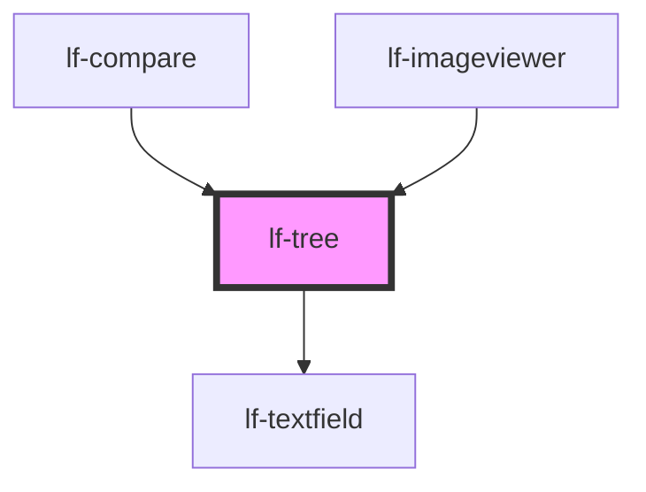

# lf-tree

<!-- Auto Generated Below -->

## Overview

The tree component displays a hierarchical dataset in a tree structure.
The tree may include nodes that can be expanded or collapsed.

## Properties

| Property                  | Attribute                    | Description                                                                                                                            | Type                                                                               | Default         |
| ------------------------- | ---------------------------- | -------------------------------------------------------------------------------------------------------------------------------------- | ---------------------------------------------------------------------------------- | --------------- |
| `lfAccordionLayout`       | `lf-accordion-layout`        | When enabled, the first level of depth will create an accordion-style appearance for nodes.                                            | `boolean`                                                                          | `true`          |
| `lfDataset`               | --                           | The data set for the LF Tree component. This property is mutable, meaning it can be changed after the component is initialized.        | `LfDataDataset`                                                                    | `null`          |
| `lfEmpty`                 | `lf-empty`                   | Empty text displayed when there is no data.                                                                                            | `string`                                                                           | `"Empty data."` |
| `lfFilter`                | `lf-filter`                  | When true, displays a text field which enables filtering the dataset of the tree.                                                      | `boolean`                                                                          | `true`          |
| `lfInitialExpansionDepth` | `lf-initial-expansion-depth` | Sets the initial expanded nodes based on the specified depth. If the property is not provided, all nodes in the tree will be expanded. | `number`                                                                           | `undefined`     |
| `lfRipple`                | `lf-ripple`                  | When set to true, the pointerdown event will trigger a ripple effect.                                                                  | `boolean`                                                                          | `true`          |
| `lfSelectable`            | `lf-selectable`              | When true, nodes can be selected.                                                                                                      | `boolean`                                                                          | `true`          |
| `lfStyle`                 | `lf-style`                   | Custom styling for the component.                                                                                                      | `string`                                                                           | `""`            |
| `lfUiSize`                | `lf-ui-size`                 | The size of the component.                                                                                                             | `"large" \| "medium" \| "small" \| "xlarge" \| "xsmall" \| "xxlarge" \| "xxsmall"` | `"medium"`      |

## Events

| Event           | Description                                                                                                                                                                                    | Type                              |
| --------------- | ---------------------------------------------------------------------------------------------------------------------------------------------------------------------------------------------- | --------------------------------- |
| `lf-tree-event` | Fires when the component triggers an internal action or user interaction. The event contains an `eventType` string, which identifies the action, and optionally `data` for additional details. | `CustomEvent<LfTreeEventPayload>` |

## Methods

### `getDebugInfo() => Promise<LfDebugLifecycleInfo>`

Retrieves the debug information reflecting the current state of the component.

#### Returns

Type: `Promise<LfDebugLifecycleInfo>`

A promise that resolves to a LfDebugLifecycleInfo object containing debug information.

### `getProps() => Promise<LfTreePropsInterface>`

Used to retrieve component's properties and descriptions.

#### Returns

Type: `Promise<LfTreePropsInterface>`

Promise resolved with an object containing the component's properties.

### `refresh() => Promise<void>`

Triggers a re-render of the component to reflect any state changes.

#### Returns

Type: `Promise<void>`

### `unmount(ms?: number) => Promise<void>`

Initiates the unmount sequence, which removes the component from the DOM after a delay.

#### Parameters

| Name | Type     | Description              |
| ---- | -------- | ------------------------ |
| `ms` | `number` | - Number of milliseconds |

#### Returns

Type: `Promise<void>`

## CSS Custom Properties

| Name                              | Description                                                                                       |
| --------------------------------- | ------------------------------------------------------------------------------------------------- |
| `--lf-tree-accordion-node-height` | Sets the height for the tree accordion node. Defaults to => 4em                                   |
| `--lf-tree-border-radius`         | Sets the border radius for the tree component. Defaults to => var(--lf-ui-border-radius)          |
| `--lf-tree-color-bg`              | Sets the color-bg color for the tree component. Defaults to => var(--lf-color-bg)                 |
| `--lf-tree-color-on-bg`           | Sets the color-on-bg color for the tree component. Defaults to => var(--lf-color-on-bg)           |
| `--lf-tree-color-on-surface`      | Sets the color-on-surface color for the tree component. Defaults to => var(--lf-color-on-surface) |
| `--lf-tree-color-surface`         | Sets the color-surface color for the tree component. Defaults to => var(--lf-color-surface)       |
| `--lf-tree-font-family`           | Sets the primary font family for the tree component. Defaults to => var(--lf-font-family-primary) |
| `--lf-tree-font-size`             | Sets the font size for the tree component. Defaults to => var(--lf-font-size)                     |
| `--lf-tree-node-height`           | Sets the height for the tree node. Defaults to => 2em                                             |
| `--lf-tree-node-padding`          | Sets the padding for the tree node. Defaults to => 0 1em                                          |
| `--lf-tree-padding`               | Sets the padding for the tree component. Defaults to => 0                                         |

## Dependencies

### Used by

 - [lf-compare](../lf-compare)
 - [lf-imageviewer](../lf-imageviewer)

### Depends on

- [lf-textfield](../lf-textfield)

### Graph

----------------------------------------------

*Built with [StencilJS](https://stenciljs.com/)*
