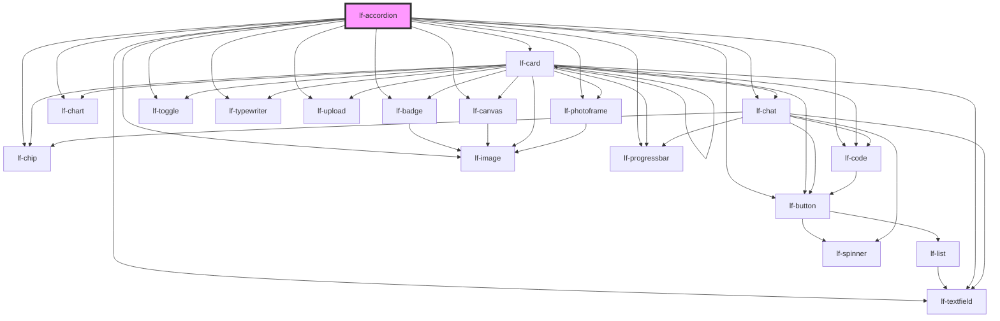

# lf-accordion

<!-- Auto Generated Below -->

## Overview

Represents an accordion-style component that displays a list of data items,
allowing users to expand or collapse content sections. Implements various
methods for managing state, retrieving component properties, handling user
interactions, and unmounting the component. Ripple effects may be enabled or
disabled via a property.

## Properties

| Property    | Attribute     | Description                                                                                                                          | Type                                                                                     | Default     |
| ----------- | ------------- | ------------------------------------------------------------------------------------------------------------------------------------ | ---------------------------------------------------------------------------------------- | ----------- |
| `lfDataset` | --            | The data set for the LF Accordion component. This property is mutable, meaning it can be changed after the component is initialized. | `LfDataDataset`                                                                          | `null`      |
| `lfRipple`  | `lf-ripple`   | Indicates whether the ripple effect is enabled for the accordion component.                                                          | `boolean`                                                                                | `true`      |
| `lfStyle`   | `lf-style`    | Custom styling for the component.                                                                                                    | `string`                                                                                 | `""`        |
| `lfUiSize`  | `lf-ui-size`  | The size of the component.                                                                                                           | `"large" \| "medium" \| "small" \| "xlarge" \| "xsmall" \| "xxlarge" \| "xxsmall"`       | `"medium"`  |
| `lfUiState` | `lf-ui-state` | The color theme state for the component.                                                                                             | `"danger" \| "disabled" \| "info" \| "primary" \| "secondary" \| "success" \| "warning"` | `"primary"` |

## Events

| Event                | Description                                                                                                                                                                                    | Type                                   |
| -------------------- | ---------------------------------------------------------------------------------------------------------------------------------------------------------------------------------------------- | -------------------------------------- |
| `lf-accordion-event` | Fires when the component triggers an internal action or user interaction. The event contains an `eventType` string, which identifies the action, and optionally `data` for additional details. | `CustomEvent<LfAccordionEventPayload>` |

## Methods

### `getDebugInfo() => Promise<LfDebugLifecycleInfo>`

Fetches debug information of the component's current state.

#### Returns

Type: `Promise<LfDebugLifecycleInfo>`

A promise that resolves with the debug information object.

### `getProps() => Promise<LfAccordionPropsInterface>`

Used to retrieve component's properties and descriptions.

#### Returns

Type: `Promise<LfAccordionPropsInterface>`

Promise resolved with an object containing the component's properties.

### `getSelectedNodes() => Promise<Set<LfDataNode>>`

Returns the selected nodes.

#### Returns

Type: `Promise<Set<LfDataNode>>`

Selected nodes.

### `refresh() => Promise<void>`

This method is used to trigger a new render of the component.

#### Returns

Type: `Promise<void>`

### `toggleNode(id: string, e?: Event) => Promise<void>`

Toggles a node in the accordion, expanding or collapsing it based on its current state.

#### Parameters

| Name | Type     | Description                                        |
| ---- | -------- | -------------------------------------------------- |
| `id` | `string` | - The ID of the node to toggle.                    |
| `e`  | `Event`  | - The event that triggered the node toggle action. |

#### Returns

Type: `Promise<void>`

### `unmount(ms?: number) => Promise<void>`

Initiates the unmount sequence, which removes the component from the DOM after a delay.

#### Parameters

| Name | Type     | Description              |
| ---- | -------- | ------------------------ |
| `ms` | `number` | - Number of milliseconds |

#### Returns

Type: `Promise<void>`

## CSS Custom Properties

| Name                              | Description                                                                                            |
| --------------------------------- | ------------------------------------------------------------------------------------------------------ |
| `--lf-accordion-border-color`     | Sets the border color for the accordion component. Defaults to => var(--lf-color-border)               |
| `--lf-accordion-border-radius`    | Sets the border radius for the accordion component. Defaults to => var(--lf-ui-border-radius)          |
| `--lf-accordion-color-bg`         | Sets the color-bg color for the accordion component. Defaults to => var(--lf-color-bg)                 |
| `--lf-accordion-color-on-bg`      | Sets the color-on-bg color for the accordion component. Defaults to => var(--lf-color-on-bg)           |
| `--lf-accordion-color-on-primary` | Sets the color-on-primary color for the accordion component. Defaults to => var(--lf-color-on-primary) |
| `--lf-accordion-color-primary`    | Sets the color-primary color for the accordion component. Defaults to => var(--lf-color-primary)       |
| `--lf-accordion-cursor`           | Sets the cursor for the accordion header. Defaults to => pointer                                       |
| `--lf-accordion-expand-margin`    | Sets the margin of the accordion expand icon. Defaults to => 0 0 0 auto                                |
| `--lf-accordion-flex-direction`   | Sets the flex direction for the accordion component. Defaults to => column                             |
| `--lf-accordion-flex-wrap`        | Sets the flex wrap for the accordion component. Defaults to => nowrap                                  |
| `--lf-accordion-font-family`      | Sets the primary font family for the accordion component. Defaults to => var(--lf-font-family-primary) |
| `--lf-accordion-font-size`        | Sets the font size for the accordion component. Defaults to => var(--lf-font-size)                     |
| `--lf-accordion-icon-margin`      | Sets the margin of the accordion icon. Defaults to => 0 0.5em 0 0                                      |
| `--lf-accordion-line-height`      | Sets the line height of the accordion header. Defaults to => 1.75em                                    |
| `--lf-accordion-padding`          | Sets the padding of the accordion header. Defaults to => 1em                                           |
| `--lf-accordion-text-align`       | Sets the text alignment of the accordion header. Defaults to => left                                   |
| `--lf-accordion-text-margin`      | Sets the margin of the accordion text. Defaults to => 0 0.5em 0 0                                      |

## Dependencies

### Depends on

- [lf-badge](../lf-badge)
- [lf-button](../lf-button)
- [lf-canvas](../lf-canvas)
- [lf-card](../lf-card)
- [lf-chart](../lf-chart)
- [lf-chat](../lf-chat)
- [lf-chip](../lf-chip)
- [lf-code](../lf-code)
- [lf-image](../lf-image)
- [lf-photoframe](../lf-photoframe)
- [lf-progressbar](../lf-progressbar)
- [lf-textfield](../lf-textfield)
- [lf-toggle](../lf-toggle)
- [lf-typewriter](../lf-typewriter)
- [lf-upload](../lf-upload)

### Graph

----------------------------------------------

*Built with [StencilJS](https://stenciljs.com/)*
