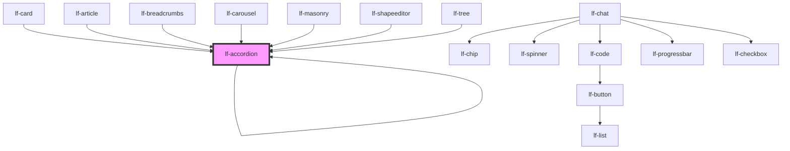

# lf-accordion

<!-- Auto Generated Below -->

## Overview

Represents an accordion-style component that displays a list of data items,
allowing users to expand or collapse content sections. Implements various
methods for managing state, retrieving component properties, handling user
interactions, and unmounting the component. Ripple effects may be enabled or
disabled via a property.

## Properties

| Property     | Attribute     | Description                                                                                                                          | Type                                                                                     | Default     |
| ------------ | ------------- | ------------------------------------------------------------------------------------------------------------------------------------ | ---------------------------------------------------------------------------------------- | ----------- |
| `lfDataset`  | --            | The data set for the LF Accordion component. This property is mutable, meaning it can be changed after the component is initialized. | `LfDataDataset`                                                                          | `null`      |
| `lfExpanded` | --            | IDs of nodes that should be expanded. When provided, the accordion will sync its internal expanded state with this array.            | `string[]`                                                                               | `[]`        |
| `lfRipple`   | `lf-ripple`   | Indicates whether the ripple effect is enabled for the accordion component.                                                          | `boolean`                                                                                | `true`      |
| `lfStyle`    | `lf-style`    | Custom styling for the component.                                                                                                    | `string`                                                                                 | `""`        |
| `lfUiSize`   | `lf-ui-size`  | The size of the component.                                                                                                           | `"large" \| "medium" \| "small" \| "xlarge" \| "xsmall" \| "xxlarge" \| "xxsmall"`       | `"medium"`  |
| `lfUiState`  | `lf-ui-state` | The color theme state for the component.                                                                                             | `"danger" \| "disabled" \| "info" \| "primary" \| "secondary" \| "success" \| "warning"` | `"primary"` |

## Events

| Event                | Description                                                                                                                                                                                    | Type                                   |
| -------------------- | ---------------------------------------------------------------------------------------------------------------------------------------------------------------------------------------------- | -------------------------------------- |
| `lf-accordion-event` | Fires when the component triggers an internal action or user interaction. The event contains an `eventType` string, which identifies the action, and optionally `data` for additional details. | `CustomEvent<LfAccordionEventPayload>` |

## Methods

### `getDebugInfo() => Promise<LfDebugLifecycleInfo>`

Fetches debug information of the component's current state.

#### Returns

Type: `Promise<LfDebugLifecycleInfo>`

A promise that resolves with the debug information object.

### `getExpandedNodes() => Promise<Set<string>>`

Returns the expanded node IDs.

#### Returns

Type: `Promise<Set<string>>`

Expanded node IDs.

### `getProps() => Promise<LfAccordionPropsInterface>`

Used to retrieve component's properties and descriptions.

#### Returns

Type: `Promise<LfAccordionPropsInterface>`

Promise resolved with an object containing the component's properties.

### `getSelectedNodes() => Promise<Set<string>>`

Returns the selected node IDs.

#### Returns

Type: `Promise<Set<string>>`

Selected node IDs.

### `refresh() => Promise<void>`

This method is used to trigger a new render of the component.

#### Returns

Type: `Promise<void>`

### `toggleNode(id: string, e?: Event) => Promise<void>`

Toggles a node in the accordion, expanding or collapsing it based on its current state.

#### Parameters

| Name | Type     | Description                                        |
| ---- | -------- | -------------------------------------------------- |
| `id` | `string` | - The ID of the node to toggle.                    |
| `e`  | `Event`  | - The event that triggered the node toggle action. |

#### Returns

Type: `Promise<void>`

### `unmount(ms?: number) => Promise<void>`

Initiates the unmount sequence, which removes the component from the DOM after a delay.

#### Parameters

| Name | Type     | Description              |
| ---- | -------- | ------------------------ |
| `ms` | `number` | - Number of milliseconds |

#### Returns

Type: `Promise<void>`

## CSS Custom Properties

| Name                              | Description                                                                                            |
| --------------------------------- | ------------------------------------------------------------------------------------------------------ |
| `--lf-accordion-border-color`     | Border color for accordion items. Defaults to => var(--lf-state-border, var(--lf-color-border))        |
| `--lf-accordion-border-radius`    | Border radius for accordion items. Defaults to => var(--lf-ui-border-radius, 0.375em)                  |
| `--lf-accordion-border-width`     | Border width for accordion items. Defaults to => var(--lf-ui-border-width, 1px)                        |
| `--lf-accordion-color-bg`         | Background color for accordion headers. Defaults to => var(--lf-state-bg, var(--lf-color-bg))          |
| `--lf-accordion-color-on-bg`      | Text color on background surface. Defaults to => var(--lf-state-on-bg, var(--lf-color-on-bg))          |
| `--lf-accordion-color-on-primary` | Text color on primary surface. Defaults to => var(--lf-state-on-primary, var(--lf-color-on-primary))   |
| `--lf-accordion-color-on-surface` | Text color on surface. Defaults to => var(--lf-state-on-surface, var(--lf-color-on-surface))           |
| `--lf-accordion-color-primary`    | Primary/accent color for selections. Defaults to => var(--lf-state-primary, var(--lf-color-primary))   |
| `--lf-accordion-color-surface`    | Surface color for accordion items. Defaults to => var(--lf-state-surface, var(--lf-color-surface))     |
| `--lf-accordion-cursor`           | Cursor for accordion headers. Defaults to => pointer                                                   |
| `--lf-accordion-expand-margin`    | Margin for the expand icon. Defaults to => 0                                                           |
| `--lf-accordion-flex-direction`   | Flex direction for accordion container. Defaults to => column                                          |
| `--lf-accordion-flex-wrap`        | Flex wrap for accordion container. Defaults to => nowrap                                               |
| `--lf-accordion-font-family`      | Sets the primary font family for the accordion component. Defaults to => var(--lf-font-family-primary) |
| `--lf-accordion-font-size`        | Sets the font size for the accordion component. Defaults to => var(--lf-font-size)                     |
| `--lf-accordion-font-weight`      | Font weight for accordion headers. Defaults to => var(--lf-font-weight-title)                          |
| `--lf-accordion-gap`              | Gap between header elements. Defaults to => 0.5em                                                      |
| `--lf-accordion-icon-margin`      | Margin for item icons. Defaults to => 0                                                                |
| `--lf-accordion-icon-size`        | Size for icons. Defaults to => 1.25em                                                                  |
| `--lf-accordion-line-height`      | Line height for accordion headers. Defaults to => 1.75em                                               |
| `--lf-accordion-padding`          | Padding for accordion headers. Defaults to => 1em                                                      |
| `--lf-accordion-text-align`       | Text alignment for headers. Defaults to => left                                                        |
| `--lf-accordion-text-margin`      | Margin for header text. Defaults to => 0                                                               |

## Dependencies

### Used by

 - [lf-accordion](.)
 - [lf-article](../lf-article)
 - [lf-breadcrumbs](../lf-breadcrumbs)
 - [lf-card](../lf-card)
 - [lf-carousel](../lf-carousel)
 - [lf-masonry](../lf-masonry)
 - [lf-shapeeditor](../lf-shapeeditor)
 - [lf-tree](../lf-tree)

### Depends on

- [lf-accordion](.)
- [lf-badge](../lf-badge)
- [lf-button](../lf-button)
- [lf-canvas](../lf-canvas)
- [lf-card](../lf-card)
- [lf-chart](../lf-chart)
- [lf-chat](../lf-chat)
- [lf-chip](../lf-chip)
- [lf-code](../lf-code)
- [lf-image](../lf-image)
- [lf-photoframe](../lf-photoframe)
- [lf-progressbar](../lf-progressbar)
- [lf-textfield](../lf-textfield)
- [lf-toggle](../lf-toggle)
- [lf-typewriter](../lf-typewriter)
- [lf-upload](../lf-upload)

### Graph

```mermaid
graph TD;
  lf-accordion --> lf-accordion
  lf-button --> lf-list
  lf-card --> lf-accordion
  lf-chat --> lf-chip
  lf-chat --> lf-spinner
  lf-chat --> lf-code
  lf-chat --> lf-progressbar
  lf-chat --> lf-checkbox
  lf-code --> lf-button
  lf-article --> lf-accordion
  lf-breadcrumbs --> lf-accordion
  lf-carousel --> lf-accordion
  lf-masonry --> lf-accordion
  lf-shapeeditor --> lf-accordion
  lf-tree --> lf-accordion
  style lf-accordion fill:#f9f,stroke:#333,stroke-width:4px
```

----------------------------------------------

*Built with [StencilJS](https://stenciljs.com/)*
