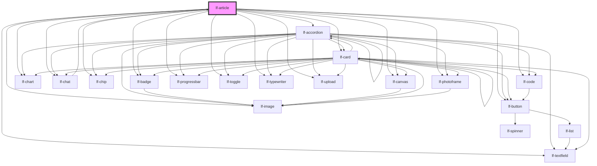

# lf-article

<!-- Auto Generated Below -->

## Overview

Represents an article-style component that displays structured content
with headings, paragraphs, and other HTML elements. Implements methods
for managing state, retrieving component properties, handling user
interactions, and unmounting the component.

## Properties

| Property    | Attribute    | Description                                                                                                                        | Type                                                                               | Default         |
| ----------- | ------------ | ---------------------------------------------------------------------------------------------------------------------------------- | ---------------------------------------------------------------------------------- | --------------- |
| `lfDataset` | --           | The data set for the LF Article component. This property is mutable, meaning it can be changed after the component is initialized. | `LfArticleDataset`                                                                 | `null`          |
| `lfEmpty`   | `lf-empty`   | Empty text displayed when there is no data.                                                                                        | `string`                                                                           | `"Empty data."` |
| `lfStyle`   | `lf-style`   | Custom styling for the component.                                                                                                  | `string`                                                                           | `""`            |
| `lfUiSize`  | `lf-ui-size` | The size of the component.                                                                                                         | `"large" \| "medium" \| "small" \| "xlarge" \| "xsmall" \| "xxlarge" \| "xxsmall"` | `"medium"`      |

## Events

| Event              | Description                                                                                                                                                                                    | Type                                 |
| ------------------ | ---------------------------------------------------------------------------------------------------------------------------------------------------------------------------------------------- | ------------------------------------ |
| `lf-article-event` | Fires when the component triggers an internal action or user interaction. The event contains an `eventType` string, which identifies the action, and optionally `data` for additional details. | `CustomEvent<LfArticleEventPayload>` |

## Methods

### `getDebugInfo() => Promise<LfDebugLifecycleInfo>`

Retrieves the debug information reflecting the current state of the component.

#### Returns

Type: `Promise<LfDebugLifecycleInfo>`

A promise that resolves to a LfDebugLifecycleInfo object containing debug information.

### `getProps() => Promise<LfArticlePropsInterface>`

Used to retrieve component's properties and descriptions.

#### Returns

Type: `Promise<LfArticlePropsInterface>`

Promise resolved with an object containing the component's properties.

### `refresh() => Promise<void>`

Triggers a re-render of the component to reflect any state changes.

#### Returns

Type: `Promise<void>`

### `unmount(ms?: number) => Promise<void>`

Initiates the unmount sequence, which removes the component from the DOM after a delay.

#### Parameters

| Name | Type     | Description              |
| ---- | -------- | ------------------------ |
| `ms` | `number` | - Number of milliseconds |

#### Returns

Type: `Promise<void>`

## CSS Custom Properties

| Name                            | Description                                                                                          |
| ------------------------------- | ---------------------------------------------------------------------------------------------------- |
| `--lf-article-border-radius`    | Sets the border radius for the article component. Defaults to => var(--lf-ui-border-radius)          |
| `--lf-article-color-h1`         | Sets the h1 color for the article component. Defaults to => var(--lf-color-on-bg)                    |
| `--lf-article-color-h2`         | Sets the h2 color for the article component. Defaults to => var(--lf-color-on-bg)                    |
| `--lf-article-color-h3`         | Sets the h3 color for the article component. Defaults to => var(--lf-color-on-bg)                    |
| `--lf-article-color-h4`         | Sets the h4 color for the article component. Defaults to => var(--lf-color-on-bg)                    |
| `--lf-article-color-h5`         | Sets the h5 color for the article component. Defaults to => var(--lf-color-on-bg)                    |
| `--lf-article-color-h6`         | Sets the h6 color for the article component. Defaults to => var(--lf-color-on-bg)                    |
| `--lf-article-color-on-bg`      | Sets the color-on-bg color for the article component. Defaults to => var(--lf-color-on-bg)           |
| `--lf-article-color-on-surface` | Sets the color-on-surface color for the article component. Defaults to => var(--lf-color-on-surface) |
| `--lf-article-color-surface`    | Sets the color-surface color for the article component. Defaults to => var(--lf-color-surface)       |
| `--lf-article-font-family`      | Sets the primary font family for the article component. Defaults to => var(--lf-font-family-primary) |
| `--lf-article-font-family-body` | Sets the body font family for the article component. Defaults to => var(--lf-font-family-primary)    |
| `--lf-article-font-family-h1`   | Sets the h1 font family for the article component. Defaults to => var(--lf-font-family-primary)      |
| `--lf-article-font-family-h2`   | Sets the h2 font family for the article component. Defaults to => var(--lf-font-family-primary)      |
| `--lf-article-font-family-h3`   | Sets the h3 font family for the article component. Defaults to => var(--lf-font-family-primary)      |
| `--lf-article-font-family-h4`   | Sets the h4 font family for the article component. Defaults to => var(--lf-font-family-primary)      |
| `--lf-article-font-family-h5`   | Sets the h5 font family for the article component. Defaults to => var(--lf-font-family-primary)      |
| `--lf-article-font-family-h6`   | Sets the h6 font family for the article component. Defaults to => var(--lf-font-family-primary)      |
| `--lf-article-font-size`        | Sets the font size for the article component. Defaults to => var(--lf-font-size)                     |
| `--lf-article-font-size-body`   | Sets the body font size for the article component. Defaults to => var(--lf-font-size)                |
| `--lf-article-font-size-h1`     | Sets the h1 font size for the article component. Defaults to => 2em                                  |
| `--lf-article-font-size-h2`     | Sets the h2 font size for the article component. Defaults to => 1.75em                               |
| `--lf-article-font-size-h3`     | Sets the h3 font size for the article component. Defaults to => 1.5em                                |
| `--lf-article-font-size-h4`     | Sets the h4 font size for the article component. Defaults to => 1.25em                               |
| `--lf-article-font-size-h5`     | Sets the h5 font size for the article component. Defaults to => 1.125em                              |
| `--lf-article-font-size-h6`     | Sets the h6 font size for the article component. Defaults to => 1em                                  |
| `--lf-article-margin`           | Sets the margin for the article component. Defaults to => auto                                       |
| `--lf-article-max-width`        | Sets the max width for the article component. Defaults to => 1200px                                  |
| `--lf-article-padding`          | Sets the padding for the article component. Defaults to => 2.5em                                     |
| `--lf-article-padding-ul`       | Sets the padding for the ul component. Defaults to => 1.25em                                         |

## Dependencies

### Used by

 - [lf-chat](../lf-chat)

### Depends on

- [lf-accordion](../lf-accordion)
- [lf-badge](../lf-badge)
- [lf-button](../lf-button)
- [lf-canvas](../lf-canvas)
- [lf-card](../lf-card)
- [lf-chart](../lf-chart)
- [lf-chat](../lf-chat)
- [lf-chip](../lf-chip)
- [lf-code](../lf-code)
- [lf-image](../lf-image)
- [lf-photoframe](../lf-photoframe)
- [lf-progressbar](../lf-progressbar)
- [lf-textfield](../lf-textfield)
- [lf-toggle](../lf-toggle)
- [lf-typewriter](../lf-typewriter)
- [lf-upload](../lf-upload)

### Graph

----------------------------------------------

*Built with [StencilJS](https://stenciljs.com/)*
