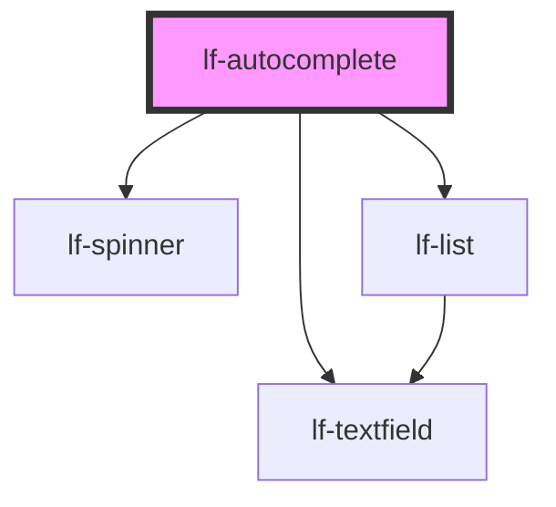

# lf-autocomplete

<!-- Auto Generated Below -->

## Overview

The autocomplete component provides an input field with dynamic, server-fetched suggestions.
It displays results in a dropdown list and debounces user input to optimize API requests.

## Properties

| Property           | Attribute             | Description                                                                                                                                                           | Type                                                                                                                                                                                                                                                                                                                                                                                                                                                                                                                                                                                                                                                                                                                                                                                                                                                                                                                                                                                                                                                                                                                   | Default     |
| ------------------ | --------------------- | --------------------------------------------------------------------------------------------------------------------------------------------------------------------- | ---------------------------------------------------------------------------------------------------------------------------------------------------------------------------------------------------------------------------------------------------------------------------------------------------------------------------------------------------------------------------------------------------------------------------------------------------------------------------------------------------------------------------------------------------------------------------------------------------------------------------------------------------------------------------------------------------------------------------------------------------------------------------------------------------------------------------------------------------------------------------------------------------------------------------------------------------------------------------------------------------------------------------------------------------------------------------------------------------------------------- | ----------- |
| `lfAllowFreeInput` | `lf-allow-free-input` | Allows input of values that are not present in the dataset. When true, users can type and submit any value. When false, only values from the dataset can be selected. | `boolean`                                                                                                                                                                                                                                                                                                                                                                                                                                                                                                                                                                                                                                                                                                                                                                                                                                                                                                                                                                                                                                                                                                              | `true`      |
| `lfCache`          | `lf-cache`            | Enables caching of autocomplete results. When enabled, previously fetched results are stored and reused for identical queries.                                        | `boolean`                                                                                                                                                                                                                                                                                                                                                                                                                                                                                                                                                                                                                                                                                                                                                                                                                                                                                                                                                                                                                                                                                                              | `false`     |
| `lfCacheTTL`       | `lf-cache-t-t-l`      | Sets the time-to-live for cached entries in milliseconds. Cached entries older than this will be considered expired.                                                  | `number`                                                                                                                                                                                                                                                                                                                                                                                                                                                                                                                                                                                                                                                                                                                                                                                                                                                                                                                                                                                                                                                                                                               | `300000`    |
| `lfDataset`        | --                    | Sets the dataset containing the autocomplete suggestions. This is typically updated dynamically in response to request events.                                        | `LfDataDataset`                                                                                                                                                                                                                                                                                                                                                                                                                                                                                                                                                                                                                                                                                                                                                                                                                                                                                                                                                                                                                                                                                                        | `null`      |
| `lfDebounceMs`     | `lf-debounce-ms`      | Sets the debounce delay in milliseconds before triggering a request event.                                                                                            | `number`                                                                                                                                                                                                                                                                                                                                                                                                                                                                                                                                                                                                                                                                                                                                                                                                                                                                                                                                                                                                                                                                                                               | `300`       |
| `lfListProps`      | --                    | Sets the props for the internal lf-list component.                                                                                                                    | `{ applyFilter?: (value: string) => Promise<void>; focusNext?: () => Promise<void>; focusPrevious?: () => Promise<void>; getSelected?: () => Promise<LfDataNode>; selectNode?: (idx: number) => Promise<void>; selectNodeById?: (id: string) => Promise<void>; setFilter?: (value: string) => Promise<void>; rootElement?: LfListElement; debugInfo?: LfDebugLifecycleInfo; getDebugInfo?: () => Promise<LfDebugLifecycleInfo>; getProps?: (descriptions?: boolean) => Promise<LfComponentPropsFor<LfComponentName>>; lfStyle?: string; refresh?: () => Promise<void>; unmount?: (ms?: number) => Promise<void>; lfDataset?: LfDataDataset; lfEmpty?: string; lfEnableDeletions?: boolean; lfFilter?: boolean; lfNavigation?: boolean; lfRipple?: boolean; lfSelectable?: boolean; lfUiSize?: "large" \| "medium" \| "small" \| "xlarge" \| "xsmall" \| "xxlarge" \| "xxsmall"; lfUiState?: "danger" \| "disabled" \| "info" \| "primary" \| "secondary" \| "success" \| "warning"; lfValue?: number; }`                                                                                                               | `null`      |
| `lfMaxCacheSize`   | `lf-max-cache-size`   | Sets the maximum number of entries in the cache. When exceeded, oldest entries are evicted (FIFO).                                                                    | `number`                                                                                                                                                                                                                                                                                                                                                                                                                                                                                                                                                                                                                                                                                                                                                                                                                                                                                                                                                                                                                                                                                                               | `100`       |
| `lfMinChars`       | `lf-min-chars`        | Sets the minimum number of characters required before triggering a request.                                                                                           | `number`                                                                                                                                                                                                                                                                                                                                                                                                                                                                                                                                                                                                                                                                                                                                                                                                                                                                                                                                                                                                                                                                                                               | `3`         |
| `lfNavigation`     | `lf-navigation`       | Enables keyboard navigation with arrow keys.                                                                                                                          | `boolean`                                                                                                                                                                                                                                                                                                                                                                                                                                                                                                                                                                                                                                                                                                                                                                                                                                                                                                                                                                                                                                                                                                              | `true`      |
| `lfSpinnerProps`   | --                    | Sets the props for the internal lf-spinner component.                                                                                                                 | `{ getProgress?: () => Promise<number>; rootElement?: LfSpinnerElement; debugInfo?: LfDebugLifecycleInfo; getDebugInfo?: () => Promise<LfDebugLifecycleInfo>; getProps?: (descriptions?: boolean) => Promise<LfComponentPropsFor<LfComponentName>>; lfStyle?: string; refresh?: () => Promise<void>; unmount?: (ms?: number) => Promise<void>; lfActive?: boolean; lfBarVariant?: boolean; lfDimensions?: string; lfFader?: boolean; lfFaderTimeout?: number; lfFullScreen?: boolean; lfLayout?: number; lfTimeout?: number; }`                                                                                                                                                                                                                                                                                                                                                                                                                                                                                                                                                                                        | `null`      |
| `lfStyle`          | `lf-style`            | Custom CSS styles to apply to the component.                                                                                                                          | `string`                                                                                                                                                                                                                                                                                                                                                                                                                                                                                                                                                                                                                                                                                                                                                                                                                                                                                                                                                                                                                                                                                                               | `null`      |
| `lfTextfieldProps` | --                    | Sets the props for the internal lf-textfield component.                                                                                                               | `{ formatJSON?: () => Promise<void>; getElement?: () => Promise<HTMLInputElement \| HTMLTextAreaElement>; getValue?: () => Promise<string>; setBlur?: () => Promise<void>; setFocus?: () => Promise<void>; setValue?: (value: string) => Promise<void>; rootElement?: LfTextfieldElement; debugInfo?: LfDebugLifecycleInfo; getDebugInfo?: () => Promise<LfDebugLifecycleInfo>; getProps?: (descriptions?: boolean) => Promise<LfComponentPropsFor<LfComponentName>>; lfStyle?: string; refresh?: () => Promise<void>; unmount?: (ms?: number) => Promise<void>; lfFormatJSON?: LfTextfieldFormatJSON; lfHelper?: LfTextfieldHelper; lfHtmlAttributes?: Partial<LfFrameworkAllowedKeysMap>; lfIcon?: string; lfLabel?: string; lfStretchY?: boolean; lfStyling?: "flat" \| "outlined" \| "raised" \| "textarea"; lfTrailingIcon?: boolean; lfTrailingIconAction?: LfTextfieldTrailingIconAction; lfUiSize?: "large" \| "medium" \| "small" \| "xlarge" \| "xsmall" \| "xxlarge" \| "xxsmall"; lfUiState?: "danger" \| "disabled" \| "info" \| "primary" \| "secondary" \| "success" \| "warning"; lfValue?: string; }` | `null`      |
| `lfUiSize`         | `lf-ui-size`          | Sets the UI size of the autocomplete field.                                                                                                                           | `"large" \| "medium" \| "small" \| "xlarge" \| "xsmall" \| "xxlarge" \| "xxsmall"`                                                                                                                                                                                                                                                                                                                                                                                                                                                                                                                                                                                                                                                                                                                                                                                                                                                                                                                                                                                                                                     | `"medium"`  |
| `lfUiState`        | `lf-ui-state`         | Sets the UI state (primary, secondary, disabled, etc.).                                                                                                               | `"danger" \| "disabled" \| "info" \| "primary" \| "secondary" \| "success" \| "warning"`                                                                                                                                                                                                                                                                                                                                                                                                                                                                                                                                                                                                                                                                                                                                                                                                                                                                                                                                                                                                                               | `"primary"` |
| `lfValue`          | `lf-value`            | Sets the initial value of the input field.                                                                                                                            | `string`                                                                                                                                                                                                                                                                                                                                                                                                                                                                                                                                                                                                                                                                                                                                                                                                                                                                                                                                                                                                                                                                                                               | `""`        |

## Events

| Event                   | Description                                                                                                                                                                                                                                                                                                                                                                                                                                    | Type                                      |
| ----------------------- | ---------------------------------------------------------------------------------------------------------------------------------------------------------------------------------------------------------------------------------------------------------------------------------------------------------------------------------------------------------------------------------------------------------------------------------------------- | ----------------------------------------- |
| `lf-autocomplete-event` | Unified custom event emitted for all autocomplete interactions. Check the eventType property to distinguish between different events: - "input": User typed in the field (includes query) - "request": Debounce complete, ready to fetch data (includes query) - "change": User selected an item from the list - "lf-event": Generic passthrough for child component events - "ready": Component initialized - "unmount": Component unmounting | `CustomEvent<LfAutocompleteEventPayload>` |

## Methods

### `clearCache() => Promise<void>`

Clears the cache of the autocomplete component.

#### Returns

Type: `Promise<void>`

### `clearInput() => Promise<void>`

Clears the input field.

#### Returns

Type: `Promise<void>`

### `getDebugInfo() => Promise<LfDebugLifecycleInfo>`

Retrieves the debug information for this component instance.

#### Returns

Type: `Promise<LfDebugLifecycleInfo>`

Lifecycle and performance metrics

### `getProps() => Promise<any>`

Retrieves all public props of this component as an object.

#### Returns

Type: `Promise<any>`

All component props

### `getValue() => Promise<string>`

Returns the current input value.

#### Returns

Type: `Promise<string>`

The current input text

### `refresh() => Promise<void>`

Forces the component to re-render.

#### Returns

Type: `Promise<void>`

### `setValue(value: string) => Promise<void>`

Sets the input value.

#### Parameters

| Name    | Type     | Description           |
| ------- | -------- | --------------------- |
| `value` | `string` | - The new input value |

#### Returns

Type: `Promise<void>`

### `unmount() => Promise<void>`

Performs cleanup for the component.

#### Returns

Type: `Promise<void>`

## CSS Custom Properties

| Name                            | Description                                                                                               |
| ------------------------------- | --------------------------------------------------------------------------------------------------------- |
| `--lf-autocomplete-font-family` | Sets the primary font family for the autocomplete component. Defaults to => var(--lf-font-family-primary) |
| `--lf-autocomplete-font-size`   | Sets the font size for the autocomplete component. Defaults to => var(--lf-font-size)                     |

## Dependencies

### Depends on

- [lf-spinner](../lf-spinner)
- [lf-list](../lf-list)
- [lf-textfield](../lf-textfield)

### Graph

----------------------------------------------

*Built with [StencilJS](https://stenciljs.com/)*
