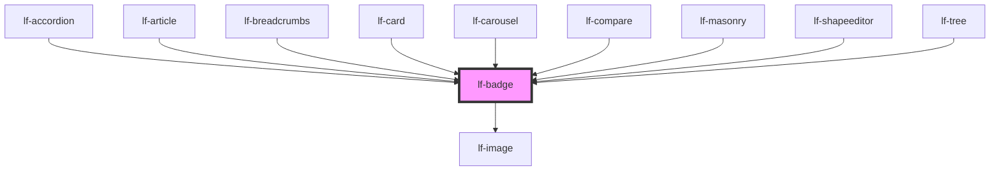

# lf-badge

<!-- Auto Generated Below -->

## Overview

Simple component that displays a badge with an optional image and label.
The badge can be positioned in one of the four corners of its container.
Custom styling can be applied to the badge and its components.
The badge can be styled with a theme color and size.

## Properties

| Property       | Attribute     | Description                                              | Type                                                                                     | Default      |
| -------------- | ------------- | -------------------------------------------------------- | ---------------------------------------------------------------------------------------- | ------------ |
| `lfImageProps` | --            | The props of the image displayed inside the badge.       | `LfImagePropsInterface`                                                                  | `null`       |
| `lfLabel`      | `lf-label`    | The label displayed inside the badge.                    | `string`                                                                                 | `""`         |
| `lfPosition`   | `lf-position` | The position of the badge in relation of its container.  | `"bottom-left" \| "bottom-right" \| "inline" \| "top-left" \| "top-right"`               | `"top-left"` |
| `lfStyle`      | `lf-style`    | Custom styling for the component.                        | `string`                                                                                 | `""`         |
| `lfUiSize`     | `lf-ui-size`  | The size of the component.                               | `"large" \| "medium" \| "small" \| "xlarge" \| "xsmall" \| "xxlarge" \| "xxsmall"`       | `"medium"`   |
| `lfUiState`    | `lf-ui-state` | Reflects the specified state color defined by the theme. | `"danger" \| "disabled" \| "info" \| "primary" \| "secondary" \| "success" \| "warning"` | `"primary"`  |

## Events

| Event            | Description                                                                                                                                                                                    | Type                               |
| ---------------- | ---------------------------------------------------------------------------------------------------------------------------------------------------------------------------------------------- | ---------------------------------- |
| `lf-badge-event` | Fires when the component triggers an internal action or user interaction. The event contains an `eventType` string, which identifies the action, and optionally `data` for additional details. | `CustomEvent<LfBadgeEventPayload>` |

## Methods

### `getDebugInfo() => Promise<LfDebugLifecycleInfo>`

Fetches debug information of the component's current state.

#### Returns

Type: `Promise<LfDebugLifecycleInfo>`

A promise that resolves with the debug information object.

### `getProps() => Promise<LfBadgePropsInterface>`

Used to retrieve component's properties and descriptions.

#### Returns

Type: `Promise<LfBadgePropsInterface>`

Promise resolved with an object containing the component's properties.

### `refresh() => Promise<void>`

This method is used to trigger a new render of the component.

#### Returns

Type: `Promise<void>`

### `unmount(ms?: number) => Promise<void>`

Initiates the unmount sequence, which removes the component from the DOM after a delay.

#### Parameters

| Name | Type     | Description              |
| ---- | -------- | ------------------------ |
| `ms` | `number` | - Number of milliseconds |

#### Returns

Type: `Promise<void>`

## CSS Custom Properties

| Name                          | Description                                                                                        |
| ----------------------------- | -------------------------------------------------------------------------------------------------- |
| `--lf-badge-border-radius`    | Sets the border radius for the badge component. Defaults to => 50%                                 |
| `--lf-badge-color-on-primary` | Sets the color-on-primary color for the badge component. Defaults to => var(--lf-color-on-primary) |
| `--lf-badge-color-primary`    | Sets the color-primary color for the badge component. Defaults to => var(--lf-color-primary)       |
| `--lf-badge-font-family`      | Sets the primary font family for the badge component. Defaults to => var(--lf-font-family-primary) |
| `--lf-badge-font-size`        | Sets the font size for the badge component. Defaults to => var(--lf-font-size)                     |
| `--lf-badge-height`           | Sets the height for the badge component. Defaults to => 1.5em                                      |
| `--lf-badge-padding`          | Sets the padding for the badge component. Defaults to => 0.25em                                    |
| `--lf-badge-place-content`    | Sets the place content for the badge component. Defaults to => center                              |
| `--lf-badge-width`            | Sets the width for the badge component. Defaults to => 1.5em                                       |

## Dependencies

### Used by

 - [lf-accordion](../lf-accordion)
 - [lf-article](../lf-article)
 - [lf-breadcrumbs](../lf-breadcrumbs)
 - [lf-card](../lf-card)
 - [lf-carousel](../lf-carousel)
 - [lf-compare](../lf-compare)
 - [lf-masonry](../lf-masonry)
 - [lf-shapeeditor](../lf-shapeeditor)
 - [lf-tree](../lf-tree)

### Depends on

- [lf-image](../lf-image)

### Graph

----------------------------------------------

*Built with [StencilJS](https://stenciljs.com/)*
