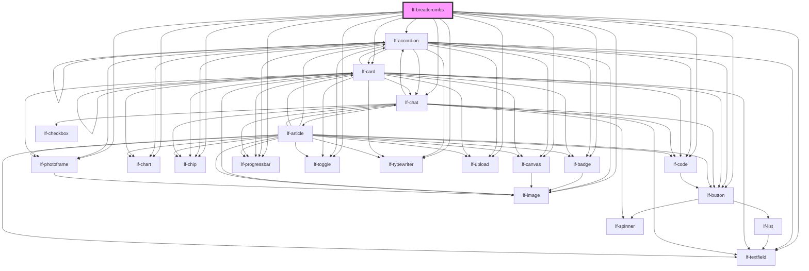

# lf-breadcrumbs

<!-- Auto Generated Below -->

## Overview

The LfBreadcrumbs component is a Stencil-based web component designed to render a breadcrumb navigation trail
based on a hierarchical dataset. It allows users to visualize and interact with the path from a root node to the
current node, supporting features like customizable separators, maximum items display, ripple effects, and theming.

This component integrates with the LF Framework for theming, debugging, and effects management. It emits events
for user interactions and provides methods for programmatic control, such as setting the current node or refreshing
the component.

Key features include:
- Dynamic breadcrumb path generation from a dataset.
- Interactive navigation with click events and optional ripple effects.
- Configurable UI size, separator, and visibility of the root node.
- Support for debugging and lifecycle management.

## Properties

| Property        | Attribute        | Description                                                  | Type                                                                                     | Default         |
| --------------- | ---------------- | ------------------------------------------------------------ | ---------------------------------------------------------------------------------------- | --------------- |
| `lfDataset`     | --               | Dataset used to build the breadcrumb path.                   | `LfDataDataset`                                                                          | `null`          |
| `lfEmpty`       | `lf-empty`       | Message displayed when the dataset is empty.                 | `string`                                                                                 | `"Empty data."` |
| `lfInteractive` | `lf-interactive` | When true, enables interactivity for breadcrumb items.       | `boolean`                                                                                | `true`          |
| `lfMaxItems`    | `lf-max-items`   | Maximum number of breadcrumb items to display.               | `number`                                                                                 | `undefined`     |
| `lfRipple`      | `lf-ripple`      | When true, enables ripple effect on breadcrumb item clicks.  | `boolean`                                                                                | `false`         |
| `lfSeparator`   | `lf-separator`   | Separator string displayed between breadcrumb items.         | `string`                                                                                 | `">"`           |
| `lfShowRoot`    | `lf-show-root`   | When true, the root node is included in the breadcrumb path. | `boolean`                                                                                | `true`          |
| `lfStyle`       | `lf-style`       | Custom CSS styles applied to the component.                  | `string`                                                                                 | `""`            |
| `lfUiSize`      | `lf-ui-size`     | The size of the component.                                   | `"large" \| "medium" \| "small" \| "xlarge" \| "xsmall" \| "xxlarge" \| "xxsmall"`       | `"medium"`      |
| `lfUiState`     | `lf-ui-state`    | Reflects the specified state color defined by the theme.     | `"danger" \| "disabled" \| "info" \| "primary" \| "secondary" \| "success" \| "warning"` | `"primary"`     |
| `lfValue`       | `lf-value`       | ID of the current node in the breadcrumb path.               | `string`                                                                                 | `undefined`     |

## Events

| Event                  | Description | Type                                                                                                                                                     |
| ---------------------- | ----------- | -------------------------------------------------------------------------------------------------------------------------------------------------------- |
| `lf-breadcrumbs-event` |             | `CustomEvent<LfEventPayload<"LfBreadcrumbs", "click" \| "lf-event" \| "pointerdown" \| "ready" \| "unmount" \| "expand"> & LfBreadcrumbsEventArguments>` |

## Methods

### `getDebugInfo() => Promise<LfDebugLifecycleInfo>`

Fetches debug information of the component's current state.

#### Returns

Type: `Promise<LfDebugLifecycleInfo>`

A promise that resolves with the debug information object.

### `getProps() => Promise<LfBreadcrumbsPropsInterface>`

Used to retrieve component's properties and descriptions.

#### Returns

Type: `Promise<LfBreadcrumbsPropsInterface>`

Promise resolved with an object containing the component's properties.

### `refresh() => Promise<void>`

This method is used to trigger a new render of the component.

#### Returns

Type: `Promise<void>`

### `setCurrentNode(nodeId: string) => Promise<void>`

Sets the current node to the specified node ID.

#### Parameters

| Name     | Type     | Description                             |
| -------- | -------- | --------------------------------------- |
| `nodeId` | `string` | - The ID of the node to set as current. |

#### Returns

Type: `Promise<void>`

A promise that resolves when the current node has been set.

### `unmount(ms?: number) => Promise<void>`

Initiates the unmount sequence, which removes the component from the DOM after a delay.

#### Parameters

| Name | Type     | Description              |
| ---- | -------- | ------------------------ |
| `ms` | `number` | - Number of milliseconds |

#### Returns

Type: `Promise<void>`

## Slots

| Slot | Description                                                                    |
| ---- | ------------------------------------------------------------------------------ |
|      | Default slot for custom content, though primarily used for internal rendering. |

## CSS Custom Properties

| Name                                | Description                                                                                              |
| ----------------------------------- | -------------------------------------------------------------------------------------------------------- |
| `--lf-breadcrumbs-border-radius`    | Sets the border radius for the breadcrumbs component. Defaults to => var(--lf-ui-border-radius)          |
| `--lf-breadcrumbs-color-on-primary` | Sets the color-on-primary color for the breadcrumbs component. Defaults to => var(--lf-color-on-primary) |
| `--lf-breadcrumbs-color-on-surface` | Sets the color-on-surface color for the breadcrumbs component. Defaults to => var(--lf-color-on-surface) |
| `--lf-breadcrumbs-color-primary`    | Sets the color-primary color for the breadcrumbs component. Defaults to => var(--lf-color-primary)       |
| `--lf-breadcrumbs-color-surface`    | Sets the color-surface color for the breadcrumbs component. Defaults to => var(--lf-color-surface)       |
| `--lf-breadcrumbs-dot-gap`          | Sets the gap between dots. Defaults to => 0.05em                                                         |
| `--lf-breadcrumbs-dot-gap-hover`    | Sets the gap between dots on hover. Defaults to => 0.2em                                                 |
| `--lf-breadcrumbs-font-family`      | Sets the primary font family for the breadcrumbs component. Defaults to => var(--lf-font-family-primary) |
| `--lf-breadcrumbs-font-size`        | Sets the font size for the breadcrumbs component. Defaults to => var(--lf-font-size)                     |
| `--lf-breadcrumbs-gap`              | Sets the gap between breadcrumb items. Defaults to => 0.5em                                              |
| `--lf-breadcrumbs-item-height`      | Sets the height for the items. Defaults to => 2em                                                        |
| `--lf-breadcrumbs-item-padding`     | Sets the padding for the items. Defaults to => 0 0.75em                                                  |
| `--lf-breadcrumbs-padding`          | Sets the padding for the breadcrumbs container. Defaults to => 0.5em                                     |
| `--lf-breadcrumbs-separator-margin` | Sets the horizontal margin around separators. Defaults to => 0.25em                                      |

## Dependencies

### Depends on

- [lf-accordion](../lf-accordion)
- [lf-badge](../lf-badge)
- [lf-button](../lf-button)
- [lf-canvas](../lf-canvas)
- [lf-card](../lf-card)
- [lf-chart](../lf-chart)
- [lf-chat](../lf-chat)
- [lf-chip](../lf-chip)
- [lf-code](../lf-code)
- [lf-image](../lf-image)
- [lf-photoframe](../lf-photoframe)
- [lf-progressbar](../lf-progressbar)
- [lf-textfield](../lf-textfield)
- [lf-toggle](../lf-toggle)
- [lf-typewriter](../lf-typewriter)
- [lf-upload](../lf-upload)

### Graph

----------------------------------------------

*Built with [StencilJS](https://stenciljs.com/)*
