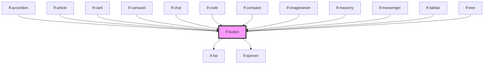

# lf-button

<!-- Auto Generated Below -->

## Overview

The button component is used to trigger actions or events.
It can display text, icons, or both, and can be styled in various ways.
The button can be disabled, toggable, or display a spinner.
It can also stretch to fill the available horizontal or vertical space.
The button can be styled with a theme color and size.

## Properties

| Property         | Attribute          | Description                                                                                                                                                                           | Type                                                                                     | Default     |
| ---------------- | ------------------ | ------------------------------------------------------------------------------------------------------------------------------------------------------------------------------------- | ---------------------------------------------------------------------------------------- | ----------- |
| `lfAriaLabel`    | `lf-aria-label`    | Explicit accessible label for the button. When provided it takes precedence over any derived label (lfLabel / lfIcon / id fallback) and is applied to the internal button element(s). | `string`                                                                                 | `""`        |
| `lfDataset`      | `lf-dataset`       | The dataset for the button, containing the nodes to be displayed. The first node will be used to set the icon and label if not provided.                                              | `LfDataDataset`                                                                          | `null`      |
| `lfIcon`         | `lf-icon`          | When set, the button will show this icon.                                                                                                                                             | `string`                                                                                 | `""`        |
| `lfIconOff`      | `lf-icon-off`      | When set, the icon button off state will show this icon. Otherwise, an outlined version of the icon prop will be displayed.                                                           | `string`                                                                                 | `""`        |
| `lfLabel`        | `lf-label`         | When set, the button will show this text.                                                                                                                                             | `string`                                                                                 | `""`        |
| `lfRipple`       | `lf-ripple`        | When set to true, the pointerdown event will trigger a ripple effect.                                                                                                                 | `boolean`                                                                                | `true`      |
| `lfShowSpinner`  | `lf-show-spinner`  | When set to true, the button will display a spinner and won't be clickable.                                                                                                           | `boolean`                                                                                | `false`     |
| `lfStretchX`     | `lf-stretch-x`     | When set to true, the button will stretch to fill the available horizontal space.                                                                                                     | `boolean`                                                                                | `false`     |
| `lfStretchY`     | `lf-stretch-y`     | When set to true, the button will stretch to fill the available vertical space.                                                                                                       | `boolean`                                                                                | `false`     |
| `lfStyle`        | `lf-style`         | Custom styling for the component.                                                                                                                                                     | `string`                                                                                 | `""`        |
| `lfStyling`      | `lf-styling`       | Defines the style of the button. This property controls the visual appearance of the button.                                                                                          | `"flat" \| "floating" \| "icon" \| "outlined" \| "raised"`                               | `"raised"`  |
| `lfToggable`     | `lf-toggable`      | When set to true, the icon button will be toggable on/off.                                                                                                                            | `boolean`                                                                                | `false`     |
| `lfTrailingIcon` | `lf-trailing-icon` | When set, the icon will be shown after the text.                                                                                                                                      | `boolean`                                                                                | `false`     |
| `lfType`         | `lf-type`          | Sets the type of the button.                                                                                                                                                          | `"button" \| "reset" \| "submit"`                                                        | `"button"`  |
| `lfUiSize`       | `lf-ui-size`       | The size of the component.                                                                                                                                                            | `"large" \| "medium" \| "small" \| "xlarge" \| "xsmall" \| "xxlarge" \| "xxsmall"`       | `"medium"`  |
| `lfUiState`      | `lf-ui-state`      | Reflects the specified state color defined by the theme.                                                                                                                              | `"danger" \| "disabled" \| "info" \| "primary" \| "secondary" \| "success" \| "warning"` | `"primary"` |
| `lfValue`        | `lf-value`         | Sets the initial state of the button. Relevant only when lfToggable is set to true.                                                                                                   | `boolean`                                                                                | `false`     |

## Events

| Event             | Description                                                                                                                                                                                    | Type                                |
| ----------------- | ---------------------------------------------------------------------------------------------------------------------------------------------------------------------------------------------- | ----------------------------------- |
| `lf-button-event` | Fires when the component triggers an internal action or user interaction. The event contains an `eventType` string, which identifies the action, and optionally `data` for additional details. | `CustomEvent<LfButtonEventPayload>` |

## Methods

### `getDebugInfo() => Promise<LfDebugLifecycleInfo>`

Fetches debug information of the component's current state.

#### Returns

Type: `Promise<LfDebugLifecycleInfo>`

A promise that resolves with the debug information object.

### `getProps() => Promise<LfButtonPropsInterface>`

Used to retrieve component's properties and descriptions.

#### Returns

Type: `Promise<LfButtonPropsInterface>`

Promise resolved with an object containing the component's properties.

### `getValue() => Promise<LfButtonState>`

Used to retrieve the component's current state.

#### Returns

Type: `Promise<"on" | "off">`

Promise resolved with the current state of the component.

### `refresh() => Promise<void>`

This method is used to trigger a new render of the component.

#### Returns

Type: `Promise<void>`

### `setMessage(label?: string, icon?: string, timeout?: number) => Promise<void>`

Temporarily sets a different label/icon combination, falling back to their previous value after a timeout.

#### Parameters

| Name      | Type     | Description                                            |
| --------- | -------- | ------------------------------------------------------ |
| `label`   | `string` | - Temporary label to display.                          |
| `icon`    | `string` | - Temporary icon to display.                           |
| `timeout` | `number` | - Time in ms to wait before restoring previous values. |

#### Returns

Type: `Promise<void>`

### `setValue(value: LfButtonState | boolean) => Promise<void>`

Sets the component's state.

#### Parameters

| Name    | Type                       | Description                                 |
| ------- | -------------------------- | ------------------------------------------- |
| `value` | `boolean \| "on" \| "off"` | - The new state to be set on the component. |

#### Returns

Type: `Promise<void>`

### `unmount(ms?: number) => Promise<void>`

Initiates the unmount sequence, which removes the component from the DOM after a delay.

#### Parameters

| Name | Type     | Description              |
| ---- | -------- | ------------------------ |
| `ms` | `number` | - Number of milliseconds |

#### Returns

Type: `Promise<void>`

## CSS Custom Properties

| Name                           | Description                                                                                         |
| ------------------------------ | --------------------------------------------------------------------------------------------------- |
| `--lf-button-align-items`      | Sets the align items for the button component. Defaults to => center                                |
| `--lf-button-border-radius`    | Sets the border radius for the button component. Defaults to => var(--lf-ui-border-radius)          |
| `--lf-button-color-border`     | Sets the color-border color for the button component. Defaults to => var(--lf-color-border)         |
| `--lf-button-color-on-primary` | Sets the color-on-primary color for the button component. Defaults to => var(--lf-color-on-primary) |
| `--lf-button-color-primary`    | Sets the color-primary color for the button component. Defaults to => var(--lf-color-primary)       |
| `--lf-button-cursor`           | Sets the cursor for the button component. Defaults to => pointer                                    |
| `--lf-button-font-family`      | Sets the primary font family for the button component. Defaults to => var(--lf-font-family-primary) |
| `--lf-button-font-size`        | Sets the font size for the button component. Defaults to => var(--lf-font-size)                     |
| `--lf-button-font-weight`      | Sets the font weight for the button component. Defaults to => var(--lf-font-weight-primary)         |
| `--lf-button-height`           | Sets the height for the button component. Defaults to => 3em                                        |
| `--lf-button-justify-content`  | Sets the justify content for the button component. Defaults to => center                            |
| `--lf-button-min-width`        | Sets the min width for the button component. Defaults to => 4em                                     |
| `--lf-button-padding`          | Sets the padding for the button component. Defaults to => 0 1.25em                                  |
| `--lf-button-text-decoration`  | Sets the text decoration for the button component. Defaults to => none                              |
| `--lf-button-text-transform`   | Sets the text transform for the button component. Defaults to => uppercase                          |

## Dependencies

### Used by

 - [lf-accordion](../lf-accordion)
 - [lf-article](../lf-article)
 - [lf-card](../lf-card)
 - [lf-carousel](../lf-carousel)
 - [lf-chat](../lf-chat)
 - [lf-code](../lf-code)
 - [lf-compare](../lf-compare)
 - [lf-imageviewer](../lf-imageviewer)
 - [lf-masonry](../lf-masonry)
 - [lf-messenger](../lf-messenger)
 - [lf-tabbar](../lf-tabbar)
 - [lf-tree](../lf-tree)

### Depends on

- [lf-list](../lf-list)
- [lf-spinner](../lf-spinner)

### Graph

----------------------------------------------

*Built with [StencilJS](https://stenciljs.com/)*
