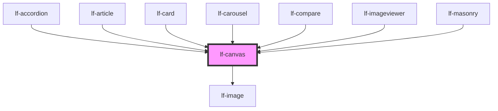

# lf-canvas

<!-- Auto Generated Below -->

## Overview

The canvas component allows users to draw on a canvas element using a brush tool.
The component provides various properties for customizing the brush size, color, opacity,
and shape, as well as the cursor style and preview display. The component also supports
loading an image into the canvas for reference or tracing purposes.

## Properties

| Property            | Attribute             | Description                                                                                                                                        | Type                     | Default     |
| ------------------- | --------------------- | -------------------------------------------------------------------------------------------------------------------------------------------------- | ------------------------ | ----------- |
| `lfBrush`           | `lf-brush`            | The shape of the brush.                                                                                                                            | `"round" \| "square"`    | `"round"`   |
| `lfColor`           | `lf-color`            | The color of the brush.                                                                                                                            | `string`                 | `"#ff0000"` |
| `lfCursor`          | `lf-cursor`           | Sets the style of the cursor.                                                                                                                      | `"default" \| "preview"` | `"preview"` |
| `lfImageProps`      | `lf-image-props`      | The props of the image displayed inside the canvas.                                                                                                | `LfImagePropsInterface`  | `null`      |
| `lfOpacity`         | `lf-opacity`          | The opacity of the brush.                                                                                                                          | `number`                 | `1.0`       |
| `lfPreview`         | `lf-preview`          | Displays the brush track of the current stroke.                                                                                                    | `boolean`                | `true`      |
| `lfSize`            | `lf-size`             | The size of the brush.                                                                                                                             | `number`                 | `10`        |
| `lfStrokeTolerance` | `lf-stroke-tolerance` | Simplifies the coordinates array by applying the Ramer-Douglas-Peucker algorithm. This prop sets the tolerance of the algorithm (null to disable). | `number`                 | `null`      |
| `lfStyle`           | `lf-style`            | Custom styling for the component.                                                                                                                  | `string`                 | `""`        |

## Events

| Event             | Description                                                                                                                                                                                    | Type                                |
| ----------------- | ---------------------------------------------------------------------------------------------------------------------------------------------------------------------------------------------- | ----------------------------------- |
| `lf-canvas-event` | Fires when the component triggers an internal action or user interaction. The event contains an `eventType` string, which identifies the action, and optionally `data` for additional details. | `CustomEvent<LfCanvasEventPayload>` |

## Methods

### `clearCanvas(type?: LfCanvasType) => Promise<void>`

Clears the specified canvas type of all drawn content.

#### Parameters

| Name   | Type                   | Description                                         |
| ------ | ---------------------- | --------------------------------------------------- |
| `type` | `"board" \| "preview"` | - The type of canvas to clear. Defaults to "board". |

#### Returns

Type: `Promise<void>`

A promise that resolves when the canvas has been cleared.

### `getCanvas(type?: LfCanvasType) => Promise<HTMLCanvasElement>`

Retrieves the canvas element based on the specified type.

#### Parameters

| Name   | Type                   | Description                                            |
| ------ | ---------------------- | ------------------------------------------------------ |
| `type` | `"board" \| "preview"` | - The type of canvas to retrieve. Defaults to "board". |

#### Returns

Type: `Promise<HTMLCanvasElement>`

Promise that resolves to the requested HTMLCanvasElement.

### `getDebugInfo() => Promise<LfDebugLifecycleInfo>`

Fetches debug information of the component's current state.

#### Returns

Type: `Promise<LfDebugLifecycleInfo>`

A promise that resolves with the debug information object.

### `getImage() => Promise<LfImageElement>`

Retrieves the HTMLLfImageElement from the canvas.

#### Returns

Type: `Promise<LfImageElement>`

A promise that resolves with the HTMLLfImageElement instance
representing the image element in the canvas.

### `getProps() => Promise<LfCanvasPropsInterface>`

Used to retrieve component's properties and descriptions.

#### Returns

Type: `Promise<LfCanvasPropsInterface>`

Promise resolved with an object containing the component's properties.

### `refresh() => Promise<void>`

This method is used to trigger a new render of the component.

#### Returns

Type: `Promise<void>`

### `resizeCanvas() => Promise<void>`

Resizes the canvas elements to match the container's dimensions.

This method adjusts both the main board canvas and preview canvas (if cursor preview is enabled)
to match the current container's height and width obtained via getBoundingClientRect().

#### Returns

Type: `Promise<void>`

A Promise that resolves when the resize operation is complete

### `setCanvasHeight(value?: number) => Promise<void>`

Sets the canvas height for both the board and preview elements.
If a value is provided, it will set that specific height.
If no value is provided, it will set the height based on the container's bounding client rect.

#### Parameters

| Name    | Type     | Description                                                        |
| ------- | -------- | ------------------------------------------------------------------ |
| `value` | `number` | - Optional number representing the desired canvas height in pixels |

#### Returns

Type: `Promise<void>`

Promise that resolves when the height has been set

### `setCanvasWidth(value?: number) => Promise<void>`

Sets the width of the canvas element(s).
If a value is provided, sets the width to that specific value.
If no value is provided, sets the width to match the container's width.
When cursor preview is enabled, also updates the preview canvas width.

#### Parameters

| Name    | Type     | Description                      |
| ------- | -------- | -------------------------------- |
| `value` | `number` | - Optional width value in pixels |

#### Returns

Type: `Promise<void>`

Promise that resolves when width is set

### `unmount(ms?: number) => Promise<void>`

Initiates the unmount sequence, which removes the component from the DOM after a delay.

#### Parameters

| Name | Type     | Description              |
| ---- | -------- | ------------------------ |
| `ms` | `number` | - Number of milliseconds |

#### Returns

Type: `Promise<void>`

## CSS Custom Properties

| Name                      | Description                                                                                         |
| ------------------------- | --------------------------------------------------------------------------------------------------- |
| `--lf-canvas-font-family` | Sets the primary font family for the canvas component. Defaults to => var(--lf-font-family-primary) |
| `--lf-canvas-font-size`   | Sets the font size for the canvas component. Defaults to => var(--lf-font-size)                     |
| `--lf-canvas-margin`      | Sets the margin for the canvas component. Defaults to => auto                                       |
| `--lf-canvas-max-height`  | Sets the max height for the canvas component. Defaults to => max-content                            |
| `--lf-canvas-max-width`   | Sets the max width for the canvas component. Defaults to => max-content                             |
| `--lf-canvas-object-fit`  | Sets the object fit for the lf-image subcomponent. Defaults to => contain                           |
| `--lf-canvas-position`    | Sets the position for the canvas component. Defaults to => relative                                 |

## Dependencies

### Used by

 - [lf-accordion](../lf-accordion)
 - [lf-article](../lf-article)
 - [lf-card](../lf-card)
 - [lf-carousel](../lf-carousel)
 - [lf-compare](../lf-compare)
 - [lf-imageviewer](../lf-imageviewer)
 - [lf-masonry](../lf-masonry)

### Depends on

- [lf-image](../lf-image)

### Graph

----------------------------------------------

*Built with [StencilJS](https://stenciljs.com/)*
