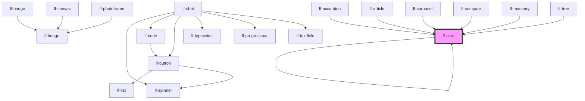

# lf-card

<!-- Auto Generated Below -->

## Overview

The card component displays a card with a header, body, and footer section.
The component provides various properties for customizing the card layout, size, style, and theme.
The card component can be used to display content, images, or other UI elements in a structured format.
The component supports different layout styles, such as material design, and can be customized using CSS.

## Properties

| Property    | Attribute     | Description                                                                                                                     | Type                                                                                     | Default      |
| ----------- | ------------- | ------------------------------------------------------------------------------------------------------------------------------- | ---------------------------------------------------------------------------------------- | ------------ |
| `lfDataset` | `lf-dataset`  | The data set for the LF Card component. This property is mutable, meaning it can be changed after the component is initialized. | `LfDataDataset`                                                                          | `null`       |
| `lfLayout`  | `lf-layout`   | The layout style for the card component. Can be set to different predefined styles like "material" design.                      | `"debug" \| "keywords" \| "material" \| "upload"`                                        | `"material"` |
| `lfSizeX`   | `lf-size-x`   | The width of the card, defaults to 100%. Accepts any valid CSS format (px, %, vw, etc.).                                        | `string`                                                                                 | `"100%"`     |
| `lfSizeY`   | `lf-size-y`   | The height of the card, defaults to 100%. Accepts any valid CSS format (px, %, vh, etc.).                                       | `string`                                                                                 | `"100%"`     |
| `lfStyle`   | `lf-style`    | Custom styling for the component.                                                                                               | `string`                                                                                 | `""`         |
| `lfUiSize`  | `lf-ui-size`  | The size of the component.                                                                                                      | `"large" \| "medium" \| "small" \| "xlarge" \| "xsmall" \| "xxlarge" \| "xxsmall"`       | `"medium"`   |
| `lfUiState` | `lf-ui-state` | Reflects the specified state color defined by the theme.                                                                        | `"danger" \| "disabled" \| "info" \| "primary" \| "secondary" \| "success" \| "warning"` | `"primary"`  |

## Events

| Event           | Description                                                                                                                                                                                    | Type                              |
| --------------- | ---------------------------------------------------------------------------------------------------------------------------------------------------------------------------------------------- | --------------------------------- |
| `lf-card-event` | Fires when the component triggers an internal action or user interaction. The event contains an `eventType` string, which identifies the action, and optionally `data` for additional details. | `CustomEvent<LfCardEventPayload>` |

## Methods

### `getDebugInfo() => Promise<LfDebugLifecycleInfo>`

Fetches debug information of the component's current state.

#### Returns

Type: `Promise<LfDebugLifecycleInfo>`

A promise that resolves with the debug information object.

### `getProps() => Promise<LfCardPropsInterface>`

Used to retrieve component's properties and descriptions.

#### Returns

Type: `Promise<LfCardPropsInterface>`

Promise resolved with an object containing the component's properties.

### `getShapes() => Promise<LfDataShapesMap>`

Used to retrieve component's shapes.

#### Returns

Type: `Promise<LfDataShapesMap>`

Map of shapes.

### `refresh() => Promise<void>`

This method is used to trigger a new render of the component.

#### Returns

Type: `Promise<void>`

### `unmount(ms?: number) => Promise<void>`

Initiates the unmount sequence, which removes the component from the DOM after a delay.

#### Parameters

| Name | Type     | Description              |
| ---- | -------- | ------------------------ |
| `ms` | `number` | - Number of milliseconds |

#### Returns

Type: `Promise<void>`

## CSS Custom Properties

| Name                      | Description                                                                                       |
| ------------------------- | ------------------------------------------------------------------------------------------------- |
| `--lf-card-border-radius` | Sets the border radius for the card component. Defaults to => var(--lf-ui-border-radius)          |
| `--lf-card-color-bg`      | Sets the color-bg color for the card component. Defaults to => var(--lf-color-bg)                 |
| `--lf-card-color-on-bg`   | Sets the color-on-bg color for the card component. Defaults to => var(--lf-color-on-bg)           |
| `--lf-card-color-primary` | Sets the color-primary color for the card component. Defaults to => var(--lf-color-primary)       |
| `--lf-card-font-family`   | Sets the primary font family for the card component. Defaults to => var(--lf-font-family-primary) |
| `--lf-card-font-size`     | Sets the font size for the card component. Defaults to => var(--lf-font-size)                     |

## Dependencies

### Used by

 - [lf-accordion](../lf-accordion)
 - [lf-article](../lf-article)
 - [lf-card](.)
 - [lf-carousel](../lf-carousel)
 - [lf-compare](../lf-compare)
 - [lf-masonry](../lf-masonry)
 - [lf-tree](../lf-tree)

### Depends on

- [lf-badge](../lf-badge)
- [lf-button](../lf-button)
- [lf-canvas](../lf-canvas)
- [lf-card](.)
- [lf-chart](../lf-chart)
- [lf-chat](../lf-chat)
- [lf-chip](../lf-chip)
- [lf-code](../lf-code)
- [lf-image](../lf-image)
- [lf-photoframe](../lf-photoframe)
- [lf-toggle](../lf-toggle)
- [lf-typewriter](../lf-typewriter)
- [lf-upload](../lf-upload)

### Graph

----------------------------------------------

*Built with [StencilJS](https://stenciljs.com/)*
