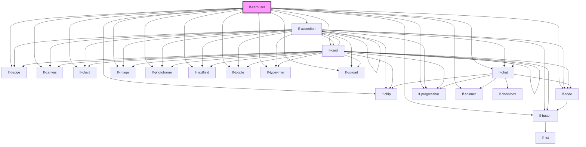

# lf-carousel

<!-- Auto Generated Below -->

## Overview

The carousel component displays a carousel with slides that can be navigated using navigation controls or by clicking on slide indicators.
The component supports autoplay, lightbox mode, and custom styling.
The carousel component can be used to display images, videos, or other content in a carousel format.

## Properties

| Property       | Attribute       | Description                                                                                                                         | Type                                                                                                                                                                                                                                   | Default   |
| -------------- | --------------- | ----------------------------------------------------------------------------------------------------------------------------------- | -------------------------------------------------------------------------------------------------------------------------------------------------------------------------------------------------------------------------------------- | --------- |
| `lfAutoPlay`   | `lf-auto-play`  | Enable or disable autoplay for the carousel.                                                                                        | `boolean`                                                                                                                                                                                                                              | `false`   |
| `lfDataset`    | --              | The data set for the LF Carousel component. This property is mutable, meaning it can be changed after the component is initialized. | `LfDataDataset`                                                                                                                                                                                                                        | `null`    |
| `lfInterval`   | `lf-interval`   | Interval in milliseconds for autoplay.                                                                                              | `number`                                                                                                                                                                                                                               | `3000`    |
| `lfLightbox`   | `lf-lightbox`   | Determines whether the carousel should display a lightbox when an item is clicked.                                                  | `boolean`                                                                                                                                                                                                                              | `false`   |
| `lfNavigation` | `lf-navigation` | Determines whether the carousel should display navigation controls (prev/next buttons).                                             | `boolean`                                                                                                                                                                                                                              | `false`   |
| `lfShape`      | `lf-shape`      | Sets the type of shapes to compare.                                                                                                 | `"accordion" \| "badge" \| "button" \| "canvas" \| "card" \| "chart" \| "chat" \| "chip" \| "code" \| "image" \| "number" \| "photoframe" \| "progressbar" \| "slot" \| "text" \| "textfield" \| "toggle" \| "typewriter" \| "upload"` | `"image"` |
| `lfStyle`      | `lf-style`      | Custom styling for the component.                                                                                                   | `string`                                                                                                                                                                                                                               | `""`      |

## Events

| Event               | Description                                                                                                                                                                                    | Type                                  |
| ------------------- | ---------------------------------------------------------------------------------------------------------------------------------------------------------------------------------------------- | ------------------------------------- |
| `lf-carousel-event` | Fires when the component triggers an internal action or user interaction. The event contains an `eventType` string, which identifies the action, and optionally `data` for additional details. | `CustomEvent<LfCarouselEventPayload>` |

## Methods

### `getDebugInfo() => Promise<LfDebugLifecycleInfo>`

Fetches debug information of the component's current state.

#### Returns

Type: `Promise<LfDebugLifecycleInfo>`

A promise that resolves with the debug information object.

### `getProps() => Promise<LfCarouselPropsInterface>`

Used to retrieve component's properties and descriptions.

#### Returns

Type: `Promise<LfCarouselPropsInterface>`

Promise resolved with an object containing the component's properties.

### `goToSlide(index: number) => Promise<void>`

Navigates to a specific slide in the carousel by its index.

#### Parameters

| Name    | Type     | Description                                     |
| ------- | -------- | ----------------------------------------------- |
| `index` | `number` | - The zero-based index of the slide to display. |

#### Returns

Type: `Promise<void>`

A promise that resolves when the slide transition is complete.

### `nextSlide() => Promise<void>`

Moves the carousel to the next slide.
Triggers the next slide transition using the carousel controller's next function.

#### Returns

Type: `Promise<void>`

A promise that resolves when the slide transition is complete.

### `prevSlide() => Promise<void>`

Moves the carousel to the previous slide by invoking the `previous` method
from the carousel controller's index set.

#### Returns

Type: `Promise<void>`

A promise that resolves when the slide transition is complete

### `refresh() => Promise<void>`

This method is used to trigger a new render of the component.

#### Returns

Type: `Promise<void>`

### `unmount(ms?: number) => Promise<void>`

Initiates the unmount sequence, which removes the component from the DOM after a delay.

#### Parameters

| Name | Type     | Description              |
| ---- | -------- | ------------------------ |
| `ms` | `number` | - Number of milliseconds |

#### Returns

Type: `Promise<void>`

## CSS Custom Properties

| Name                                    | Description                                                                                                     |
| --------------------------------------- | --------------------------------------------------------------------------------------------------------------- |
| `--lf-carousel-border-radius`           | Border radius for the carousel container. Defaults to => var(--lf-ui-border-radius, 0.25em)                     |
| `--lf-carousel-color-on-primary`        | Text/icon color on primary surfaces. Defaults to => var(--lf-state-on-primary, var(--lf-color-on-primary))      |
| `--lf-carousel-color-on-surface`        | Text/icon color on surface. Defaults to => var(--lf-state-on-surface, var(--lf-color-on-surface))               |
| `--lf-carousel-color-primary`           | Primary color for carousel navigation elements. Defaults to => var(--lf-state-primary, var(--lf-color-primary)) |
| `--lf-carousel-color-surface`           | Surface color for the slide bar. Defaults to => var(--lf-state-surface, var(--lf-color-surface))                |
| `--lf-carousel-font-family`             | Sets the primary font family for the carousel component. Defaults to => var(--lf-font-family-primary)           |
| `--lf-carousel-font-size`               | Sets the font size for the carousel component. Defaults to => var(--lf-font-size)                               |
| `--lf-carousel-slide-bar-height`        | Height of the slide indicator bar. Defaults to => 0.75em                                                        |
| `--lf-carousel-slide-bar-opacity`       | Opacity of the slide bar at rest. Defaults to => 0.75                                                           |
| `--lf-carousel-slide-bar-opacity-hover` | Opacity of the slide bar on hover. Defaults to => 1                                                             |
| `--lf-carousel-transition-duration`     | Duration for slide transitions. Defaults to => 0.5s                                                             |

## Dependencies

### Depends on

- [lf-accordion](../lf-accordion)
- [lf-badge](../lf-badge)
- [lf-button](../lf-button)
- [lf-canvas](../lf-canvas)
- [lf-card](../lf-card)
- [lf-chart](../lf-chart)
- [lf-chat](../lf-chat)
- [lf-chip](../lf-chip)
- [lf-code](../lf-code)
- [lf-image](../lf-image)
- [lf-photoframe](../lf-photoframe)
- [lf-progressbar](../lf-progressbar)
- [lf-textfield](../lf-textfield)
- [lf-toggle](../lf-toggle)
- [lf-typewriter](../lf-typewriter)
- [lf-upload](../lf-upload)
- [lf-spinner](../lf-spinner)

### Graph

```mermaid
graph TD;
  lf-carousel --> lf-accordion
  lf-carousel --> lf-badge
  lf-carousel --> lf-button
  lf-carousel --> lf-canvas
  lf-carousel --> lf-card
  lf-carousel --> lf-chart
  lf-carousel --> lf-chat
  lf-carousel --> lf-chip
  lf-carousel --> lf-code
  lf-carousel --> lf-image
  lf-carousel --> lf-photoframe
  lf-carousel --> lf-progressbar
  lf-carousel --> lf-textfield
  lf-carousel --> lf-toggle
  lf-carousel --> lf-typewriter
  lf-carousel --> lf-upload
  lf-carousel --> lf-spinner
  lf-accordion --> lf-accordion
  lf-accordion --> lf-badge
  lf-accordion --> lf-button
  lf-accordion --> lf-canvas
  lf-accordion --> lf-card
  lf-accordion --> lf-chart
  lf-accordion --> lf-chat
  lf-accordion --> lf-chip
  lf-accordion --> lf-code
  lf-accordion --> lf-image
  lf-accordion --> lf-photoframe
  lf-accordion --> lf-progressbar
  lf-accordion --> lf-textfield
  lf-accordion --> lf-toggle
  lf-accordion --> lf-typewriter
  lf-accordion --> lf-upload
  lf-button --> lf-list
  lf-card --> lf-accordion
  lf-card --> lf-badge
  lf-card --> lf-button
  lf-card --> lf-canvas
  lf-card --> lf-card
  lf-card --> lf-chart
  lf-card --> lf-chat
  lf-card --> lf-chip
  lf-card --> lf-code
  lf-card --> lf-image
  lf-card --> lf-photoframe
  lf-card --> lf-progressbar
  lf-card --> lf-textfield
  lf-card --> lf-toggle
  lf-card --> lf-typewriter
  lf-card --> lf-upload
  lf-chat --> lf-chip
  lf-chat --> lf-spinner
  lf-chat --> lf-code
  lf-chat --> lf-progressbar
  lf-chat --> lf-checkbox
  lf-code --> lf-button
  style lf-carousel fill:#f9f,stroke:#333,stroke-width:4px
```

----------------------------------------------

*Built with [StencilJS](https://stenciljs.com/)*
