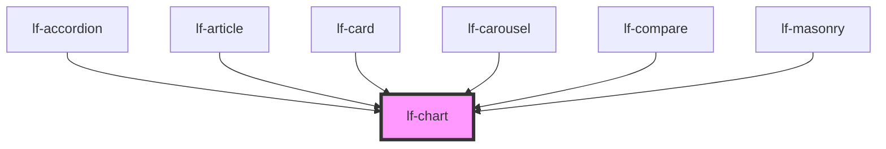

# lf-chart

<!-- Auto Generated Below -->

## Overview

Represents a chart component that displays data in various formats, such as
bar, line, pie, scatter, and more. The component supports multiple axes,
series, and data types, and can be customized with various options. Implements
methods for managing state, retrieving component properties, refreshing the
component, and resizing the chart.

## Properties

| Property    | Attribute   | Description                                                                                                                                                                    | Type                                                                                                                                                                                                                                                                                                                                                                                                                                                                                                                                                                                                                                                                                                                                                                                                                                                                                                                           | Default    |
| ----------- | ----------- | ------------------------------------------------------------------------------------------------------------------------------------------------------------------------------ | ------------------------------------------------------------------------------------------------------------------------------------------------------------------------------------------------------------------------------------------------------------------------------------------------------------------------------------------------------------------------------------------------------------------------------------------------------------------------------------------------------------------------------------------------------------------------------------------------------------------------------------------------------------------------------------------------------------------------------------------------------------------------------------------------------------------------------------------------------------------------------------------------------------------------------ | ---------- |
| `lfAxis`    | `lf-axis`   | Sets the axis of the chart.                                                                                                                                                    | `string \| string[]`                                                                                                                                                                                                                                                                                                                                                                                                                                                                                                                                                                                                                                                                                                                                                                                                                                                                                                           | `[]`       |
| `lfColors`  | --          | Overrides theme's colors.                                                                                                                                                      | `string[]`                                                                                                                                                                                                                                                                                                                                                                                                                                                                                                                                                                                                                                                                                                                                                                                                                                                                                                                     | `[]`       |
| `lfDataset` | --          | The data set for the LF Chart component. This property is mutable, meaning it can be changed after the component is initialized.                                               | `LfDataDataset`                                                                                                                                                                                                                                                                                                                                                                                                                                                                                                                                                                                                                                                                                                                                                                                                                                                                                                                | `null`     |
| `lfLegend`  | `lf-legend` | Sets the position of the legend. Supported values: bottom, left, right, top, hidden. Keep in mind that legend types are tied to chart types, some combinations might not work. | `"bottom" \| "hidden" \| "left" \| "right" \| "top"`                                                                                                                                                                                                                                                                                                                                                                                                                                                                                                                                                                                                                                                                                                                                                                                                                                                                           | `"bottom"` |
| `lfSeries`  | --          | The data series to be displayed. They must be of the same type.                                                                                                                | `string[]`                                                                                                                                                                                                                                                                                                                                                                                                                                                                                                                                                                                                                                                                                                                                                                                                                                                                                                                     | `[]`       |
| `lfSizeX`   | `lf-size-x` | The width of the chart, defaults to 100%. Accepts any valid CSS format (px, %, vw, etc.).                                                                                      | `string`                                                                                                                                                                                                                                                                                                                                                                                                                                                                                                                                                                                                                                                                                                                                                                                                                                                                                                                       | `"100%"`   |
| `lfSizeY`   | `lf-size-y` | The height of the chart, defaults to 100%. Accepts any valid CSS format (px, %, vh, etc.).                                                                                     | `string`                                                                                                                                                                                                                                                                                                                                                                                                                                                                                                                                                                                                                                                                                                                                                                                                                                                                                                                       | `"100%"`   |
| `lfStyle`   | `lf-style`  | Custom styling for the component.                                                                                                                                              | `string`                                                                                                                                                                                                                                                                                                                                                                                                                                                                                                                                                                                                                                                                                                                                                                                                                                                                                                                       | `""`       |
| `lfTypes`   | --          | The type of the chart. Supported formats: Bar, Gaussian, Line, Pie, Map and Scatter.                                                                                           | `("bar" \| "line" \| "radar" \| "calendar" \| "scatter" \| "pie" \| "area" \| "funnel" \| "sankey" \| "candlestick" \| "heatmap" \| "bubble" \| "gaussian" \| "hbar" \| "sbar")[]`                                                                                                                                                                                                                                                                                                                                                                                                                                                                                                                                                                                                                                                                                                                                             | `["line"]` |
| `lfXAxis`   | --          | Customization options for the x Axis.                                                                                                                                          | `AxisBaseOptionCommon & { gridIndex?: number; gridId?: string; position?: CartesianAxisPosition; offset?: number; categorySortInfo?: OrdinalSortInfo; } & { mainType?: "xAxis"; } \| CategoryAxisBaseOption & { gridIndex?: number; gridId?: string; position?: CartesianAxisPosition; offset?: number; categorySortInfo?: OrdinalSortInfo; } & { mainType?: "xAxis"; } \| LogAxisBaseOption & { gridIndex?: number; gridId?: string; position?: CartesianAxisPosition; offset?: number; categorySortInfo?: OrdinalSortInfo; } & { mainType?: "xAxis"; } \| TimeAxisBaseOption & { gridIndex?: number; gridId?: string; position?: CartesianAxisPosition; offset?: number; categorySortInfo?: OrdinalSortInfo; } & { mainType?: "xAxis"; } \| ValueAxisBaseOption & { gridIndex?: number; gridId?: string; position?: CartesianAxisPosition; offset?: number; categorySortInfo?: OrdinalSortInfo; } & { mainType?: "xAxis"; }` | `null`     |
| `lfYAxis`   | --          | Customization options for the y Axis.                                                                                                                                          | `AxisBaseOptionCommon & { gridIndex?: number; gridId?: string; position?: CartesianAxisPosition; offset?: number; categorySortInfo?: OrdinalSortInfo; } & { mainType?: "yAxis"; } \| CategoryAxisBaseOption & { gridIndex?: number; gridId?: string; position?: CartesianAxisPosition; offset?: number; categorySortInfo?: OrdinalSortInfo; } & { mainType?: "yAxis"; } \| LogAxisBaseOption & { gridIndex?: number; gridId?: string; position?: CartesianAxisPosition; offset?: number; categorySortInfo?: OrdinalSortInfo; } & { mainType?: "yAxis"; } \| TimeAxisBaseOption & { gridIndex?: number; gridId?: string; position?: CartesianAxisPosition; offset?: number; categorySortInfo?: OrdinalSortInfo; } & { mainType?: "yAxis"; } \| ValueAxisBaseOption & { gridIndex?: number; gridId?: string; position?: CartesianAxisPosition; offset?: number; categorySortInfo?: OrdinalSortInfo; } & { mainType?: "yAxis"; }` | `null`     |

## Events

| Event            | Description                                                                                                                                                                                    | Type                               |
| ---------------- | ---------------------------------------------------------------------------------------------------------------------------------------------------------------------------------------------- | ---------------------------------- |
| `lf-chart-event` | Fires when the component triggers an internal action or user interaction. The event contains an `eventType` string, which identifies the action, and optionally `data` for additional details. | `CustomEvent<LfChartEventPayload>` |

## Methods

### `getDebugInfo() => Promise<LfDebugLifecycleInfo>`

Fetches debug information of the component's current state.

#### Returns

Type: `Promise<LfDebugLifecycleInfo>`

A promise that resolves with the debug information object.

### `getProps() => Promise<LfChartPropsInterface>`

Used to retrieve component's properties and descriptions.

#### Returns

Type: `Promise<LfChartPropsInterface>`

Promise resolved with an object containing the component's properties.

### `refresh() => Promise<void>`

This method is used to trigger a new render of the component.

#### Returns

Type: `Promise<void>`

### `resize() => Promise<void>`

Resizes the chart to fit the container.

#### Returns

Type: `Promise<void>`

### `unmount(ms?: number) => Promise<void>`

Initiates the unmount sequence, which removes the component from the DOM after a delay.

#### Parameters

| Name | Type     | Description              |
| ---- | -------- | ------------------------ |
| `ms` | `number` | - Number of milliseconds |

#### Returns

Type: `Promise<void>`

## CSS Custom Properties

| Name                     | Description                                                                                        |
| ------------------------ | -------------------------------------------------------------------------------------------------- |
| `--lf-chart-color-bg`    | Sets the color-bg color for the chart component. Defaults to => var(--lf-color-bg)                 |
| `--lf-chart-color-on-bg` | Sets the color-on-bg color for the chart component. Defaults to => var(--lf-color-on-bg)           |
| `--lf-chart-font-family` | Sets the primary font family for the chart component. Defaults to => var(--lf-font-family-primary) |
| `--lf-chart-font-size`   | Sets the font size for the chart component. Defaults to => var(--lf-font-size)                     |

## Dependencies

### Used by

 - [lf-accordion](../lf-accordion)
 - [lf-article](../lf-article)
 - [lf-card](../lf-card)
 - [lf-carousel](../lf-carousel)
 - [lf-compare](../lf-compare)
 - [lf-masonry](../lf-masonry)

### Graph

----------------------------------------------

*Built with [StencilJS](https://stenciljs.com/)*
