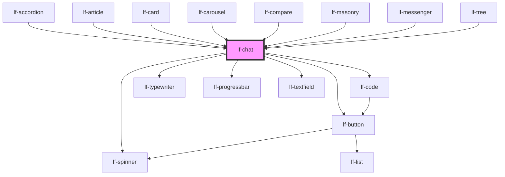

# lf-chat

<!-- Auto Generated Below -->

## Overview

Represents the properties of the `lf-chat` component. The properties include
settings for the chat layout, endpoint URL, system message, and more. The
properties can be set to customize the chat component's appearance and behavior.

## Properties

| Property            | Attribute             | Description                                                                                                                        | Type                                                                               | Default                                                                                 |
| ------------------- | --------------------- | ---------------------------------------------------------------------------------------------------------------------------------- | ---------------------------------------------------------------------------------- | --------------------------------------------------------------------------------------- |
| `lfContextWindow`   | `lf-context-window`   | How many tokens the context window can handle, used to calculate the occupied space.                                               | `number`                                                                           | `8192`                                                                                  |
| `lfEmpty`           | `lf-empty`            | Empty text displayed when there is no data.                                                                                        | `string`                                                                           | `"Your chat history is empty!"`                                                         |
| `lfEndpointUrl`     | `lf-endpoint-url`     | The URL endpoint for the chat service.                                                                                             | `string`                                                                           | `"http://localhost:5001"`                                                               |
| `lfLayout`          | `lf-layout`           | Sets the layout of the chat.                                                                                                       | `"bottom" \| "top"`                                                                | `"top"`                                                                                 |
| `lfMaxTokens`       | `lf-max-tokens`       | The maximum amount of tokens allowed in the LLM's answer.                                                                          | `number`                                                                           | `250`                                                                                   |
| `lfPollingInterval` | `lf-polling-interval` | How often the component checks whether the LLM endpoint is online or not.                                                          | `number`                                                                           | `10000`                                                                                 |
| `lfSeed`            | `lf-seed`             | The seed of the LLM's answer.                                                                                                      | `number`                                                                           | `-1`                                                                                    |
| `lfStyle`           | `lf-style`            | Custom styling for the component.                                                                                                  | `string`                                                                           | `""`                                                                                    |
| `lfSystem`          | `lf-system`           | System message for the LLM.                                                                                                        | `string`                                                                           | `"You are a helpful and cheerful assistant eager to help the user out with his tasks."` |
| `lfTemperature`     | `lf-temperature`      | Sets the creative boundaries of the LLM.                                                                                           | `number`                                                                           | `0.7`                                                                                   |
| `lfTypewriterProps` | `lf-typewriter-props` | Sets the props of the assistant typewriter component. Set this prop to false to replace the typewriter with a simple text element. | `LfTypewriterPropsInterface`                                                       | `{     lfDeleteSpeed: 10,     lfTag: "p",     lfSpeed: 20,   }`                         |
| `lfUiSize`          | `lf-ui-size`          | The size of the component.                                                                                                         | `"large" \| "medium" \| "small" \| "xlarge" \| "xsmall" \| "xxlarge" \| "xxsmall"` | `"medium"`                                                                              |
| `lfValue`           | `lf-value`            | Sets the initial history of the chat.                                                                                              | `LfLLMChoiceMessage[]`                                                             | `[]`                                                                                    |

## Events

| Event           | Description                                                                                                                                                                                    | Type                              |
| --------------- | ---------------------------------------------------------------------------------------------------------------------------------------------------------------------------------------------- | --------------------------------- |
| `lf-chat-event` | Fires when the component triggers an internal action or user interaction. The event contains an `eventType` string, which identifies the action, and optionally `data` for additional details. | `CustomEvent<LfChatEventPayload>` |

## Methods

### `getDebugInfo() => Promise<LfDebugLifecycleInfo>`

Retrieves the debug information reflecting the current state of the component.

#### Returns

Type: `Promise<LfDebugLifecycleInfo>`

A promise that resolves to a LfDebugLifecycleInfo object containing debug information.

### `getHistory() => Promise<string>`

Returns the full history as a string.

#### Returns

Type: `Promise<string>`

Full history of the chat.

### `getLastMessage() => Promise<string>`

Returns the last message as a string.

#### Returns

Type: `Promise<string>`

The last message of the history.

### `getProps() => Promise<LfChatPropsInterface>`

Used to retrieve component's properties and descriptions.

#### Returns

Type: `Promise<LfChatPropsInterface>`

Promise resolved with an object containing the component's properties.

### `refresh() => Promise<void>`

Triggers a re-render of the component to reflect any state changes.

#### Returns

Type: `Promise<void>`

### `setHistory(history: string) => Promise<void>`

Sets the history of the component through a string.

#### Parameters

| Name      | Type     | Description |
| --------- | -------- | ----------- |
| `history` | `string` |             |

#### Returns

Type: `Promise<void>`

### `unmount(ms?: number) => Promise<void>`

Initiates the unmount sequence, which removes the component from the DOM after a delay.

#### Parameters

| Name | Type     | Description              |
| ---- | -------- | ------------------------ |
| `ms` | `number` | - Number of milliseconds |

#### Returns

Type: `Promise<void>`

## CSS Custom Properties

| Name                         | Description                                                                                       |
| ---------------------------- | ------------------------------------------------------------------------------------------------- |
| `--lf-chat-border-color`     | Sets the border color for the chat component. Defaults to => var(--lf-color-border)               |
| `--lf-chat-border-radius`    | Sets the border radius for the chat component. Defaults to => var(--lf-ui-border-radius)          |
| `--lf-chat-buttons-padding`  | Sets the padding for the buttons of the chat component. Defaults to => 1em 0                      |
| `--lf-chat-color-bg`         | Sets the color-bg color for the chat component. Defaults to => var(--lf-color-bg)                 |
| `--lf-chat-color-on-bg`      | Sets the color-on-bg color for the chat component. Defaults to => var(--lf-color-on-bg)           |
| `--lf-chat-color-on-surface` | Sets the color-on-surface color for the chat component. Defaults to => var(--lf-color-on-surface) |
| `--lf-chat-color-surface`    | Sets the color-surface color for the chat component. Defaults to => var(--lf-color-surface)       |
| `--lf-chat-font-family`      | Sets the primary font family for the chat component. Defaults to => var(--lf-font-family-primary) |
| `--lf-chat-font-size`        | Sets the font size for the chat component. Defaults to => var(--lf-font-size)                     |
| `--lf-chat-grid-gap`         | Sets the grid gap for the messages area. Defaults to => 0.75em                                    |
| `--lf-chat-inner-padding`    | Sets the inner padding for the messages area. Defaults to => 1em                                  |
| `--lf-chat-margin-bottom`    | Sets the margin bottom for the messages area. Defaults to => 1em                                  |
| `--lf-chat-margin-top`       | Sets the margin top for the messages area. Defaults to => 1em                                     |
| `--lf-chat-outer-grid-gap`   | Sets the outer grid gap for the chat component. Defaults to => 0.75em                             |
| `--lf-chat-padding`          | Sets the padding for the chat component. Defaults to => 1em                                       |

## Dependencies

### Used by

 - [lf-accordion](../lf-accordion)
 - [lf-article](../lf-article)
 - [lf-card](../lf-card)
 - [lf-carousel](../lf-carousel)
 - [lf-compare](../lf-compare)
 - [lf-masonry](../lf-masonry)
 - [lf-messenger](../lf-messenger)
 - [lf-tree](../lf-tree)

### Depends on

- [lf-spinner](../lf-spinner)
- [lf-code](../lf-code)
- [lf-button](../lf-button)
- [lf-typewriter](../lf-typewriter)
- [lf-progressbar](../lf-progressbar)
- [lf-textfield](../lf-textfield)

### Graph

----------------------------------------------

*Built with [StencilJS](https://stenciljs.com/)*
