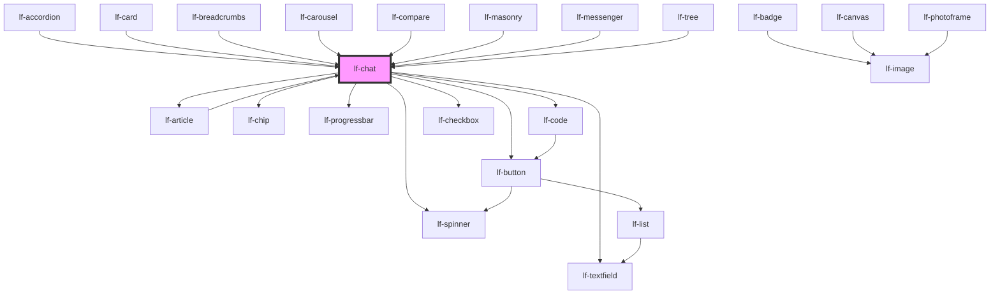

# lf-chat

<!-- Auto Generated Below -->

## Overview

Represents the properties of the `lf-chat` component. The properties include
settings for the chat layout, endpoint URL, system message, and more. The
properties can be set to customize the chat component's appearance and behavior.

## Properties

| Property           | Attribute    | Description                                                                                                                                                                                                        | Type                                                                                                                       | Default     |
| ------------------ | ------------ | ------------------------------------------------------------------------------------------------------------------------------------------------------------------------------------------------------------------ | -------------------------------------------------------------------------------------------------------------------------- | ----------- |
| `lfConfig`         | --           | Configuration object for LLM, tools, UI, and attachments. All chat settings are configured through this single prop.                                                                                               | `LfChatConfig`                                                                                                             | `{}`        |
| `lfStyle`          | `lf-style`   | Custom styling for the component.                                                                                                                                                                                  | `string`                                                                                                                   | `""`        |
| `lfToolHandlers`   | --           | Map of tool names to their execution handler functions. Each handler receives the parsed arguments and returns a result. This is kept as a separate prop (not in lfConfig) because functions are not serializable. | `{ [x: string]: (args: Record<string, unknown>) => string \| LfLLMToolResponse \| Promise<string \| LfLLMToolResponse>; }` | `undefined` |
| `lfUiSize`         | `lf-ui-size` | The size of the component.                                                                                                                                                                                         | `"large" \| "medium" \| "small" \| "xlarge" \| "xsmall" \| "xxlarge" \| "xxsmall"`                                         | `"medium"`  |
| `lfUploadCallback` | --           | Callback for uploading files to external storage. Returns attachment metadata after upload completes. This is kept as a separate prop (not in lfConfig) because functions are not serializable.                    | `(files: File[]) => Promise<LfLLMAttachment[]>`                                                                            | `undefined` |
| `lfValue`          | --           | Sets the initial history of the chat.                                                                                                                                                                              | `LfLLMChoiceMessage[]`                                                                                                     | `[]`        |

## Events

| Event           | Description                                                                                                                                                                                    | Type                              |
| --------------- | ---------------------------------------------------------------------------------------------------------------------------------------------------------------------------------------------- | --------------------------------- |
| `lf-chat-event` | Fires when the component triggers an internal action or user interaction. The event contains an `eventType` string, which identifies the action, and optionally `data` for additional details. | `CustomEvent<LfChatEventPayload>` |

## Methods

### `abortStreaming() => Promise<void>`

Aborts the current streaming response from the LLM.

#### Returns

Type: `Promise<void>`

### `exportHistory() => Promise<void>`

Exports current history as JSON file

#### Returns

Type: `Promise<void>`

### `getDebugInfo() => Promise<LfDebugLifecycleInfo>`

Retrieves the debug information reflecting the current state of the component.

#### Returns

Type: `Promise<LfDebugLifecycleInfo>`

A promise that resolves to a LfDebugLifecycleInfo object containing debug information.

### `getHistory() => Promise<string>`

Returns the full history as a string.

#### Returns

Type: `Promise<string>`

Full history of the chat.

### `getLastMessage() => Promise<string>`

Returns the last message as a string.

#### Returns

Type: `Promise<string>`

The last message of the history.

### `getProps() => Promise<LfChatPropsInterface>`

Used to retrieve component's properties and descriptions.

#### Returns

Type: `Promise<LfChatPropsInterface>`

Promise resolved with an object containing the component's properties.

### `handleFileAttachment() => Promise<void>`

Opens file picker for file attachment

#### Returns

Type: `Promise<void>`

### `handleImageAttachment() => Promise<void>`

Opens file picker for image attachment

#### Returns

Type: `Promise<void>`

### `refresh() => Promise<void>`

Triggers a re-render of the component to reflect any state changes.

#### Returns

Type: `Promise<void>`

### `removeAttachment(id: string) => Promise<void>`

Removes an attachment from the current message

#### Parameters

| Name | Type     | Description |
| ---- | -------- | ----------- |
| `id` | `string` |             |

#### Returns

Type: `Promise<void>`

### `scrollToBottom(blockOrScroll?: ScrollLogicalPosition | boolean) => Promise<void>`

Scrolls the chat message list to the bottom.

The method first checks the component controller status via this.#adapter.controller.get;
if the controller is not in the "ready" state the method returns early without performing any scrolling.

Behavior:
- If blockOrScroll === true, performs a passive scroll of the messages container by calling
  this.#messagesContainer.scrollTo({ top: this.#messagesContainer.scrollHeight, behavior: "smooth" }).
  This path is intended for initial loads where a container-level scroll is sufficient.
- Otherwise, uses this.#lastMessage?.scrollIntoView({ behavior: "smooth", block: blockOrScroll })
  to bring the last message element into view for active user interactions. The block argument is
  treated as a ScrollLogicalPosition (for example "start" | "center" | "end" | "nearest").

Notes:
- The method is async and returns a Promise<void>, but it does not wait for the visual scrolling
  animation to complete; the promise resolves after issuing the scroll command.
- If the messages container or last message element is not present, the corresponding scroll call
  is a no-op.
- The signature accepts a boolean union for convenience (true = container scroll). Callers who intend
  to use scrollIntoView should pass a valid ScrollLogicalPosition value.

#### Parameters

| Name            | Type                               | Description                                                                                                                                               |
| --------------- | ---------------------------------- | --------------------------------------------------------------------------------------------------------------------------------------------------------- |
| `blockOrScroll` | `boolean \| ScrollLogicalPosition` | - If true, scroll the container to the bottom. Otherwise, a ScrollLogicalPosition   used as the `block` option for scrollIntoView. Defaults to "nearest". |

#### Returns

Type: `Promise<void>`

Promise<void> that resolves after issuing the scroll command.

### `setHistory(history: string, fromFile?: boolean) => Promise<void>`

Sets the history of the component through a string.

#### Parameters

| Name       | Type      | Description |
| ---------- | --------- | ----------- |
| `history`  | `string`  |             |
| `fromFile` | `boolean` |             |

#### Returns

Type: `Promise<void>`

### `unmount(ms?: number) => Promise<void>`

Initiates the unmount sequence, which removes the component from the DOM after a delay.

#### Parameters

| Name | Type     | Description              |
| ---- | -------- | ------------------------ |
| `ms` | `number` | - Number of milliseconds |

#### Returns

Type: `Promise<void>`

## CSS Custom Properties

| Name                                  | Description                                                                                       |
| ------------------------------------- | ------------------------------------------------------------------------------------------------- |
| `--lf-chat-article-margin-top`        | Sets the top margin for lf-article content rendered inside messages. Defaults to => 0.75em        |
| `--lf-chat-attachments-padding`       | Sets the attachments padding for the chat component. Defaults to => 0 1em                         |
| `--lf-chat-blockquote-border-opacity` | Sets the border opacity for blockquotes. Defaults to => 0.3                                       |
| `--lf-chat-blockquote-border-width`   | Sets the border width for blockquotes. Defaults to => 3px                                         |
| `--lf-chat-blockquote-margin`         | Sets the margin for blockquotes. Defaults to => 1em 0                                             |
| `--lf-chat-blockquote-padding`        | Sets the padding for blockquotes. Defaults to => 0.5em 1em                                        |
| `--lf-chat-border-color`              | Sets the border color for the chat component. Defaults to => var(--lf-color-border)               |
| `--lf-chat-border-radius`             | Sets the border radius for the chat component. Defaults to => var(--lf-ui-border-radius)          |
| `--lf-chat-buttons-padding`           | Sets the padding for the buttons of the chat component. Defaults to => 1em 0                      |
| `--lf-chat-color-bg`                  | Sets the color-bg color for the chat component. Defaults to => var(--lf-color-bg)                 |
| `--lf-chat-color-on-bg`               | Sets the color-on-bg color for the chat component. Defaults to => var(--lf-color-on-bg)           |
| `--lf-chat-color-on-surface`          | Sets the color-on-surface color for the chat component. Defaults to => var(--lf-color-on-surface) |
| `--lf-chat-color-surface`             | Sets the color-surface color for the chat component. Defaults to => var(--lf-color-surface)       |
| `--lf-chat-font-family`               | Sets the primary font family for the chat component. Defaults to => var(--lf-font-family-primary) |
| `--lf-chat-font-size`                 | Sets the font size for the chat component. Defaults to => var(--lf-font-size)                     |
| `--lf-chat-grid-gap`                  | Sets the grid gap for the messages area. Defaults to => 0.75em                                    |
| `--lf-chat-heading-margin-bottom`     | Sets the bottom margin for headings. Defaults to => 0.5em                                         |
| `--lf-chat-heading-margin-top`        | Sets the top margin for headings. Defaults to => 1em                                              |
| `--lf-chat-hr-border-width`           | Sets the border width for horizontal rules. Defaults to => 1px                                    |
| `--lf-chat-hr-margin`                 | Sets the margin for horizontal rules. Defaults to => 1em 0                                        |
| `--lf-chat-hr-opacity`                | Sets the opacity for horizontal rules. Defaults to => 0.2                                         |
| `--lf-chat-inline-code-border-radius` | Sets the border radius for inline code. Defaults to => var(--lf-border-radius, 0.25em)            |
| `--lf-chat-inline-code-padding`       | Sets the padding for inline code. Defaults to => 0.2em 0.4em                                      |
| `--lf-chat-inner-padding`             | Sets the inner padding for the messages area. Defaults to => 1em                                  |
| `--lf-chat-list-item-margin`          | Sets the margin for list items. Defaults to => 0.25em 0                                           |
| `--lf-chat-list-margin`               | Sets the margin for lists. Defaults to => 0.5em 0                                                 |
| `--lf-chat-list-padding-left`         | Sets the left padding for lists. Defaults to => 2em                                               |
| `--lf-chat-margin-bottom`             | Sets the margin bottom for the messages area. Defaults to => 1em                                  |
| `--lf-chat-margin-top`                | Sets the margin top for the messages area. Defaults to => 1em                                     |
| `--lf-chat-message-max-width`         | Sets the max width for each message in the messages area. Defaults to => 75%                      |
| `--lf-chat-outer-grid-gap`            | Sets the outer grid gap for the chat component. Defaults to => 0.75em                             |
| `--lf-chat-padding`                   | Sets the padding for the chat component. Defaults to => 1em                                       |

## Dependencies

### Used by

 - [lf-accordion](../lf-accordion)
 - [lf-article](../lf-article)
 - [lf-breadcrumbs](../lf-breadcrumbs)
 - [lf-card](../lf-card)
 - [lf-carousel](../lf-carousel)
 - [lf-compare](../lf-compare)
 - [lf-masonry](../lf-masonry)
 - [lf-messenger](../lf-messenger)
 - [lf-tree](../lf-tree)

### Depends on

- [lf-spinner](../lf-spinner)
- [lf-article](../lf-article)
- [lf-button](../lf-button)
- [lf-chip](../lf-chip)
- [lf-textfield](../lf-textfield)
- [lf-progressbar](../lf-progressbar)
- [lf-code](../lf-code)
- [lf-checkbox](../lf-checkbox)

### Graph

----------------------------------------------

*Built with [StencilJS](https://stenciljs.com/)*
