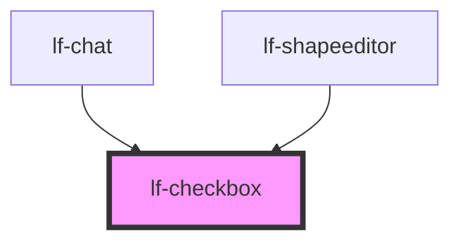

# lf-checkbox

<!-- Auto Generated Below -->

## Overview

The checkbox component is a three-state selection control.
It supports unchecked, checked, and indeterminate states.
The checkbox features Material Design-inspired animations and styling.

## Properties

| Property         | Attribute          | Description                                                                                                                                                   | Type                                                                                     | Default     |
| ---------------- | ------------------ | ------------------------------------------------------------------------------------------------------------------------------------------------------------- | ---------------------------------------------------------------------------------------- | ----------- |
| `lfAriaLabel`    | `lf-aria-label`    | Explicit accessible label for the checkbox control. Fallback chain when empty: lfLabel -> root element id -> 'checkbox'. Applied to the native input element. | `string`                                                                                 | `""`        |
| `lfLabel`        | `lf-label`         | Defines text to display along with the checkbox.                                                                                                              | `string`                                                                                 | `""`        |
| `lfLeadingLabel` | `lf-leading-label` | When set to true, the label will be displayed before the checkbox.                                                                                            | `boolean`                                                                                | `false`     |
| `lfRipple`       | `lf-ripple`        | When set to true, the pointerdown event will trigger a ripple effect.                                                                                         | `boolean`                                                                                | `true`      |
| `lfStyle`        | `lf-style`         | Custom styling for the component.                                                                                                                             | `string`                                                                                 | `""`        |
| `lfUiSize`       | `lf-ui-size`       | The size of the component.                                                                                                                                    | `"large" \| "medium" \| "small" \| "xlarge" \| "xsmall" \| "xxlarge" \| "xxsmall"`       | `"medium"`  |
| `lfUiState`      | `lf-ui-state`      | Reflects the specified state color defined by the theme.                                                                                                      | `"danger" \| "disabled" \| "info" \| "primary" \| "secondary" \| "success" \| "warning"` | `"primary"` |
| `lfValue`        | `lf-value`         | Sets the initial boolean state of the checkbox. Set to null for indeterminate state.                                                                          | `boolean`                                                                                | `false`     |

## Events

| Event               | Description                                                                                                                               | Type                                  |
| ------------------- | ----------------------------------------------------------------------------------------------------------------------------------------- | ------------------------------------- |
| `lf-checkbox-event` | Fires when the component triggers an internal action or user interaction. The event contains an `eventType` string and state information. | `CustomEvent<LfCheckboxEventPayload>` |

## Methods

### `getDebugInfo() => Promise<LfDebugLifecycleInfo>`

Fetches debug information of the component's current state.

#### Returns

Type: `Promise<LfDebugLifecycleInfo>`

### `getProps() => Promise<LfCheckboxPropsInterface>`

Used to retrieve component's properties and descriptions.

#### Returns

Type: `Promise<LfCheckboxPropsInterface>`

### `getValue() => Promise<LfCheckboxState>`

Retrieves the current value of the checkbox.

#### Returns

Type: `Promise<"off" | "on" | "indeterminate">`

### `refresh() => Promise<void>`

This method is used to trigger a new render of the component.

#### Returns

Type: `Promise<void>`

### `setValue(value: LfCheckboxState | boolean) => Promise<void>`

Sets the value of the checkbox.

#### Parameters

| Name    | Type                                          | Description                                                 |
| ------- | --------------------------------------------- | ----------------------------------------------------------- |
| `value` | `boolean \| "off" \| "on" \| "indeterminate"` | - The value to set (true, false, or null for indeterminate) |

#### Returns

Type: `Promise<void>`

### `unmount(ms?: number) => Promise<void>`

Initiates the unmount sequence, removing the component from the DOM after a delay.

#### Parameters

| Name | Type     | Description                                        |
| ---- | -------- | -------------------------------------------------- |
| `ms` | `number` | - Number of milliseconds to wait before unmounting |

#### Returns

Type: `Promise<void>`

## CSS Custom Properties

| Name                                   | Description                                                                                                      |
| -------------------------------------- | ---------------------------------------------------------------------------------------------------------------- |
| `--lf-checkbox-animation-duration`     | Animation duration for state changes. Defaults to => 90ms                                                        |
| `--lf-checkbox-border-radius`          | Border radius for the background. Defaults to => var(--lf-ui-border-radius)                                      |
| `--lf-checkbox-checkmark-stroke-width` | Stroke width for checkmark. Defaults to => 3.12px                                                                |
| `--lf-checkbox-color-on-primary`       | Color for checkmark on primary background. Defaults to => var(--lf-state-on-primary, var(--lf-color-on-primary)) |
| `--lf-checkbox-color-primary`          | Primary color for checked/active states. Defaults to => var(--lf-state-primary, var(--lf-color-primary))         |
| `--lf-checkbox-color-surface`          | Surface/track background color. Defaults to => var(--lf-state-surface, var(--lf-color-surface))                  |
| `--lf-checkbox-font-family`            | Sets the primary font family for the checkbox component. Defaults to => var(--lf-font-family-primary)            |
| `--lf-checkbox-font-size`              | Sets the font size for the checkbox component. Defaults to => var(--lf-font-size)                                |
| `--lf-checkbox-size`                   | Size for the checkbox control. Defaults to => 1.5em                                                              |
| `--lf-checkbox-surface-border-radius`  | Border radius for the surface. Defaults to => 50%                                                                |
| `--lf-checkbox-surface-size`           | Size for the surface area. Defaults to => 3.5em                                                                  |

## Dependencies

### Used by

 - [lf-chat](../lf-chat)
 - [lf-shapeeditor](../lf-shapeeditor)

### Graph

----------------------------------------------

*Built with [StencilJS](https://stenciljs.com/)*
