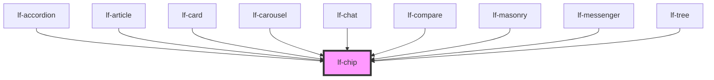

# lf-chip

<!-- Auto Generated Below -->

## Overview

The chip component is a stylized UI element that displays a list of data items.
Users can select or deselect items, and expand or collapse content sections.
The component supports various styling options, including choice, input, filter,
and standard. Ripple effects can be enabled or disabled via a property.

## Properties

| Property      | Attribute       | Description                                                                                                                                                                                    | Type                                                                                     | Default      |
| ------------- | --------------- | ---------------------------------------------------------------------------------------------------------------------------------------------------------------------------------------------- | ---------------------------------------------------------------------------------------- | ------------ |
| `lfAriaLabel` | `lf-aria-label` | Explicit accessible label applied to each chip item when it would otherwise lack a text label. Fallback chain per item: node.value -> lfAriaLabel -> node.icon -> component id -> 'chip item'. | `string`                                                                                 | `""`         |
| `lfDataset`   | `lf-dataset`    | The data set for the LF Chip component. This property is mutable, meaning it can be changed after the component is initialized.                                                                | `LfDataDataset`                                                                          | `null`       |
| `lfRipple`    | `lf-ripple`     | When set to true, the pointerdown event will trigger a ripple effect.                                                                                                                          | `boolean`                                                                                | `true`       |
| `lfStyle`     | `lf-style`      | Custom styling for the component.                                                                                                                                                              | `string`                                                                                 | `""`         |
| `lfStyling`   | `lf-styling`    | Styling of the chip component, includes: "choice", "input", "filter" and "standard".                                                                                                           | `"choice" \| "filter" \| "input" \| "standard"`                                          | `"standard"` |
| `lfUiSize`    | `lf-ui-size`    | The size of the component.                                                                                                                                                                     | `"large" \| "medium" \| "small" \| "xlarge" \| "xsmall" \| "xxlarge" \| "xxsmall"`       | `"medium"`   |
| `lfUiState`   | `lf-ui-state`   | Reflects the specified state color defined by the theme.                                                                                                                                       | `"danger" \| "disabled" \| "info" \| "primary" \| "secondary" \| "success" \| "warning"` | `"primary"`  |
| `lfValue`     | `lf-value`      | Sets the initial state of the chip. Relevant only when the chip can be selected.                                                                                                               | `string[]`                                                                               | `null`       |

## Events

| Event           | Description                                                                                                                                                                                    | Type                              |
| --------------- | ---------------------------------------------------------------------------------------------------------------------------------------------------------------------------------------------- | --------------------------------- |
| `lf-chip-event` | Fires when the component triggers an internal action or user interaction. The event contains an `eventType` string, which identifies the action, and optionally `data` for additional details. | `CustomEvent<LfChipEventPayload>` |

## Methods

### `getDebugInfo() => Promise<LfDebugLifecycleInfo>`

Fetches debug information of the component's current state.

#### Returns

Type: `Promise<LfDebugLifecycleInfo>`

A promise that resolves with the debug information object.

### `getProps() => Promise<LfChipPropsInterface>`

Used to retrieve component's properties and descriptions.

#### Returns

Type: `Promise<LfChipPropsInterface>`

Promise resolved with an object containing the component's properties.

### `getSelectedNodes() => Promise<Set<LfDataNode>>`

Returns the selected nodes.

#### Returns

Type: `Promise<Set<LfDataNode>>`

Selected nodes.

### `refresh() => Promise<void>`

This method is used to trigger a new render of the component.

#### Returns

Type: `Promise<void>`

### `setSelectedNodes(nodes: (LfDataNode[] | string[]) & Array<any>) => Promise<void>`

Selects one or more nodes in the chip component.

#### Parameters

| Name    | Type                                 | Description                                                  |
| ------- | ------------------------------------ | ------------------------------------------------------------ |
| `nodes` | `(string[] \| LfDataNode[]) & any[]` | - An array of LfDataNode objects or node IDs to be selected. |

#### Returns

Type: `Promise<void>`

### `unmount(ms?: number) => Promise<void>`

Initiates the unmount sequence, which removes the component from the DOM after a delay.

#### Parameters

| Name | Type     | Description              |
| ---- | -------- | ------------------------ |
| `ms` | `number` | - Number of milliseconds |

#### Returns

Type: `Promise<void>`

## CSS Custom Properties

| Name                             | Description                                                                                       |
| -------------------------------- | ------------------------------------------------------------------------------------------------- |
| `--lf-chip-border-radius`        | Sets the border radius for the chip component. Defaults to => var(--lf-ui-border-radius)          |
| `--lf-chip-color-on-bg`          | Sets the color for the filter layout checkmark. Defaults to => var(--lf-color-on-surface)         |
| `--lf-chip-color-on-primary`     | Sets the color-on-primary color for the chip component. Defaults to => var(--lf-color-on-primary) |
| `--lf-chip-color-on-surface`     | Sets the color-on-surface color for the chip component. Defaults to => var(--lf-color-on-surface) |
| `--lf-chip-color-primary`        | Sets the color-primary color for the chip component. Defaults to => var(--lf-color-primary)       |
| `--lf-chip-color-surface`        | Sets the color-surface color for the chip component. Defaults to => var(--lf-color-surface)       |
| `--lf-chip-font-family`          | Sets the primary font family for the chip component. Defaults to => var(--lf-font-family-primary) |
| `--lf-chip-font-size`            | Sets the font size for the chip component. Defaults to => var(--lf-font-size)                     |
| `--lf-chip-item-height`          | Sets the height for the items. Defaults to => 2em                                                 |
| `--lf-chip-item-margin`          | Sets the margin for the items. Defaults to => 0.25em                                              |
| `--lf-chip-item-max-width`       | Sets the max-width for the items. Defaults to => max-content                                      |
| `--lf-chip-item-outline`         | Sets the outline for the items. Defaults to => none                                               |
| `--lf-chip-item-padding`         | Sets the padding for the items. Defaults to => 0 0.75em                                           |
| `--lf-chip-item-text-decoration` | Sets the text-decoration for the items. Defaults to => inherit                                    |
| `--lf-chip-item-text-transform`  | Sets the text-transform for the items. Defaults to => inherit                                     |
| `--lf-chip-margin`               | Sets the margin for the wrapper. Defaults to => 0.25em                                            |

## Dependencies

### Used by

 - [lf-accordion](../lf-accordion)
 - [lf-article](../lf-article)
 - [lf-card](../lf-card)
 - [lf-carousel](../lf-carousel)
 - [lf-chat](../lf-chat)
 - [lf-compare](../lf-compare)
 - [lf-masonry](../lf-masonry)
 - [lf-messenger](../lf-messenger)
 - [lf-tree](../lf-tree)

### Graph

----------------------------------------------

*Built with [StencilJS](https://stenciljs.com/)*
