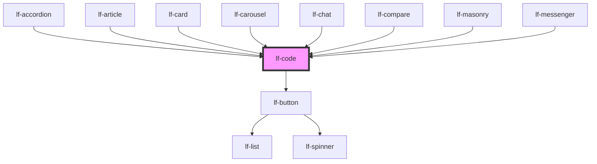

# lf-code

<!-- Auto Generated Below -->

## Overview

The code component displays a snippet of code in a styled container with
syntax highlighting. The component supports various languages and provides
options for formatting, preserving spaces, and showing a copy button.

## Properties

| Property           | Attribute            | Description                                                              | Type                                                                                     | Default        |
| ------------------ | -------------------- | ------------------------------------------------------------------------ | ---------------------------------------------------------------------------------------- | -------------- |
| `lfFormat`         | `lf-format`          | Automatically formats the value.                                         | `boolean`                                                                                | `true`         |
| `lfLanguage`       | `lf-language`        | Sets the language of the snippet.                                        | `string`                                                                                 | `"javascript"` |
| `lfPreserveSpaces` | `lf-preserve-spaces` | Whether to preserve spaces or not. When missing it is set automatically. | `boolean`                                                                                | `undefined`    |
| `lfShowCopy`       | `lf-show-copy`       | Whether to show the copy button or not.                                  | `boolean`                                                                                | `true`         |
| `lfShowHeader`     | `lf-show-header`     | Whether to show the header or not.                                       | `boolean`                                                                                | `true`         |
| `lfStickyHeader`   | `lf-sticky-header`   | Determines whether the header is sticky or not.                          | `boolean`                                                                                | `true`         |
| `lfStyle`          | `lf-style`           | Custom styling for the component.                                        | `string`                                                                                 | `""`           |
| `lfUiSize`         | `lf-ui-size`         | The size of the component.                                               | `"large" \| "medium" \| "small" \| "xlarge" \| "xsmall" \| "xxlarge" \| "xxsmall"`       | `"medium"`     |
| `lfUiState`        | `lf-ui-state`        | Reflects the specified state color defined by the theme.                 | `"danger" \| "disabled" \| "info" \| "primary" \| "secondary" \| "success" \| "warning"` | `"primary"`    |
| `lfValue`          | `lf-value`           | String containing the snippet of code to display.                        | `string`                                                                                 | `""`           |

## Events

| Event           | Description                                                                                                                                                                                    | Type                              |
| --------------- | ---------------------------------------------------------------------------------------------------------------------------------------------------------------------------------------------- | --------------------------------- |
| `lf-code-event` | Fires when the component triggers an internal action or user interaction. The event contains an `eventType` string, which identifies the action, and optionally `data` for additional details. | `CustomEvent<LfCodeEventPayload>` |

## Methods

### `getDebugInfo() => Promise<LfDebugLifecycleInfo>`

Retrieves the debug information reflecting the current state of the component.

#### Returns

Type: `Promise<LfDebugLifecycleInfo>`

A promise that resolves to a LfDebugLifecycleInfo object containing debug information.

### `getProps() => Promise<LfCodePropsInterface>`

Used to retrieve component's properties and descriptions.

#### Returns

Type: `Promise<LfCodePropsInterface>`

Promise resolved with an object containing the component's properties.

### `refresh() => Promise<void>`

Triggers a re-render of the component to reflect any state changes.

#### Returns

Type: `Promise<void>`

### `unmount(ms?: number) => Promise<void>`

Initiates the unmount sequence, which removes the component from the DOM after a delay.

#### Parameters

| Name | Type     | Description              |
| ---- | -------- | ------------------------ |
| `ms` | `number` | - Number of milliseconds |

#### Returns

Type: `Promise<void>`

## CSS Custom Properties

| Name                         | Description                                                                                       |
| ---------------------------- | ------------------------------------------------------------------------------------------------- |
| `--lf-code-border-color`     | Sets the border color for the code component. Defaults to => var(--lf-color-border)               |
| `--lf-code-border-radius`    | Sets the border radius for the code component. Defaults to => var(--lf-ui-border-radius)          |
| `--lf-code-border-right`     | Sets the border right for the code component. Defaults to => 1px solid var(--lf-color-border)     |
| `--lf-code-border-top`       | Sets the border top for the code component. Defaults to => 1px solid var(--lf-color-border)       |
| `--lf-code-color-on-bg`      | Sets the color-on-bg color for the code component. Defaults to => var(--lf-color-on-bg)           |
| `--lf-code-color-on-primary` | Sets the color-on-primary color for the code component. Defaults to => var(--lf-color-on-primary) |
| `--lf-code-color-on-surface` | Sets the color-on-surface color for the code component. Defaults to => var(--lf-color-on-surface) |
| `--lf-code-color-primary`    | Sets the color-primary color for the code component. Defaults to => var(--lf-color-primary)       |
| `--lf-code-color-surface`    | Sets the color-surface color for the code component. Defaults to => var(--lf-color-surface)       |
| `--lf-code-font-family`      | Sets the primary font family for the code component. Defaults to => var(--lf-font-family-primary) |
| `--lf-code-font-size`        | Sets the font size for the code component. Defaults to => var(--lf-font-size)                     |
| `--lf-code-header-position`  | Sets the position for the header. Defaults to => sticky                                           |
| `--lf-code-height`           | Sets the height for the code component. Defaults to => 100%                                       |

## Dependencies

### Used by

 - [lf-accordion](../lf-accordion)
 - [lf-article](../lf-article)
 - [lf-card](../lf-card)
 - [lf-carousel](../lf-carousel)
 - [lf-chat](../lf-chat)
 - [lf-compare](../lf-compare)
 - [lf-masonry](../lf-masonry)
 - [lf-messenger](../lf-messenger)

### Depends on

- [lf-button](../lf-button)

### Graph

----------------------------------------------

*Built with [StencilJS](https://stenciljs.com/)*
