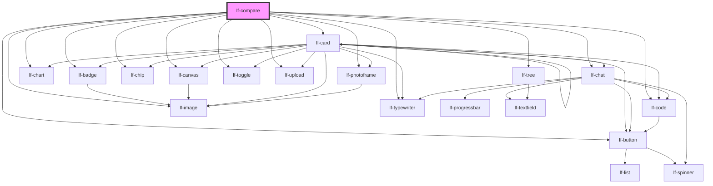

# lf-compare

<!-- Auto Generated Below -->

## Overview

Represents a comparison component that displays two shapes side by side or
overlaid on top of each other. Implements methods for fetching debug
information, retrieving component properties, refreshing the component, and
initiating the unmount sequence. The component may be styled with custom CSS.

## Properties

| Property    | Attribute    | Description                                                                                                                      | Type                                                                                                                                                                                    | Default   |
| ----------- | ------------ | -------------------------------------------------------------------------------------------------------------------------------- | --------------------------------------------------------------------------------------------------------------------------------------------------------------------------------------- | --------- |
| `lfDataset` | `lf-dataset` | The data set for the LF Chart component. This property is mutable, meaning it can be changed after the component is initialized. | `LfDataDataset`                                                                                                                                                                         | `null`    |
| `lfShape`   | `lf-shape`   | Sets the type of shapes to compare.                                                                                              | `"badge" \| "button" \| "canvas" \| "card" \| "chart" \| "chat" \| "chip" \| "code" \| "image" \| "number" \| "photoframe" \| "slot" \| "text" \| "toggle" \| "typewriter" \| "upload"` | `"image"` |
| `lfStyle`   | `lf-style`   | Custom styling for the component.                                                                                                | `string`                                                                                                                                                                                | `""`      |
| `lfView`    | `lf-view`    | Sets the type of view, either styled as a before-after or a side-by-side comparison.                                             | `"main" \| "split"`                                                                                                                                                                     | `"main"`  |

## Events

| Event              | Description                                                                                                                                                                                    | Type                                 |
| ------------------ | ---------------------------------------------------------------------------------------------------------------------------------------------------------------------------------------------- | ------------------------------------ |
| `lf-compare-event` | Fires when the component triggers an internal action or user interaction. The event contains an `eventType` string, which identifies the action, and optionally `data` for additional details. | `CustomEvent<LfCompareEventPayload>` |

## Methods

### `getDebugInfo() => Promise<LfDebugLifecycleInfo>`

Fetches debug information of the component's current state.

#### Returns

Type: `Promise<LfDebugLifecycleInfo>`

A promise that resolves with the debug information object.

### `getProps() => Promise<LfComparePropsInterface>`

Used to retrieve component's properties and descriptions.

#### Returns

Type: `Promise<LfComparePropsInterface>`

Promise resolved with an object containing the component's properties.

### `refresh() => Promise<void>`

This method is used to trigger a new render of the component.

#### Returns

Type: `Promise<void>`

### `unmount(ms?: number) => Promise<void>`

Initiates the unmount sequence, which removes the component from the DOM after a delay.

#### Parameters

| Name | Type     | Description              |
| ---- | -------- | ------------------------ |
| `ms` | `number` | - Number of milliseconds |

#### Returns

Type: `Promise<void>`

## CSS Custom Properties

| Name                            | Description                                                                                          |
| ------------------------------- | ---------------------------------------------------------------------------------------------------- |
| `--lf-compare-border-color`     | Sets the border color for the compare component. Defaults to => var(--lf-color-border)               |
| `--lf-compare-border-radius`    | Sets the border radius for the compare component. Defaults to => var(--lf-ui-border-radius)          |
| `--lf-compare-color-on-surface` | Sets the color-on-surface color for the compare component. Defaults to => var(--lf-color-on-surface) |
| `--lf-compare-color-surface`    | Sets the color-surface color for the compare component. Defaults to => var(--lf-color-surface)       |
| `--lf-compare-font-family`      | Sets the primary font family for the compare component. Defaults to => var(--lf-font-family-primary) |
| `--lf-compare-font-size`        | Sets the font size for the compare component. Defaults to => var(--lf-font-size)                     |
| `--lf-compare-grid-template`    | Sets the grid template for the compare component. Defaults to => 0.75em                              |
| `--lf-compare-panel-height`     | Sets the height for the panel of the compare component. Defaults to => max-content                   |
| `--lf-compare-panel-max-height` | Sets the max height for the panel of the compare component. Defaults to => 50%                       |
| `--lf-compare-panel-width`      | Sets the width for the panel of the compare component. Defaults to => 50%                            |
| `--lf-compare-panel-z-index`    | Sets the z index for the panel of the compare component. Defaults to => var(--lf-ui-zindex-portal)   |
| `--lf-compare-slider-thickness` | Sets the thickness for the slider of the compare component. Defaults to => 3px                       |
| `--lf-compare-toolbar-justify`  | Sets the justify for the toolbar of the compare component. Defaults to => space-between              |

## Dependencies

### Depends on

- [lf-badge](../lf-badge)
- [lf-button](../lf-button)
- [lf-canvas](../lf-canvas)
- [lf-card](../lf-card)
- [lf-chart](../lf-chart)
- [lf-chat](../lf-chat)
- [lf-chip](../lf-chip)
- [lf-code](../lf-code)
- [lf-image](../lf-image)
- [lf-photoframe](../lf-photoframe)
- [lf-toggle](../lf-toggle)
- [lf-typewriter](../lf-typewriter)
- [lf-upload](../lf-upload)
- [lf-tree](../lf-tree)

### Graph

----------------------------------------------

*Built with [StencilJS](https://stenciljs.com/)*
