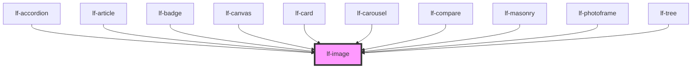

# lf-image

<!-- Auto Generated Below -->

## Overview

Represents an image component that displays an image or icon.
The image may be loaded from a URL or a local asset.
The component supports various customization options, including size, styling, and state color.

## Properties

| Property           | Attribute            | Description                                                                                                                                                      | Type                                                                                                                                                                                                                                                                                                                                                                                                                                                                                                                                                                                                                                                                                                                                                                                                                                                                                                                                                                                                                                                                                                                                                                                                                                                                                                                                                                                                                                                                                                                                                                                                                                                                                                                                                                                                                                                                                                                                                                                                                                                                                                                                                                                                                                                                                                                                                                                                          | Default     |
| ------------------ | -------------------- | ---------------------------------------------------------------------------------------------------------------------------------------------------------------- | ------------------------------------------------------------------------------------------------------------------------------------------------------------------------------------------------------------------------------------------------------------------------------------------------------------------------------------------------------------------------------------------------------------------------------------------------------------------------------------------------------------------------------------------------------------------------------------------------------------------------------------------------------------------------------------------------------------------------------------------------------------------------------------------------------------------------------------------------------------------------------------------------------------------------------------------------------------------------------------------------------------------------------------------------------------------------------------------------------------------------------------------------------------------------------------------------------------------------------------------------------------------------------------------------------------------------------------------------------------------------------------------------------------------------------------------------------------------------------------------------------------------------------------------------------------------------------------------------------------------------------------------------------------------------------------------------------------------------------------------------------------------------------------------------------------------------------------------------------------------------------------------------------------------------------------------------------------------------------------------------------------------------------------------------------------------------------------------------------------------------------------------------------------------------------------------------------------------------------------------------------------------------------------------------------------------------------------------------------------------------------------------------------------- | ----------- |
| `lfHtmlAttributes` | `lf-html-attributes` | Allows customization of the image element. This can include attributes like 'alt', 'aria-', etc., to further customize the behavior or appearance of the input.  | `{ lfDataset?: any; lfRipple?: any; lfStyle?: any; lfUiSize?: any; lfUiState?: any; name?: any; id?: any; type?: any; placeholder?: any; multiple?: any; value?: any; min?: any; max?: any; dataset?: any; title?: any; disabled?: any; alt?: any; step?: any; lfFadeIn?: any; lfFormat?: any; lfLanguage?: any; lfPreserveSpaces?: any; lfShowCopy?: any; lfShowHeader?: any; lfStickyHeader?: any; lfValue?: any; lfAriaLabel?: any; lfLabel?: any; lfLeadingLabel?: any; lfFormatJSON?: any; lfHelper?: any; lfHtmlAttributes?: any; lfIcon?: any; lfStretchY?: any; lfStyling?: any; lfTrailingIcon?: any; accept?: any; "accept-charset"?: any; autocomplete?: any; autofocus?: any; checked?: any; class?: any; href?: any; htmlProps?: any; maxLength?: any; minLength?: any; readonly?: any; role?: any; src?: any; srcset?: any; lfEmpty?: any; lfImageProps?: any; lfPosition?: any; lfIconOff?: any; lfShowSpinner?: any; lfStretchX?: any; lfToggable?: any; lfType?: any; lfBrush?: any; lfColor?: any; lfCursor?: any; lfOpacity?: any; lfPreview?: any; lfSize?: any; lfStrokeTolerance?: any; lfLayout?: any; lfSizeX?: any; lfSizeY?: any; lfAutoPlay?: any; lfInterval?: any; lfLightbox?: any; lfNavigation?: any; lfShape?: any; lfAxis?: any; lfColors?: any; lfLegend?: any; lfSeries?: any; lfTypes?: any; lfXAxis?: any; lfYAxis?: any; lfContextWindow?: any; lfEndpointUrl?: any; lfMaxTokens?: any; lfPollingInterval?: any; lfSeed?: any; lfSystem?: any; lfTemperature?: any; lfTypewriterProps?: any; lfView?: any; lfDisplay?: any; lfResponsive?: any; lfMode?: any; lfLoadCallback?: any; lfEnableDeletions?: any; lfSelectable?: any; lfActions?: any; lfColumns?: any; lfAutosave?: any; lfOverlay?: any; lfPlaceholder?: any; lfThreshold?: any; lfProps?: any; lfTrigger?: any; lfAnimated?: any; lfCenteredLabel?: any; lfIsRadial?: any; lfMax?: any; lfMin?: any; lfStep?: any; lfActive?: any; lfBarVariant?: any; lfDimensions?: any; lfFader?: any; lfFaderTimeout?: any; lfFullScreen?: any; lfTimeout?: any; lfCloseCallback?: any; lfCloseIcon?: any; lfMessage?: any; lfTimer?: any; lfAccordionLayout?: any; lfExpandedNodeIds?: any; lfFilter?: any; lfInitialExpansionDepth?: any; lfGrid?: any; lfSelectedNodeIds?: any; lfDeleteSpeed?: any; lfLoop?: any; lfPause?: any; lfSpeed?: any; lfTag?: any; lfUpdatable?: any; "data-"?: any; "aria-"?: any; }` | `{}`        |
| `lfMode`           | `lf-mode`            | Rendering mode for non-URL values: sprite (default) or mask (legacy).                                                                                            | `"mask" \| "sprite"`                                                                                                                                                                                                                                                                                                                                                                                                                                                                                                                                                                                                                                                                                                                                                                                                                                                                                                                                                                                                                                                                                                                                                                                                                                                                                                                                                                                                                                                                                                                                                                                                                                                                                                                                                                                                                                                                                                                                                                                                                                                                                                                                                                                                                                                                                                                                                                                          | `"sprite"`  |
| `lfShowSpinner`    | `lf-show-spinner`    | Controls the display of a loading indicator. When enabled, a spinner is shown until the image finishes loading. This property is not compatible with SVG images. | `boolean`                                                                                                                                                                                                                                                                                                                                                                                                                                                                                                                                                                                                                                                                                                                                                                                                                                                                                                                                                                                                                                                                                                                                                                                                                                                                                                                                                                                                                                                                                                                                                                                                                                                                                                                                                                                                                                                                                                                                                                                                                                                                                                                                                                                                                                                                                                                                                                                                     | `false`     |
| `lfSizeX`          | `lf-size-x`          | Sets the width of the icon. This property accepts any valid CSS measurement value (e.g., px, %, vh, etc.) and defaults to 100%.                                  | `string`                                                                                                                                                                                                                                                                                                                                                                                                                                                                                                                                                                                                                                                                                                                                                                                                                                                                                                                                                                                                                                                                                                                                                                                                                                                                                                                                                                                                                                                                                                                                                                                                                                                                                                                                                                                                                                                                                                                                                                                                                                                                                                                                                                                                                                                                                                                                                                                                      | `"100%"`    |
| `lfSizeY`          | `lf-size-y`          | Sets the height of the icon. This property accepts any valid CSS measurement value (e.g., px, %, vh, etc.) and defaults to 100%.                                 | `string`                                                                                                                                                                                                                                                                                                                                                                                                                                                                                                                                                                                                                                                                                                                                                                                                                                                                                                                                                                                                                                                                                                                                                                                                                                                                                                                                                                                                                                                                                                                                                                                                                                                                                                                                                                                                                                                                                                                                                                                                                                                                                                                                                                                                                                                                                                                                                                                                      | `"100%"`    |
| `lfStyle`          | `lf-style`           | Custom styling for the component.                                                                                                                                | `string`                                                                                                                                                                                                                                                                                                                                                                                                                                                                                                                                                                                                                                                                                                                                                                                                                                                                                                                                                                                                                                                                                                                                                                                                                                                                                                                                                                                                                                                                                                                                                                                                                                                                                                                                                                                                                                                                                                                                                                                                                                                                                                                                                                                                                                                                                                                                                                                                      | `""`        |
| `lfUiState`        | `lf-ui-state`        | Reflects the specified state color defined by the theme.                                                                                                         | `"danger" \| "disabled" \| "info" \| "primary" \| "secondary" \| "success" \| "warning"`                                                                                                                                                                                                                                                                                                                                                                                                                                                                                                                                                                                                                                                                                                                                                                                                                                                                                                                                                                                                                                                                                                                                                                                                                                                                                                                                                                                                                                                                                                                                                                                                                                                                                                                                                                                                                                                                                                                                                                                                                                                                                                                                                                                                                                                                                                                      | `"primary"` |
| `lfValue`          | `lf-value`           | Defines the source URL of the image. This property is used to set the image resource that the component should display.                                          | `string`                                                                                                                                                                                                                                                                                                                                                                                                                                                                                                                                                                                                                                                                                                                                                                                                                                                                                                                                                                                                                                                                                                                                                                                                                                                                                                                                                                                                                                                                                                                                                                                                                                                                                                                                                                                                                                                                                                                                                                                                                                                                                                                                                                                                                                                                                                                                                                                                      | `""`        |

## Events

| Event            | Description                                                                                                                                                                                    | Type                               |
| ---------------- | ---------------------------------------------------------------------------------------------------------------------------------------------------------------------------------------------- | ---------------------------------- |
| `lf-image-event` | Fires when the component triggers an internal action or user interaction. The event contains an `eventType` string, which identifies the action, and optionally `data` for additional details. | `CustomEvent<LfImageEventPayload>` |

## Methods

### `getDebugInfo() => Promise<LfDebugLifecycleInfo>`

Fetches debug information of the component's current state.

#### Returns

Type: `Promise<LfDebugLifecycleInfo>`

A promise that resolves with the debug information object.

### `getImage() => Promise<HTMLImageElement | SVGElement | null>`

Retrieves the underlying HTMLImageElement used to display the image.

#### Returns

Type: `Promise<HTMLImageElement | SVGElement>`

A promise that resolves with the image element, or null if not available.

### `getProps() => Promise<LfImagePropsInterface>`

Used to retrieve component's properties and descriptions.

#### Returns

Type: `Promise<LfImagePropsInterface>`

Promise resolved with an object containing the component's properties.

### `refresh() => Promise<void>`

This method is used to trigger a new render of the component.

#### Returns

Type: `Promise<void>`

### `unmount(ms?: number) => Promise<void>`

Initiates the unmount sequence, which removes the component from the DOM after a delay.

#### Parameters

| Name | Type     | Description              |
| ---- | -------- | ------------------------ |
| `ms` | `number` | - Number of milliseconds |

#### Returns

Type: `Promise<void>`

## CSS Custom Properties

| Name                       | Description                                                                                        |
| -------------------------- | -------------------------------------------------------------------------------------------------- |
| `--lf-image-aspect-ratio`  | Sets the aspect ratio for the icons. Defaults to => 1                                              |
| `--lf-image-color-primary` | Sets the color-primary color for the image component. Defaults to => var(--lf-color-primary)       |
| `--lf-image-font-family`   | Sets the primary font family for the image component. Defaults to => var(--lf-font-family-primary) |
| `--lf-image-font-size`     | Sets the font size for the image component. Defaults to => var(--lf-font-size)                     |
| `--lf-image-margin`        | Sets the margin for the image component. Defaults to => auto                                       |
| `--lf-image-object-fit`    | Sets the object fit for the image element. Defaults to => cover                                    |

## Dependencies

### Used by

 - [lf-accordion](../lf-accordion)
 - [lf-article](../lf-article)
 - [lf-badge](../lf-badge)
 - [lf-canvas](../lf-canvas)
 - [lf-card](../lf-card)
 - [lf-carousel](../lf-carousel)
 - [lf-compare](../lf-compare)
 - [lf-masonry](../lf-masonry)
 - [lf-photoframe](../lf-photoframe)
 - [lf-tree](../lf-tree)

### Graph

----------------------------------------------

*Built with [StencilJS](https://stenciljs.com/)*
