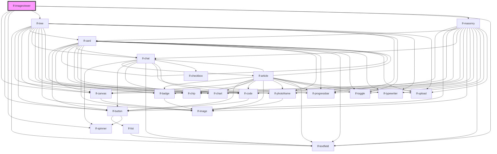

# lf-imageviewer

<!-- Auto Generated Below -->

## Overview

Represents an image viewer component that displays a collection of images in a masonry layout.
The image viewer allows users to navigate through images, view details, and interact with the images.
The component supports various customization options, including image loading, navigation, and styling.

## Properties

| Property         | Attribute  | Description                                                                                                                            | Type                                                                  | Default     |
| ---------------- | ---------- | -------------------------------------------------------------------------------------------------------------------------------------- | --------------------------------------------------------------------- | ----------- |
| `lfDataset`      | --         | The data set for the LF Imageviewer component. This property is mutable, meaning it can be changed after the component is initialized. | `LfDataDataset`                                                       | `{}`        |
| `lfLoadCallback` | --         | Callback invoked when the load button is clicked.                                                                                      | `(imageviewer: LfImageviewerInterface, dir: string) => Promise<void>` | `null`      |
| `lfNavigation`   | --         | Configuration options for the navigation panel.                                                                                        | `LfImageviewerNavigation`                                             | `undefined` |
| `lfStyle`        | `lf-style` | Custom styling for the component.                                                                                                      | `string`                                                              | `""`        |
| `lfValue`        | --         | Configuration parameters of the detail view.                                                                                           | `LfDataDataset`                                                       | `{}`        |

## Events

| Event                  | Description                                                                                                                                                                                    | Type                                     |
| ---------------------- | ---------------------------------------------------------------------------------------------------------------------------------------------------------------------------------------------- | ---------------------------------------- |
| `lf-imageviewer-event` | Fires when the component triggers an internal action or user interaction. The event contains an `eventType` string, which identifies the action, and optionally `data` for additional details. | `CustomEvent<LfImageviewerEventPayload>` |

## Methods

### `addSnapshot(value: string) => Promise<void>`

Appends a new snapshot to the current shape's history by duplicating it with an updated value.
It has no effect when the current shape is not set.

#### Parameters

| Name    | Type     | Description |
| ------- | -------- | ----------- |
| `value` | `string` |             |

#### Returns

Type: `Promise<void>`

### `clearHistory(index?: number) => Promise<void>`

Clears the history related to the shape identified by the index.
When index is not provided, it clear the full history.

#### Parameters

| Name    | Type     | Description |
| ------- | -------- | ----------- |
| `index` | `number` |             |

#### Returns

Type: `Promise<void>`

### `clearSelection() => Promise<void>`

Clears the currently selected shape.

#### Returns

Type: `Promise<void>`

### `getComponents() => Promise<LfImageviewerAdapterRefs>`

This method is used to retrieve the references to the subcomponents.

#### Returns

Type: `Promise<LfImageviewerAdapterRefs>`

### `getCurrentSnapshot() => Promise<{ shape: LfMasonrySelectedShape; value: string; }>`

Fetches the current snapshot.

#### Returns

Type: `Promise<{ shape: LfMasonrySelectedShape; value: string; }>`

A promise that resolves with the current snapshot's object.

### `getDebugInfo() => Promise<LfDebugLifecycleInfo>`

Fetches debug information of the component's current state.

#### Returns

Type: `Promise<LfDebugLifecycleInfo>`

A promise that resolves with the debug information object.

### `getProps() => Promise<LfImageviewerPropsInterface>`

Used to retrieve component's properties and descriptions.

#### Returns

Type: `Promise<LfImageviewerPropsInterface>`

Promise resolved with an object containing the component's properties.

### `refresh() => Promise<void>`

This method is used to trigger a new render of the component.

#### Returns

Type: `Promise<void>`

### `reset() => Promise<void>`

Clears the full history and clears the current selection.

#### Returns

Type: `Promise<void>`

### `setSpinnerStatus(status: boolean) => Promise<void>`

Displays/hides the spinner over the preview.

#### Parameters

| Name     | Type      | Description |
| -------- | --------- | ----------- |
| `status` | `boolean` |             |

#### Returns

Type: `Promise<void>`

### `unmount(ms?: number) => Promise<void>`

Initiates the unmount sequence, which removes the component from the DOM after a delay.

#### Parameters

| Name | Type     | Description              |
| ---- | -------- | ------------------------ |
| `ms` | `number` | - Number of milliseconds |

#### Returns

Type: `Promise<void>`

## CSS Custom Properties

| Name                             | Description                                                                                              |
| -------------------------------- | -------------------------------------------------------------------------------------------------------- |
| `--lf-imageviewer-border-color`  | Sets the border color for the imageviewer component. Defaults to => var(--lf-color-border)               |
| `--lf-imageviewer-border-radius` | Sets the border radius for the imageviewer component. Defaults to => var(--lf-ui-border-radius)          |
| `--lf-imageviewer-color-bg`      | Sets the color-bg color for the imageviewer component. Defaults to => var(--lf-color-bg)                 |
| `--lf-imageviewer-color-on-bg`   | Sets the color-on-bg color for the imageviewer component. Defaults to => var(--lf-color-on-bg)           |
| `--lf-imageviewer-font-family`   | Sets the primary font family for the imageviewer component. Defaults to => var(--lf-font-family-primary) |
| `--lf-imageviewer-font-size`     | Sets the font size for the imageviewer component. Defaults to => var(--lf-font-size)                     |
| `--lf-imageviewer-nav-width`     | Sets the width for the navigation panel. Defaults to => auto                                             |

## Dependencies

### Depends on

- [lf-canvas](../lf-canvas)
- [lf-button](../lf-button)
- [lf-spinner](../lf-spinner)
- [lf-tree](../lf-tree)
- [lf-masonry](../lf-masonry)
- [lf-textfield](../lf-textfield)

### Graph

----------------------------------------------

*Built with [StencilJS](https://stenciljs.com/)*
