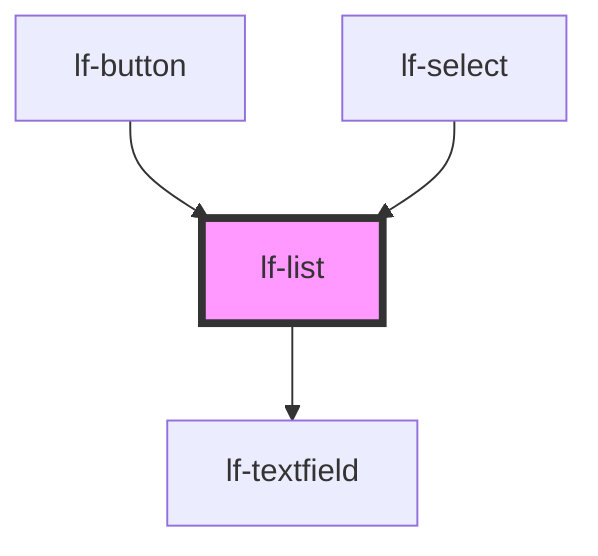

# lf-list

<!-- Auto Generated Below -->

## Overview

The list component displays a collection of items in a vertical list layout.
The list supports various customization options, including item selection, deletion, and navigation.

## Properties

| Property            | Attribute             | Description                                                                                                                     | Type                                                                                     | Default         |
| ------------------- | --------------------- | ------------------------------------------------------------------------------------------------------------------------------- | ---------------------------------------------------------------------------------------- | --------------- |
| `lfDataset`         | --                    | The data set for the LF List component. This property is mutable, meaning it can be changed after the component is initialized. | `LfDataDataset`                                                                          | `null`          |
| `lfEmpty`           | `lf-empty`            | Empty text displayed when there is no data.                                                                                     | `string`                                                                                 | `"Empty data."` |
| `lfEnableDeletions` | `lf-enable-deletions` | Defines whether items can be removed from the list or not.                                                                      | `boolean`                                                                                | `false`         |
| `lfFilter`          | `lf-filter`           | When true, displays a filter text field above the list items for searching.                                                     | `boolean`                                                                                | `false`         |
| `lfNavigation`      | `lf-navigation`       |                                                                                                                                 | `boolean`                                                                                | `true`          |
| `lfRipple`          | `lf-ripple`           | When set to true, the pointerdown event will trigger a ripple effect.                                                           | `boolean`                                                                                | `true`          |
| `lfSelectable`      | `lf-selectable`       | Defines whether items are selectable or not.                                                                                    | `boolean`                                                                                | `true`          |
| `lfStyle`           | `lf-style`            | Custom styling for the component.                                                                                               | `string`                                                                                 | `""`            |
| `lfUiSize`          | `lf-ui-size`          | The size of the component.                                                                                                      | `"large" \| "medium" \| "small" \| "xlarge" \| "xsmall" \| "xxlarge" \| "xxsmall"`       | `"medium"`      |
| `lfUiState`         | `lf-ui-state`         | Reflects the specified state color defined by the theme.                                                                        | `"danger" \| "disabled" \| "info" \| "primary" \| "secondary" \| "success" \| "warning"` | `"primary"`     |
| `lfValue`           | `lf-value`            | Sets the initial state of the list. Relevant only when the list can be selected.                                                | `number`                                                                                 | `null`          |

## Events

| Event           | Description                                                                                                                                                                                    | Type                              |
| --------------- | ---------------------------------------------------------------------------------------------------------------------------------------------------------------------------------------------- | --------------------------------- |
| `lf-list-event` | Fires when the component triggers an internal action or user interaction. The event contains an `eventType` string, which identifies the action, and optionally `data` for additional details. | `CustomEvent<LfListEventPayload>` |

## Methods

### `applyFilter(value: string) => Promise<void>`

Applies a filter value immediately (for testing compatibility).

#### Parameters

| Name    | Type     | Description               |
| ------- | -------- | ------------------------- |
| `value` | `string` | - The filter string value |

#### Returns

Type: `Promise<void>`

### `focusNext() => Promise<void>`

Moves focus to the next item in the list.
If no item is currently focused, focuses the selected item.
If the last item is focused, wraps around to the first item.

#### Returns

Type: `Promise<void>`

A promise that resolves when the focus operation is complete

### `focusPrevious() => Promise<void>`

Focuses the previous item in the list.
If no item is currently focused, it focuses the selected item.
If focused item is the first one, it wraps around to the last item.

#### Returns

Type: `Promise<void>`

Promise that resolves when the focus operation is complete

### `getDebugInfo() => Promise<LfDebugLifecycleInfo>`

Fetches debug information of the component's current state.

#### Returns

Type: `Promise<LfDebugLifecycleInfo>`

A promise that resolves with the debug information object.

### `getProps() => Promise<LfListPropsInterface>`

Used to retrieve component's properties and descriptions.

#### Returns

Type: `Promise<LfListPropsInterface>`

Promise resolved with an object containing the component's properties.

### `getSelected() => Promise<LfDataNode>`

Retrieves the currently selected node from the list.

#### Returns

Type: `Promise<LfDataNode>`

A Promise that resolves to the selected LfDataNode object.

### `refresh() => Promise<void>`

This method is used to trigger a new render of the component.

#### Returns

Type: `Promise<void>`

### `selectNode(index?: number) => Promise<void>`

Selects a node in the list at the specified index.
If no index is provided, selects the currently focused node.

#### Parameters

| Name    | Type     | Description                                                            |
| ------- | -------- | ---------------------------------------------------------------------- |
| `index` | `number` | - The index of the node to select. If omitted, uses the focused index. |

#### Returns

Type: `Promise<void>`

A promise that resolves when the selection is complete.

### `selectNodeById(id: string) => Promise<void>`

Selects a node in the list by its ID.

#### Parameters

| Name | Type     | Description                    |
| ---- | -------- | ------------------------------ |
| `id` | `string` | - The ID of the node to select |

#### Returns

Type: `Promise<void>`

### `setFilter(value: string) => Promise<void>`

Sets the filter value and updates the filter input field.

#### Parameters

| Name    | Type     | Description               |
| ------- | -------- | ------------------------- |
| `value` | `string` | - The filter string value |

#### Returns

Type: `Promise<void>`

### `unmount(ms?: number) => Promise<void>`

Initiates the unmount sequence, which removes the component from the DOM after a delay.

#### Parameters

| Name | Type     | Description              |
| ---- | -------- | ------------------------ |
| `ms` | `number` | - Number of milliseconds |

#### Returns

Type: `Promise<void>`

## CSS Custom Properties

| Name                                     | Description                                                                                       |
| ---------------------------------------- | ------------------------------------------------------------------------------------------------- |
| `--lf-list-border-color`                 | Sets the border color for the list component. Defaults to => var(--lf-color-border)               |
| `--lf-list-border-radius`                | Sets the border radius for the list component. Defaults to => var(--lf-ui-border-radius)          |
| `--lf-list-color-bg`                     | Sets the color-bg color for the list component. Defaults to => var(--lf-color-bg)                 |
| `--lf-list-color-danger`                 | Sets the color-danger color for the list component. Defaults to => var(--lf-color-danger)         |
| `--lf-list-color-on-bg`                  | Sets the color-on-bg color for the list component. Defaults to => var(--lf-color-on-bg)           |
| `--lf-list-color-on-danger`              | Sets the color-on-danger color for the list component. Defaults to => var(--lf-color-on-danger)   |
| `--lf-list-color-primary`                | Sets the color-primary color for the list component. Defaults to => var(--lf-color-primary)       |
| `--lf-list-font-family`                  | Sets the primary font family for the list component. Defaults to => var(--lf-font-family-primary) |
| `--lf-list-font-size`                    | Sets the font size for the list component. Defaults to => var(--lf-font-size)                     |
| `--lf-list-item-height`                  | Sets the height for the item of the list component. Defaults to => 2.5em                          |
| `--lf-list-item-padding`                 | Sets the padding for the item of the list component. Defaults to => 0 0.75em                      |
| `--lf-list-item-with-description-height` | Sets the height for the item with description of the list component. Defaults to => 3.6em         |

## Dependencies

### Used by

 - [lf-button](../lf-button)
 - [lf-select](../lf-select)

### Depends on

- [lf-textfield](../lf-textfield)

### Graph

----------------------------------------------

*Built with [StencilJS](https://stenciljs.com/)*
