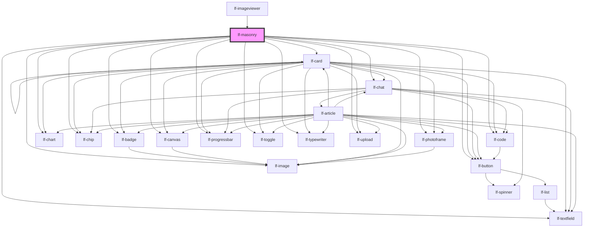

# lf-masonry

<!-- Auto Generated Below -->

## Overview

A masonry component that displays a collection of shapes in a grid layout.
The masonry component supports various customization options, including shape selection, view type, and styling.
The component allows users to interact with shapes, view details, and customize the layout.

## Properties

| Property            | Attribute             | Description                                                                                                                                                                                                                        | Type                                                                                                                                                                                                                    | Default                                           |
| ------------------- | --------------------- | ---------------------------------------------------------------------------------------------------------------------------------------------------------------------------------------------------------------------------------- | ----------------------------------------------------------------------------------------------------------------------------------------------------------------------------------------------------------------------- | ------------------------------------------------- |
| `lfActions`         | `lf-actions`          | When true displays floating buttons to customize the view.                                                                                                                                                                         | `boolean`                                                                                                                                                                                                               | `false`                                           |
| `lfCollapseColumns` | `lf-collapse-columns` | When true the masonry will collapse the number of columns to the number of items when the number of items is less than the configured columns. Set to false to preserve the configured column count even if there are fewer items. | `boolean`                                                                                                                                                                                                               | `true`                                            |
| `lfColumns`         | `lf-columns`          | Number of columns of the masonry, doesn't affect sequential views. Can be set with a number or an array of numbers that identify each breakpoint.                                                                                  | `number \| number[]`                                                                                                                                                                                                    | `Array.from(     LF_MASONRY_DEFAULT_COLUMNS,   )` |
| `lfDataset`         | --                    | Actual data of the masonry.                                                                                                                                                                                                        | `LfDataDataset`                                                                                                                                                                                                         | `null`                                            |
| `lfSelectable`      | `lf-selectable`       | Allows for the selection of elements.                                                                                                                                                                                              | `boolean`                                                                                                                                                                                                               | `false`                                           |
| `lfShape`           | `lf-shape`            | Sets the type of shapes to compare.                                                                                                                                                                                                | `"badge" \| "button" \| "canvas" \| "card" \| "chart" \| "chat" \| "chip" \| "code" \| "image" \| "number" \| "photoframe" \| "progressbar" \| "slot" \| "text" \| "textfield" \| "toggle" \| "typewriter" \| "upload"` | `"image"`                                         |
| `lfStyle`           | `lf-style`            | Custom styling for the component.                                                                                                                                                                                                  | `string`                                                                                                                                                                                                                | `""`                                              |
| `lfView`            | `lf-view`             | Sets the type of view, either the actual masonry or a sequential view.                                                                                                                                                             | `"horizontal" \| "main" \| "vertical"`                                                                                                                                                                                  | `"main"`                                          |

## Events

| Event              | Description                                                                                                                                                                                    | Type                                 |
| ------------------ | ---------------------------------------------------------------------------------------------------------------------------------------------------------------------------------------------- | ------------------------------------ |
| `lf-masonry-event` | Fires when the component triggers an internal action or user interaction. The event contains an `eventType` string, which identifies the action, and optionally `data` for additional details. | `CustomEvent<LfMasonryEventPayload>` |

## Methods

### `getDebugInfo() => Promise<LfDebugLifecycleInfo>`

Fetches debug information of the component's current state.

#### Returns

Type: `Promise<LfDebugLifecycleInfo>`

A promise that resolves with the debug information object.

### `getProps() => Promise<LfMasonryPropsInterface>`

Used to retrieve component's properties and descriptions.

#### Returns

Type: `Promise<LfMasonryPropsInterface>`

Promise resolved with an object containing the component's properties.

### `getSelectedShape() => Promise<LfMasonrySelectedShape>`

Returns the selected shape.

#### Returns

Type: `Promise<LfMasonrySelectedShape>`

Selected shape.

### `redecorateShapes() => Promise<void>`

Redecorates the shapes, updating potential new values.

#### Returns

Type: `Promise<void>`

### `refresh() => Promise<void>`

This method is used to trigger a new render of the component.

#### Returns

Type: `Promise<void>`

### `setSelectedShape(index: number) => Promise<void>`

Sets the selected shape by index.

#### Parameters

| Name    | Type     | Description |
| ------- | -------- | ----------- |
| `index` | `number` |             |

#### Returns

Type: `Promise<void>`

### `unmount(ms?: number) => Promise<void>`

Initiates the unmount sequence, which removes the component from the DOM after a delay.

#### Parameters

| Name | Type     | Description              |
| ---- | -------- | ------------------------ |
| `ms` | `number` | - Number of milliseconds |

#### Returns

Type: `Promise<void>`

## CSS Custom Properties

| Name                                 | Description                                                                                                                                            |
| ------------------------------------ | ------------------------------------------------------------------------------------------------------------------------------------------------------ |
| `--lf-masonry-actions-backdrop`      | Sets the backdrop filter for the actions of the masonry component. Defaults to => blur(10px)                                                           |
| `--lf-masonry-actions-background`    | Sets the background for the actions of the masonry component. Defaults to => rgba(var(--lf-color-surface), 0.75)                                       |
| `--lf-masonry-actions-border-radius` | Sets the border radius for the actions of the masonry component. Defaults to => 50px                                                                   |
| `--lf-masonry-actions-margin`        | Sets the margin for the actions of the masonry component. Defaults to => 0 0.5em 0.5em 0                                                               |
| `--lf-masonry-actions-padding`       | Sets the padding for the actions of the masonry component. Defaults to => 0.75em                                                                       |
| `--lf-masonry-actions-z-index`       | Sets the z index for the actions of the masonry component. Defaults to => 2                                                                            |
| `--lf-masonry-button-bottom`         | Sets the bottom for the button of the masonry component. Defaults to => 1em                                                                            |
| `--lf-masonry-button-right`          | Sets the right for the button of the masonry component. Defaults to => 1em                                                                             |
| `--lf-masonry-column-size`           | Sets the column size for the grid of the masonry component. Defaults to => minmax(0px, 1fr)                                                            |
| `--lf-masonry-font-family`           | Sets the primary font family for the masonry component. Defaults to => var(--lf-font-family-primary)                                                   |
| `--lf-masonry-font-size`             | Sets the font size for the masonry component. Defaults to => var(--lf-font-size)                                                                       |
| `--lf-masonry-grid-gap`              | Sets the gap for the grid of the masonry component. Defaults to => 0.5em                                                                               |
| `--lf-masonry-grid-gap-actions`      | Sets the gap for the actions of the masonry component. Defaults to => 0.5em                                                                            |
| `--lf-masonry-grid-gap-actions-sub`  | Sets the gap for the actions sub of the masonry component. Defaults to => 0.25em                                                                       |
| `--lf-masonry-grid-items-alignment`  | Sets the items alignment for the grid of the masonry component. Defaults to => start                                                                   |
| `--lf-masonry-padding`               | Sets the padding for the grid of the masonry component. Defaults to => 0.75em                                                                          |
| `--lf-masonry-selected-border`       | Sets the border for the selected image of the masonry component. Defaults to => 1px solid rgba(var(--lf-color-secondary, 0.875))                       |
| `--lf-masonry-selected-filter`       | Sets the filter for the selected image of the masonry component. Defaults to => brightness(110%) drop-shadow(0 0 0.5em rgb(var(--lf-color-secondary))) |

## Dependencies

### Used by

 - [lf-imageviewer](../lf-imageviewer)

### Depends on

- [lf-badge](../lf-badge)
- [lf-button](../lf-button)
- [lf-canvas](../lf-canvas)
- [lf-card](../lf-card)
- [lf-chart](../lf-chart)
- [lf-chat](../lf-chat)
- [lf-chip](../lf-chip)
- [lf-code](../lf-code)
- [lf-image](../lf-image)
- [lf-photoframe](../lf-photoframe)
- [lf-progressbar](../lf-progressbar)
- [lf-textfield](../lf-textfield)
- [lf-toggle](../lf-toggle)
- [lf-typewriter](../lf-typewriter)
- [lf-upload](../lf-upload)

### Graph

----------------------------------------------

*Built with [StencilJS](https://stenciljs.com/)*
