# lf-messenger

<!-- Auto Generated Below -->

## Overview

Represents a messenger component that displays a chat interface with characters and messages.
The messenger component allows users to interact with characters, view messages, and customize the chat.
The component supports various customization options, including character selection, message history, and styling.

## Properties

| Property     | Attribute     | Description                                                                                                                     | Type                 | Default |
| ------------ | ------------- | ------------------------------------------------------------------------------------------------------------------------------- | -------------------- | ------- |
| `lfAutosave` | `lf-autosave` | Automatically saves the dataset when a chat updates.                                                                            | `boolean`            | `true`  |
| `lfDataset`  | `lf-dataset`  | The data set for the LF List component. This property is mutable, meaning it can be changed after the component is initialized. | `LfMessengerDataset` | `null`  |
| `lfStyle`    | `lf-style`    | Custom styling for the component.                                                                                               | `string`             | `""`    |
| `lfValue`    | `lf-value`    | Sets the initial configuration, including active character and filters.                                                         | `LfMessengerConfig`  | `null`  |

## Events

| Event                | Description                                                                                                                                                                                    | Type                                   |
| -------------------- | ---------------------------------------------------------------------------------------------------------------------------------------------------------------------------------------------- | -------------------------------------- |
| `lf-messenger-event` | Fires when the component triggers an internal action or user interaction. The event contains an `eventType` string, which identifies the action, and optionally `data` for additional details. | `CustomEvent<LfMessengerEventPayload>` |

## Methods

### `deleteOption(node: LfMessengerBaseChildNode<LfMessengerUnionChildIds>, type: LfMessengerImageTypes) => Promise<void>`

Removes a specific child node from the messenger's image structure.

#### Parameters

| Name   | Type                                                 | Description                                            |
| ------ | ---------------------------------------------------- | ------------------------------------------------------ |
| `node` | `LfMessengerBaseChildNode<LfMessengerUnionChildIds>` | - The child node to be removed from the messenger tree |
| `type` | `"avatars" \| LfMessengerOptionTypes`                | - The type of image messenger structure to modify      |

#### Returns

Type: `Promise<void>`

A Promise that resolves when the deletion is complete

### `getDebugInfo() => Promise<LfDebugLifecycleInfo>`

Fetches debug information of the component's current state.

#### Returns

Type: `Promise<LfDebugLifecycleInfo>`

A promise that resolves with the debug information object.

### `getProps() => Promise<LfMessengerPropsInterface>`

Used to retrieve component's properties and descriptions.

#### Returns

Type: `Promise<LfMessengerPropsInterface>`

Promise resolved with an object containing the component's properties.

### `refresh() => Promise<void>`

This method is used to trigger a new render of the component.

#### Returns

Type: `Promise<void>`

### `reset() => Promise<void>`

Resets the messenger component to its initial state.
Clears covers, current character, and message history.
Reinitializes the component.

#### Returns

Type: `Promise<void>`

A promise that resolves when the reset is complete

### `save() => Promise<void>`

Asynchronously saves the current messenger state.

#### Returns

Type: `Promise<void>`

A Promise that resolves when the save operation is complete.

### `unmount(ms?: number) => Promise<void>`

Initiates the unmount sequence, which removes the component from the DOM after a delay.

#### Parameters

| Name | Type     | Description              |
| ---- | -------- | ------------------------ |
| `ms` | `number` | - Number of milliseconds |

#### Returns

Type: `Promise<void>`

## CSS Custom Properties

| Name                                         | Description                                                                                                             |
| -------------------------------------------- | ----------------------------------------------------------------------------------------------------------------------- |
| `--lf-messenger-active-options-name-padding` | Sets the padding for the name of the active options of the messenger component. Defaults to => 0.5em                    |
| `--lf-messenger-avatar-name-padding`         | Sets the padding for the name of the character. Defaults to => 0.5em                                                    |
| `--lf-messenger-color-danger`                | Sets the color-danger color for the messenger component. Defaults to => var(--lf-color-danger)                          |
| `--lf-messenger-color-on-danger`             | Sets the color-on-danger color for the messenger component. Defaults to => var(--lf-color-on-danger)                    |
| `--lf-messenger-color-on-success`            | Sets the color-on-success color for the messenger component. Defaults to => var(--lf-color-on-success)                  |
| `--lf-messenger-color-on-surface`            | Sets the color-on-surface color for the messenger component. Defaults to => var(--lf-color-on-surface)                  |
| `--lf-messenger-color-success`               | Sets the color-success color for the messenger component. Defaults to => var(--lf-color-success)                        |
| `--lf-messenger-color-surface`               | Sets the color-surface color for the messenger component. Defaults to => var(--lf-color-surface)                        |
| `--lf-messenger-customization-title-padding` | Sets the padding for the title of the customization panel. Defaults to => 0.5em                                         |
| `--lf-messenger-font-family`                 | Sets the primary font family for the messenger component. Defaults to => var(--lf-font-family-primary)                  |
| `--lf-messenger-font-size`                   | Sets the font size for the messenger component. Defaults to => var(--lf-font-size)                                      |
| `--lf-messenger-name-background-color`       | Sets the background color for the name of the messenger component's option. Defaults to => rgb(var(--lf-color-surface)) |
| `--lf-messenger-name-height`                 | Sets the height for the name of the character. Defaults to => 3em                                                       |
| `--lf-messenger-portrait-foredrop-color`     | Sets the color for the foredrop of the portrait. Defaults to => rgba(var(--lf-color-bg), 0.275)                         |

## Dependencies

### Depends on

- [lf-code](../lf-code)
- [lf-button](../lf-button)
- [lf-chat](../lf-chat)
- [lf-tabbar](../lf-tabbar)
- [lf-chip](../lf-chip)
- [lf-textfield](../lf-textfield)

### Graph

```mermaid
graph TD;
  lf-messenger --> lf-code
  lf-messenger --> lf-button
  lf-messenger --> lf-chat
  lf-messenger --> lf-tabbar
  lf-messenger --> lf-chip
  lf-messenger --> lf-textfield
  lf-code --> lf-button
  lf-button --> lf-list
  lf-button --> lf-spinner
  lf-chat --> lf-spinner
  lf-chat --> lf-code
  lf-chat --> lf-button
  lf-chat --> lf-typewriter
  lf-chat --> lf-progressbar
  lf-chat --> lf-textfield
  lf-tabbar --> lf-button
  style lf-messenger fill:#f9f,stroke:#333,stroke-width:4px
```

----------------------------------------------

*Built with [StencilJS](https://stenciljs.com/)*
