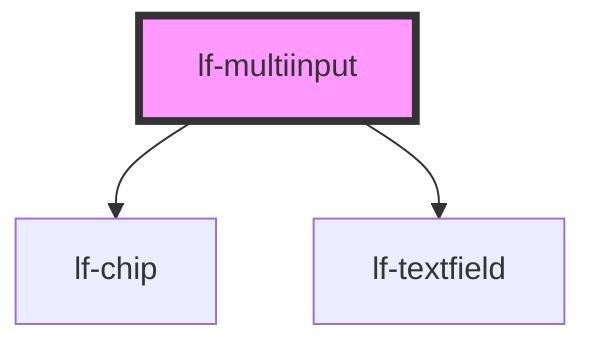

# lf-multiinput

<!-- Auto Generated Below -->

## Overview

The multiinput component combines a textfield with a chip-based history bar.
It exposes a single string value while allowing quick selection from recent entries.

## Properties

| Property           | Attribute             | Description                                                                                                                                                        | Type                                                                                                                                                                                                                                                                                                                                                                                                                                                                                                                                                                                                                                                                                                                                                                                                                                                                                                                                                                                                                                                                                                                   | Default     |
| ------------------ | --------------------- | ------------------------------------------------------------------------------------------------------------------------------------------------------------------ | ---------------------------------------------------------------------------------------------------------------------------------------------------------------------------------------------------------------------------------------------------------------------------------------------------------------------------------------------------------------------------------------------------------------------------------------------------------------------------------------------------------------------------------------------------------------------------------------------------------------------------------------------------------------------------------------------------------------------------------------------------------------------------------------------------------------------------------------------------------------------------------------------------------------------------------------------------------------------------------------------------------------------------------------------------------------------------------------------------------------------- | ----------- |
| `lfAllowFreeInput` | `lf-allow-free-input` | When false, values must match an entry in the history dataset to be accepted on commit.                                                                            | `boolean`                                                                                                                                                                                                                                                                                                                                                                                                                                                                                                                                                                                                                                                                                                                                                                                                                                                                                                                                                                                                                                                                                                              | `true`      |
| `lfChipProps`      | --                    | Props forwarded to the internal lf-chip history row.                                                                                                               | `{ getSelectedNodes?: () => Promise<Set<LfDataNode>>; setSelectedNodes?: (nodes: (string[] \| LfDataNode[]) & any[]) => Promise<void>; rootElement?: LfChipElement; debugInfo?: LfDebugLifecycleInfo; getDebugInfo?: () => Promise<LfDebugLifecycleInfo>; getProps?: (descriptions?: boolean) => Promise<LfComponentPropsFor<LfComponentName>>; lfStyle?: string; refresh?: () => Promise<void>; unmount?: (ms?: number) => Promise<void>; lfAriaLabel?: string; lfDataset?: LfDataDataset; lfFlat?: boolean; lfRipple?: boolean; lfShowSpinner?: boolean; lfStyling?: "input" \| "choice" \| "filter" \| "standard"; lfUiSize?: "large" \| "medium" \| "small" \| "xlarge" \| "xsmall" \| "xxlarge" \| "xxsmall"; lfUiState?: "danger" \| "disabled" \| "info" \| "primary" \| "secondary" \| "success" \| "warning"; lfValue?: string[]; }`                                                                                                                                                                                                                                                                          | `null`      |
| `lfDataset`        | --                    | Dataset backing the history chips. Nodes are treated as the source of truth.                                                                                       | `LfDataDataset`                                                                                                                                                                                                                                                                                                                                                                                                                                                                                                                                                                                                                                                                                                                                                                                                                                                                                                                                                                                                                                                                                                        | `null`      |
| `lfMaxHistory`     | `lf-max-history`      | Maximum number of history entries to retain.                                                                                                                       | `number`                                                                                                                                                                                                                                                                                                                                                                                                                                                                                                                                                                                                                                                                                                                                                                                                                                                                                                                                                                                                                                                                                                               | `10`        |
| `lfMode`           | `lf-mode`             | Behaviour mode for the component. - "history": single-value + commit history (default). - "tags": tag selection where the value is a comma-separated list of tags. | `"history" \| "tags"`                                                                                                                                                                                                                                                                                                                                                                                                                                                                                                                                                                                                                                                                                                                                                                                                                                                                                                                                                                                                                                                                                                  | `"history"` |
| `lfStyle`          | `lf-style`            | Custom CSS string injected into the component shadow root.                                                                                                         | `string`                                                                                                                                                                                                                                                                                                                                                                                                                                                                                                                                                                                                                                                                                                                                                                                                                                                                                                                                                                                                                                                                                                               | `null`      |
| `lfTextfieldProps` | --                    | Props forwarded to the internal lf-textfield input.                                                                                                                | `{ formatJSON?: () => Promise<void>; getElement?: () => Promise<HTMLInputElement \| HTMLTextAreaElement>; getValue?: () => Promise<string>; setBlur?: () => Promise<void>; setFocus?: () => Promise<void>; setValue?: (value: string) => Promise<void>; rootElement?: LfTextfieldElement; debugInfo?: LfDebugLifecycleInfo; getDebugInfo?: () => Promise<LfDebugLifecycleInfo>; getProps?: (descriptions?: boolean) => Promise<LfComponentPropsFor<LfComponentName>>; lfStyle?: string; refresh?: () => Promise<void>; unmount?: (ms?: number) => Promise<void>; lfFormatJSON?: LfTextfieldFormatJSON; lfHelper?: LfTextfieldHelper; lfHtmlAttributes?: Partial<LfFrameworkAllowedKeysMap>; lfIcon?: string; lfLabel?: string; lfStretchY?: boolean; lfStyling?: "flat" \| "outlined" \| "raised" \| "textarea"; lfTrailingIcon?: boolean; lfTrailingIconAction?: LfTextfieldTrailingIconAction; lfUiSize?: "large" \| "medium" \| "small" \| "xlarge" \| "xsmall" \| "xxlarge" \| "xxsmall"; lfUiState?: "danger" \| "disabled" \| "info" \| "primary" \| "secondary" \| "success" \| "warning"; lfValue?: string; }` | `null`      |
| `lfUiSize`         | `lf-ui-size`          | UI size token propagated to children.                                                                                                                              | `"large" \| "medium" \| "small" \| "xlarge" \| "xsmall" \| "xxlarge" \| "xxsmall"`                                                                                                                                                                                                                                                                                                                                                                                                                                                                                                                                                                                                                                                                                                                                                                                                                                                                                                                                                                                                                                     | `"medium"`  |
| `lfUiState`        | `lf-ui-state`         | UI state token propagated to children.                                                                                                                             | `"danger" \| "disabled" \| "info" \| "primary" \| "secondary" \| "success" \| "warning"`                                                                                                                                                                                                                                                                                                                                                                                                                                                                                                                                                                                                                                                                                                                                                                                                                                                                                                                                                                                                                               | `"primary"` |
| `lfValue`          | `lf-value`            | Initial string value for the textfield.                                                                                                                            | `string`                                                                                                                                                                                                                                                                                                                                                                                                                                                                                                                                                                                                                                                                                                                                                                                                                                                                                                                                                                                                                                                                                                               | `""`        |

## Events

| Event                 | Description                                                                                                              | Type                                    |
| --------------------- | ------------------------------------------------------------------------------------------------------------------------ | --------------------------------------- |
| `lf-multiinput-event` | Unified event emitted for all interactions within the component. Check `detail.eventType` to branch on specific actions. | `CustomEvent<LfMultiInputEventPayload>` |

## Methods

### `addToHistory(value: string) => Promise<void>`

#### Parameters

| Name    | Type     | Description |
| ------- | -------- | ----------- |
| `value` | `string` |             |

#### Returns

Type: `Promise<void>`

### `getDebugInfo() => Promise<LfDebugLifecycleInfo>`

Fetches debug information of the component's current state.

#### Returns

Type: `Promise<LfDebugLifecycleInfo>`

A promise that resolves with the debug information object.

### `getHistory() => Promise<string[]>`

#### Returns

Type: `Promise<string[]>`

### `getProps() => Promise<LfMultiInputPropsInterface>`

Used to retrieve component's properties and descriptions.

#### Returns

Type: `Promise<LfMultiInputPropsInterface>`

Promise resolved with an object containing the component's properties.

### `getState() => Promise<{ value: string; history: string[]; }>`

#### Returns

Type: `Promise<{ value: string; history: string[]; }>`

### `getValue() => Promise<string>`

#### Returns

Type: `Promise<string>`

### `refresh() => Promise<void>`

This method is used to trigger a new render of the component.

#### Returns

Type: `Promise<void>`

### `setHistory(values: string[]) => Promise<void>`

#### Parameters

| Name     | Type       | Description |
| -------- | ---------- | ----------- |
| `values` | `string[]` |             |

#### Returns

Type: `Promise<void>`

### `setValue(value: string) => Promise<void>`

#### Parameters

| Name    | Type     | Description |
| ------- | -------- | ----------- |
| `value` | `string` |             |

#### Returns

Type: `Promise<void>`

### `unmount(ms?: number) => Promise<void>`

Initiates the unmount sequence, which removes the component from the DOM after a delay.

#### Parameters

| Name | Type     | Description              |
| ---- | -------- | ------------------------ |
| `ms` | `number` | - Number of milliseconds |

#### Returns

Type: `Promise<void>`

## CSS Custom Properties

| Name                          | Description                                                                                             |
| ----------------------------- | ------------------------------------------------------------------------------------------------------- |
| `--lf-multiinput-font-family` | Sets the primary font family for the multiinput component. Defaults to => var(--lf-font-family-primary) |
| `--lf-multiinput-font-size`   | Sets the font size for the multiinput component. Defaults to => var(--lf-font-size)                     |

## Dependencies

### Depends on

- [lf-chip](../lf-chip)
- [lf-textfield](../lf-textfield)

### Graph

----------------------------------------------

*Built with [StencilJS](https://stenciljs.com/)*
