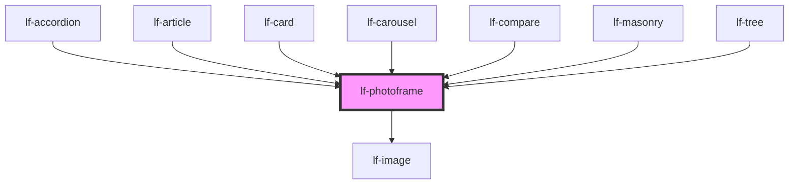

# lf-photoframe

<!-- Auto Generated Below -->

## Overview

Represents an image component that displays a photo or graphic.
The image may be overlaid with text or other elements.

## Properties

| Property        | Attribute      | Description                                                                   | Type                                                                                                                                                                                                                                                                                                                                                                                                                                                                                                                                                                                                                                                                                                                                                                                                                                                                                                                                                                                                                                                                                                                                                                                                                                                                                                                                                                                                                                                                                                                                                                                                                                                                                                                                                                                                                                                                                                                                                                                                                                                                                                                                                                                                                                                                                                                                                                                                                                                                                                                                                                                                      | Default |
| --------------- | -------------- | ----------------------------------------------------------------------------- | --------------------------------------------------------------------------------------------------------------------------------------------------------------------------------------------------------------------------------------------------------------------------------------------------------------------------------------------------------------------------------------------------------------------------------------------------------------------------------------------------------------------------------------------------------------------------------------------------------------------------------------------------------------------------------------------------------------------------------------------------------------------------------------------------------------------------------------------------------------------------------------------------------------------------------------------------------------------------------------------------------------------------------------------------------------------------------------------------------------------------------------------------------------------------------------------------------------------------------------------------------------------------------------------------------------------------------------------------------------------------------------------------------------------------------------------------------------------------------------------------------------------------------------------------------------------------------------------------------------------------------------------------------------------------------------------------------------------------------------------------------------------------------------------------------------------------------------------------------------------------------------------------------------------------------------------------------------------------------------------------------------------------------------------------------------------------------------------------------------------------------------------------------------------------------------------------------------------------------------------------------------------------------------------------------------------------------------------------------------------------------------------------------------------------------------------------------------------------------------------------------------------------------------------------------------------------------------------------------- | ------- |
| `lfOverlay`     | --             | When not empty, this text will be overlayed on the photo - blocking the view. | `LfPhotoframeOverlay`                                                                                                                                                                                                                                                                                                                                                                                                                                                                                                                                                                                                                                                                                                                                                                                                                                                                                                                                                                                                                                                                                                                                                                                                                                                                                                                                                                                                                                                                                                                                                                                                                                                                                                                                                                                                                                                                                                                                                                                                                                                                                                                                                                                                                                                                                                                                                                                                                                                                                                                                                                                     | `null`  |
| `lfPlaceholder` | --             | Html attributes of the picture before the component enters the viewport.      | `{ lfImageProps?: any; lfLabel?: any; lfPosition?: any; lfStyle?: any; lfUiSize?: any; lfUiState?: any; lfAriaLabel?: any; lfDataset?: any; lfIcon?: any; lfIconOff?: any; lfRipple?: any; lfShowSpinner?: any; lfStretchX?: any; lfStretchY?: any; lfStyling?: any; lfToggable?: any; lfTrailingIcon?: any; lfType?: any; lfValue?: any; lfBrush?: any; lfColor?: any; lfCursor?: any; lfOpacity?: any; lfPreview?: any; lfSize?: any; lfStrokeTolerance?: any; lfLayout?: any; lfSizeX?: any; lfSizeY?: any; lfAxis?: any; lfColors?: any; lfLegend?: any; lfSeries?: any; lfTypes?: any; lfXAxis?: any; lfYAxis?: any; lfConfig?: any; lfAttachmentUploadTimeout?: any; lfContextWindow?: any; lfEmpty?: any; lfEndpointUrl?: any; lfFrequencyPenalty?: any; lfMaxTokens?: any; lfPollingInterval?: any; lfPresencePenalty?: any; lfSeed?: any; lfSystem?: any; lfTemperature?: any; lfTools?: any; lfTopP?: any; lfUploadCallback?: any; lfFlat?: any; lfFadeIn?: any; lfFormat?: any; lfLanguage?: any; lfPreserveSpaces?: any; lfShowCopy?: any; lfShowHeader?: any; lfStickyHeader?: any; lfHtmlAttributes?: any; lfMode?: any; lfOverlay?: any; lfPlaceholder?: any; lfThreshold?: any; lfAnimated?: any; lfCenteredLabel?: any; lfIsRadial?: any; lfFormatJSON?: any; lfHelper?: any; lfLeadingLabel?: any; lfDeleteSpeed?: any; lfLoop?: any; lfPause?: any; lfSpeed?: any; lfTag?: any; lfUpdatable?: any; disabled?: any; lfAutoPlay?: any; lfInterval?: any; lfLightbox?: any; lfNavigation?: any; lfShape?: any; lfView?: any; lfDisplay?: any; lfResponsive?: any; lfLoadCallback?: any; lfEnableDeletions?: any; lfSelectable?: any; lfActions?: any; lfCollapseColumns?: any; lfColumns?: any; lfAutosave?: any; lfProps?: any; lfTrigger?: any; lfOrientation?: any; lfMax?: any; lfMin?: any; lfStep?: any; lfActive?: any; lfBarVariant?: any; lfDimensions?: any; lfFader?: any; lfFaderTimeout?: any; lfFullScreen?: any; lfTimeout?: any; lfCloseCallback?: any; lfCloseIcon?: any; lfMessage?: any; lfTimer?: any; lfAccordionLayout?: any; lfExpandedNodeIds?: any; lfFilter?: any; lfInitialExpansionDepth?: any; lfGrid?: any; lfSelectedNodeIds?: any; value?: any; htmlProps?: any; accept?: any; "accept-charset"?: any; alt?: any; autocomplete?: any; autofocus?: any; checked?: any; class?: any; dataset?: any; href?: any; id?: any; max?: any; maxLength?: any; min?: any; minLength?: any; multiple?: any; name?: any; placeholder?: any; readonly?: any; role?: any; src?: any; srcset?: any; step?: any; title?: any; type?: any; "aria-"?: any; "data-"?: any; }` | `null`  |
| `lfStyle`       | `lf-style`     | Custom styling for the component.                                             | `string`                                                                                                                                                                                                                                                                                                                                                                                                                                                                                                                                                                                                                                                                                                                                                                                                                                                                                                                                                                                                                                                                                                                                                                                                                                                                                                                                                                                                                                                                                                                                                                                                                                                                                                                                                                                                                                                                                                                                                                                                                                                                                                                                                                                                                                                                                                                                                                                                                                                                                                                                                                                                  | `""`    |
| `lfThreshold`   | `lf-threshold` | Percentage of the component dimensions entering the viewport (0.1 => 1).      | `number`                                                                                                                                                                                                                                                                                                                                                                                                                                                                                                                                                                                                                                                                                                                                                                                                                                                                                                                                                                                                                                                                                                                                                                                                                                                                                                                                                                                                                                                                                                                                                                                                                                                                                                                                                                                                                                                                                                                                                                                                                                                                                                                                                                                                                                                                                                                                                                                                                                                                                                                                                                                                  | `0.25`  |
| `lfValue`       | --             | Html attributes of the picture after the component enters the viewport.       | `{ lfImageProps?: any; lfLabel?: any; lfPosition?: any; lfStyle?: any; lfUiSize?: any; lfUiState?: any; lfAriaLabel?: any; lfDataset?: any; lfIcon?: any; lfIconOff?: any; lfRipple?: any; lfShowSpinner?: any; lfStretchX?: any; lfStretchY?: any; lfStyling?: any; lfToggable?: any; lfTrailingIcon?: any; lfType?: any; lfValue?: any; lfBrush?: any; lfColor?: any; lfCursor?: any; lfOpacity?: any; lfPreview?: any; lfSize?: any; lfStrokeTolerance?: any; lfLayout?: any; lfSizeX?: any; lfSizeY?: any; lfAxis?: any; lfColors?: any; lfLegend?: any; lfSeries?: any; lfTypes?: any; lfXAxis?: any; lfYAxis?: any; lfConfig?: any; lfAttachmentUploadTimeout?: any; lfContextWindow?: any; lfEmpty?: any; lfEndpointUrl?: any; lfFrequencyPenalty?: any; lfMaxTokens?: any; lfPollingInterval?: any; lfPresencePenalty?: any; lfSeed?: any; lfSystem?: any; lfTemperature?: any; lfTools?: any; lfTopP?: any; lfUploadCallback?: any; lfFlat?: any; lfFadeIn?: any; lfFormat?: any; lfLanguage?: any; lfPreserveSpaces?: any; lfShowCopy?: any; lfShowHeader?: any; lfStickyHeader?: any; lfHtmlAttributes?: any; lfMode?: any; lfOverlay?: any; lfPlaceholder?: any; lfThreshold?: any; lfAnimated?: any; lfCenteredLabel?: any; lfIsRadial?: any; lfFormatJSON?: any; lfHelper?: any; lfLeadingLabel?: any; lfDeleteSpeed?: any; lfLoop?: any; lfPause?: any; lfSpeed?: any; lfTag?: any; lfUpdatable?: any; disabled?: any; lfAutoPlay?: any; lfInterval?: any; lfLightbox?: any; lfNavigation?: any; lfShape?: any; lfView?: any; lfDisplay?: any; lfResponsive?: any; lfLoadCallback?: any; lfEnableDeletions?: any; lfSelectable?: any; lfActions?: any; lfCollapseColumns?: any; lfColumns?: any; lfAutosave?: any; lfProps?: any; lfTrigger?: any; lfOrientation?: any; lfMax?: any; lfMin?: any; lfStep?: any; lfActive?: any; lfBarVariant?: any; lfDimensions?: any; lfFader?: any; lfFaderTimeout?: any; lfFullScreen?: any; lfTimeout?: any; lfCloseCallback?: any; lfCloseIcon?: any; lfMessage?: any; lfTimer?: any; lfAccordionLayout?: any; lfExpandedNodeIds?: any; lfFilter?: any; lfInitialExpansionDepth?: any; lfGrid?: any; lfSelectedNodeIds?: any; value?: any; htmlProps?: any; accept?: any; "accept-charset"?: any; alt?: any; autocomplete?: any; autofocus?: any; checked?: any; class?: any; dataset?: any; href?: any; id?: any; max?: any; maxLength?: any; min?: any; minLength?: any; multiple?: any; name?: any; placeholder?: any; readonly?: any; role?: any; src?: any; srcset?: any; step?: any; title?: any; type?: any; "aria-"?: any; "data-"?: any; }` | `null`  |

## Events

| Event                 | Description                                                                                                                                                                                    | Type                                    |
| --------------------- | ---------------------------------------------------------------------------------------------------------------------------------------------------------------------------------------------- | --------------------------------------- |
| `lf-photoframe-event` | Fires when the component triggers an internal action or user interaction. The event contains an `eventType` string, which identifies the action, and optionally `data` for additional details. | `CustomEvent<LfPhotoframeEventPayload>` |

## Methods

### `getDebugInfo() => Promise<LfDebugLifecycleInfo>`

Fetches debug information of the component's current state.

#### Returns

Type: `Promise<LfDebugLifecycleInfo>`

A promise that resolves with the debug information object.

### `getProps() => Promise<LfPhotoframePropsInterface>`

Used to retrieve component's properties and descriptions.

#### Returns

Type: `Promise<LfPhotoframePropsInterface>`

Promise resolved with an object containing the component's properties.

### `refresh() => Promise<void>`

This method is used to trigger a new render of the component.

#### Returns

Type: `Promise<void>`

### `unmount(ms?: number) => Promise<void>`

Initiates the unmount sequence, which removes the component from the DOM after a delay.

#### Parameters

| Name | Type     | Description              |
| ---- | -------- | ------------------------ |
| `ms` | `number` | - Number of milliseconds |

#### Returns

Type: `Promise<void>`

## CSS Custom Properties

| Name                              | Description                                                                                             |
| --------------------------------- | ------------------------------------------------------------------------------------------------------- |
| `--lf-photoframe-color-bg`        | Sets the color-bg color for the photoframe component. Defaults to => var(--lf-color-bg)                 |
| `--lf-photoframe-color-on-bg`     | Sets the color-on-bg color for the photoframe component. Defaults to => var(--lf-color-on-bg)           |
| `--lf-photoframe-fade-out-time`   | Sets the fade out time for the placeholder of the photoframe component. Defaults to => 1750ms           |
| `--lf-photoframe-font-family`     | Sets the primary font family for the photoframe component. Defaults to => var(--lf-font-family-primary) |
| `--lf-photoframe-font-size`       | Sets the font size for the photoframe component. Defaults to => var(--lf-font-size)                     |
| `--lf-photoframe-image-fit`       | Sets the object fit for the image of the photoframe component. Defaults to => cover                     |
| `--lf-photoframe-overlay-zindex`  | Sets the z-index for the overlay of the photoframe component. Defaults to => 2                          |
| `--lf-photoframe-placeholder-fit` | Sets the object fit for the placeholder of the photoframe component. Defaults to => cover               |

## Dependencies

### Used by

 - [lf-accordion](../lf-accordion)
 - [lf-article](../lf-article)
 - [lf-card](../lf-card)
 - [lf-carousel](../lf-carousel)
 - [lf-compare](../lf-compare)
 - [lf-masonry](../lf-masonry)
 - [lf-tree](../lf-tree)

### Depends on

- [lf-image](../lf-image)

### Graph

----------------------------------------------

*Built with [StencilJS](https://stenciljs.com/)*
