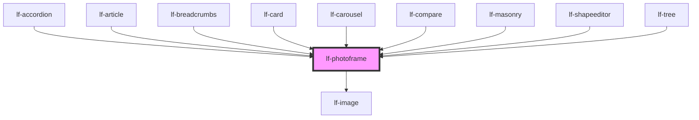

# lf-photoframe

<!-- Auto Generated Below -->

## Overview

Represents an image component that displays a photo or graphic.
The image may be overlaid with text or other elements.

## Properties

| Property        | Attribute      | Description                                                                   | Type                                                                                                                                                                                                                                                                                                                                                                                                                                                                                                                                                                                                                                                                                                                                                                                                                                                                                                                                                                                                                                                                                                                                                                                                                                                                                                                                                                                                                                                                                                                                                                                                                                                                                                                                                                                                                                                                                                                                                                                                                                                                                                                                                                                                                                                                                                                                                                                                                                                                                                                                                                                                                                                                                                                                                                                                           | Default |
| --------------- | -------------- | ----------------------------------------------------------------------------- | -------------------------------------------------------------------------------------------------------------------------------------------------------------------------------------------------------------------------------------------------------------------------------------------------------------------------------------------------------------------------------------------------------------------------------------------------------------------------------------------------------------------------------------------------------------------------------------------------------------------------------------------------------------------------------------------------------------------------------------------------------------------------------------------------------------------------------------------------------------------------------------------------------------------------------------------------------------------------------------------------------------------------------------------------------------------------------------------------------------------------------------------------------------------------------------------------------------------------------------------------------------------------------------------------------------------------------------------------------------------------------------------------------------------------------------------------------------------------------------------------------------------------------------------------------------------------------------------------------------------------------------------------------------------------------------------------------------------------------------------------------------------------------------------------------------------------------------------------------------------------------------------------------------------------------------------------------------------------------------------------------------------------------------------------------------------------------------------------------------------------------------------------------------------------------------------------------------------------------------------------------------------------------------------------------------------------------------------------------------------------------------------------------------------------------------------------------------------------------------------------------------------------------------------------------------------------------------------------------------------------------------------------------------------------------------------------------------------------------------------------------------------------------------------------------------- | ------- |
| `lfOverlay`     | --             | When not empty, this text will be overlayed on the photo - blocking the view. | `LfPhotoframeOverlay`                                                                                                                                                                                                                                                                                                                                                                                                                                                                                                                                                                                                                                                                                                                                                                                                                                                                                                                                                                                                                                                                                                                                                                                                                                                                                                                                                                                                                                                                                                                                                                                                                                                                                                                                                                                                                                                                                                                                                                                                                                                                                                                                                                                                                                                                                                                                                                                                                                                                                                                                                                                                                                                                                                                                                                                          | `null`  |
| `lfPlaceholder` | --             | Html attributes of the picture before the component enters the viewport.      | `{ autocomplete?: any; placeholder?: any; name?: any; id?: any; disabled?: any; class?: any; href?: any; lfAriaLabel?: any; lfLabel?: any; lfLeadingLabel?: any; lfRipple?: any; lfStyle?: any; lfUiSize?: any; lfUiState?: any; lfValue?: any; lfDataset?: any; lfExpanded?: any; lfImageProps?: any; lfPosition?: any; lfIcon?: any; lfIconOff?: any; lfShowSpinner?: any; lfStretchX?: any; lfStretchY?: any; lfStyling?: any; lfToggable?: any; lfTrailingIcon?: any; lfType?: any; lfAutoResize?: any; lfBrush?: any; lfColor?: any; lfCursor?: any; lfOpacity?: any; lfPreview?: any; lfSize?: any; lfStrokeTolerance?: any; lfLayout?: any; lfSizeX?: any; lfSizeY?: any; lfAxis?: any; lfColors?: any; lfLegend?: any; lfSeries?: any; lfTypes?: any; lfXAxis?: any; lfYAxis?: any; lfConfig?: any; lfToolHandlers?: any; lfUploadCallback?: any; lfFlat?: any; lfFadeIn?: any; lfFormat?: any; lfLanguage?: any; lfPreserveSpaces?: any; lfShowCopy?: any; lfShowHeader?: any; lfStickyHeader?: any; lfHtmlAttributes?: any; lfOverlay?: any; lfPlaceholder?: any; lfThreshold?: any; lfAnimated?: any; lfCenteredLabel?: any; lfIsRadial?: any; lfCaptureShortcuts?: any; lfFormatJSON?: any; lfHelper?: any; lfTrailingIconAction?: any; lfDeleteSpeed?: any; lfLoop?: any; lfPause?: any; lfSpeed?: any; lfTag?: any; lfUpdatable?: any; lfEmpty?: any; lfAllowFreeInput?: any; lfCache?: any; lfCacheTTL?: any; lfDebounceMs?: any; lfListProps?: any; lfMaxCacheSize?: any; lfMinChars?: any; lfNavigation?: any; lfSpinnerProps?: any; lfTextfieldProps?: any; lfInteractive?: any; lfMaxItems?: any; lfSeparator?: any; lfShowRoot?: any; lfAutoPlay?: any; lfInterval?: any; lfLightbox?: any; lfShape?: any; lfView?: any; lfDisplay?: any; lfResponsive?: any; lfEnableDeletions?: any; lfFilter?: any; lfSelectable?: any; lfActions?: any; lfCollapseColumns?: any; lfColumns?: any; lfAutosave?: any; lfChipProps?: any; lfMaxHistory?: any; lfMode?: any; lfProps?: any; lfTrigger?: any; lfOrientation?: any; lfLoadCallback?: any; lfMax?: any; lfMin?: any; lfStep?: any; lfAction?: any; lfActionCallback?: any; lfCloseIcon?: any; lfDuration?: any; lfMessage?: any; lfActive?: any; lfBarVariant?: any; lfFader?: any; lfFaderTimeout?: any; lfFullScreen?: any; lfTimeout?: any; lfCloseCallback?: any; lfTimer?: any; lfAccordionLayout?: any; lfExpandedNodeIds?: any; lfInitialExpansionDepth?: any; lfGrid?: any; lfSelectedNodeIds?: any; value?: any; htmlProps?: any; accept?: any; "accept-charset"?: any; alt?: any; autofocus?: any; checked?: any; dataset?: any; max?: any; maxLength?: any; min?: any; minLength?: any; multiple?: any; readonly?: any; role?: any; src?: any; srcset?: any; step?: any; title?: any; type?: any; "aria-"?: any; "data-"?: any; }` | `null`  |
| `lfStyle`       | `lf-style`     | Custom styling for the component.                                             | `string`                                                                                                                                                                                                                                                                                                                                                                                                                                                                                                                                                                                                                                                                                                                                                                                                                                                                                                                                                                                                                                                                                                                                                                                                                                                                                                                                                                                                                                                                                                                                                                                                                                                                                                                                                                                                                                                                                                                                                                                                                                                                                                                                                                                                                                                                                                                                                                                                                                                                                                                                                                                                                                                                                                                                                                                                       | `""`    |
| `lfThreshold`   | `lf-threshold` | Percentage of the component dimensions entering the viewport (0.1 => 1).      | `number`                                                                                                                                                                                                                                                                                                                                                                                                                                                                                                                                                                                                                                                                                                                                                                                                                                                                                                                                                                                                                                                                                                                                                                                                                                                                                                                                                                                                                                                                                                                                                                                                                                                                                                                                                                                                                                                                                                                                                                                                                                                                                                                                                                                                                                                                                                                                                                                                                                                                                                                                                                                                                                                                                                                                                                                                       | `0.25`  |
| `lfValue`       | --             | Html attributes of the picture after the component enters the viewport.       | `{ autocomplete?: any; placeholder?: any; name?: any; id?: any; disabled?: any; class?: any; href?: any; lfAriaLabel?: any; lfLabel?: any; lfLeadingLabel?: any; lfRipple?: any; lfStyle?: any; lfUiSize?: any; lfUiState?: any; lfValue?: any; lfDataset?: any; lfExpanded?: any; lfImageProps?: any; lfPosition?: any; lfIcon?: any; lfIconOff?: any; lfShowSpinner?: any; lfStretchX?: any; lfStretchY?: any; lfStyling?: any; lfToggable?: any; lfTrailingIcon?: any; lfType?: any; lfAutoResize?: any; lfBrush?: any; lfColor?: any; lfCursor?: any; lfOpacity?: any; lfPreview?: any; lfSize?: any; lfStrokeTolerance?: any; lfLayout?: any; lfSizeX?: any; lfSizeY?: any; lfAxis?: any; lfColors?: any; lfLegend?: any; lfSeries?: any; lfTypes?: any; lfXAxis?: any; lfYAxis?: any; lfConfig?: any; lfToolHandlers?: any; lfUploadCallback?: any; lfFlat?: any; lfFadeIn?: any; lfFormat?: any; lfLanguage?: any; lfPreserveSpaces?: any; lfShowCopy?: any; lfShowHeader?: any; lfStickyHeader?: any; lfHtmlAttributes?: any; lfOverlay?: any; lfPlaceholder?: any; lfThreshold?: any; lfAnimated?: any; lfCenteredLabel?: any; lfIsRadial?: any; lfCaptureShortcuts?: any; lfFormatJSON?: any; lfHelper?: any; lfTrailingIconAction?: any; lfDeleteSpeed?: any; lfLoop?: any; lfPause?: any; lfSpeed?: any; lfTag?: any; lfUpdatable?: any; lfEmpty?: any; lfAllowFreeInput?: any; lfCache?: any; lfCacheTTL?: any; lfDebounceMs?: any; lfListProps?: any; lfMaxCacheSize?: any; lfMinChars?: any; lfNavigation?: any; lfSpinnerProps?: any; lfTextfieldProps?: any; lfInteractive?: any; lfMaxItems?: any; lfSeparator?: any; lfShowRoot?: any; lfAutoPlay?: any; lfInterval?: any; lfLightbox?: any; lfShape?: any; lfView?: any; lfDisplay?: any; lfResponsive?: any; lfEnableDeletions?: any; lfFilter?: any; lfSelectable?: any; lfActions?: any; lfCollapseColumns?: any; lfColumns?: any; lfAutosave?: any; lfChipProps?: any; lfMaxHistory?: any; lfMode?: any; lfProps?: any; lfTrigger?: any; lfOrientation?: any; lfLoadCallback?: any; lfMax?: any; lfMin?: any; lfStep?: any; lfAction?: any; lfActionCallback?: any; lfCloseIcon?: any; lfDuration?: any; lfMessage?: any; lfActive?: any; lfBarVariant?: any; lfFader?: any; lfFaderTimeout?: any; lfFullScreen?: any; lfTimeout?: any; lfCloseCallback?: any; lfTimer?: any; lfAccordionLayout?: any; lfExpandedNodeIds?: any; lfInitialExpansionDepth?: any; lfGrid?: any; lfSelectedNodeIds?: any; value?: any; htmlProps?: any; accept?: any; "accept-charset"?: any; alt?: any; autofocus?: any; checked?: any; dataset?: any; max?: any; maxLength?: any; min?: any; minLength?: any; multiple?: any; readonly?: any; role?: any; src?: any; srcset?: any; step?: any; title?: any; type?: any; "aria-"?: any; "data-"?: any; }` | `null`  |

## Events

| Event                 | Description                                                                                                                                                                                    | Type                                    |
| --------------------- | ---------------------------------------------------------------------------------------------------------------------------------------------------------------------------------------------- | --------------------------------------- |
| `lf-photoframe-event` | Fires when the component triggers an internal action or user interaction. The event contains an `eventType` string, which identifies the action, and optionally `data` for additional details. | `CustomEvent<LfPhotoframeEventPayload>` |

## Methods

### `getDebugInfo() => Promise<LfDebugLifecycleInfo>`

Fetches debug information of the component's current state.

#### Returns

Type: `Promise<LfDebugLifecycleInfo>`

A promise that resolves with the debug information object.

### `getProps() => Promise<LfPhotoframePropsInterface>`

Used to retrieve component's properties and descriptions.

#### Returns

Type: `Promise<LfPhotoframePropsInterface>`

Promise resolved with an object containing the component's properties.

### `refresh() => Promise<void>`

This method is used to trigger a new render of the component.

#### Returns

Type: `Promise<void>`

### `unmount(ms?: number) => Promise<void>`

Initiates the unmount sequence, which removes the component from the DOM after a delay.

#### Parameters

| Name | Type     | Description              |
| ---- | -------- | ------------------------ |
| `ms` | `number` | - Number of milliseconds |

#### Returns

Type: `Promise<void>`

## CSS Custom Properties

| Name                                    | Description                                                                                             |
| --------------------------------------- | ------------------------------------------------------------------------------------------------------- |
| `--lf-photoframe-aspect-ratio`          | Aspect ratio for the frame. Defaults to => auto                                                         |
| `--lf-photoframe-border-radius`         | Border radius for the frame. Defaults to => var(--lf-ui-border-radius)                                  |
| `--lf-photoframe-color-bg`              | Background color for overlay. Defaults to => var(--lf-state-bg, var(--lf-color-bg))                     |
| `--lf-photoframe-color-on-bg`           | Text color on overlay. Defaults to => var(--lf-state-on-bg, var(--lf-color-on-bg))                      |
| `--lf-photoframe-color-on-surface`      | Icon color on surface. Defaults to => var(--lf-state-on-surface, var(--lf-color-on-surface))            |
| `--lf-photoframe-color-surface`         | Surface background for icon fallback. Defaults to => var(--lf-state-surface, var(--lf-color-surface))   |
| `--lf-photoframe-description-size`      | Font size for description. Defaults to => 0.875em                                                       |
| `--lf-photoframe-fit`                   | Object fit for the image. Defaults to => cover                                                          |
| `--lf-photoframe-font-family`           | Sets the primary font family for the photoframe component. Defaults to => var(--lf-font-family-primary) |
| `--lf-photoframe-font-size`             | Sets the font size for the photoframe component. Defaults to => var(--lf-font-size)                     |
| `--lf-photoframe-height`                | Height for the frame. Defaults to => auto                                                               |
| `--lf-photoframe-overlay-align`         | Alignment for overlay content. Defaults to => flex-end                                                  |
| `--lf-photoframe-overlay-justify`       | Justify content for overlay. Defaults to => flex-end                                                    |
| `--lf-photoframe-overlay-opacity`       | Opacity for the overlay. Defaults to => 0                                                               |
| `--lf-photoframe-overlay-opacity-hover` | Opacity on hover. Defaults to => 1                                                                      |
| `--lf-photoframe-overlay-padding`       | Padding for overlay content. Defaults to => 1em                                                         |
| `--lf-photoframe-position`              | Object position for the image. Defaults to => center                                                    |
| `--lf-photoframe-title-size`            | Font size for title. Defaults to => 1.125em                                                             |
| `--lf-photoframe-title-weight`          | Font weight for title. Defaults to => 600                                                               |
| `--lf-photoframe-width`                 | Width for the frame. Defaults to => auto                                                                |

## Dependencies

### Used by

 - [lf-accordion](../lf-accordion)
 - [lf-article](../lf-article)
 - [lf-breadcrumbs](../lf-breadcrumbs)
 - [lf-card](../lf-card)
 - [lf-carousel](../lf-carousel)
 - [lf-compare](../lf-compare)
 - [lf-masonry](../lf-masonry)
 - [lf-shapeeditor](../lf-shapeeditor)
 - [lf-tree](../lf-tree)

### Depends on

- [lf-image](../lf-image)

### Graph

```mermaid
graph TD;
  lf-photoframe --> lf-image
  lf-accordion --> lf-photoframe
  lf-article --> lf-photoframe
  lf-breadcrumbs --> lf-photoframe
  lf-card --> lf-photoframe
  lf-carousel --> lf-photoframe
  lf-compare --> lf-photoframe
  lf-masonry --> lf-photoframe
  lf-shapeeditor --> lf-photoframe
  lf-tree --> lf-photoframe
  style lf-photoframe fill:#f9f,stroke:#333,stroke-width:4px
```

----------------------------------------------

*Built with [StencilJS](https://stenciljs.com/)*
