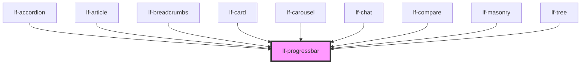

# lf-progressbar

<!-- Auto Generated Below -->

## Overview

A progress bar component that displays the progress of a task or process.
The progress bar may be linear or radial, and may include a label or icon.
The progress bar may be animated and styled according to the theme.

## Properties

| Property          | Attribute           | Description                                                                                                         | Type                                                                                     | Default     |
| ----------------- | ------------------- | ------------------------------------------------------------------------------------------------------------------- | ---------------------------------------------------------------------------------------- | ----------- |
| `lfAnimated`      | `lf-animated`       | Specifies whether the progress bar should display animated stripes.                                                 | `boolean`                                                                                | `false`     |
| `lfCenteredLabel` | `lf-centered-label` | Displays the label in the middle of the progress bar. It's the default for the radial variant and can't be changed. | `boolean`                                                                                | `false`     |
| `lfIcon`          | `lf-icon`           | Specifies an icon to replace the label.                                                                             | `string`                                                                                 | `""`        |
| `lfIsRadial`      | `lf-is-radial`      | Radial version.                                                                                                     | `boolean`                                                                                | `false`     |
| `lfLabel`         | `lf-label`          | Specifies a text for the bar's label.                                                                               | `string`                                                                                 | `""`        |
| `lfStyle`         | `lf-style`          | Custom styling for the component.                                                                                   | `string`                                                                                 | `""`        |
| `lfUiSize`        | `lf-ui-size`        | The size of the component.                                                                                          | `"large" \| "medium" \| "small" \| "xlarge" \| "xsmall" \| "xxlarge" \| "xxsmall"`       | `"medium"`  |
| `lfUiState`       | `lf-ui-state`       | Reflects the specified state color defined by the theme.                                                            | `"danger" \| "disabled" \| "info" \| "primary" \| "secondary" \| "success" \| "warning"` | `"primary"` |
| `lfValue`         | `lf-value`          | The current value the progress bar must display.                                                                    | `number`                                                                                 | `0`         |

## Events

| Event                  | Description                                                                                                                                                                                    | Type                                     |
| ---------------------- | ---------------------------------------------------------------------------------------------------------------------------------------------------------------------------------------------- | ---------------------------------------- |
| `lf-progressbar-event` | Fires when the component triggers an internal action or user interaction. The event contains an `eventType` string, which identifies the action, and optionally `data` for additional details. | `CustomEvent<LfProgressbarEventPayload>` |

## Methods

### `getDebugInfo() => Promise<LfDebugLifecycleInfo>`

Retrieves the debug information reflecting the current state of the component.

#### Returns

Type: `Promise<LfDebugLifecycleInfo>`

A promise that resolves to a LfDebugLifecycleInfo object containing debug information.

### `getProps() => Promise<LfProgressbarPropsInterface>`

Used to retrieve component's properties and descriptions.

#### Returns

Type: `Promise<LfProgressbarPropsInterface>`

Promise resolved with an object containing the component's properties.

### `refresh() => Promise<void>`

Triggers a re-render of the component to reflect any state changes.

#### Returns

Type: `Promise<void>`

### `unmount(ms?: number) => Promise<void>`

Initiates the unmount sequence, which removes the component from the DOM after a delay.

#### Parameters

| Name | Type     | Description              |
| ---- | -------- | ------------------------ |
| `ms` | `number` | - Number of milliseconds |

#### Returns

Type: `Promise<void>`

## CSS Custom Properties

| Name                                | Description                                                                                              |
| ----------------------------------- | -------------------------------------------------------------------------------------------------------- |
| `--lf-progressbar-border-color`     | Sets the border color for the progressbar component. Defaults to => var(--lf-color-border)               |
| `--lf-progressbar-border-radius`    | Sets the border radius for the progressbar component. Defaults to => var(--lf-ui-border-radius)          |
| `--lf-progressbar-color-on-bg`      | Sets the color-on-bg color for the progressbar component. Defaults to => var(--lf-color-on-bg)           |
| `--lf-progressbar-color-on-primary` | Sets the color-on-primary color for the progressbar component. Defaults to => var(--lf-color-on-primary) |
| `--lf-progressbar-color-on-surface` | Sets the color-on-surface color for the progressbar component. Defaults to => var(--lf-color-on-surface) |
| `--lf-progressbar-color-primary`    | Sets the color-primary color for the progressbar component. Defaults to => var(--lf-color-primary)       |
| `--lf-progressbar-color-surface`    | Sets the color-surface color for the progressbar component. Defaults to => var(--lf-color-surface)       |
| `--lf-progressbar-font-family`      | Sets the primary font family for the progressbar component. Defaults to => var(--lf-font-family-primary) |
| `--lf-progressbar-font-size`        | Sets the font size for the progressbar component. Defaults to => var(--lf-font-size)                     |
| `--lf-progressbar-height`           | Sets the height for the progressbar component. Defaults to => 100%                                       |
| `--lf-progressbar-padding`          | Sets the padding for the progressbar component. Defaults to => 1em 0em                                   |
| `--lf-progressbar-width`            | Sets the width for the progressbar component. Defaults to => 100%                                        |

## Dependencies

### Used by

 - [lf-accordion](../lf-accordion)
 - [lf-article](../lf-article)
 - [lf-breadcrumbs](../lf-breadcrumbs)
 - [lf-card](../lf-card)
 - [lf-carousel](../lf-carousel)
 - [lf-chat](../lf-chat)
 - [lf-compare](../lf-compare)
 - [lf-masonry](../lf-masonry)
 - [lf-tree](../lf-tree)

### Graph

----------------------------------------------

*Built with [StencilJS](https://stenciljs.com/)*
