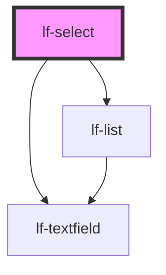

# lf-select

<!-- Auto Generated Below -->

## Overview

The select component provides a dropdown selection interface that combines textfield styling with list functionality.
It displays selected values in a textfield-like appearance and shows available options in a dropdown list.

## Properties

| Property           | Attribute       | Description                                                                                                    | Type                                                                                                                                                                                                                                                                                                                                                                                                                                                                                                                                                                                                                                                                                                                                                                                                                                                                                                                                                                                                                                                                                                                   | Default     |
| ------------------ | --------------- | -------------------------------------------------------------------------------------------------------------- | ---------------------------------------------------------------------------------------------------------------------------------------------------------------------------------------------------------------------------------------------------------------------------------------------------------------------------------------------------------------------------------------------------------------------------------------------------------------------------------------------------------------------------------------------------------------------------------------------------------------------------------------------------------------------------------------------------------------------------------------------------------------------------------------------------------------------------------------------------------------------------------------------------------------------------------------------------------------------------------------------------------------------------------------------------------------------------------------------------------------------- | ----------- |
| `lfDataset`        | --              | Sets the dataset containing the selectable options. This property is immutable after the component has loaded. | `LfDataDataset`                                                                                                                                                                                                                                                                                                                                                                                                                                                                                                                                                                                                                                                                                                                                                                                                                                                                                                                                                                                                                                                                                                        | `null`      |
| `lfListProps`      | --              | Sets the props for the internal lf-list component.                                                             | `{ applyFilter?: (value: string) => Promise<void>; focusNext?: () => Promise<void>; focusPrevious?: () => Promise<void>; getSelected?: () => Promise<LfDataNode>; selectNode?: (idx: number) => Promise<void>; selectNodeById?: (id: string) => Promise<void>; setFilter?: (value: string) => Promise<void>; rootElement?: LfListElement; debugInfo?: LfDebugLifecycleInfo; getDebugInfo?: () => Promise<LfDebugLifecycleInfo>; getProps?: (descriptions?: boolean) => Promise<LfComponentPropsFor<LfComponentName>>; lfStyle?: string; refresh?: () => Promise<void>; unmount?: (ms?: number) => Promise<void>; lfDataset?: LfDataDataset; lfEmpty?: string; lfEnableDeletions?: boolean; lfFilter?: boolean; lfNavigation?: boolean; lfRipple?: boolean; lfSelectable?: boolean; lfUiSize?: "large" \| "medium" \| "small" \| "xlarge" \| "xsmall" \| "xxlarge" \| "xxsmall"; lfUiState?: "danger" \| "disabled" \| "info" \| "primary" \| "secondary" \| "success" \| "warning"; lfValue?: number; }`                                                                                                               | `null`      |
| `lfNavigation`     | `lf-navigation` | Enables keyboard navigation with arrow keys.                                                                   | `boolean`                                                                                                                                                                                                                                                                                                                                                                                                                                                                                                                                                                                                                                                                                                                                                                                                                                                                                                                                                                                                                                                                                                              | `true`      |
| `lfStyle`          | `lf-style`      | Custom CSS styles to apply to the component.                                                                   | `string`                                                                                                                                                                                                                                                                                                                                                                                                                                                                                                                                                                                                                                                                                                                                                                                                                                                                                                                                                                                                                                                                                                               | `null`      |
| `lfTextfieldProps` | --              | Sets the props for the internal lf-textfield component.                                                        | `{ formatJSON?: () => Promise<void>; getElement?: () => Promise<HTMLInputElement \| HTMLTextAreaElement>; getValue?: () => Promise<string>; setBlur?: () => Promise<void>; setFocus?: () => Promise<void>; setValue?: (value: string) => Promise<void>; rootElement?: LfTextfieldElement; debugInfo?: LfDebugLifecycleInfo; getDebugInfo?: () => Promise<LfDebugLifecycleInfo>; getProps?: (descriptions?: boolean) => Promise<LfComponentPropsFor<LfComponentName>>; lfStyle?: string; refresh?: () => Promise<void>; unmount?: (ms?: number) => Promise<void>; lfFormatJSON?: LfTextfieldFormatJSON; lfHelper?: LfTextfieldHelper; lfHtmlAttributes?: Partial<LfFrameworkAllowedKeysMap>; lfIcon?: string; lfLabel?: string; lfStretchY?: boolean; lfStyling?: "flat" \| "outlined" \| "raised" \| "textarea"; lfTrailingIcon?: boolean; lfTrailingIconAction?: LfTextfieldTrailingIconAction; lfUiSize?: "large" \| "medium" \| "small" \| "xlarge" \| "xsmall" \| "xxlarge" \| "xxsmall"; lfUiState?: "danger" \| "disabled" \| "info" \| "primary" \| "secondary" \| "success" \| "warning"; lfValue?: string; }` | `null`      |
| `lfUiSize`         | `lf-ui-size`    | Sets the UI size of the select field.                                                                          | `"large" \| "medium" \| "small" \| "xlarge" \| "xsmall" \| "xxlarge" \| "xxsmall"`                                                                                                                                                                                                                                                                                                                                                                                                                                                                                                                                                                                                                                                                                                                                                                                                                                                                                                                                                                                                                                     | `"medium"`  |
| `lfUiState`        | `lf-ui-state`   | Sets the UI state color of the select field.                                                                   | `"danger" \| "disabled" \| "info" \| "primary" \| "secondary" \| "success" \| "warning"`                                                                                                                                                                                                                                                                                                                                                                                                                                                                                                                                                                                                                                                                                                                                                                                                                                                                                                                                                                                                                               | `"primary"` |
| `lfValue`          | `lf-value`      | Sets the initial selected value. Non-mutable after component load.                                             | `number \| string`                                                                                                                                                                                                                                                                                                                                                                                                                                                                                                                                                                                                                                                                                                                                                                                                                                                                                                                                                                                                                                                                                                     | `null`      |

## Events

| Event             | Description                                                                                                                                                                                    | Type                                |
| ----------------- | ---------------------------------------------------------------------------------------------------------------------------------------------------------------------------------------------- | ----------------------------------- |
| `lf-select-event` | Fires when the component triggers an internal action or user interaction. The event contains an `eventType` string, which identifies the action, and optionally `data` for additional details. | `CustomEvent<LfSelectEventPayload>` |

## Methods

### `getDebugInfo() => Promise<LfDebugLifecycleInfo>`

Returns debug information about the component's current state.

#### Returns

Type: `Promise<LfDebugLifecycleInfo>`

Promise that resolves with debug information

### `getProps() => Promise<LfSelectPropsInterface>`

Retrieves the public props for the component.

#### Returns

Type: `Promise<LfSelectPropsInterface>`

Promise that resolves with the component props

### `getSelectedIndex() => Promise<number>`

Returns the index of the currently selected node in the dataset.

#### Returns

Type: `Promise<number>`

Promise that resolves with the selected index or -1 if none

### `getValue() => Promise<LfDataNode>`

Returns the currently selected node.

#### Returns

Type: `Promise<LfDataNode>`

Promise that resolves with the selected node

### `refresh() => Promise<void>`

Forces a re-render of the component.

#### Returns

Type: `Promise<void>`

### `setValue(id: string) => Promise<void>`

Sets the selected value by id.

#### Parameters

| Name | Type     | Description                    |
| ---- | -------- | ------------------------------ |
| `id` | `string` | - The id of the node to select |

#### Returns

Type: `Promise<void>`

### `unmount(ms?: number) => Promise<void>`

Initiates the unmount sequence.

#### Parameters

| Name | Type     | Description             |
| ---- | -------- | ----------------------- |
| `ms` | `number` | - Delay in milliseconds |

#### Returns

Type: `Promise<void>`

## CSS Custom Properties

| Name                        | Description                                                                                         |
| --------------------------- | --------------------------------------------------------------------------------------------------- |
| `--lf-select-color-primary` | Sets the color-primary color for the select component. Defaults to => var(--lf-color-primary)       |
| `--lf-select-font-family`   | Sets the primary font family for the select component. Defaults to => var(--lf-font-family-primary) |
| `--lf-select-font-size`     | Sets the font size for the select component. Defaults to => var(--lf-font-size)                     |

## Dependencies

### Depends on

- [lf-list](../lf-list)
- [lf-textfield](../lf-textfield)

### Graph

----------------------------------------------

*Built with [StencilJS](https://stenciljs.com/)*
