# lf-imageviewer

<!-- Auto Generated Below -->

## Overview

A universal 4-panel interactive explorer that transforms any LfShape type
into an explorable, configurable, and previewable experience.

The shapeeditor provides:
- Categories panel (masonry) for high-level grouping
- Items panel (tree) for detailed selection and history
- Preview panel (any LfShape) for visual output
- Configuration panel (slot) for parameter editing

## Properties

| Property         | Attribute  | Description                                                                                                                            | Type                                                                                                                                                                                                                                   | Default     |
| ---------------- | ---------- | -------------------------------------------------------------------------------------------------------------------------------------- | -------------------------------------------------------------------------------------------------------------------------------------------------------------------------------------------------------------------------------------- | ----------- |
| `lfDataset`      | --         | The data set for the LF Shapeeditor component. This property is mutable, meaning it can be changed after the component is initialized. | `LfDataDataset`                                                                                                                                                                                                                        | `{}`        |
| `lfLoadCallback` | --         | Callback invoked when the load button is clicked.                                                                                      | `(shapeeditor: LfShapeeditorInterface, dir: string) => Promise<void>`                                                                                                                                                                  | `null`      |
| `lfNavigation`   | --         | Configuration options for the navigation panel.                                                                                        | `LfShapeeditorNavigation`                                                                                                                                                                                                              | `undefined` |
| `lfShape`        | `lf-shape` | The shape type to render in the preview area. Determines which LfShape component is used for preview.                                  | `"accordion" \| "badge" \| "button" \| "canvas" \| "card" \| "chart" \| "chat" \| "chip" \| "code" \| "image" \| "number" \| "photoframe" \| "progressbar" \| "slot" \| "text" \| "textfield" \| "toggle" \| "typewriter" \| "upload"` | `"image"`   |
| `lfStyle`        | `lf-style` | Custom styling for the component.                                                                                                      | `string`                                                                                                                                                                                                                               | `""`        |
| `lfValue`        | --         | Configuration parameters of the detail view.                                                                                           | `LfDataDataset`                                                                                                                                                                                                                        | `{}`        |

## Events

| Event                  | Description                                                                                                                                                                                    | Type                                     |
| ---------------------- | ---------------------------------------------------------------------------------------------------------------------------------------------------------------------------------------------- | ---------------------------------------- |
| `lf-shapeeditor-event` | Fires when the component triggers an internal action or user interaction. The event contains an `eventType` string, which identifies the action, and optionally `data` for additional details. | `CustomEvent<LfShapeeditorEventPayload>` |

## Methods

### `addSnapshot(value: string) => Promise<void>`

Appends a new snapshot to the current shape's history by duplicating it with an updated value.
It has no effect when the current shape is not set.

#### Parameters

| Name    | Type     | Description |
| ------- | -------- | ----------- |
| `value` | `string` |             |

#### Returns

Type: `Promise<void>`

### `clearHistory(index?: number) => Promise<void>`

Clears the history related to the shape identified by the index.
When index is not provided, it clear the full history.

#### Parameters

| Name    | Type     | Description |
| ------- | -------- | ----------- |
| `index` | `number` |             |

#### Returns

Type: `Promise<void>`

### `clearSelection() => Promise<void>`

Clears the currently selected shape.

#### Returns

Type: `Promise<void>`

### `getComponents() => Promise<LfShapeeditorAdapterRefs>`

This method is used to retrieve the references to the subcomponents.

#### Returns

Type: `Promise<LfShapeeditorAdapterRefs>`

### `getCurrentSnapshot() => Promise<{ shape: LfMasonrySelectedShape; value: string; }>`

Fetches the current snapshot.

#### Returns

Type: `Promise<{ shape: LfMasonrySelectedShape; value: string; }>`

A promise that resolves with the current snapshot's object.

### `getDebugInfo() => Promise<LfDebugLifecycleInfo>`

Fetches debug information of the component's current state.

#### Returns

Type: `Promise<LfDebugLifecycleInfo>`

A promise that resolves with the debug information object.

### `getProps() => Promise<LfShapeeditorPropsInterface>`

Used to retrieve component's properties and descriptions.

#### Returns

Type: `Promise<LfShapeeditorPropsInterface>`

Promise resolved with an object containing the component's properties.

### `getSettings() => Promise<LfShapeeditorConfigSettings>`

Returns the current configuration settings.

#### Returns

Type: `Promise<LfShapeeditorConfigSettings>`

The current settings object.

### `refresh() => Promise<void>`

This method is used to trigger a new render of the component.

#### Returns

Type: `Promise<void>`

### `reset() => Promise<void>`

Clears the full history and clears the current selection.

#### Returns

Type: `Promise<void>`

### `setSettings(settings: LfShapeeditorConfigSettings, replace?: boolean) => Promise<void>`

Updates the configuration settings programmatically.

#### Parameters

| Name       | Type                                          | Description                                                       |
| ---------- | --------------------------------------------- | ----------------------------------------------------------------- |
| `settings` | `{ [x: string]: LfShapeeditorControlValue; }` | - The settings to merge or replace.                               |
| `replace`  | `boolean`                                     | - If true, replaces all settings; if false, merges with existing. |

#### Returns

Type: `Promise<void>`

### `setSpinnerStatus(status: boolean) => Promise<void>`

Displays/hides the spinner over the preview.

#### Parameters

| Name     | Type      | Description |
| -------- | --------- | ----------- |
| `status` | `boolean` |             |

#### Returns

Type: `Promise<void>`

### `unmount(ms?: number) => Promise<void>`

Initiates the unmount sequence, which removes the component from the DOM after a delay.

#### Parameters

| Name | Type     | Description              |
| ---- | -------- | ------------------------ |
| `ms` | `number` | - Number of milliseconds |

#### Returns

Type: `Promise<void>`

## CSS Custom Properties

| Name                             | Description                                                                                              |
| -------------------------------- | -------------------------------------------------------------------------------------------------------- |
| `--lf-shapeeditor-border-color`  | Sets the border color for the shapeeditor component. Defaults to => var(--lf-color-border)               |
| `--lf-shapeeditor-border-radius` | Sets the border radius for the shapeeditor component. Defaults to => var(--lf-ui-border-radius)          |
| `--lf-shapeeditor-color-bg`      | Sets the color-bg color for the shapeeditor component. Defaults to => var(--lf-color-bg)                 |
| `--lf-shapeeditor-color-on-bg`   | Sets the color-on-bg color for the shapeeditor component. Defaults to => var(--lf-color-on-bg)           |
| `--lf-shapeeditor-font-family`   | Sets the primary font family for the shapeeditor component. Defaults to => var(--lf-font-family-primary) |
| `--lf-shapeeditor-font-size`     | Sets the font size for the shapeeditor component. Defaults to => var(--lf-font-size)                     |
| `--lf-shapeeditor-nav-width`     | Sets the width for the navigation panel. Defaults to => auto                                             |

## Dependencies

### Depends on

- [lf-button](../lf-button)
- [lf-spinner](../lf-spinner)
- [lf-tree](../lf-tree)
- [lf-accordion](../lf-accordion)
- [lf-checkbox](../lf-checkbox)
- [lf-multiinput](../lf-multiinput)
- [lf-slider](../lf-slider)
- [lf-toggle](../lf-toggle)
- [lf-textfield](../lf-textfield)
- [lf-select](../lf-select)
- [lf-badge](../lf-badge)
- [lf-canvas](../lf-canvas)
- [lf-card](../lf-card)
- [lf-chart](../lf-chart)
- [lf-chat](../lf-chat)
- [lf-chip](../lf-chip)
- [lf-code](../lf-code)
- [lf-image](../lf-image)
- [lf-photoframe](../lf-photoframe)
- [lf-progressbar](../lf-progressbar)
- [lf-typewriter](../lf-typewriter)
- [lf-upload](../lf-upload)
- [lf-masonry](../lf-masonry)

### Graph

```mermaid
graph TD;
  lf-shapeeditor --> lf-button
  lf-shapeeditor --> lf-spinner
  lf-shapeeditor --> lf-tree
  lf-shapeeditor --> lf-accordion
  lf-shapeeditor --> lf-checkbox
  lf-shapeeditor --> lf-multiinput
  lf-shapeeditor --> lf-slider
  lf-shapeeditor --> lf-toggle
  lf-shapeeditor --> lf-textfield
  lf-shapeeditor --> lf-select
  lf-shapeeditor --> lf-badge
  lf-shapeeditor --> lf-canvas
  lf-shapeeditor --> lf-card
  lf-shapeeditor --> lf-chart
  lf-shapeeditor --> lf-chat
  lf-shapeeditor --> lf-chip
  lf-shapeeditor --> lf-code
  lf-shapeeditor --> lf-image
  lf-shapeeditor --> lf-photoframe
  lf-shapeeditor --> lf-progressbar
  lf-shapeeditor --> lf-typewriter
  lf-shapeeditor --> lf-upload
  lf-shapeeditor --> lf-masonry
  lf-button --> lf-list
  lf-button --> lf-spinner
  lf-list --> lf-textfield
  lf-tree --> lf-textfield
  lf-tree --> lf-accordion
  lf-tree --> lf-badge
  lf-tree --> lf-button
  lf-tree --> lf-canvas
  lf-tree --> lf-card
  lf-tree --> lf-chart
  lf-tree --> lf-chat
  lf-tree --> lf-chip
  lf-tree --> lf-code
  lf-tree --> lf-image
  lf-tree --> lf-photoframe
  lf-tree --> lf-progressbar
  lf-tree --> lf-toggle
  lf-tree --> lf-typewriter
  lf-tree --> lf-upload
  lf-accordion --> lf-accordion
  lf-accordion --> lf-badge
  lf-accordion --> lf-button
  lf-accordion --> lf-canvas
  lf-accordion --> lf-card
  lf-accordion --> lf-chart
  lf-accordion --> lf-chat
  lf-accordion --> lf-chip
  lf-accordion --> lf-code
  lf-accordion --> lf-image
  lf-accordion --> lf-photoframe
  lf-accordion --> lf-progressbar
  lf-accordion --> lf-textfield
  lf-accordion --> lf-toggle
  lf-accordion --> lf-typewriter
  lf-accordion --> lf-upload
  lf-badge --> lf-image
  lf-canvas --> lf-image
  lf-card --> lf-accordion
  lf-card --> lf-badge
  lf-card --> lf-button
  lf-card --> lf-canvas
  lf-card --> lf-card
  lf-card --> lf-chart
  lf-card --> lf-chat
  lf-card --> lf-chip
  lf-card --> lf-code
  lf-card --> lf-image
  lf-card --> lf-photoframe
  lf-card --> lf-progressbar
  lf-card --> lf-textfield
  lf-card --> lf-toggle
  lf-card --> lf-typewriter
  lf-card --> lf-upload
  lf-chat --> lf-spinner
  lf-chat --> lf-article
  lf-chat --> lf-accordion
  lf-chat --> lf-button
  lf-chat --> lf-chip
  lf-chat --> lf-textfield
  lf-chat --> lf-progressbar
  lf-chat --> lf-code
  lf-chat --> lf-checkbox
  lf-article --> lf-accordion
  lf-article --> lf-badge
  lf-article --> lf-button
  lf-article --> lf-canvas
  lf-article --> lf-card
  lf-article --> lf-chart
  lf-article --> lf-chat
  lf-article --> lf-chip
  lf-article --> lf-code
  lf-article --> lf-image
  lf-article --> lf-photoframe
  lf-article --> lf-progressbar
  lf-article --> lf-textfield
  lf-article --> lf-toggle
  lf-article --> lf-typewriter
  lf-article --> lf-upload
  lf-code --> lf-button
  lf-photoframe --> lf-image
  lf-multiinput --> lf-chip
  lf-multiinput --> lf-textfield
  lf-select --> lf-list
  lf-select --> lf-textfield
  lf-masonry --> lf-accordion
  lf-masonry --> lf-badge
  lf-masonry --> lf-button
  lf-masonry --> lf-canvas
  lf-masonry --> lf-card
  lf-masonry --> lf-chart
  lf-masonry --> lf-chat
  lf-masonry --> lf-chip
  lf-masonry --> lf-code
  lf-masonry --> lf-image
  lf-masonry --> lf-photoframe
  lf-masonry --> lf-progressbar
  lf-masonry --> lf-textfield
  lf-masonry --> lf-toggle
  lf-masonry --> lf-typewriter
  lf-masonry --> lf-upload
  style lf-shapeeditor fill:#f9f,stroke:#333,stroke-width:4px
```

----------------------------------------------

*Built with [StencilJS](https://stenciljs.com/)*
