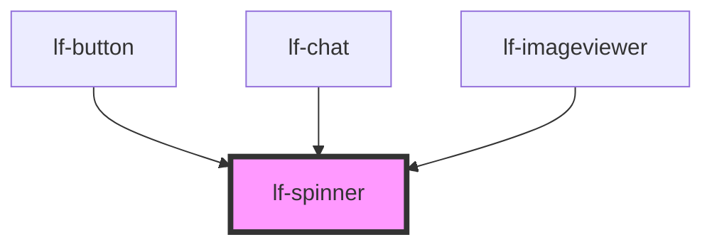

# lf-spinner

<!-- Auto Generated Below -->

## Overview

The spinner component displays a loading animation to indicate that a process is underway.
The spinner may be displayed as a bar or a spinner, and may include a progress bar.

## Properties

| Property         | Attribute          | Description                                                                                    | Type      | Default |
| ---------------- | ------------------ | ---------------------------------------------------------------------------------------------- | --------- | ------- |
| `lfActive`       | `lf-active`        | Specifies if the spinner is animating.                                                         | `boolean` | `false` |
| `lfBarVariant`   | `lf-bar-variant`   | Controls if the component displays as a bar or a spinner.                                      | `boolean` | `false` |
| `lfDimensions`   | `lf-dimensions`    | Defines the width and height of the spinner. In the bar variant, it specifies only the height. | `string`  | `""`    |
| `lfFader`        | `lf-fader`         | Applies a blending modal over the component to darken or lighten the view, based on the theme. | `boolean` | `false` |
| `lfFaderTimeout` | `lf-fader-timeout` | Duration needed for the fader to become active.                                                | `number`  | `3500`  |
| `lfFullScreen`   | `lf-full-screen`   | Fills the entire viewport when enabled.                                                        | `boolean` | `false` |
| `lfLayout`       | `lf-layout`        | Selects the spinner layout.                                                                    | `number`  | `1`     |
| `lfStyle`        | `lf-style`         | Custom styling for the component.                                                              | `string`  | `""`    |
| `lfTimeout`      | `lf-timeout`       | Duration for the progress bar to fill up (in milliseconds).                                    | `number`  | `0`     |

## Events

| Event              | Description | Type                                 |
| ------------------ | ----------- | ------------------------------------ |
| `lf-spinner-event` |             | `CustomEvent<LfSpinnerEventPayload>` |

## Methods

### `getDebugInfo() => Promise<LfDebugLifecycleInfo>`

Fetches debug information of the component's current state.

#### Returns

Type: `Promise<LfDebugLifecycleInfo>`

A promise that resolves with the debug information object.

### `getProps() => Promise<LfSpinnerPropsInterface>`

Used to retrieve component's properties and descriptions.

#### Returns

Type: `Promise<LfSpinnerPropsInterface>`

Promise resolved with an object containing the component's properties.

### `refresh() => Promise<void>`

This method is used to trigger a new render of the component.

#### Returns

Type: `Promise<void>`

### `unmount(ms?: number) => Promise<void>`

Initiates the unmount sequence, which removes the component from the DOM after a delay.

#### Parameters

| Name | Type     | Description              |
| ---- | -------- | ------------------------ |
| `ms` | `number` | - Number of milliseconds |

#### Returns

Type: `Promise<void>`

## CSS Custom Properties

| Name                       | Description                                                                                          |
| -------------------------- | ---------------------------------------------------------------------------------------------------- |
| `--lf-spinner-font-family` | Sets the primary font family for the spinner component. Defaults to => var(--lf-font-family-primary) |
| `--lf-spinner-font-size`   | Sets the font size for the spinner component. Defaults to => var(--lf-font-size)                     |

## Dependencies

### Used by

 - [lf-button](../lf-button)
 - [lf-chat](../lf-chat)
 - [lf-imageviewer](../lf-imageviewer)

### Graph

----------------------------------------------

*Built with [StencilJS](https://stenciljs.com/)*
