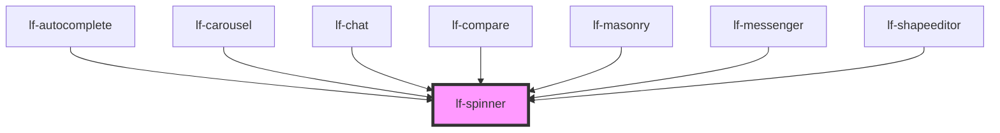

# lf-spinner

<!-- Auto Generated Below -->

## Overview

The spinner component displays a loading animation to indicate that a process is underway.
Multiple layout options are available including ring, dots, bars (equalizer), spinner,
grid, icon (custom), pulse, and wave. A progress bar variant is also supported.

## Properties

| Property         | Attribute          | Description                                                                                                     | Type                                                                                                                                                                                                                                                                                                                                                                                                                                                                                                                                                                                                                                                                                                                                                                                                                                                                                                                                                                                                                                                                                                                                                                                                                                                                                                                                                                                                                                                                                                                                                                                                                                                                                                                                                                                                                                                                                                                                                                                                                                                                                                                                                                                                                                                                                                                                                                                                                                                                                                                                                                                                                                                                                                                                                                                                                                                                                                                                                                                                                                                         | Default     |
| ---------------- | ------------------ | --------------------------------------------------------------------------------------------------------------- | ------------------------------------------------------------------------------------------------------------------------------------------------------------------------------------------------------------------------------------------------------------------------------------------------------------------------------------------------------------------------------------------------------------------------------------------------------------------------------------------------------------------------------------------------------------------------------------------------------------------------------------------------------------------------------------------------------------------------------------------------------------------------------------------------------------------------------------------------------------------------------------------------------------------------------------------------------------------------------------------------------------------------------------------------------------------------------------------------------------------------------------------------------------------------------------------------------------------------------------------------------------------------------------------------------------------------------------------------------------------------------------------------------------------------------------------------------------------------------------------------------------------------------------------------------------------------------------------------------------------------------------------------------------------------------------------------------------------------------------------------------------------------------------------------------------------------------------------------------------------------------------------------------------------------------------------------------------------------------------------------------------------------------------------------------------------------------------------------------------------------------------------------------------------------------------------------------------------------------------------------------------------------------------------------------------------------------------------------------------------------------------------------------------------------------------------------------------------------------------------------------------------------------------------------------------------------------------------------------------------------------------------------------------------------------------------------------------------------------------------------------------------------------------------------------------------------------------------------------------------------------------------------------------------------------------------------------------------------------------------------------------------------------------------------------------ | ----------- |
| `lfActive`       | `lf-active`        | Specifies if the spinner is animating.                                                                          | `boolean`                                                                                                                                                                                                                                                                                                                                                                                                                                                                                                                                                                                                                                                                                                                                                                                                                                                                                                                                                                                                                                                                                                                                                                                                                                                                                                                                                                                                                                                                                                                                                                                                                                                                                                                                                                                                                                                                                                                                                                                                                                                                                                                                                                                                                                                                                                                                                                                                                                                                                                                                                                                                                                                                                                                                                                                                                                                                                                                                                                                                                                                    | `false`     |
| `lfBarVariant`   | `lf-bar-variant`   | Controls if the component displays as a bar or a spinner.                                                       | `boolean`                                                                                                                                                                                                                                                                                                                                                                                                                                                                                                                                                                                                                                                                                                                                                                                                                                                                                                                                                                                                                                                                                                                                                                                                                                                                                                                                                                                                                                                                                                                                                                                                                                                                                                                                                                                                                                                                                                                                                                                                                                                                                                                                                                                                                                                                                                                                                                                                                                                                                                                                                                                                                                                                                                                                                                                                                                                                                                                                                                                                                                                    | `false`     |
| `lfFader`        | `lf-fader`         | Applies a blending modal over the component to darken or lighten the view, based on the theme.                  | `boolean`                                                                                                                                                                                                                                                                                                                                                                                                                                                                                                                                                                                                                                                                                                                                                                                                                                                                                                                                                                                                                                                                                                                                                                                                                                                                                                                                                                                                                                                                                                                                                                                                                                                                                                                                                                                                                                                                                                                                                                                                                                                                                                                                                                                                                                                                                                                                                                                                                                                                                                                                                                                                                                                                                                                                                                                                                                                                                                                                                                                                                                                    | `false`     |
| `lfFaderTimeout` | `lf-fader-timeout` | Duration needed for the fader to become active.                                                                 | `number`                                                                                                                                                                                                                                                                                                                                                                                                                                                                                                                                                                                                                                                                                                                                                                                                                                                                                                                                                                                                                                                                                                                                                                                                                                                                                                                                                                                                                                                                                                                                                                                                                                                                                                                                                                                                                                                                                                                                                                                                                                                                                                                                                                                                                                                                                                                                                                                                                                                                                                                                                                                                                                                                                                                                                                                                                                                                                                                                                                                                                                                     | `3500`      |
| `lfFullScreen`   | `lf-full-screen`   | Fills the entire viewport when enabled.                                                                         | `boolean`                                                                                                                                                                                                                                                                                                                                                                                                                                                                                                                                                                                                                                                                                                                                                                                                                                                                                                                                                                                                                                                                                                                                                                                                                                                                                                                                                                                                                                                                                                                                                                                                                                                                                                                                                                                                                                                                                                                                                                                                                                                                                                                                                                                                                                                                                                                                                                                                                                                                                                                                                                                                                                                                                                                                                                                                                                                                                                                                                                                                                                                    | `false`     |
| `lfIcon`         | `lf-icon`          | Icon to display when using the "icon" layout. The icon will rotate with the spinner animation.                  | `"article" \| "checkbox" \| "code" \| "list" \| "select" \| "upload" \| "id" \| "copy" \| "download" \| "edit" \| "refresh" \| "settings" \| "search" \| "ai" \| "brush" \| "bug" \| "bulb" \| "camera" \| "candle" \| "check" \| "door" \| "droplet" \| "file" \| "flare" \| "folder" \| "forms" \| "help" \| "highlight" \| "history" \| "home" \| "hourglass" \| "ikosaedr" \| "json" \| "key" \| "link" \| "loader" \| "lock" \| "maximize" \| "messages" \| "microphone" \| "moon" \| "movie" \| "music" \| "network" \| "notification" \| "numbers" \| "palette" \| "pdf" \| "photo" \| "progress" \| "replace" \| "robot" \| "schema" \| "send" \| "shirt" \| "skew" \| "sparkles" \| "slideshow" \| "temperature" \| "template" \| "tooltip" \| "wand" \| "writing" \| "x" \| "zip" \| "adjustments-horizontal" \| "alert-triangle" \| "arrow-autofit-content" \| "arrow-back" \| "bell-ringing" \| "brand-facebook" \| "brand-github" \| "brand-github-copilot" \| "brand-instagram" \| "brand-linkedin" \| "brand-npm" \| "brand-reddit" \| "brand-x" \| "calendar-clock" \| "camera-ai" \| "caret-down" \| "caret-left" \| "caret-right" \| "caret-up" \| "chart-column" \| "chart-histogram" \| "chevron-compact-down" \| "chevron-compact-left" \| "chevron-compact-right" \| "chevron-compact-up" \| "chevron-down" \| "chevron-left" \| "chevron-right" \| "chevrons-down" \| "chevrons-left" \| "chevrons-right" \| "chevrons-up" \| "chevron-up" \| "circle-arrow-down" \| "circle-arrow-left" \| "circle-arrow-right" \| "circle-arrow-up" \| "circle-caret-down" \| "circle-caret-left" \| "circle-caret-right" \| "circle-caret-up" \| "circle-chevron-down" \| "circle-chevron-left" \| "circle-chevron-right" \| "circle-chevron-up" \| "circle-x" \| "code-circle-2" \| "color-swatch" \| "columns-2" \| "contrast-2" \| "copy-check" \| "drag-drop" \| "exclamation-circle" \| "filter-search" \| "folder-open" \| "hexagon-alert" \| "hexagon-info" \| "hexagon-minus" \| "hexagon-minus-2" \| "hexagon-photo" \| "hexagon-plus" \| "hexagon-plus-2" \| "hourglass-low" \| "image-in-picture" \| "inner-shadow-bottom" \| "input-search" \| "layout-board-split" \| "layout-list" \| "layout-navbar" \| "layout-navbar-inactive" \| "layout-sidebar" \| "lf-signature" \| "lf-website" \| "link-plus" \| "list-tree" \| "loader-2" \| "loader-3" \| "menu-2" \| "message-circle-user" \| "off-brush" \| "off-hexagon" \| "off-highlight" \| "off-id" \| "off-microphone" \| "off-moon" \| "off-notification" \| "off-palette" \| "off-replace" \| "off-search" \| "off-send" \| "off-template" \| "percentage-60" \| "photo-search" \| "photo-x" \| "picture-in-picture-top" \| "player-record" \| "player-stop" \| "playstation-circle" \| "playstation-square" \| "playstation-triangle" \| "playstation-x" \| "route-2" \| "share-2" \| "square-toggle" \| "square-x" \| "stack-pop" \| "stack-push" \| "stopwatch" \| "sunset-2" \| "terminal-2" \| "time-duration-30" \| "toggle-right" \| "viewport-tall" \| "viewport-wide"` | `undefined` |
| `lfLayout`       | `lf-layout`        | Selects the spinner layout style. Available: "ring", "dots", "bars", "spinner", "grid", "icon", "pulse", "wave" | `"bars" \| "dots" \| "grid" \| "icon" \| "pulse" \| "ring" \| "spinner" \| "wave"`                                                                                                                                                                                                                                                                                                                                                                                                                                                                                                                                                                                                                                                                                                                                                                                                                                                                                                                                                                                                                                                                                                                                                                                                                                                                                                                                                                                                                                                                                                                                                                                                                                                                                                                                                                                                                                                                                                                                                                                                                                                                                                                                                                                                                                                                                                                                                                                                                                                                                                                                                                                                                                                                                                                                                                                                                                                                                                                                                                           | `"ring"`    |
| `lfStyle`        | `lf-style`         | Custom styling for the component.                                                                               | `string`                                                                                                                                                                                                                                                                                                                                                                                                                                                                                                                                                                                                                                                                                                                                                                                                                                                                                                                                                                                                                                                                                                                                                                                                                                                                                                                                                                                                                                                                                                                                                                                                                                                                                                                                                                                                                                                                                                                                                                                                                                                                                                                                                                                                                                                                                                                                                                                                                                                                                                                                                                                                                                                                                                                                                                                                                                                                                                                                                                                                                                                     | `""`        |
| `lfTimeout`      | `lf-timeout`       | Duration for the progress bar to fill up (in milliseconds). Only applies when lfBarVariant is true.             | `number`                                                                                                                                                                                                                                                                                                                                                                                                                                                                                                                                                                                                                                                                                                                                                                                                                                                                                                                                                                                                                                                                                                                                                                                                                                                                                                                                                                                                                                                                                                                                                                                                                                                                                                                                                                                                                                                                                                                                                                                                                                                                                                                                                                                                                                                                                                                                                                                                                                                                                                                                                                                                                                                                                                                                                                                                                                                                                                                                                                                                                                                     | `0`         |
| `lfUiSize`       | `lf-ui-size`       | The size of the component. Controls the spinner dimensions using predefined sizes.                              | `"large" \| "medium" \| "small" \| "xlarge" \| "xsmall" \| "xxlarge" \| "xxsmall"`                                                                                                                                                                                                                                                                                                                                                                                                                                                                                                                                                                                                                                                                                                                                                                                                                                                                                                                                                                                                                                                                                                                                                                                                                                                                                                                                                                                                                                                                                                                                                                                                                                                                                                                                                                                                                                                                                                                                                                                                                                                                                                                                                                                                                                                                                                                                                                                                                                                                                                                                                                                                                                                                                                                                                                                                                                                                                                                                                                           | `"medium"`  |
| `lfUiState`      | `lf-ui-state`      | Reflects the specified state color defined by the theme. Controls the spinner color using theme state colors.   | `"danger" \| "disabled" \| "info" \| "primary" \| "secondary" \| "success" \| "warning"`                                                                                                                                                                                                                                                                                                                                                                                                                                                                                                                                                                                                                                                                                                                                                                                                                                                                                                                                                                                                                                                                                                                                                                                                                                                                                                                                                                                                                                                                                                                                                                                                                                                                                                                                                                                                                                                                                                                                                                                                                                                                                                                                                                                                                                                                                                                                                                                                                                                                                                                                                                                                                                                                                                                                                                                                                                                                                                                                                                     | `"primary"` |

## Events

| Event              | Description                                                                                                                  | Type                                 |
| ------------------ | ---------------------------------------------------------------------------------------------------------------------------- | ------------------------------------ |
| `lf-spinner-event` | Canonical event emitter exposed by the Stencil component instance. Used by adapter dispatchers to centralise event emission. | `CustomEvent<LfSpinnerEventPayload>` |

## Methods

### `getDebugInfo() => Promise<LfDebugLifecycleInfo>`

Fetches debug information of the component's current state.

#### Returns

Type: `Promise<LfDebugLifecycleInfo>`

A promise that resolves with the debug information object.

### `getProgress() => Promise<number>`

Gets the current progress value.

#### Returns

Type: `Promise<number>`

### `getProps() => Promise<LfSpinnerPropsInterface>`

Used to retrieve component's properties and descriptions.

#### Returns

Type: `Promise<LfSpinnerPropsInterface>`

Promise resolved with an object containing the component's properties.

### `refresh() => Promise<void>`

This method is used to trigger a new render of the component.

#### Returns

Type: `Promise<void>`

### `unmount(ms?: number) => Promise<void>`

Initiates the unmount sequence, which removes the component from the DOM after a delay.

#### Parameters

| Name | Type     | Description              |
| ---- | -------- | ------------------------ |
| `ms` | `number` | - Number of milliseconds |

#### Returns

Type: `Promise<void>`

## CSS Custom Properties

| Name                          | Description                                                                                          |
| ----------------------------- | ---------------------------------------------------------------------------------------------------- |
| `--lf-spinner-border-radius`  | Border radius for layout wrapper. Defaults to => 0.5em                                               |
| `--lf-spinner-color-bg`       | Background color for layout wrapper. Defaults to => var(--lf-state-bg, var(--lf-color-bg))           |
| `--lf-spinner-color-on-bg`    | Label text color. Defaults to => var(--lf-state-on-bg, var(--lf-color-on-bg))                        |
| `--lf-spinner-color-primary`  | Primary color for spinner elements. Defaults to => var(--lf-state-primary, var(--lf-color-primary))  |
| `--lf-spinner-font-family`    | Sets the primary font family for the spinner component. Defaults to => var(--lf-font-family-primary) |
| `--lf-spinner-font-size`      | Sets the font size for the spinner component. Defaults to => var(--lf-font-size)                     |
| `--lf-spinner-ring-thickness` | Thickness for ring spinners. Defaults to => 0.35em                                                   |
| `--lf-spinner-size`           | Size for the spinner. Defaults to => 7em                                                             |

## Dependencies

### Used by

 - [lf-autocomplete](../lf-autocomplete)
 - [lf-carousel](../lf-carousel)
 - [lf-chat](../lf-chat)
 - [lf-compare](../lf-compare)
 - [lf-masonry](../lf-masonry)
 - [lf-messenger](../lf-messenger)
 - [lf-shapeeditor](../lf-shapeeditor)

### Graph

```mermaid
graph TD;
  lf-autocomplete --> lf-spinner
  lf-carousel --> lf-spinner
  lf-chat --> lf-spinner
  lf-compare --> lf-spinner
  lf-masonry --> lf-spinner
  lf-messenger --> lf-spinner
  lf-shapeeditor --> lf-spinner
  style lf-spinner fill:#f9f,stroke:#333,stroke-width:4px
```

----------------------------------------------

*Built with [StencilJS](https://stenciljs.com/)*
