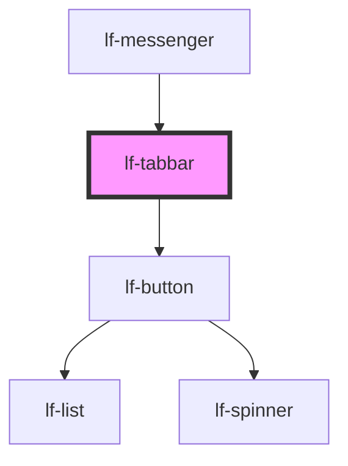

# lf-tabbar

<!-- Auto Generated Below -->

## Overview

Represents the tab bar component, which displays a set of tabs for navigation.
The tab bar may include navigation arrows for overflow tabs and a ripple effect on user interaction.

## Properties

| Property       | Attribute       | Description                                                                                                                       | Type                                                                                     | Default     |
| -------------- | --------------- | --------------------------------------------------------------------------------------------------------------------------------- | ---------------------------------------------------------------------------------------- | ----------- |
| `lfDataset`    | `lf-dataset`    | The data set for the LF Tabbar component. This property is mutable, meaning it can be changed after the component is initialized. | `LfDataDataset`                                                                          | `null`      |
| `lfNavigation` | `lf-navigation` | When set to true, the tabbar will display navigation arrows for overflow tabs.                                                    | `boolean`                                                                                | `false`     |
| `lfRipple`     | `lf-ripple`     | When set to true, the pointerdown event will trigger a ripple effect.                                                             | `boolean`                                                                                | `true`      |
| `lfStyle`      | `lf-style`      | Custom styling for the component.                                                                                                 | `string`                                                                                 | `""`        |
| `lfUiSize`     | `lf-ui-size`    | The size of the component.                                                                                                        | `"large" \| "medium" \| "small" \| "xlarge" \| "xsmall" \| "xxlarge" \| "xxsmall"`       | `"medium"`  |
| `lfUiState`    | `lf-ui-state`   | Reflects the specified state color defined by the theme.                                                                          | `"danger" \| "disabled" \| "info" \| "primary" \| "secondary" \| "success" \| "warning"` | `"primary"` |
| `lfValue`      | `lf-value`      | Sets the initial selected node's index.                                                                                           | `number \| string`                                                                       | `null`      |

## Events

| Event             | Description                                                                                                                                                                                    | Type                                |
| ----------------- | ---------------------------------------------------------------------------------------------------------------------------------------------------------------------------------------------- | ----------------------------------- |
| `lf-tabbar-event` | Fires when the component triggers an internal action or user interaction. The event contains an `eventType` string, which identifies the action, and optionally `data` for additional details. | `CustomEvent<LfTabbarEventPayload>` |

## Methods

### `getDebugInfo() => Promise<LfDebugLifecycleInfo>`

Retrieves the debug information reflecting the current state of the component.

#### Returns

Type: `Promise<LfDebugLifecycleInfo>`

A promise that resolves to a LfDebugLifecycleInfo object containing debug information.

### `getProps() => Promise<LfTabbarPropsInterface>`

Used to retrieve component's properties and descriptions.

#### Returns

Type: `Promise<LfTabbarPropsInterface>`

Promise resolved with an object containing the component's properties.

### `getValue() => Promise<LfTabbarState>`

Returns the selected node and its index.

#### Returns

Type: `Promise<LfTabbarState>`

Selected node and its index.

### `refresh() => Promise<void>`

Triggers a re-render of the component to reflect any state changes.

#### Returns

Type: `Promise<void>`

### `setValue(value: number | string) => Promise<LfTabbarState>`

Sets the value of the component based on the provided argument.

#### Parameters

| Name    | Type               | Description                                    |
| ------- | ------------------ | ---------------------------------------------- |
| `value` | `string \| number` | - The index of the node or the id of the node. |

#### Returns

Type: `Promise<LfTabbarState>`

The newly set value.

### `unmount(ms?: number) => Promise<void>`

Initiates the unmount sequence, which removes the component from the DOM after a delay.

#### Parameters

| Name | Type     | Description              |
| ---- | -------- | ------------------------ |
| `ms` | `number` | - Number of milliseconds |

#### Returns

Type: `Promise<void>`

## CSS Custom Properties

| Name                          | Description                                                                                         |
| ----------------------------- | --------------------------------------------------------------------------------------------------- |
| `--lf-tabbar-border-radius`   | Sets the border radius for the tabbar component. Defaults to => var(--lf-ui-border-radius)          |
| `--lf-tabbar-color-bg`        | Sets the color-bg color for the tabbar component. Defaults to => var(--lf-color-bg)                 |
| `--lf-tabbar-color-indicator` | Sets the color for the tabbar component's indicator. Defaults to => var(--lf-tabbar-color-primary)  |
| `--lf-tabbar-color-on-bg`     | Sets the color-on-bg color for the tabbar component. Defaults to => var(--lf-color-on-bg)           |
| `--lf-tabbar-color-primary`   | Sets the color-primary color for the tabbar component. Defaults to => var(--lf-color-primary)       |
| `--lf-tabbar-font-family`     | Sets the primary font family for the tabbar component. Defaults to => var(--lf-font-family-primary) |
| `--lf-tabbar-font-size`       | Sets the font size for the tabbar component. Defaults to => var(--lf-font-size)                     |
| `--lf-tabbar-height`          | Sets the height for the tabbar component. Defaults to => 2.25em                                     |
| `--lf-tabbar-min-width`       | Sets the min-width for the tabbar component. Defaults to => 5em                                     |
| `--lf-tabbar-padding`         | Sets the padding for the tabbar component. Defaults to => 0 1.25em                                  |

## Dependencies

### Used by

 - [lf-messenger](../lf-messenger)

### Depends on

- [lf-button](../lf-button)

### Graph

----------------------------------------------

*Built with [StencilJS](https://stenciljs.com/)*
