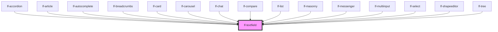

# lf-textfield

<!-- Auto Generated Below -->

## Overview

The text field may include an icon, label, helper text, and a character counter.

## Properties

| Property               | Attribute                 | Description                                                                                                                                                                                                               | Type                                                                                                                                                                                                                                                                                                                                                                                                                                                                                                                                                                                                                                                                                                                                                                                                                                                                                                                                                                                                                                                                                                                                                                                                                                                                                                                                                                                                                                                                                                                                                                                                                                                                                                                                                                                                                                                                                                                                                                                                                                                                                                                                                                                                                                                                                                                                                                                                                                                                                                                                                                                                                                                                                                                                                                                                                                                                                                                                                                                                                                                                                                                                                                                                                                                                                                                                                                                                                                                                                                                                                                                                                                                                                                                                         | Default     |
| ---------------------- | ------------------------- | ------------------------------------------------------------------------------------------------------------------------------------------------------------------------------------------------------------------------- | -------------------------------------------------------------------------------------------------------------------------------------------------------------------------------------------------------------------------------------------------------------------------------------------------------------------------------------------------------------------------------------------------------------------------------------------------------------------------------------------------------------------------------------------------------------------------------------------------------------------------------------------------------------------------------------------------------------------------------------------------------------------------------------------------------------------------------------------------------------------------------------------------------------------------------------------------------------------------------------------------------------------------------------------------------------------------------------------------------------------------------------------------------------------------------------------------------------------------------------------------------------------------------------------------------------------------------------------------------------------------------------------------------------------------------------------------------------------------------------------------------------------------------------------------------------------------------------------------------------------------------------------------------------------------------------------------------------------------------------------------------------------------------------------------------------------------------------------------------------------------------------------------------------------------------------------------------------------------------------------------------------------------------------------------------------------------------------------------------------------------------------------------------------------------------------------------------------------------------------------------------------------------------------------------------------------------------------------------------------------------------------------------------------------------------------------------------------------------------------------------------------------------------------------------------------------------------------------------------------------------------------------------------------------------------------------------------------------------------------------------------------------------------------------------------------------------------------------------------------------------------------------------------------------------------------------------------------------------------------------------------------------------------------------------------------------------------------------------------------------------------------------------------------------------------------------------------------------------------------------------------------------------------------------------------------------------------------------------------------------------------------------------------------------------------------------------------------------------------------------------------------------------------------------------------------------------------------------------------------------------------------------------------------------------------------------------------------------------------------------- | ----------- |
| `lfCaptureShortcuts`   | `lf-capture-shortcuts`    | When enabled, prevents propagation of common keyboard shortcuts (e.g. Ctrl/Cmd + C, V, X, Z, Y, A) from the internal input or textarea to parent components.                                                              | `boolean`                                                                                                                                                                                                                                                                                                                                                                                                                                                                                                                                                                                                                                                                                                                                                                                                                                                                                                                                                                                                                                                                                                                                                                                                                                                                                                                                                                                                                                                                                                                                                                                                                                                                                                                                                                                                                                                                                                                                                                                                                                                                                                                                                                                                                                                                                                                                                                                                                                                                                                                                                                                                                                                                                                                                                                                                                                                                                                                                                                                                                                                                                                                                                                                                                                                                                                                                                                                                                                                                                                                                                                                                                                                                                                                                    | `true`      |
| `lfFormatJSON`         | --                        | Automatically formats textarea content to prettier JSON structure.                                                                                                                                                        | `LfTextfieldFormatJSON`                                                                                                                                                                                                                                                                                                                                                                                                                                                                                                                                                                                                                                                                                                                                                                                                                                                                                                                                                                                                                                                                                                                                                                                                                                                                                                                                                                                                                                                                                                                                                                                                                                                                                                                                                                                                                                                                                                                                                                                                                                                                                                                                                                                                                                                                                                                                                                                                                                                                                                                                                                                                                                                                                                                                                                                                                                                                                                                                                                                                                                                                                                                                                                                                                                                                                                                                                                                                                                                                                                                                                                                                                                                                                                                      | `null`      |
| `lfHelper`             | --                        | Sets the helper text for the text field. The helper text can provide additional information or instructions to the user.                                                                                                  | `LfTextfieldHelper`                                                                                                                                                                                                                                                                                                                                                                                                                                                                                                                                                                                                                                                                                                                                                                                                                                                                                                                                                                                                                                                                                                                                                                                                                                                                                                                                                                                                                                                                                                                                                                                                                                                                                                                                                                                                                                                                                                                                                                                                                                                                                                                                                                                                                                                                                                                                                                                                                                                                                                                                                                                                                                                                                                                                                                                                                                                                                                                                                                                                                                                                                                                                                                                                                                                                                                                                                                                                                                                                                                                                                                                                                                                                                                                          | `null`      |
| `lfHtmlAttributes`     | --                        | Allows customization of the input or textarea element through additional HTML attributes. This can include attributes like 'readonly', 'placeholder', etc., to further customize the behavior or appearance of the input. | `{ disabled?: any; id?: any; class?: any; href?: any; lfHtmlAttributes?: any; lfShowSpinner?: any; lfSizeX?: any; lfSizeY?: any; lfStyle?: any; lfUiState?: any; lfValue?: any; lfLabel?: any; lfRipple?: any; lfFadeIn?: any; lfFormat?: any; lfLanguage?: any; lfPreserveSpaces?: any; lfShowCopy?: any; lfShowHeader?: any; lfStickyHeader?: any; lfUiSize?: any; lfDataset?: any; lfExpanded?: any; lfImageProps?: any; lfPosition?: any; lfAriaLabel?: any; lfIcon?: any; lfIconOff?: any; lfStretchX?: any; lfStretchY?: any; lfStyling?: any; lfToggable?: any; lfTrailingIcon?: any; lfType?: any; lfBrush?: any; lfColor?: any; lfCursor?: any; lfOpacity?: any; lfPreview?: any; lfSize?: any; lfStrokeTolerance?: any; lfLayout?: any; lfAxis?: any; lfColors?: any; lfLegend?: any; lfSeries?: any; lfTypes?: any; lfXAxis?: any; lfYAxis?: any; lfConfig?: any; lfToolHandlers?: any; lfUploadCallback?: any; lfFlat?: any; lfOverlay?: any; lfPlaceholder?: any; lfThreshold?: any; lfAnimated?: any; lfCenteredLabel?: any; lfIsRadial?: any; lfCaptureShortcuts?: any; lfFormatJSON?: any; lfHelper?: any; lfTrailingIconAction?: any; lfLeadingLabel?: any; lfDeleteSpeed?: any; lfLoop?: any; lfPause?: any; lfSpeed?: any; lfTag?: any; lfUpdatable?: any; lfEmpty?: any; lfAllowFreeInput?: any; lfCache?: any; lfCacheTTL?: any; lfDebounceMs?: any; lfListProps?: any; lfMaxCacheSize?: any; lfMinChars?: any; lfNavigation?: any; lfSpinnerProps?: any; lfTextfieldProps?: any; lfInteractive?: any; lfMaxItems?: any; lfSeparator?: any; lfShowRoot?: any; lfAutoPlay?: any; lfInterval?: any; lfLightbox?: any; lfShape?: any; lfView?: any; lfDisplay?: any; lfResponsive?: any; lfLoadCallback?: any; lfEnableDeletions?: any; lfFilter?: any; lfSelectable?: any; lfActions?: any; lfCollapseColumns?: any; lfColumns?: any; lfAutosave?: any; lfChipProps?: any; lfMaxHistory?: any; lfMode?: any; lfProps?: any; lfTrigger?: any; lfOrientation?: any; lfMax?: any; lfMin?: any; lfStep?: any; lfAction?: any; lfActionCallback?: any; lfCloseIcon?: any; lfDuration?: any; lfMessage?: any; lfActive?: any; lfBarVariant?: any; lfDimensions?: any; lfFader?: any; lfFaderTimeout?: any; lfFullScreen?: any; lfTimeout?: any; lfCloseCallback?: any; lfTimer?: any; lfAccordionLayout?: any; lfExpandedNodeIds?: any; lfInitialExpansionDepth?: any; lfGrid?: any; lfSelectedNodeIds?: any; value?: any; htmlProps?: any; accept?: any; "accept-charset"?: any; alt?: any; autocomplete?: any; autofocus?: any; checked?: any; dataset?: any; max?: any; maxLength?: any; min?: any; minLength?: any; multiple?: any; name?: any; placeholder?: any; readonly?: any; role?: any; src?: any; srcset?: any; step?: any; title?: any; type?: any; "aria-"?: any; "data-"?: any; }`                                                                                                                                                                                                                                                                                                                                                                                                                                                                                                                                                                                                                                                                                                                                                                                                                                                                                                                               | `undefined` |
| `lfIcon`               | `lf-icon`                 | Sets the icon to be displayed within the text field.                                                                                                                                                                      | `"copy" \| "download" \| "edit" \| "refresh" \| "settings" \| "search" \| "upload" \| "--lf-icon-add" \| "--lf-icon-attachment" \| "--lf-icon-broken-image" \| "--lf-icon-clear" \| "--lf-icon-copy" \| "--lf-icon-copy-ok" \| "--lf-icon-collapsed" \| "--lf-icon-danger" \| "--lf-icon-delete" \| "--lf-icon-disabled" \| "--lf-icon-download" \| "--lf-icon-dropdown" \| "--lf-icon-edit" \| "--lf-icon-expanded" \| "--lf-icon-image" \| "--lf-icon-info" \| "--lf-icon-loading" \| "--lf-icon-minus" \| "--lf-icon-next" \| "--lf-icon-plus" \| "--lf-icon-previous" \| "--lf-icon-primary" \| "--lf-icon-refresh" \| "--lf-icon-secondary" \| "--lf-icon-settings" \| "--lf-icon-success" \| "--lf-icon-search" \| "--lf-icon-upload" \| "--lf-icon-warning" \| "ai" \| "article" \| "brush" \| "bug" \| "bulb" \| "camera" \| "candle" \| "check" \| "checkbox" \| "code" \| "door" \| "droplet" \| "file" \| "flare" \| "folder" \| "forms" \| "help" \| "highlight" \| "history" \| "home" \| "hourglass" \| "id" \| "ikosaedr" \| "json" \| "key" \| "link" \| "list" \| "loader" \| "lock" \| "maximize" \| "messages" \| "microphone" \| "moon" \| "movie" \| "music" \| "network" \| "notification" \| "numbers" \| "palette" \| "pdf" \| "photo" \| "progress" \| "replace" \| "robot" \| "schema" \| "select" \| "send" \| "shirt" \| "skew" \| "sparkles" \| "slideshow" \| "temperature" \| "template" \| "tooltip" \| "wand" \| "writing" \| "x" \| "zip" \| "adjustments-horizontal" \| "alert-triangle" \| "arrow-autofit-content" \| "arrow-back" \| "bell-ringing" \| "brand-facebook" \| "brand-github" \| "brand-github-copilot" \| "brand-instagram" \| "brand-linkedin" \| "brand-npm" \| "brand-reddit" \| "brand-x" \| "calendar-clock" \| "camera-ai" \| "caret-down" \| "caret-left" \| "caret-right" \| "caret-up" \| "chart-column" \| "chart-histogram" \| "chevron-compact-down" \| "chevron-compact-left" \| "chevron-compact-right" \| "chevron-compact-up" \| "chevron-down" \| "chevron-left" \| "chevron-right" \| "chevrons-down" \| "chevrons-left" \| "chevrons-right" \| "chevrons-up" \| "chevron-up" \| "circle-arrow-down" \| "circle-arrow-left" \| "circle-arrow-right" \| "circle-arrow-up" \| "circle-caret-down" \| "circle-caret-left" \| "circle-caret-right" \| "circle-caret-up" \| "circle-chevron-down" \| "circle-chevron-left" \| "circle-chevron-right" \| "circle-chevron-up" \| "circle-x" \| "code-circle-2" \| "color-swatch" \| "columns-2" \| "contrast-2" \| "copy-check" \| "drag-drop" \| "exclamation-circle" \| "filter-search" \| "folder-open" \| "hexagon-alert" \| "hexagon-info" \| "hexagon-minus" \| "hexagon-minus-2" \| "hexagon-photo" \| "hexagon-plus" \| "hexagon-plus-2" \| "hourglass-low" \| "image-in-picture" \| "inner-shadow-bottom" \| "input-search" \| "layout-board-split" \| "layout-list" \| "layout-navbar" \| "layout-navbar-inactive" \| "layout-sidebar" \| "lf-signature" \| "lf-website" \| "link-plus" \| "list-tree" \| "loader-2" \| "loader-3" \| "menu-2" \| "message-circle-user" \| "off-brush" \| "off-hexagon" \| "off-highlight" \| "off-id" \| "off-microphone" \| "off-moon" \| "off-notification" \| "off-palette" \| "off-replace" \| "off-search" \| "off-send" \| "off-template" \| "percentage-60" \| "photo-search" \| "photo-x" \| "picture-in-picture-top" \| "player-record" \| "player-stop" \| "playstation-circle" \| "playstation-square" \| "playstation-triangle" \| "playstation-x" \| "route-2" \| "share-2" \| "square-toggle" \| "square-x" \| "stack-pop" \| "stack-push" \| "stopwatch" \| "sunset-2" \| "terminal-2" \| "time-duration-30" \| "toggle-right" \| "viewport-tall" \| "viewport-wide"` | `null`      |
| `lfLabel`              | `lf-label`                | Sets the label for the text field.                                                                                                                                                                                        | `string`                                                                                                                                                                                                                                                                                                                                                                                                                                                                                                                                                                                                                                                                                                                                                                                                                                                                                                                                                                                                                                                                                                                                                                                                                                                                                                                                                                                                                                                                                                                                                                                                                                                                                                                                                                                                                                                                                                                                                                                                                                                                                                                                                                                                                                                                                                                                                                                                                                                                                                                                                                                                                                                                                                                                                                                                                                                                                                                                                                                                                                                                                                                                                                                                                                                                                                                                                                                                                                                                                                                                                                                                                                                                                                                                     | `""`        |
| `lfStretchX`           | `lf-stretch-x`            | Sets the text field to fill the available width of its container.                                                                                                                                                         | `boolean`                                                                                                                                                                                                                                                                                                                                                                                                                                                                                                                                                                                                                                                                                                                                                                                                                                                                                                                                                                                                                                                                                                                                                                                                                                                                                                                                                                                                                                                                                                                                                                                                                                                                                                                                                                                                                                                                                                                                                                                                                                                                                                                                                                                                                                                                                                                                                                                                                                                                                                                                                                                                                                                                                                                                                                                                                                                                                                                                                                                                                                                                                                                                                                                                                                                                                                                                                                                                                                                                                                                                                                                                                                                                                                                                    | `false`     |
| `lfStretchY`           | `lf-stretch-y`            | Sets the text field to fill the available height of its container.                                                                                                                                                        | `boolean`                                                                                                                                                                                                                                                                                                                                                                                                                                                                                                                                                                                                                                                                                                                                                                                                                                                                                                                                                                                                                                                                                                                                                                                                                                                                                                                                                                                                                                                                                                                                                                                                                                                                                                                                                                                                                                                                                                                                                                                                                                                                                                                                                                                                                                                                                                                                                                                                                                                                                                                                                                                                                                                                                                                                                                                                                                                                                                                                                                                                                                                                                                                                                                                                                                                                                                                                                                                                                                                                                                                                                                                                                                                                                                                                    | `false`     |
| `lfStyle`              | `lf-style`                | Custom styling for the component.                                                                                                                                                                                         | `string`                                                                                                                                                                                                                                                                                                                                                                                                                                                                                                                                                                                                                                                                                                                                                                                                                                                                                                                                                                                                                                                                                                                                                                                                                                                                                                                                                                                                                                                                                                                                                                                                                                                                                                                                                                                                                                                                                                                                                                                                                                                                                                                                                                                                                                                                                                                                                                                                                                                                                                                                                                                                                                                                                                                                                                                                                                                                                                                                                                                                                                                                                                                                                                                                                                                                                                                                                                                                                                                                                                                                                                                                                                                                                                                                     | `""`        |
| `lfStyling`            | `lf-styling`              | Sets the styling variant for the text field.                                                                                                                                                                              | `"flat" \| "outlined" \| "raised" \| "textarea"`                                                                                                                                                                                                                                                                                                                                                                                                                                                                                                                                                                                                                                                                                                                                                                                                                                                                                                                                                                                                                                                                                                                                                                                                                                                                                                                                                                                                                                                                                                                                                                                                                                                                                                                                                                                                                                                                                                                                                                                                                                                                                                                                                                                                                                                                                                                                                                                                                                                                                                                                                                                                                                                                                                                                                                                                                                                                                                                                                                                                                                                                                                                                                                                                                                                                                                                                                                                                                                                                                                                                                                                                                                                                                             | `"raised"`  |
| `lfTrailingIcon`       | `lf-trailing-icon`        | When enabled, the text field's icon will be displayed on the trailing side.                                                                                                                                               | `boolean`                                                                                                                                                                                                                                                                                                                                                                                                                                                                                                                                                                                                                                                                                                                                                                                                                                                                                                                                                                                                                                                                                                                                                                                                                                                                                                                                                                                                                                                                                                                                                                                                                                                                                                                                                                                                                                                                                                                                                                                                                                                                                                                                                                                                                                                                                                                                                                                                                                                                                                                                                                                                                                                                                                                                                                                                                                                                                                                                                                                                                                                                                                                                                                                                                                                                                                                                                                                                                                                                                                                                                                                                                                                                                                                                    | `false`     |
| `lfTrailingIconAction` | `lf-trailing-icon-action` | Sets a service icon to be displayed on the trailing side for additional actions. This icon is not customizable by consumers and defaults to null (hidden).                                                                | `"--lf-icon-add" \| "--lf-icon-attachment" \| "--lf-icon-broken-image" \| "--lf-icon-clear" \| "--lf-icon-copy" \| "--lf-icon-copy-ok" \| "--lf-icon-collapsed" \| "--lf-icon-danger" \| "--lf-icon-delete" \| "--lf-icon-disabled" \| "--lf-icon-download" \| "--lf-icon-dropdown" \| "--lf-icon-edit" \| "--lf-icon-expanded" \| "--lf-icon-image" \| "--lf-icon-info" \| "--lf-icon-loading" \| "--lf-icon-minus" \| "--lf-icon-next" \| "--lf-icon-plus" \| "--lf-icon-previous" \| "--lf-icon-primary" \| "--lf-icon-refresh" \| "--lf-icon-secondary" \| "--lf-icon-settings" \| "--lf-icon-success" \| "--lf-icon-search" \| "--lf-icon-upload" \| "--lf-icon-warning"`                                                                                                                                                                                                                                                                                                                                                                                                                                                                                                                                                                                                                                                                                                                                                                                                                                                                                                                                                                                                                                                                                                                                                                                                                                                                                                                                                                                                                                                                                                                                                                                                                                                                                                                                                                                                                                                                                                                                                                                                                                                                                                                                                                                                                                                                                                                                                                                                                                                                                                                                                                                                                                                                                                                                                                                                                                                                                                                                                                                                                                                               | `null`      |
| `lfUiSize`             | `lf-ui-size`              | The size of the component.                                                                                                                                                                                                | `"large" \| "medium" \| "small" \| "xlarge" \| "xsmall" \| "xxlarge" \| "xxsmall"`                                                                                                                                                                                                                                                                                                                                                                                                                                                                                                                                                                                                                                                                                                                                                                                                                                                                                                                                                                                                                                                                                                                                                                                                                                                                                                                                                                                                                                                                                                                                                                                                                                                                                                                                                                                                                                                                                                                                                                                                                                                                                                                                                                                                                                                                                                                                                                                                                                                                                                                                                                                                                                                                                                                                                                                                                                                                                                                                                                                                                                                                                                                                                                                                                                                                                                                                                                                                                                                                                                                                                                                                                                                           | `"medium"`  |
| `lfUiState`            | `lf-ui-state`             | Reflects the specified state color defined by the theme.                                                                                                                                                                  | `"danger" \| "disabled" \| "info" \| "primary" \| "secondary" \| "success" \| "warning"`                                                                                                                                                                                                                                                                                                                                                                                                                                                                                                                                                                                                                                                                                                                                                                                                                                                                                                                                                                                                                                                                                                                                                                                                                                                                                                                                                                                                                                                                                                                                                                                                                                                                                                                                                                                                                                                                                                                                                                                                                                                                                                                                                                                                                                                                                                                                                                                                                                                                                                                                                                                                                                                                                                                                                                                                                                                                                                                                                                                                                                                                                                                                                                                                                                                                                                                                                                                                                                                                                                                                                                                                                                                     | `"primary"` |
| `lfValue`              | `lf-value`                | Sets the initial value of the text field.                                                                                                                                                                                 | `string`                                                                                                                                                                                                                                                                                                                                                                                                                                                                                                                                                                                                                                                                                                                                                                                                                                                                                                                                                                                                                                                                                                                                                                                                                                                                                                                                                                                                                                                                                                                                                                                                                                                                                                                                                                                                                                                                                                                                                                                                                                                                                                                                                                                                                                                                                                                                                                                                                                                                                                                                                                                                                                                                                                                                                                                                                                                                                                                                                                                                                                                                                                                                                                                                                                                                                                                                                                                                                                                                                                                                                                                                                                                                                                                                     | `""`        |

## Events

| Event                | Description                                                                                                                                                                                    | Type                                   |
| -------------------- | ---------------------------------------------------------------------------------------------------------------------------------------------------------------------------------------------- | -------------------------------------- |
| `lf-textfield-event` | Fires when the component triggers an internal action or user interaction. The event contains an `eventType` string, which identifies the action, and optionally `data` for additional details. | `CustomEvent<LfTextfieldEventPayload>` |

## Methods

### `formatJSON() => Promise<void>`

Formats the content of the textarea as JSON programmatically and on-demand.

#### Returns

Type: `Promise<void>`

### `getDebugInfo() => Promise<LfDebugLifecycleInfo>`

Fetches debug information of the component's current state.

#### Returns

Type: `Promise<LfDebugLifecycleInfo>`

A promise that resolves with the debug information object.

### `getElement() => Promise<HTMLTextAreaElement | HTMLInputElement>`

Fetches the HTML element of the component.

#### Returns

Type: `Promise<HTMLInputElement | HTMLTextAreaElement>`

A promise that resolves with the component's root HTML element.

### `getProps() => Promise<LfTextfieldPropsInterface>`

Used to retrieve component's properties and descriptions.

#### Returns

Type: `Promise<LfTextfieldPropsInterface>`

Promise resolved with an object containing the component's properties.

### `getValue() => Promise<string>`

Used to retrieve the component's current state.

#### Returns

Type: `Promise<string>`

Promise resolved with the current state of the component.

### `refresh() => Promise<void>`

This method is used to trigger a new render of the component.

#### Returns

Type: `Promise<void>`

### `setBlur() => Promise<void>`

Blurs the input element.

#### Returns

Type: `Promise<void>`

### `setFocus() => Promise<void>`

Focuses the input element.

#### Returns

Type: `Promise<void>`

### `setValue(value: string) => Promise<void>`

Sets the component's state.

#### Parameters

| Name    | Type     | Description                                 |
| ------- | -------- | ------------------------------------------- |
| `value` | `string` | - The new state to be set on the component. |

#### Returns

Type: `Promise<void>`

### `unmount(ms?: number) => Promise<void>`

Initiates the unmount sequence, which removes the component from the DOM after a delay.

#### Parameters

| Name | Type     | Description              |
| ---- | -------- | ------------------------ |
| `ms` | `number` | - Number of milliseconds |

#### Returns

Type: `Promise<void>`

## CSS Custom Properties

| Name                                 | Description                                                                                            |
| ------------------------------------ | ------------------------------------------------------------------------------------------------------ |
| `--lf-textfield-border-color`        | Sets the border color for the textfield component. Defaults to => var(--lf-color-border)               |
| `--lf-textfield-border-radius`       | Sets the border radius for the textfield component. Defaults to => var(--lf-ui-border-radius)          |
| `--lf-textfield-color-on-bg`         | Sets the color-on-bg color for the textfield component. Defaults to => var(--lf-color-on-bg)           |
| `--lf-textfield-color-primary`       | Sets the color-primary color for the textfield component. Defaults to => var(--lf-color-primary)       |
| `--lf-textfield-color-surface`       | Sets the color-surface color for the textfield component. Defaults to => var(--lf-color-surface)       |
| `--lf-textfield-font-family`         | Sets the primary font family for the textfield component. Defaults to => var(--lf-font-family-primary) |
| `--lf-textfield-font-size`           | Sets the font size for the textfield component. Defaults to => var(--lf-font-size)                     |
| `--lf-textfield-height`              | Sets the height for the textfield component. Defaults to => 3.5em                                      |
| `--lf-textfield-icon-action-padding` | Sets the padding for the textfield action icon. Defaults to => 0 0.75em 0 0                            |
| `--lf-textfield-icon-padding`        | Sets the padding for the textfield icon. Defaults to => 0 0 0 0.75em                                   |
| `--lf-textfield-input-cursor`        | Sets the cursor for the textfield input. Defaults to => text                                           |
| `--lf-textfield-padding`             | Sets the padding for the textfield component. Defaults to => 0 1em                                     |

## Dependencies

### Used by

 - [lf-accordion](../lf-accordion)
 - [lf-article](../lf-article)
 - [lf-autocomplete](../lf-autocomplete)
 - [lf-breadcrumbs](../lf-breadcrumbs)
 - [lf-card](../lf-card)
 - [lf-carousel](../lf-carousel)
 - [lf-chat](../lf-chat)
 - [lf-compare](../lf-compare)
 - [lf-list](../lf-list)
 - [lf-masonry](../lf-masonry)
 - [lf-messenger](../lf-messenger)
 - [lf-multiinput](../lf-multiinput)
 - [lf-select](../lf-select)
 - [lf-shapeeditor](../lf-shapeeditor)
 - [lf-tree](../lf-tree)

### Graph

----------------------------------------------

*Built with [StencilJS](https://stenciljs.com/)*
