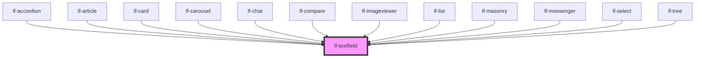

# lf-textfield

<!-- Auto Generated Below -->

## Overview

The text field may include an icon, label, helper text, and a character counter.

## Properties

| Property           | Attribute          | Description                                                                                                                                                                                                               | Type                                                                                                                                                                                                                                                                                                                                                                                                                                                                                                                                                                                                                                                                                                                                                                                                                                                                                                                                                                                                                                                                                                                                                                                                                                                                                                                                                                                                                                                                                                                                                                                                                                                                                                                                                                                                                                                                                                                                                                                                                                                                                                                                                                                                                                                                                                                                                                                                                                                                                                                                                                                                                                                                            | Default     |
| ------------------ | ------------------ | ------------------------------------------------------------------------------------------------------------------------------------------------------------------------------------------------------------------------- | ------------------------------------------------------------------------------------------------------------------------------------------------------------------------------------------------------------------------------------------------------------------------------------------------------------------------------------------------------------------------------------------------------------------------------------------------------------------------------------------------------------------------------------------------------------------------------------------------------------------------------------------------------------------------------------------------------------------------------------------------------------------------------------------------------------------------------------------------------------------------------------------------------------------------------------------------------------------------------------------------------------------------------------------------------------------------------------------------------------------------------------------------------------------------------------------------------------------------------------------------------------------------------------------------------------------------------------------------------------------------------------------------------------------------------------------------------------------------------------------------------------------------------------------------------------------------------------------------------------------------------------------------------------------------------------------------------------------------------------------------------------------------------------------------------------------------------------------------------------------------------------------------------------------------------------------------------------------------------------------------------------------------------------------------------------------------------------------------------------------------------------------------------------------------------------------------------------------------------------------------------------------------------------------------------------------------------------------------------------------------------------------------------------------------------------------------------------------------------------------------------------------------------------------------------------------------------------------------------------------------------------------------------------------------------- | ----------- |
| `lfFormatJSON`     | --                 | Automatically formats textarea content to prettier JSON structure.                                                                                                                                                        | `LfTextfieldFormatJSON`                                                                                                                                                                                                                                                                                                                                                                                                                                                                                                                                                                                                                                                                                                                                                                                                                                                                                                                                                                                                                                                                                                                                                                                                                                                                                                                                                                                                                                                                                                                                                                                                                                                                                                                                                                                                                                                                                                                                                                                                                                                                                                                                                                                                                                                                                                                                                                                                                                                                                                                                                                                                                                                         | `null`      |
| `lfHelper`         | --                 | Sets the helper text for the text field. The helper text can provide additional information or instructions to the user.                                                                                                  | `LfTextfieldHelper`                                                                                                                                                                                                                                                                                                                                                                                                                                                                                                                                                                                                                                                                                                                                                                                                                                                                                                                                                                                                                                                                                                                                                                                                                                                                                                                                                                                                                                                                                                                                                                                                                                                                                                                                                                                                                                                                                                                                                                                                                                                                                                                                                                                                                                                                                                                                                                                                                                                                                                                                                                                                                                                             | `null`      |
| `lfHtmlAttributes` | --                 | Allows customization of the input or textarea element through additional HTML attributes. This can include attributes like 'readonly', 'placeholder', etc., to further customize the behavior or appearance of the input. | `{ lfImageProps?: any; lfLabel?: any; lfPosition?: any; lfStyle?: any; lfUiSize?: any; lfUiState?: any; lfAriaLabel?: any; lfDataset?: any; lfIcon?: any; lfIconOff?: any; lfRipple?: any; lfShowSpinner?: any; lfStretchX?: any; lfStretchY?: any; lfStyling?: any; lfToggable?: any; lfTrailingIcon?: any; lfType?: any; lfValue?: any; lfBrush?: any; lfColor?: any; lfCursor?: any; lfOpacity?: any; lfPreview?: any; lfSize?: any; lfStrokeTolerance?: any; lfLayout?: any; lfSizeX?: any; lfSizeY?: any; lfAxis?: any; lfColors?: any; lfLegend?: any; lfSeries?: any; lfTypes?: any; lfXAxis?: any; lfYAxis?: any; lfConfig?: any; lfAttachmentUploadTimeout?: any; lfContextWindow?: any; lfEmpty?: any; lfEndpointUrl?: any; lfFrequencyPenalty?: any; lfMaxTokens?: any; lfPollingInterval?: any; lfPresencePenalty?: any; lfSeed?: any; lfSystem?: any; lfTemperature?: any; lfTools?: any; lfTopP?: any; lfUploadCallback?: any; lfFlat?: any; lfFadeIn?: any; lfFormat?: any; lfLanguage?: any; lfPreserveSpaces?: any; lfShowCopy?: any; lfShowHeader?: any; lfStickyHeader?: any; lfHtmlAttributes?: any; lfMode?: any; lfOverlay?: any; lfPlaceholder?: any; lfThreshold?: any; lfAnimated?: any; lfCenteredLabel?: any; lfIsRadial?: any; lfFormatJSON?: any; lfHelper?: any; lfLeadingLabel?: any; lfDeleteSpeed?: any; lfLoop?: any; lfPause?: any; lfSpeed?: any; lfTag?: any; lfUpdatable?: any; disabled?: any; lfAutoPlay?: any; lfInterval?: any; lfLightbox?: any; lfNavigation?: any; lfShape?: any; lfView?: any; lfDisplay?: any; lfResponsive?: any; lfLoadCallback?: any; lfEnableDeletions?: any; lfFilter?: any; lfFilterPlaceholder?: any; lfSelectable?: any; lfActions?: any; lfCollapseColumns?: any; lfColumns?: any; lfAutosave?: any; lfProps?: any; lfTrigger?: any; lfOrientation?: any; lfListProps?: any; lfTextfieldProps?: any; lfMax?: any; lfMin?: any; lfStep?: any; lfActive?: any; lfBarVariant?: any; lfDimensions?: any; lfFader?: any; lfFaderTimeout?: any; lfFullScreen?: any; lfTimeout?: any; lfCloseCallback?: any; lfCloseIcon?: any; lfMessage?: any; lfTimer?: any; lfAccordionLayout?: any; lfExpandedNodeIds?: any; lfInitialExpansionDepth?: any; lfGrid?: any; lfSelectedNodeIds?: any; value?: any; htmlProps?: any; accept?: any; "accept-charset"?: any; alt?: any; autocomplete?: any; autofocus?: any; checked?: any; class?: any; dataset?: any; href?: any; id?: any; max?: any; maxLength?: any; min?: any; minLength?: any; multiple?: any; name?: any; placeholder?: any; readonly?: any; role?: any; src?: any; srcset?: any; step?: any; title?: any; type?: any; "aria-"?: any; "data-"?: any; }` | `undefined` |
| `lfIcon`           | `lf-icon`          | Sets the icon to be displayed within the text field.                                                                                                                                                                      | `string`                                                                                                                                                                                                                                                                                                                                                                                                                                                                                                                                                                                                                                                                                                                                                                                                                                                                                                                                                                                                                                                                                                                                                                                                                                                                                                                                                                                                                                                                                                                                                                                                                                                                                                                                                                                                                                                                                                                                                                                                                                                                                                                                                                                                                                                                                                                                                                                                                                                                                                                                                                                                                                                                        | `""`        |
| `lfLabel`          | `lf-label`         | Sets the label for the text field.                                                                                                                                                                                        | `string`                                                                                                                                                                                                                                                                                                                                                                                                                                                                                                                                                                                                                                                                                                                                                                                                                                                                                                                                                                                                                                                                                                                                                                                                                                                                                                                                                                                                                                                                                                                                                                                                                                                                                                                                                                                                                                                                                                                                                                                                                                                                                                                                                                                                                                                                                                                                                                                                                                                                                                                                                                                                                                                                        | `""`        |
| `lfStretchX`       | `lf-stretch-x`     | Sets the text field to fill the available width of its container.                                                                                                                                                         | `boolean`                                                                                                                                                                                                                                                                                                                                                                                                                                                                                                                                                                                                                                                                                                                                                                                                                                                                                                                                                                                                                                                                                                                                                                                                                                                                                                                                                                                                                                                                                                                                                                                                                                                                                                                                                                                                                                                                                                                                                                                                                                                                                                                                                                                                                                                                                                                                                                                                                                                                                                                                                                                                                                                                       | `false`     |
| `lfStretchY`       | `lf-stretch-y`     | Sets the text field to fill the available height of its container.                                                                                                                                                        | `boolean`                                                                                                                                                                                                                                                                                                                                                                                                                                                                                                                                                                                                                                                                                                                                                                                                                                                                                                                                                                                                                                                                                                                                                                                                                                                                                                                                                                                                                                                                                                                                                                                                                                                                                                                                                                                                                                                                                                                                                                                                                                                                                                                                                                                                                                                                                                                                                                                                                                                                                                                                                                                                                                                                       | `false`     |
| `lfStyle`          | `lf-style`         | Custom styling for the component.                                                                                                                                                                                         | `string`                                                                                                                                                                                                                                                                                                                                                                                                                                                                                                                                                                                                                                                                                                                                                                                                                                                                                                                                                                                                                                                                                                                                                                                                                                                                                                                                                                                                                                                                                                                                                                                                                                                                                                                                                                                                                                                                                                                                                                                                                                                                                                                                                                                                                                                                                                                                                                                                                                                                                                                                                                                                                                                                        | `""`        |
| `lfStyling`        | `lf-styling`       | Sets the styling variant for the text field.                                                                                                                                                                              | `"flat" \| "outlined" \| "raised" \| "textarea"`                                                                                                                                                                                                                                                                                                                                                                                                                                                                                                                                                                                                                                                                                                                                                                                                                                                                                                                                                                                                                                                                                                                                                                                                                                                                                                                                                                                                                                                                                                                                                                                                                                                                                                                                                                                                                                                                                                                                                                                                                                                                                                                                                                                                                                                                                                                                                                                                                                                                                                                                                                                                                                | `"raised"`  |
| `lfTrailingIcon`   | `lf-trailing-icon` | When enabled, the text field's icon will be displayed on the trailing side.                                                                                                                                               | `boolean`                                                                                                                                                                                                                                                                                                                                                                                                                                                                                                                                                                                                                                                                                                                                                                                                                                                                                                                                                                                                                                                                                                                                                                                                                                                                                                                                                                                                                                                                                                                                                                                                                                                                                                                                                                                                                                                                                                                                                                                                                                                                                                                                                                                                                                                                                                                                                                                                                                                                                                                                                                                                                                                                       | `false`     |
| `lfUiSize`         | `lf-ui-size`       | The size of the component.                                                                                                                                                                                                | `"large" \| "medium" \| "small" \| "xlarge" \| "xsmall" \| "xxlarge" \| "xxsmall"`                                                                                                                                                                                                                                                                                                                                                                                                                                                                                                                                                                                                                                                                                                                                                                                                                                                                                                                                                                                                                                                                                                                                                                                                                                                                                                                                                                                                                                                                                                                                                                                                                                                                                                                                                                                                                                                                                                                                                                                                                                                                                                                                                                                                                                                                                                                                                                                                                                                                                                                                                                                              | `"medium"`  |
| `lfUiState`        | `lf-ui-state`      | Reflects the specified state color defined by the theme.                                                                                                                                                                  | `"danger" \| "disabled" \| "info" \| "primary" \| "secondary" \| "success" \| "warning"`                                                                                                                                                                                                                                                                                                                                                                                                                                                                                                                                                                                                                                                                                                                                                                                                                                                                                                                                                                                                                                                                                                                                                                                                                                                                                                                                                                                                                                                                                                                                                                                                                                                                                                                                                                                                                                                                                                                                                                                                                                                                                                                                                                                                                                                                                                                                                                                                                                                                                                                                                                                        | `"primary"` |
| `lfValue`          | `lf-value`         | Sets the initial value of the text field.                                                                                                                                                                                 | `string`                                                                                                                                                                                                                                                                                                                                                                                                                                                                                                                                                                                                                                                                                                                                                                                                                                                                                                                                                                                                                                                                                                                                                                                                                                                                                                                                                                                                                                                                                                                                                                                                                                                                                                                                                                                                                                                                                                                                                                                                                                                                                                                                                                                                                                                                                                                                                                                                                                                                                                                                                                                                                                                                        | `""`        |

## Events

| Event                | Description                                                                                                                                                                                    | Type                                   |
| -------------------- | ---------------------------------------------------------------------------------------------------------------------------------------------------------------------------------------------- | -------------------------------------- |
| `lf-textfield-event` | Fires when the component triggers an internal action or user interaction. The event contains an `eventType` string, which identifies the action, and optionally `data` for additional details. | `CustomEvent<LfTextfieldEventPayload>` |

## Methods

### `formatJSON() => Promise<void>`

Formats the content of the textarea as JSON programmatically and on-demand.

#### Returns

Type: `Promise<void>`

### `getDebugInfo() => Promise<LfDebugLifecycleInfo>`

Fetches debug information of the component's current state.

#### Returns

Type: `Promise<LfDebugLifecycleInfo>`

A promise that resolves with the debug information object.

### `getElement() => Promise<HTMLTextAreaElement | HTMLInputElement>`

Fetches the HTML element of the component.

#### Returns

Type: `Promise<HTMLInputElement | HTMLTextAreaElement>`

A promise that resolves with the component's root HTML element.

### `getProps() => Promise<LfTextfieldPropsInterface>`

Used to retrieve component's properties and descriptions.

#### Returns

Type: `Promise<LfTextfieldPropsInterface>`

Promise resolved with an object containing the component's properties.

### `getValue() => Promise<string>`

Used to retrieve the component's current state.

#### Returns

Type: `Promise<string>`

Promise resolved with the current state of the component.

### `refresh() => Promise<void>`

This method is used to trigger a new render of the component.

#### Returns

Type: `Promise<void>`

### `setBlur() => Promise<void>`

Blurs the input element.

#### Returns

Type: `Promise<void>`

### `setFocus() => Promise<void>`

Focuses the input element.

#### Returns

Type: `Promise<void>`

### `setValue(value: string) => Promise<void>`

Sets the component's state.

#### Parameters

| Name    | Type     | Description                                 |
| ------- | -------- | ------------------------------------------- |
| `value` | `string` | - The new state to be set on the component. |

#### Returns

Type: `Promise<void>`

### `unmount(ms?: number) => Promise<void>`

Initiates the unmount sequence, which removes the component from the DOM after a delay.

#### Parameters

| Name | Type     | Description              |
| ---- | -------- | ------------------------ |
| `ms` | `number` | - Number of milliseconds |

#### Returns

Type: `Promise<void>`

## CSS Custom Properties

| Name                           | Description                                                                                            |
| ------------------------------ | ------------------------------------------------------------------------------------------------------ |
| `--lf-textfield-border-color`  | Sets the border color for the textfield component. Defaults to => var(--lf-color-border)               |
| `--lf-textfield-border-radius` | Sets the border radius for the textfield component. Defaults to => var(--lf-ui-border-radius)          |
| `--lf-textfield-color-on-bg`   | Sets the color-on-bg color for the textfield component. Defaults to => var(--lf-color-on-bg)           |
| `--lf-textfield-color-primary` | Sets the color-primary color for the textfield component. Defaults to => var(--lf-color-primary)       |
| `--lf-textfield-color-surface` | Sets the color-surface color for the textfield component. Defaults to => var(--lf-color-surface)       |
| `--lf-textfield-font-family`   | Sets the primary font family for the textfield component. Defaults to => var(--lf-font-family-primary) |
| `--lf-textfield-font-size`     | Sets the font size for the textfield component. Defaults to => var(--lf-font-size)                     |
| `--lf-textfield-height`        | Sets the height for the textfield component. Defaults to => 3.5em                                      |
| `--lf-textfield-padding`       | Sets the padding for the textfield component. Defaults to => 0 1em                                     |

## Dependencies

### Used by

 - [lf-accordion](../lf-accordion)
 - [lf-article](../lf-article)
 - [lf-card](../lf-card)
 - [lf-carousel](../lf-carousel)
 - [lf-chat](../lf-chat)
 - [lf-compare](../lf-compare)
 - [lf-imageviewer](../lf-imageviewer)
 - [lf-list](../lf-list)
 - [lf-masonry](../lf-masonry)
 - [lf-messenger](../lf-messenger)
 - [lf-select](../lf-select)
 - [lf-tree](../lf-tree)

### Graph

----------------------------------------------

*Built with [StencilJS](https://stenciljs.com/)*
