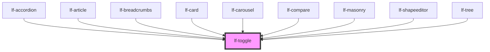

# lf-toggle

<!-- Auto Generated Below -->

## Overview

The toggle component is a switch that can be toggled on or off.
The toggle may include a label to provide context for the user.
The toggle may also include a ripple effect when clicked.

## Properties

| Property         | Attribute          | Description                                                                                                                                               | Type                                                                                     | Default     |
| ---------------- | ------------------ | --------------------------------------------------------------------------------------------------------------------------------------------------------- | ---------------------------------------------------------------------------------------- | ----------- |
| `lfAriaLabel`    | `lf-aria-label`    | Explicit accessible label for the toggle control. Fallback chain when empty: lfLabel -> root element id -> 'toggle'. Applied to the native input element. | `string`                                                                                 | `""`        |
| `lfLabel`        | `lf-label`         | Defines text to display along with the toggle.                                                                                                            | `string`                                                                                 | `""`        |
| `lfLeadingLabel` | `lf-leading-label` | Defaults at false. When set to true, the label will be displayed before the component.                                                                    | `boolean`                                                                                | `false`     |
| `lfRipple`       | `lf-ripple`        | When set to true, the pointerdown event will trigger a ripple effect.                                                                                     | `boolean`                                                                                | `true`      |
| `lfStyle`        | `lf-style`         | Custom styling for the component.                                                                                                                         | `string`                                                                                 | `""`        |
| `lfUiSize`       | `lf-ui-size`       | The size of the component.                                                                                                                                | `"large" \| "medium" \| "small" \| "xlarge" \| "xsmall" \| "xxlarge" \| "xxsmall"`       | `"medium"`  |
| `lfUiState`      | `lf-ui-state`      | Reflects the specified state color defined by the theme.                                                                                                  | `"danger" \| "disabled" \| "info" \| "primary" \| "secondary" \| "success" \| "warning"` | `"primary"` |
| `lfValue`        | `lf-value`         | Sets the initial boolean state of the toggle.                                                                                                             | `boolean`                                                                                | `false`     |

## Events

| Event             | Description                                                                                                                                                                                    | Type                                |
| ----------------- | ---------------------------------------------------------------------------------------------------------------------------------------------------------------------------------------------- | ----------------------------------- |
| `lf-toggle-event` | Fires when the component triggers an internal action or user interaction. The event contains an `eventType` string, which identifies the action, and optionally `data` for additional details. | `CustomEvent<LfToggleEventPayload>` |

## Methods

### `getDebugInfo() => Promise<LfDebugLifecycleInfo>`

Fetches debug information of the component's current state.

#### Returns

Type: `Promise<LfDebugLifecycleInfo>`

A promise that resolves with the debug information object.

### `getProps() => Promise<LfTogglePropsInterface>`

Used to retrieve component's properties and descriptions.

#### Returns

Type: `Promise<LfTogglePropsInterface>`

Promise resolved with an object containing the component's properties.

### `getValue() => Promise<LfToggleState>`

Used to retrieve the component's current state.

#### Returns

Type: `Promise<"off" | "on">`

Promise resolved with the current state of the component.

### `refresh() => Promise<void>`

This method is used to trigger a new render of the component.

#### Returns

Type: `Promise<void>`

### `setValue(value: LfToggleState | boolean) => Promise<void>`

Sets the component's state.

#### Parameters

| Name    | Type                       | Description                                 |
| ------- | -------------------------- | ------------------------------------------- |
| `value` | `boolean \| "off" \| "on"` | - The new state to be set on the component. |

#### Returns

Type: `Promise<void>`

### `unmount(ms?: number) => Promise<void>`

Initiates the unmount sequence, which removes the component from the DOM after a delay.

#### Parameters

| Name | Type     | Description              |
| ---- | -------- | ------------------------ |
| `ms` | `number` | - Number of milliseconds |

#### Returns

Type: `Promise<void>`

## CSS Custom Properties

| Name                              | Description                                                                                         |
| --------------------------------- | --------------------------------------------------------------------------------------------------- |
| `--lf-toggle-color-on-bg`         | Label text color. Defaults to => var(--lf-state-on-bg, var(--lf-color-on-bg))                       |
| `--lf-toggle-color-on-surface`    | Thumb color in off state. Defaults to => var(--lf-state-on-surface, var(--lf-color-on-surface))     |
| `--lf-toggle-color-primary`       | Primary color for active/on state. Defaults to => var(--lf-state-primary, var(--lf-color-primary))  |
| `--lf-toggle-color-surface`       | Surface color for track background. Defaults to => var(--lf-state-surface, var(--lf-color-surface)) |
| `--lf-toggle-font-family`         | Sets the primary font family for the toggle component. Defaults to => var(--lf-font-family-primary) |
| `--lf-toggle-font-size`           | Sets the font size for the toggle component. Defaults to => var(--lf-font-size)                     |
| `--lf-toggle-thumb-border-radius` | Border radius for thumb. Defaults to => 50%                                                         |
| `--lf-toggle-thumb-inset`         | Inset for thumb positioning. Defaults to => 0.125em                                                 |
| `--lf-toggle-thumb-offset`        | Translation distance when on. Defaults to => 1.25em                                                 |
| `--lf-toggle-thumb-shadow`        | Box shadow for thumb. Defaults to => 0 2px 4px rgba(0, 0, 0, 0.2)                                   |
| `--lf-toggle-thumb-size`          | Size for the thumb. Defaults to => 1.25em                                                           |
| `--lf-toggle-track-border-radius` | Border radius for track. Defaults to => 1em                                                         |
| `--lf-toggle-track-height`        | Height for the track. Defaults to => 1.5em                                                          |
| `--lf-toggle-track-width`         | Width for the track. Defaults to => 2.75em                                                          |
| `--lf-toggle-underlay-size`       | Size for focus underlay. Defaults to => 2.5em                                                       |

## Dependencies

### Used by

 - [lf-accordion](../lf-accordion)
 - [lf-article](../lf-article)
 - [lf-breadcrumbs](../lf-breadcrumbs)
 - [lf-card](../lf-card)
 - [lf-carousel](../lf-carousel)
 - [lf-compare](../lf-compare)
 - [lf-masonry](../lf-masonry)
 - [lf-shapeeditor](../lf-shapeeditor)
 - [lf-tree](../lf-tree)

### Graph

----------------------------------------------

*Built with [StencilJS](https://stenciljs.com/)*
