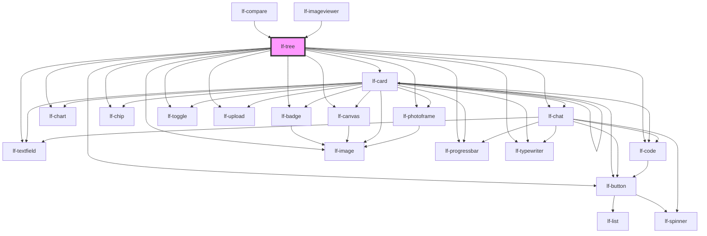

# lf-tree

<!-- Auto Generated Below -->

## Overview

The tree component displays a hierarchical dataset in a tree structure.
The tree may include nodes that can be expanded or collapsed.

## Properties

| Property                  | Attribute                    | Description                                                                                                                                                                                                                                                                                                                                                                                                                                           | Type                                                                               | Default         |
| ------------------------- | ---------------------------- | ----------------------------------------------------------------------------------------------------------------------------------------------------------------------------------------------------------------------------------------------------------------------------------------------------------------------------------------------------------------------------------------------------------------------------------------------------- | ---------------------------------------------------------------------------------- | --------------- |
| `lfAccordionLayout`       | `lf-accordion-layout`        | When enabled, the first level of depth will create an accordion-style appearance for nodes.                                                                                                                                                                                                                                                                                                                                                           | `boolean`                                                                          | `true`          |
| `lfDataset`               | `lf-dataset`                 | The data set for the LF Tree component. This property is mutable, meaning it can be changed after the component is initialized.                                                                                                                                                                                                                                                                                                                       | `LfDataDataset`                                                                    | `null`          |
| `lfEmpty`                 | `lf-empty`                   | Empty text displayed when there is no data.                                                                                                                                                                                                                                                                                                                                                                                                           | `string`                                                                           | `"Empty data."` |
| `lfExpandedNodeIds`       | `lf-expanded-node-ids`       | Identifiers of the nodes that are expanded. This property is mutable, meaning it can be changed after the component is initialized.                                                                                                                                                                                                                                                                                                                   | `string[]`                                                                         | `undefined`     |
| `lfFilter`                | `lf-filter`                  | When true, displays a text field which enables filtering the dataset of the tree.                                                                                                                                                                                                                                                                                                                                                                     | `boolean`                                                                          | `true`          |
| `lfGrid`                  | `lf-grid`                    | When true, the tree behaves like a grid, displaying each node's cells across the configured dataset columns. The dataset should provide a `columns` array. Each column id will be looked up inside the node `cells` container; if a matching cell is found its shape/component will be rendered, otherwise a textual fallback (node value / empty) is shown. The first column will still contain the hierarchical expansion affordance and node icon. | `boolean`                                                                          | `false`         |
| `lfInitialExpansionDepth` | `lf-initial-expansion-depth` | The initial depth to which the tree should be expanded upon first render. A value of 0 means all nodes are collapsed, 1 means only the root nodes are expanded, and so on. This property is mutable, meaning it can be changed after the component is initialized.                                                                                                                                                                                    | `number`                                                                           | `undefined`     |
| `lfRipple`                | `lf-ripple`                  | When set to true, the pointerdown event will trigger a ripple effect.                                                                                                                                                                                                                                                                                                                                                                                 | `boolean`                                                                          | `true`          |
| `lfSelectable`            | `lf-selectable`              | When true, nodes can be selected.                                                                                                                                                                                                                                                                                                                                                                                                                     | `boolean`                                                                          | `true`          |
| `lfSelectedNodeIds`       | `lf-selected-node-ids`       | Identifiers of the nodes that are selected. This property is mutable, meaning it can be changed after the component is initialized.                                                                                                                                                                                                                                                                                                                   | `string[]`                                                                         | `undefined`     |
| `lfStyle`                 | `lf-style`                   | Custom styling for the component.                                                                                                                                                                                                                                                                                                                                                                                                                     | `string`                                                                           | `""`            |
| `lfUiSize`                | `lf-ui-size`                 | The size of the component.                                                                                                                                                                                                                                                                                                                                                                                                                            | `"large" \| "medium" \| "small" \| "xlarge" \| "xsmall" \| "xxlarge" \| "xxsmall"` | `"medium"`      |

## Events

| Event           | Description                                                                                                                                                                                    | Type                              |
| --------------- | ---------------------------------------------------------------------------------------------------------------------------------------------------------------------------------------------- | --------------------------------- |
| `lf-tree-event` | Fires when the component triggers an internal action or user interaction. The event contains an `eventType` string, which identifies the action, and optionally `data` for additional details. | `CustomEvent<LfTreeEventPayload>` |

## Methods

### `getDebugInfo() => Promise<LfDebugLifecycleInfo>`

Retrieves the debug information reflecting the current state of the component.

#### Returns

Type: `Promise<LfDebugLifecycleInfo>`

A promise that resolves to a LfDebugLifecycleInfo object containing debug information.

### `getExpandedNodeIds() => Promise<string[]>`

Retrieves the identifiers for nodes currently expanded within the tree.

#### Returns

Type: `Promise<string[]>`

### `getProps() => Promise<LfTreePropsInterface>`

Used to retrieve component's properties and descriptions.

#### Returns

Type: `Promise<LfTreePropsInterface>`

Promise resolved with an object containing the component's properties.

### `getSelectedNodeIds() => Promise<string[]>`

Retrieves the identifiers for nodes currently selected within the tree.

#### Returns

Type: `Promise<string[]>`

### `refresh() => Promise<void>`

Triggers a re-render of the component to reflect any state changes.

#### Returns

Type: `Promise<void>`

### `selectByPredicate(predicate: (node: LfDataNode) => boolean) => Promise<LfDataNode | undefined>`

Selects the first node matching the provided predicate. If no match is found, selection is cleared.
This method combines node.find with setSelectedNodes for common selection-by-criteria workflows.

#### Parameters

| Name        | Type                            | Description |
| ----------- | ------------------------------- | ----------- |
| `predicate` | `(node: LfDataNode) => boolean` |             |

#### Returns

Type: `Promise<LfDataNode>`

Promise resolving to the selected node, or undefined if no match was found

### `setExpandedNodes(nodes: string | LfDataNode | Array<string | LfDataNode> | null) => Promise<void>`

Sets the expanded nodes in the tree.

#### Parameters

| Name    | Type                                               | Description |
| ------- | -------------------------------------------------- | ----------- |
| `nodes` | `string \| LfDataNode \| (string \| LfDataNode)[]` |             |

#### Returns

Type: `Promise<void>`

### `setSelectedNodes(nodes: string | LfDataNode | Array<string | LfDataNode> | null) => Promise<void>`

Sets the selected nodes in the tree.

#### Parameters

| Name    | Type                                               | Description |
| ------- | -------------------------------------------------- | ----------- |
| `nodes` | `string \| LfDataNode \| (string \| LfDataNode)[]` |             |

#### Returns

Type: `Promise<void>`

### `unmount(ms?: number) => Promise<void>`

Initiates the unmount sequence, which removes the component from the DOM after a delay.

#### Parameters

| Name | Type     | Description              |
| ---- | -------- | ------------------------ |
| `ms` | `number` | - Number of milliseconds |

#### Returns

Type: `Promise<void>`

## CSS Custom Properties

| Name                              | Description                                                                                       |
| --------------------------------- | ------------------------------------------------------------------------------------------------- |
| `--lf-tree-accordion-node-height` | Sets the height for the tree accordion node. Defaults to => 4em                                   |
| `--lf-tree-border-radius`         | Sets the border radius for the tree component. Defaults to => var(--lf-ui-border-radius)          |
| `--lf-tree-color-bg`              | Sets the color-bg color for the tree component. Defaults to => var(--lf-color-bg)                 |
| `--lf-tree-color-on-bg`           | Sets the color-on-bg color for the tree component. Defaults to => var(--lf-color-on-bg)           |
| `--lf-tree-color-on-surface`      | Sets the color-on-surface color for the tree component. Defaults to => var(--lf-color-on-surface) |
| `--lf-tree-color-surface`         | Sets the color-surface color for the tree component. Defaults to => var(--lf-color-surface)       |
| `--lf-tree-font-family`           | Sets the primary font family for the tree component. Defaults to => var(--lf-font-family-primary) |
| `--lf-tree-font-size`             | Sets the font size for the tree component. Defaults to => var(--lf-font-size)                     |
| `--lf-tree-node-height`           | Sets the height for the tree node. Defaults to => 2em                                             |
| `--lf-tree-node-padding`          | Sets the padding for the tree node. Defaults to => 0 1em                                          |
| `--lf-tree-padding`               | Sets the padding for the tree component. Defaults to => 0                                         |

## Dependencies

### Used by

 - [lf-compare](../lf-compare)
 - [lf-imageviewer](../lf-imageviewer)

### Depends on

- [lf-textfield](../lf-textfield)
- [lf-badge](../lf-badge)
- [lf-button](../lf-button)
- [lf-canvas](../lf-canvas)
- [lf-card](../lf-card)
- [lf-chart](../lf-chart)
- [lf-chat](../lf-chat)
- [lf-chip](../lf-chip)
- [lf-code](../lf-code)
- [lf-image](../lf-image)
- [lf-photoframe](../lf-photoframe)
- [lf-progressbar](../lf-progressbar)
- [lf-toggle](../lf-toggle)
- [lf-typewriter](../lf-typewriter)
- [lf-upload](../lf-upload)

### Graph

----------------------------------------------

*Built with [StencilJS](https://stenciljs.com/)*
