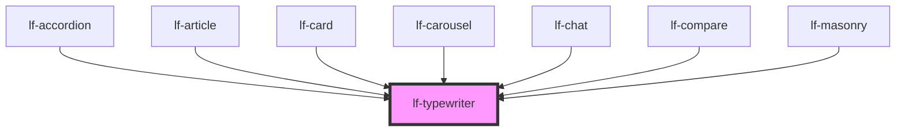

# lf-typewriter

<!-- Auto Generated Below -->

## Overview

The typewriter component displays text with a typewriter effect.
The typewriter may display a single text or loop through an array of texts.

## Properties

| Property        | Attribute         | Description                                                            | Type                                                                                               | Default    |
| --------------- | ----------------- | ---------------------------------------------------------------------- | -------------------------------------------------------------------------------------------------- | ---------- |
| `lfCursor`      | `lf-cursor`       | Sets the behavior of the blinking cursor.                              | `"auto" \| "disabled" \| "enabled"`                                                                | `"auto"`   |
| `lfDeleteSpeed` | `lf-delete-speed` | Sets the deleting speed in milliseconds.                               | `number`                                                                                           | `50`       |
| `lfLoop`        | `lf-loop`         | Enables or disables looping of the text.                               | `boolean`                                                                                          | `false`    |
| `lfPause`       | `lf-pause`        | Sets the duration of the pause after typing a complete text.           | `number`                                                                                           | `500`      |
| `lfSpeed`       | `lf-speed`        | Sets the typing speed in milliseconds.                                 | `number`                                                                                           | `50`       |
| `lfStyle`       | `lf-style`        | Custom styling for the component.                                      | `string`                                                                                           | `""`       |
| `lfTag`         | `lf-tag`          | The name of the HTML tag that will wrap the text.                      | `"a" \| "code" \| "div" \| "h1" \| "h2" \| "h3" \| "h4" \| "h5" \| "h6" \| "p" \| "pre" \| "span"` | `"p"`      |
| `lfUiSize`      | `lf-ui-size`      | The size of the component.                                             | `"large" \| "medium" \| "small" \| "xlarge" \| "xsmall" \| "xxlarge" \| "xxsmall"`                 | `"medium"` |
| `lfUpdatable`   | `lf-updatable`    | Controls whether the component should update its text content.         | `boolean`                                                                                          | `true`     |
| `lfValue`       | `lf-value`        | Sets the text or array of texts to display with the typewriter effect. | `string \| string[]`                                                                               | `""`       |

## Events

| Event                 | Description                                                                                                                                                                                    | Type                                    |
| --------------------- | ---------------------------------------------------------------------------------------------------------------------------------------------------------------------------------------------- | --------------------------------------- |
| `lf-typewriter-event` | Fires when the component triggers an internal action or user interaction. The event contains an `eventType` string, which identifies the action, and optionally `data` for additional details. | `CustomEvent<LfTypewriterEventPayload>` |

## Methods

### `getDebugInfo() => Promise<LfDebugLifecycleInfo>`

Fetches debug information of the component's current state.

#### Returns

Type: `Promise<LfDebugLifecycleInfo>`

A promise that resolves with the debug information object.

### `getProps() => Promise<LfTypewriterPropsInterface>`

Used to retrieve component's properties and descriptions.

#### Returns

Type: `Promise<LfTypewriterPropsInterface>`

Promise resolved with an object containing the component's properties.

### `refresh() => Promise<void>`

This method is used to trigger a new render of the component.

#### Returns

Type: `Promise<void>`

### `unmount(ms?: number) => Promise<void>`

Initiates the unmount sequence, which removes the component from the DOM after a delay.

#### Parameters

| Name | Type     | Description              |
| ---- | -------- | ------------------------ |
| `ms` | `number` | - Number of milliseconds |

#### Returns

Type: `Promise<void>`

## CSS Custom Properties

| Name                                    | Description                                                                                             |
| --------------------------------------- | ------------------------------------------------------------------------------------------------------- |
| `--lf-typewriter-color-bg`              | Sets the color-bg color for the typewriter component. Defaults to => var(--lf-color-bg)                 |
| `--lf-typewriter-color-on-bg`           | Sets the color-on-bg color for the typewriter component. Defaults to => var(--lf-color-on-bg)           |
| `--lf-typewriter-cursor-height`         | Sets the height for the typewriter cursor. Defaults to => 1.25em                                        |
| `--lf-typewriter-cursor-margin-left`    | Sets the left margin for the typewriter cursor. Defaults to => 0.15em                                   |
| `--lf-typewriter-cursor-vertical-align` | Sets the vertical-align for the typewriter cursor. Defaults to => top                                   |
| `--lf-typewriter-cursor-width`          | Sets the width for the typewriter cursor. Defaults to => 0.125em                                        |
| `--lf-typewriter-font-family`           | Sets the primary font family for the typewriter component. Defaults to => var(--lf-font-family-primary) |
| `--lf-typewriter-font-size`             | Sets the font size for the typewriter component. Defaults to => var(--lf-font-size)                     |
| `--lf-typewriter-margin`                | Sets the margin for the typewriter text. Defaults to => 0                                               |
| `--lf-typewriter-padding`               | Sets the padding for the typewriter component. Defaults to => 1em                                       |

## Dependencies

### Used by

 - [lf-accordion](../lf-accordion)
 - [lf-article](../lf-article)
 - [lf-card](../lf-card)
 - [lf-carousel](../lf-carousel)
 - [lf-chat](../lf-chat)
 - [lf-compare](../lf-compare)
 - [lf-masonry](../lf-masonry)

### Graph

----------------------------------------------

*Built with [StencilJS](https://stenciljs.com/)*
