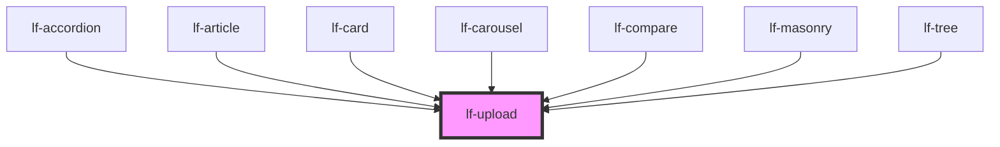

# lf-upload

<!-- Auto Generated Below -->

## Overview

The upload component allows users to upload files, displaying the selected files and their sizes.
The component can be customized with a label, ripple effect, and custom styling.

## Properties

| Property           | Attribute            | Description                                                                                                                                                                                                   | Type                                                                                                                                                                                                                                                                                                                                                                                                                                                                                                                                                                                                                                                                                                                                                                                                                                                                                                                                                                                                                                                                                                                                                                                                                                                                                                                                                                                                                                                                                                                                                                                                                                                                                                                                                                                                                                                                                                                                                                                                                                                                                                                                                                                                                                                                                                                                                | Default             |
| ------------------ | -------------------- | ------------------------------------------------------------------------------------------------------------------------------------------------------------------------------------------------------------- | --------------------------------------------------------------------------------------------------------------------------------------------------------------------------------------------------------------------------------------------------------------------------------------------------------------------------------------------------------------------------------------------------------------------------------------------------------------------------------------------------------------------------------------------------------------------------------------------------------------------------------------------------------------------------------------------------------------------------------------------------------------------------------------------------------------------------------------------------------------------------------------------------------------------------------------------------------------------------------------------------------------------------------------------------------------------------------------------------------------------------------------------------------------------------------------------------------------------------------------------------------------------------------------------------------------------------------------------------------------------------------------------------------------------------------------------------------------------------------------------------------------------------------------------------------------------------------------------------------------------------------------------------------------------------------------------------------------------------------------------------------------------------------------------------------------------------------------------------------------------------------------------------------------------------------------------------------------------------------------------------------------------------------------------------------------------------------------------------------------------------------------------------------------------------------------------------------------------------------------------------------------------------------------------------------------------------------------------------- | ------------------- |
| `lfHtmlAttributes` | `lf-html-attributes` | Allows customization of the input element through additional HTML attributes. This can include attributes like 'readonly', 'placeholder', etc., to further customize the behavior or appearance of the input. | `{ class?: any; title?: any; name?: any; href?: any; autofocus?: any; id?: any; role?: any; src?: any; alt?: any; disabled?: any; type?: any; value?: any; autocomplete?: any; srcset?: any; checked?: any; max?: any; maxLength?: any; min?: any; minLength?: any; multiple?: any; placeholder?: any; readonly?: any; step?: any; dataset?: any; lfDataset?: any; lfRipple?: any; lfStyle?: any; lfUiSize?: any; lfUiState?: any; lfFadeIn?: any; lfFormat?: any; lfLanguage?: any; lfPreserveSpaces?: any; lfShowCopy?: any; lfShowHeader?: any; lfStickyHeader?: any; lfValue?: any; lfAriaLabel?: any; lfLabel?: any; lfLeadingLabel?: any; lfHelper?: any; lfHtmlAttributes?: any; lfIcon?: any; lfStretchY?: any; lfStyling?: any; lfTrailingIcon?: any; htmlProps?: any; lfEmpty?: any; lfImageProps?: any; lfPosition?: any; lfIconOff?: any; lfShowSpinner?: any; lfStretchX?: any; lfToggable?: any; lfType?: any; lfBrush?: any; lfColor?: any; lfCursor?: any; lfOpacity?: any; lfPreview?: any; lfSize?: any; lfStrokeTolerance?: any; lfLayout?: any; lfSizeX?: any; lfSizeY?: any; lfAutoPlay?: any; lfInterval?: any; lfLightbox?: any; lfNavigation?: any; lfShape?: any; lfAxis?: any; lfColors?: any; lfLegend?: any; lfSeries?: any; lfTypes?: any; lfXAxis?: any; lfYAxis?: any; lfContextWindow?: any; lfEndpointUrl?: any; lfMaxTokens?: any; lfPollingInterval?: any; lfSeed?: any; lfSystem?: any; lfTemperature?: any; lfTypewriterProps?: any; lfView?: any; lfDisplay?: any; lfResponsive?: any; lfMode?: any; lfLoadCallback?: any; lfEnableDeletions?: any; lfSelectable?: any; lfActions?: any; lfColumns?: any; lfAutosave?: any; lfOverlay?: any; lfPlaceholder?: any; lfThreshold?: any; lfProps?: any; lfTrigger?: any; lfAnimated?: any; lfCenteredLabel?: any; lfIsRadial?: any; lfMax?: any; lfMin?: any; lfStep?: any; lfActive?: any; lfBarVariant?: any; lfDimensions?: any; lfFader?: any; lfFaderTimeout?: any; lfFullScreen?: any; lfTimeout?: any; lfCloseCallback?: any; lfCloseIcon?: any; lfMessage?: any; lfTimer?: any; lfAccordionLayout?: any; lfExpandedNodeIds?: any; lfFilter?: any; lfInitialExpansionDepth?: any; lfGrid?: any; lfSelectedNodeIds?: any; lfDeleteSpeed?: any; lfLoop?: any; lfPause?: any; lfSpeed?: any; lfTag?: any; lfUpdatable?: any; "data-"?: any; "aria-"?: any; }` | `undefined`         |
| `lfLabel`          | `lf-label`           | Sets the button's label.                                                                                                                                                                                      | `string`                                                                                                                                                                                                                                                                                                                                                                                                                                                                                                                                                                                                                                                                                                                                                                                                                                                                                                                                                                                                                                                                                                                                                                                                                                                                                                                                                                                                                                                                                                                                                                                                                                                                                                                                                                                                                                                                                                                                                                                                                                                                                                                                                                                                                                                                                                                                            | `"Upload files..."` |
| `lfRipple`         | `lf-ripple`          | When set to true, the pointerdown event will trigger a ripple effect.                                                                                                                                         | `boolean`                                                                                                                                                                                                                                                                                                                                                                                                                                                                                                                                                                                                                                                                                                                                                                                                                                                                                                                                                                                                                                                                                                                                                                                                                                                                                                                                                                                                                                                                                                                                                                                                                                                                                                                                                                                                                                                                                                                                                                                                                                                                                                                                                                                                                                                                                                                                           | `true`              |
| `lfStyle`          | `lf-style`           | Custom styling for the component.                                                                                                                                                                             | `string`                                                                                                                                                                                                                                                                                                                                                                                                                                                                                                                                                                                                                                                                                                                                                                                                                                                                                                                                                                                                                                                                                                                                                                                                                                                                                                                                                                                                                                                                                                                                                                                                                                                                                                                                                                                                                                                                                                                                                                                                                                                                                                                                                                                                                                                                                                                                            | `""`                |
| `lfValue`          | `lf-value`           | Initializes the component with these files.                                                                                                                                                                   | `File[]`                                                                                                                                                                                                                                                                                                                                                                                                                                                                                                                                                                                                                                                                                                                                                                                                                                                                                                                                                                                                                                                                                                                                                                                                                                                                                                                                                                                                                                                                                                                                                                                                                                                                                                                                                                                                                                                                                                                                                                                                                                                                                                                                                                                                                                                                                                                                            | `null`              |

## Events

| Event             | Description                                                                                                                                                                                    | Type                                |
| ----------------- | ---------------------------------------------------------------------------------------------------------------------------------------------------------------------------------------------- | ----------------------------------- |
| `lf-upload-event` | Fires when the component triggers an internal action or user interaction. The event contains an `eventType` string, which identifies the action, and optionally `data` for additional details. | `CustomEvent<LfUploadEventPayload>` |

## Methods

### `getDebugInfo() => Promise<LfDebugLifecycleInfo>`

Retrieves the debug information reflecting the current state of the component.

#### Returns

Type: `Promise<LfDebugLifecycleInfo>`

A promise that resolves to a LfDebugLifecycleInfo object containing debug information.

### `getProps() => Promise<LfUploadPropsInterface>`

Used to retrieve component's properties and descriptions.

#### Returns

Type: `Promise<LfUploadPropsInterface>`

Promise resolved with an object containing the component's properties.

### `getValue() => Promise<File[]>`

Returns the component's internal value.

#### Returns

Type: `Promise<File[]>`

### `refresh() => Promise<void>`

Triggers a re-render of the component to reflect any state changes.

#### Returns

Type: `Promise<void>`

### `unmount(ms?: number) => Promise<void>`

Initiates the unmount sequence, which removes the component from the DOM after a delay.

#### Parameters

| Name | Type     | Description              |
| ---- | -------- | ------------------------ |
| `ms` | `number` | - Number of milliseconds |

#### Returns

Type: `Promise<void>`

## CSS Custom Properties

| Name                        | Description                                                                                         |
| --------------------------- | --------------------------------------------------------------------------------------------------- |
| `--lf-upload-border-color`  | Sets the border color for the upload component. Defaults to => var(--lf-color-border)               |
| `--lf-upload-border-radius` | Sets the border radius for the upload component. Defaults to => var(--lf-ui-border-radius)          |
| `--lf-upload-button-height` | Sets the height for the upload button. Defaults to => 2.75em                                        |
| `--lf-upload-color-on-bg`   | Sets the color-on-bg color for the upload component. Defaults to => var(--lf-color-on-bg)           |
| `--lf-upload-color-surface` | Sets the color-surface color for the upload component. Defaults to => var(--lf-color-surface)       |
| `--lf-upload-font-family`   | Sets the primary font family for the upload component. Defaults to => var(--lf-font-family-primary) |
| `--lf-upload-font-size`     | Sets the font size for the upload component. Defaults to => var(--lf-font-size)                     |
| `--lf-upload-grid-gap`      | Sets the grid-gap for the upload component. Defaults to => 1.25em                                   |
| `--lf-upload-item-padding`  | Sets the padding for the upload item. Defaults to => 0.75em                                         |
| `--lf-upload-min-height`    | Sets the min-height for the upload component. Defaults to => 8em                                    |
| `--lf-upload-padding`       | Sets the padding for the upload component. Defaults to => 1em                                       |

## Dependencies

### Used by

 - [lf-accordion](../lf-accordion)
 - [lf-article](../lf-article)
 - [lf-card](../lf-card)
 - [lf-carousel](../lf-carousel)
 - [lf-compare](../lf-compare)
 - [lf-masonry](../lf-masonry)
 - [lf-tree](../lf-tree)

### Graph

----------------------------------------------

*Built with [StencilJS](https://stenciljs.com/)*
